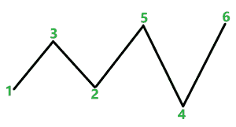

# 找出具有 X 个局部最大值(峰值)和 Y 个局部最小值(谷值)的数字 1 到 N 的排列

> 原文:[https://www . geesforgeks . org/find-数字排列-1 到 n-having-x-local-maximum-peaks-and-y-local-minim-valley/](https://www.geeksforgeeks.org/find-permutation-of-numbers-1-to-n-having-x-local-maxima-peaks-and-y-local-minima-valleys/)

给定三个整数 **N** 、 **A** 和 **B** ，任务是找到从 **1** 到 **N** 的成对不同数字的排列，该排列恰好具有**“A”**局部最小值和**“B”**局部最大值。

*   局部极小被定义为小于其两个邻居的元素。
*   局部最大值被定义为大于其两个相邻值的元素。
*   整个排列的第一个和最后一个元素永远不可能是局部最小值或最大值。

如果不存在这样的排列，打印 **-1** 。

**示例:**

> **输入:** N = 6，A = 2，B = 2
> **输出:** 1，3，2，5，4，6
> **解释:**
> 2 个局部最小值:2 和 5
> 2 个局部最大值:3 和 5
> 
> **输入:** N = 5，A = 2，B = 2
> T3】输出: -1

**天真方法(蛮力):**在这种方法中，生成 1 到 **N** 个数字的所有排列，并逐个检查。按照以下步骤，解决这个问题:

*   [生成从 **1** 到 **N** 的所有数字排列](https://www.geeksforgeeks.org/iterative-approach-to-print-all-permutations-of-an-array/)，并将其存储在数组中。
*   遍历每个排列，如果下面的排列正好有 **A** 局部最小值和 **B** 局部最大值，打印排列。
*   如果不存在这样的排列，则打印 **-1** 。

下面是上述方法的实现:

## C++

```
// C++ program for the above approach

#include <bits/stdc++.h>
using namespace std;

// Function to generate next permutation
void nextPermutation(vector<int>& nums)
{
    int n = nums.size(), k, l;
    for (k = n - 2; k >= 0; k--) {
        if (nums[k] < nums[k + 1]) {
            break;
        }
    }
    if (k < 0) {
        reverse(nums.begin(), nums.end());
    }
    else {
        for (l = n - 1; l > k; l--) {
            if (nums[l] > nums[k]) {
                break;
            }
        }
        swap(nums[k], nums[l]);
        reverse(nums.begin() + k + 1, nums.end());
    }
}

// Factorial function
int factorial(int n)
{
    return (n == 1 || n == 0) ? 1 : factorial(n - 1) * n;
}

// Function to returns all the permutations of a given array
// or vector
vector<vector<int> > permute(vector<int>& nums)
{
    vector<vector<int> > permuted;
    int n = nums.size();
    int factn = factorial(n);
    for (int i = 0; i < factn; i++) {
        permuted.push_back(nums);
        nextPermutation(nums);
    }
    return permuted;
}

// Function to find the permutation of 1 to N numbers
// having A minimas and B maximas
void findPermutation(int n, int a, int b)
{

    // Generate the array containing one permutation
    vector<int> nums(n);
    for (int i = 0; i < n; i++) {
        nums[i] = i + 1;
    }

    // Generate all the permutations
    vector<vector<int> > allpermutations = permute(nums);

    int total = allpermutations.size();
    int ansindex = -1;

    for (int i = 0; i < total; i++) {
        // Count local minima and local maximas for each
        // permutation
        int minc = 0, maxc = 0;
        for (int j = 1; j < n - 1; j++) {
            if (allpermutations[i][j]
                    > allpermutations[i][j - 1]
                && allpermutations[i][j]
                       > allpermutations[i][j + 1]) {
                maxc++;
            }
            if (allpermutations[i][j]
                    < allpermutations[i][j - 1]
                && allpermutations[i][j]
                       < allpermutations[i][j + 1]) {
                minc++;
            }
        }
        if (minc == a && maxc == b) {

            // Store the index of a perfect permutation
            ansindex = i;
            break;
        }
    }

    // Print -1 if no such permutation exists
    if (ansindex == -1) {
        cout << -1;
    }
    else {
        // Print the perfect permutation if exists
        for (int i = 0; i < n; i++) {
            cout << allpermutations[ansindex][i] << " ";
        }
    }
}

int main()
{
    int N = 6, A = 2, B = 2;
    findPermutation(N, A, B);
    return 0;
}
```

**Output**

```
1 3 2 5 4 6 
```

**时间复杂度:** O(N！)
**辅助空间:** O(N！)

**有效方法(贪婪方法):**

上述蛮力方法可以使用[贪婪算法](https://www.geeksforgeeks.org/greedy-algorithms/)进行优化。贪婪是一种算法范式，它一点一点地建立解决方案，总是选择下一个能带来最明显和最直接好处的方案。所以，根据 **N** 、 **A** 、 **B** 的值，把问题分解成不同的可用块。请按照以下步骤解决此问题:

*   由于整个排列的第一个和最后一个元素不能是最大值或最小值，因此最大值和最小值的总数必须小于或等于 **N-2** 。所以如果 **(A + B > N -2)** ，打印 **-1** 。
*   此外，不能有两个连续的最小值或最大值。两个连续的最大值之间必须有一个最小值，两个连续的最小值之间必须有一个最大值。所以最小值和最大值的总数的绝对差必须小于或等于 1。所以如果 **A** 和 **B** 的绝对差值超过了 **1** ，那么打印 **-1** 。我们可以很容易地从下图中看到这一点。



*   完成两个角例后，创建两个变量， **minValue** 存储排列的最小值， **maxValue** 存储 maxValue。现在把问题分成三种不同的情况，分别是 **(A > B)** 、 **(A < B)** 和 **(A=B)** 。现在分别解决每个案例:
    *   如果 **(A > B):** 将**最小值**初始化为 1，并从索引 2 开始用**最小值**填充数组 **A** 次。每次插入后，将**最小值**增加 1，因为这些值应该是不同的。填充时，确保每次插入后保留一个索引为空，因为两个最小值不可能连续存在。在创建**之后，一个**极小值以递增的顺序填充数组的其余部分，这样就不会创建新的极小值。
    *   如果 **(B > A):** 将**最大值**初始化为 **N** ，并从索引 **2** 开始为 **B** 次填充数组**最大值**。每次插入后，将**最大值**减少 1，因为这些值应该是不同的。填充时，确保每次插入后保留一个索引为空，因为两个最大值不可能连续存在。创建 **B** 最大值后，按降序填充数组的其余部分，这样就不会创建新的最大值。
    *   如果 **(A = B):** 则初始化两个值**最小值**为 1，**最大值**为 **N** 。用 **minValue** 填充数组的第一个元素，并将 **minValue** 增加 1。然后用**最大值**填充偶数索引，将**最大值**减少 1，用**最小值**填充奇数索引，将**最小值**增加 1，为 **A** 倍。现在，按照递增的顺序填充其余的位置。

下面是上述方法的实现:

## C++

```
// C++ program for the above approach
#include <bits/stdc++.h>
using namespace std;

// Function to find the permutation of 1 to N numbers
// having A minimas and B maximas
void findPermutation(int N, int A, int B)
{

    // Create the result array
    vector<int> arr(N);
    for (int i = 0; i < N; i++) {
        arr[i] = -1;
    }

    // If the absolute difference between A and B is
    // greater 1 or A+B is greater than N-2, then return -1
    if (abs(A - B) > 1 || A + B > N - 2) {
        cout << -1;
    }
    else {
        if (A > B) {

            // Initialize maxValue with N
            int maxValue = N;

            // Create a maxima's
            for (int i = 1; i < N - 1 && A > 0; i += 2) {
                arr[i] = maxValue;
                maxValue--;
                A--;
            }

            // Fill other elements in decreasing order
            for (int i = 0; i < N; i++) {
                if (arr[i] == -1) {
                    arr[i] = maxValue;
                    maxValue--;
                }
            }
        }
        else if (A < B) {
            // Initialize minValue with 1
            int minValue = 1;

            // Create B minima's
            for (int i = 1; i < N - 1 && B > 0; i += 2) {
                arr[i] = minValue;
                minValue++;
                B--;
            }

            // Fill other elements in increasing order
            for (int i = 0; i < N; i++) {
                if (arr[i] == -1) {
                    arr[i] = minValue;
                    minValue++;
                }
            }
        }
        else if (A == B) {

            // Initialize maxValue with n and minValue with
            // 1
            int minValue = 1, maxValue = N;
            arr[0] = minValue;
            minValue++;

            // Initialize fill equal number of minima and
            // maximas
            for (int i = 1; i < N - 1 && A > 0; i += 2) {
                arr[i] = maxValue;
                arr[i + 1] = minValue;
                A--;
                maxValue--;
                minValue++;
            }

            // Fill the rest in increasing order
            for (int i = 0; i < N; i++) {
                if (arr[i] == -1) {
                    arr[i] = minValue;
                    minValue++;
                }
            }
        }

        // Print the output
        for (int i = 0; i < N; i++) {
            cout << arr[i] << " ";
        }
    }
    cout << endl;
}

// Driver Code
int main()
{
    int N = 6, A = 2, B = 1;
    findPermutation(N, A, B);

    return 0;
}
```

## Java 语言(一种计算机语言，尤用于创建网站)

```
// Java program for the above approach
class GFG{

// Function to find the permutation of 1 to N numbers
// having A minimas and B maximas
static void findPermutation(int N, int A, int B)
{

    // Create the result array
    int []arr = new int[N];
    for (int i = 0; i < N; i++) {
        arr[i] = -1;
    }

    // If the absolute difference between A and B is
    // greater 1 or A+B is greater than N-2, then return -1
    if (Math.abs(A - B) > 1 || A + B > N - 2) {
        System.out.print(-1);
    }
    else {
        if (A > B) {

            // Initialize maxValue with N
            int maxValue = N;

            // Create a maxima's
            for (int i = 1; i < N - 1 && A > 0; i += 2) {
                arr[i] = maxValue;
                maxValue--;
                A--;
            }

            // Fill other elements in decreasing order
            for (int i = 0; i < N; i++) {
                if (arr[i] == -1) {
                    arr[i] = maxValue;
                    maxValue--;
                }
            }
        }
        else if (A < B) {
            // Initialize minValue with 1
            int minValue = 1;

            // Create B minima's
            for (int i = 1; i < N - 1 && B > 0; i += 2) {
                arr[i] = minValue;
                minValue++;
                B--;
            }

            // Fill other elements in increasing order
            for (int i = 0; i < N; i++) {
                if (arr[i] == -1) {
                    arr[i] = minValue;
                    minValue++;
                }
            }
        }
        else if (A == B) {

            // Initialize maxValue with n and minValue with
            // 1
            int minValue = 1, maxValue = N;
            arr[0] = minValue;
            minValue++;

            // Initialize fill equal number of minima and
            // maximas
            for (int i = 1; i < N - 1 && A > 0; i += 2) {
                arr[i] = maxValue;
                arr[i + 1] = minValue;
                A--;
                maxValue--;
                minValue++;
            }

            // Fill the rest in increasing order
            for (int i = 0; i < N; i++) {
                if (arr[i] == -1) {
                    arr[i] = minValue;
                    minValue++;
                }
            }
        }

        // Print the output
        for (int i = 0; i < N; i++) {
            System.out.print(arr[i]+ " ");
        }
    }
    System.out.println();
}

// Driver Code
public static void main(String[] args)
{
    int N = 6, A = 2, B = 1;
    findPermutation(N, A, B);

}
}

// This code is contributed by 29AjayKumar
```

## 蟒蛇 3

```
# Python 3 program for the above approach

# Function to find the permutation of 1 to N numbers
# having A minimas and B maximas
def findPermutation(N, A, B):

    # Create the result array
    arr = [0]*(N)
    for i in range(N):
        arr[i] = -1

    # If the absolute difference between A and B is
    # greater 1 or A+B is greater than N-2, then return -1
    if (abs(A - B) > 1 or A + B > N - 2):
        print(-1)

    else:
        if (A > B):

            # Initialize maxValue with N
            maxValue = N

            # Create a maxima's
            i = 1
            while i < N - 1 and A > 0:
                arr[i] = maxValue
                maxValue -= 1
                A -= 1
                i += 2

            # Fill other elements in decreasing order
            for i in range(N):
                if (arr[i] == -1):
                    arr[i] = maxValue
                    maxValue -= 1
        elif (A < B):
            # Initialize minValue with 1
            minValue = 1

            # Create B minima's
            i = 1
            while i < N - 1 and B > 0:
                arr[i] = minValue
                minValue += 1
                B -= 1
                i += 2

            # Fill other elements in increasing order
            for i in range(N):
                if (arr[i] == -1):
                    arr[i] = minValue
                    minValue += 1
        elif (A == B):

            # Initialize maxValue with n and minValue with
            # 1
            minValue = 1
            maxValue = N
            arr[0] = minValue
            minValue += 1

            # Initialize fill equal number of minima and
            # maximas
            i = 1
            while i < N - 1 and A > 0:
                arr[i] = maxValue
                arr[i + 1] = minValue
                A -= 1
                maxValue -= 1
                minValue += 1
                i += 2

            # Fill the rest in increasing order
            for i in range(N):
                if (arr[i] == -1):
                    arr[i] = minValue
                    minValue += 1

        # Print the output
        for i in range(N):
            print(arr[i], end=" ")

    print()

# Driver Code
if __name__ == "__main__":

    N = 6
    A = 2
    B = 1
    findPermutation(N, A, B)

    # This code is contributed by ukasp.
```

## C#

```
// C# program for the above approach
using System;
class GFG{

  // Function to find the permutation of 1 to N numbers
  // having A minimas and B maximas
  static void findPermutation(int N, int A, int B)
  {

    // Create the result array
    int []arr = new int[N];
    for (int i = 0; i < N; i++) {
      arr[i] = -1;
    }

    // If the absolute difference between A and B is
    // greater 1 or A+B is greater than N-2, then return -1
    if (Math.Abs(A - B) > 1 || A + B > N - 2) {
      Console.Write(-1);
    }
    else {
      if (A > B) {

        // Initialize maxValue with N
        int maxValue = N;

        // Create a maxima's
        for (int i = 1; i < N - 1 && A > 0; i += 2) {
          arr[i] = maxValue;
          maxValue--;
          A--;
        }

        // Fill other elements in decreasing order
        for (int i = 0; i < N; i++) {
          if (arr[i] == -1) {
            arr[i] = maxValue;
            maxValue--;
          }
        }
      }
      else if (A < B) {
        // Initialize minValue with 1
        int minValue = 1;

        // Create B minima's
        for (int i = 1; i < N - 1 && B > 0; i += 2) {
          arr[i] = minValue;
          minValue++;
          B--;
        }

        // Fill other elements in increasing order
        for (int i = 0; i < N; i++) {
          if (arr[i] == -1) {
            arr[i] = minValue;
            minValue++;
          }
        }
      }
      else if (A == B) {

        // Initialize maxValue with n and minValue with
        // 1
        int minValue = 1, maxValue = N;
        arr[0] = minValue;
        minValue++;

        // Initialize fill equal number of minima and
        // maximas
        for (int i = 1; i < N - 1 && A > 0; i += 2) {
          arr[i] = maxValue;
          arr[i + 1] = minValue;
          A--;
          maxValue--;
          minValue++;
        }

        // Fill the rest in increasing order
        for (int i = 0; i < N; i++) {
          if (arr[i] == -1) {
            arr[i] = minValue;
            minValue++;
          }
        }
      }

      // Print the output
      for (int i = 0; i < N; i++) {
        Console.Write(arr[i]+ " ");
      }
    }
    Console.Write("\n");
  }

  // Driver Code
  public static void Main()
  {
    int N = 6, A = 2, B = 1;
    findPermutation(N, A, B);

  }
}

// This code is contributed by Samim Hossain Mondal.
```

## java 描述语言

```
<script>
   // JavaScript code for the above approach

   // Function to find the permutation of 1 to N numbers
   // having A minimas and B maximas
   function findPermutation(N, A, B)
   {

     // Create the result array
     let arr = new Array(N);
     for (let i = 0; i < N; i++) {
       arr[i] = -1;
     }

     // If the absolute difference between A and B is
     // greater 1 or A+B is greater than N-2, then return -1
     if (Math.abs(A - B) > 1 || A + B > N - 2) {
       document.write(-1);
     }
     else {
       if (A > B) {

         // Initialize maxValue with N
         let maxValue = N;

         // Create a maxima's
         for (let i = 1; i < N - 1 && A > 0; i += 2) {
           arr[i] = maxValue;
           maxValue--;
           A--;
         }

         // Fill other elements in decreasing order
         for (let i = 0; i < N; i++) {
           if (arr[i] == -1) {
             arr[i] = maxValue;
             maxValue--;
           }
         }
       }
       else if (A < B)
       {

         // Initialize minValue with 1
         let minValue = 1;

         // Create B minima's
         for (let i = 1; i < N - 1 && B > 0; i += 2) {
           arr[i] = minValue;
           minValue++;
           B--;
         }

         // Fill other elements in increasing order
         for (let i = 0; i < N; i++) {
           if (arr[i] == -1) {
             arr[i] = minValue;
             minValue++;
           }
         }
       }
       else if (A == B) {

         // Initialize maxValue with n and minValue with
         // 1
         let minValue = 1, maxValue = N;
         arr[0] = minValue;
         minValue++;

         // Initialize fill equal number of minima and
         // maximas
         for (let i = 1; i < N - 1 && A > 0; i += 2) {
           arr[i] = maxValue;
           arr[i + 1] = minValue;
           A--;
           maxValue--;
           minValue++;
         }

         // Fill the rest in increasing order
         for (let i = 0; i < N; i++) {
           if (arr[i] == -1) {
             arr[i] = minValue;
             minValue++;
           }
         }
       }

       // Print the output
       for (let i = 0; i < N; i++) {
         document.write(arr[i] + " ");
       }
     }
     document.write('<br>')
   }

   // Driver Code
   let N = 6, A = 2, B = 1;
   findPermutation(N, A, B);

 // This code is contributed by Potta Lokesh
 </script>
```

**Output**

```
4 6 3 5 2 1 
```

**时间复杂度:**O(N)
T3】辅助空间: O(N)