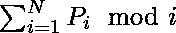
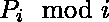

# 求余数和最大的置换

> 原文:[https://www . geeksforgeeks . org/find-带最大余数的置换-sum/](https://www.geeksforgeeks.org/find-permutation-with-maximum-remainder-sum/)

给定一个整数 **N** ，任务是找到从 **1** 到 **N** 的整数排列，使得最大。
**示例:**

> **输入:** N = 3
> **输出:** 3 1 2
> 余值之和为(0 + 1 + 2) = 3
> 这是最大可能值。
> **输入:** N = 5
> **输出:** 5 1 2 3 4

**逼近:**众所周知，用 **Y** 做 **mod** 后一个数字 **X** 的最大值是 **Y-1** 。产生最大 mosulus 值和的排列将是 **{N，1，2，3，…。，N–1 }**。
对上述数组中的表达式求值后，输出数组将是 **{0，1，2，3，…。，N–1 }**这是可以获得的最大值。
以下是上述方法的实施:

## C++

```
// C++ implementation of the approach
#include <bits/stdc++.h>
using namespace std;

// Function to find the permutation
vector<int> Findpermutation(int n)
{
    vector<int> a(n + 1);

    // Put n at the first index 1
    a[1] = n;

    // Put all the numbers from
    // 2 to n sequentially
    for (int i = 2; i <= n; i++)
        a[i] = i - 1;

    return a;
}

// Driver code
int main()
{
    int n = 8;

    vector<int> v = Findpermutation(n);

    // Display the permutation
    for (int i = 1; i <= n; i++)
        cout << v[i] << ' ';

    return 0;
}
```

## Java 语言(一种计算机语言，尤用于创建网站)

```
// Java implementation of the approach
import java.util.*;
class GFG
{

// Function to find the permutation
static int[] Findpermutation(int n)
{
    int [] a = new int[n + 1];

    // Put n at the first index 1
    a[1] = n;

    // Put all the numbers from
    // 2 to n sequentially
    for (int i = 2; i <= n; i++)
        a[i] = i - 1;

    return a;
}

// Driver code
public static void main(String[] args)
{
    int n = 8;

    int []v = Findpermutation(n);

    // Display the permutation
    for (int i = 1; i <= n; i++)
        System.out.print(v[i] + " ");
}
}

// This code is contributed by 29AjayKumar
```

## 蟒蛇 3

```
# Python3 implementation of the approach

# Function to find the permutation
def Findpermutation(n) :

    a = [0] * (n + 1);

    # Put n at the first index 1
    a[1] = n;

    # Put all the numbers from
    # 2 to n sequentially
    for i in range(2, n + 1) :
        a[i] = i - 1;

    return a;

# Driver code
if __name__ == "__main__" :

    n = 8;

    v = Findpermutation(n);

    # Display the permutation
    for i in range(1, n + 1) :
        print(v[i], end = ' ');

# This code is contributed by AnkitRai01
```

## C#

```
// C# implementation of the approach
using System;

class GFG
{

// Function to find the permutation
static int[] Findpermutation(int n)
{
    int [] a = new int[n + 1];

    // Put n at the first index 1
    a[1] = n;

    // Put all the numbers from
    // 2 to n sequentially
    for (int i = 2; i <= n; i++)
        a[i] = i - 1;

    return a;
}

// Driver code
public static void Main(String[] args)
{
    int n = 8;

    int []v = Findpermutation(n);

    // Display the permutation
    for (int i = 1; i <= n; i++)
        Console.Write(v[i] + " ");
}
}

// This code is contributed by 29AjayKumar
```

## java 描述语言

```
<script>

// Javascript implementation of the approach

// Function to find the permutation
function Findpermutation(n)
{
    let a = new Array(n + 1);

    // Put n at the first index 1
    a[1] = n;

    // Put all the numbers from
    // 2 to n sequentially
    for (let i = 2; i <= n; i++)
        a[i] = i - 1;

    return a;
}

// Driver code
    let n = 8;

    let v = Findpermutation(n);

    // Display the permutation
    for (let i = 1; i <= n; i++)
        document.write(v[i] + ' ');

</script>
```

**Output:** 

```
8 1 2 3 4 5 6 7
```

**时间复杂度:** O(N)