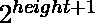
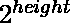

# 在只允许数字 4 和 7 的序列中找到给定项的位置

> 原文:[https://www . geeksforgeeks . org/find-给定术语在序列中的位置-仅允许使用数字 4 和 7/](https://www.geeksforgeeks.org/find-position-of-given-term-in-a-series-formed-with-only-digits-4-and-7-allowed/)

有一系列只有数字 4 和 7 的数字，数字按递增顺序排列。数列的前几个数字是 **4、7、44、47、74、77、444、…等。**给定一个数 **N** ，任务是找到该数在给定数列中的位置。
**例:**

> **输入:** N = 4
> **输出:** 1
> **解释:**
> 数列中第一个数字是 4
> **输入:** N = 777
> **输出:** 14
> **解释:**
> 数列中第 14 个数字是 777

**方法:**这个问题可以用下面的观察结果来解决:

*   下面是给定系列中观察到的模式。数字可以看做:

```
                 ""
              /      \
            4         7
          /   \     /   \ 
        44    47   74    77
       / \   / \   / \  / \
```

*   我们可以观察到 **2** 的功率在增加。因此，我们的想法是从最低有效位开始迭代数字的位数，并将数字的位置更新为:
    1.  如果当前数字= 7，则在该位置加上。
    2.  如果当前数字= 4，则在该位置加上。
*   完成上述操作后，打印最终位置。

以下是上述方法的实现:

## C++

```
// C++ program for the above approach

#include <bits/stdc++.h>
using namespace std;

// Function to find the position
// of the number N
void findPosition(int n)
{
    int i = 0;

    // To store the position of N
    int pos = 0;

    // Iterate through all digit of N
    while (n > 0) {

        // If current digit is 7
        if (n % 10 == 7) {
            pos = pos + pow(2, i + 1);
        }

        // If current digit is 4
        else {
            pos = pos + pow(2, i);
        }

        i++;
        n = n / 10;
    }

    // Print the final position
    cout << pos;
}

// Driver Code
int main()
{
    // Given number of the series
    int N = 777;

    // Function Call
    findPosition(N);
    return 0;
}
```

## Java 语言(一种计算机语言，尤用于创建网站)

```
// Java program for the above approach
import java.util.*;
class GFG{

// Function to find the position
// of the number N
static void findPosition(int n)
{
    int i = 0;

    // To store the position of N
    int pos = 0;

    // Iterate through all digit of N
    while (n > 0)
    {

        // If current digit is 7
        if (n % 10 == 7)
        {
            pos = pos + (int)Math.pow(2, i + 1);
        }

        // If current digit is 4
        else
        {
            pos = pos + (int)Math.pow(2, i);
        }

        i++;
        n = n / 10;
    }

    // Print the final position
    System.out.print(pos);
}

// Driver Code
public static void main(String[] args)
{
    // Given number of the series
    int N = 777;

    // Function Call
    findPosition(N);
}
}

// This code is contributed by shivanisinghss2110
```

## 蟒蛇 3

```
# Python3 program for the above approach

# Function to find the position
# of the number N
def findPosition(n):

    i = 0

    # To store the position of N
    pos = 0

    # Iterate through all digit of N
    while (n > 0):

        # If current digit is 7
        if (n % 10 == 7):
            pos = pos + pow(2, i + 1)

        # If current digit is 4
        else:
            pos = pos + pow(2, i)

        i += 1
        n = n // 10

    # Print the final position
    print(pos)

# Driver Code
if __name__ == '__main__':

    # Given number of the series
    N = 777

    # Function Call
    findPosition(N)

# This code is contributed by mohit kumar 29
```

## C#

```
// C# program for the above approach
using System;
class GFG{

// Function to find the position
// of the number N
static void findPosition(int n)
{
    int i = 0;

    // To store the position of N
    int pos = 0;

    // Iterate through all digit of N
    while (n > 0)
    {

        // If current digit is 7
        if (n % 10 == 7)
        {
            pos = pos + (int)Math.Pow(2, i + 1);
        }

        // If current digit is 4
        else
        {
            pos = pos + (int)Math.Pow(2, i);
        }

        i++;
        n = n / 10;
    }

    // Print the final position
    Console.Write(pos);
}

// Driver Code
public static void Main()
{
    // Given number of the series
    int N = 777;

    // Function Call
    findPosition(N);
}
}

// This code is contributed by Code_Mech
```

## java 描述语言

```
<script>
// javascript program for the above approach

    // Function to find the position
    // of the number N
    function findPosition(n)
    {
        var i = 0;

        // To store the position of N
        var pos = 0;

        // Iterate through all digit of N
        while (n > 0) {

            // If current digit is 7
            if (n % 10 == 7) {
                pos = pos + parseInt( Math.pow(2, i + 1));
            }

            // If current digit is 4
            else {
                pos = pos + parseInt( Math.pow(2, i));
            }

            i++;
            n = parseInt(n / 10);
        }

        // Print  the final position
        document.write(pos);
    }

    // Driver Code

    // Given number of the series
    var N = 777;

    // Function Call
    findPosition(N);

// This code is contributed by Princi Singh
</script>
```

**Output:** 

```
14
```

**时间复杂度:***O(log<sub>10</sub>N)*