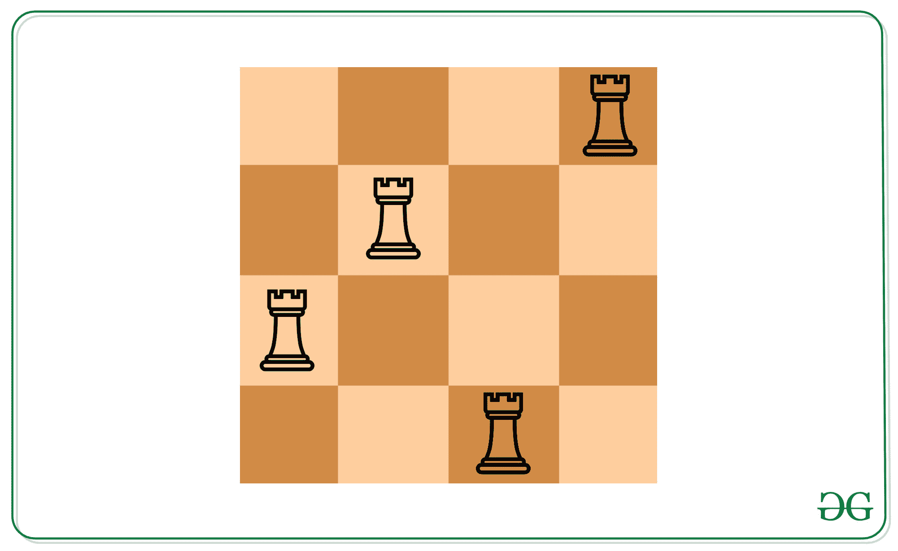
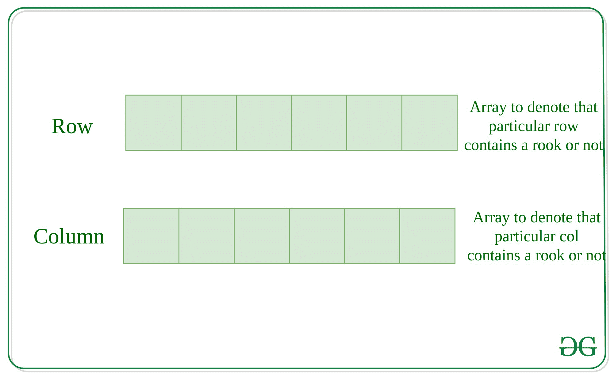

# 按照字典顺序找到可以放在 N*N 棋盘上的非攻击车的位置

> 原文:[https://www . geeksforgeeks . org/find-非攻击性车的位置-按字典顺序排列-可放置在-nn-棋盘上/](https://www.geeksforgeeks.org/find-position-of-non-attacking-rooks-in-lexicographic-order-that-can-be-placed-on-nn-chessboard/)

给定一个整数 **N** 和一个表示已经放置的非攻击车位置的位置数组**arr【】**，任务是按照字典顺序找到可以放置在 N*N 棋盘上的非攻击车的位置。
**车的移动:**任何车都可以水平或垂直移动任意数量的未被占据的方块。

**示例:**

> **输入:** N = 4，arr[] = {(1，4)，(2，2)}
> **输出:**2
> 3 1
> 4 3
> T8】说明:
> 4 * 4 棋盘
> 上可以多放两个车
> 
> 
> 
> **输入:** N = 5，arr[] = {}
> **输出:**5
> 1 1
> 2 2
> 3
> 4 4
> 5 5

**简单方法:**初始化一个大小为 N*N 的 2D 矩阵**mat【】【】**，每个单元格为 0，并以 1 标记初始位置的车。然后遍历矩阵 mat[][]，检查 i <sup>第</sup>行和 j <sup>第</sup>列是否包含任何车，记录放置的车数。如果任何一行包含和一列都不包含任何放置的车，那么在那里放置一个车，并将此单元格添加到结果字符串中。
最后，打印放置的车数和车位置
**时间复杂度:** O(N <sup>3</sup> )
**空间复杂度:** O(N <sup>2</sup> )
**高效方法:**想法是创建两个大小各为 **N** 的数组，以存储 i <sup>第</sup>行还是 i <sup>行
**时间复杂度:** O(N <sup>2</sup> )
**空间复杂度:** O(N)</sup>



**最有效的方法:**问题中的关键观察是，可以放置的最大车是 **N-K** 。也就是说，如果两个车在同一排或同一列，它们就会互相攻击。因为没有两个给定的车互相攻击，所以输入中给定的所有行都是唯一的。同样，输入中给出的所有列都是唯一的。因此，我们剩下 N-K 个未使用的行和 N-K 个未使用的列来放置新的车。
换句话说，如果我们试图通过[鸽子洞原理](https://www.geeksforgeeks.org/discrete-mathematics-the-pigeonhole-principle/)放入 N-K 个以上的白嘴鸦，如果有 N+1 只鸽子和 N 个地方要填充，那么至少有一个地方包含 1 只以上的鸽子。
并寻找字典最小答案。这个答案可以通过将最小的未使用行与最小的未使用列配对，将第二小的未使用行与第二小的未使用列配对，以此类推。
**时间复杂度:** *O(N)*

下面是上述方法的实现:

## C++

```
// C++ implementation to find
// count of placing non-attacking
// rooks on the N x N chessboard
#include <bits/stdc++.h>
using namespace std;

// Function to find the count of
// placing non-attacking rooks
// on the N x N chessboard
void findCountRooks(int row[], int col[],
                    int n, int k)
{

    // Count of the Non-attacking rooks
    int res = n - k;
    cout << res << "\n";

    int ri = 0, ci = 0;

    while (res-- > 0)
    {

        // Printing lexographically
        // smallest configuration
        while (ri < k && row[ri] == 1)
        {
            ri++;
        }
        while (ci < k && col[ci] == 1)
        {
            ci++;
        }
        cout << (ri + 1) << " "
             << (ci + 1) << "\n";

        ri++;
        ci++;
    }
}

// Driver Code
int main()
{
    int n = 4;
    int k = 2;
    int row[] = { 1, 2 };
    int col[] = { 4, 2 };

    // Function call
    findCountRooks(row, col, n, k);
    return 0;
}

// This code is contributed by jana_sayantan
```

## Java 语言(一种计算机语言，尤用于创建网站)

```
// Java implementation to find
// count of placing non-attacking
// rooks on the N x N chessboard

import java.util.Scanner;

public class P2Placerooks {
    // Function to find the count of
    // placing non-attacking rooks
    // on the N x N chessboard
    static void findCountRooks(
        int row[], int col[], int n, int k)
    {

        // Count of the Non-attacking rooks
        int res = n - k;
        System.out.println(res + " ");
        int ri = 0, ci = 0;
        while (res-- > 0) {

            // Printing lexographically
            // smallest configuration
            while (ri < k && row[ri] == 1) {
                ri++;
            }
            while (ci < k && col[ci] == 1) {
                ci++;
            }
            System.out.println((ri + 1)
                               + " " + (ci + 1)
                               + " ");
            ri++;
            ci++;
        }
    }

    // Driver Code
    public static void main(String[] args)
    {
        int n = 4;
        int k = 2;
        int row[] = { 1, 2 };
        int col[] = { 4, 2 };

        // Function Call
        findCountRooks(row, col, n, k);
    }
}
```

## 蟒蛇 3

```
# Python3 implementation to find
# count of placing non-attacking
# rooks on the N x N chessboard

# Function to find the count of
# placing non-attacking rooks
# on the N x N chessboard
def findCountRooks(row, col, n, k):

    # Count of the Non-attacking rooks
    res = n - k
    print(res)

    ri = 0
    ci = 0

    while (res > 0):

        # Printing lexographically
        # smallest configuration
        while (ri < k and row[ri] == 1):
            ri += 1

        while (ci < k and col[ci] == 1):
            ci += 1

        print((ri + 1), "", (ci + 1))

        ri += 1
        ci += 1
        res -= 1

# Driver Code
n = 4
k = 2

row = [ 1, 2 ]
col = [ 4, 2 ]

# Function call
findCountRooks(row, col, n, k)

# This code is contributed by sanjoy_62
```

## C#

```
// C# implementation to find
// count of placing non-attacking
// rooks on the N x N chessboard
using System;

class P2Placerooks{

// Function to find the count of
// placing non-attacking rooks
// on the N x N chessboard
static void findCountRooks(int []row,
                           int []col,
                           int n, int k)
{

    // Count of the Non-attacking rooks
    int res = n - k;
    Console.WriteLine(res + " ");

    int ri = 0, ci = 0;
    while (res-- > 0)
    {

        // Printing lexographically
        // smallest configuration
        while (ri < k && row[ri] == 1)
        {
            ri++;
        }
        while (ci < k && col[ci] == 1)
        {
            ci++;
        }
        Console.WriteLine((ri + 1) + " " +
                          (ci + 1) + " ");
        ri++;
        ci++;
    }
}

// Driver Code
public static void Main(String[] args)
{
    int n = 4;
    int k = 2;
    int []row = { 1, 2 };
    int []col = { 4, 2 };

    // Function call
    findCountRooks(row, col, n, k);
}
}

// This code is contributed by Rajput-Ji
```

## java 描述语言

```
<script>

// JavaScript implementation to find
// count of placing non-attacking
// rooks on the N x N chessboard

// Function to find the count of
// placing non-attacking rooks
// on the N x N chessboard
function findCountRooks(row,col,n,k)
{

    // Count of the Non-attacking rooks
    let res = n - k;
    document.write(res + "<br>");

    let ri = 0, ci = 0;

    while (res-- > 0)
    {

        // Printing lexographically
        // smallest configuration
        while (ri < k && row[ri] == 1)
        {
            ri++;
        }
        while (ci < k && col[ci] == 1)
        {
            ci++;
        }
        document.write((ri + 1) + " "
            + (ci + 1) + "<br>");

        ri++;
        ci++;
    }
}

// Driver Code

    let n = 4;
    let k = 2;
    let row = [ 1, 2 ];
    let col = [ 4, 2 ];

    // Function call
    findCountRooks(row, col, n, k);

</script>
```

**Output:** 

```
2 
2 1 
3 2
```

**性能分析:**

*   **时间复杂度:** *O(N)*
*   **辅助空间:** *O(1)*