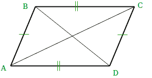

# 找出平行四边形的所有可能坐标

> 原文:[https://www . geesforgeks . org/find-可能-坐标-平行四边形/](https://www.geeksforgeeks.org/find-possible-coordinates-parallelogram/)

从给定的三个坐标中找出所有可能的坐标，形成一个非零面积的平行四边形。
我们称 A、B、C 为给定的三个点。我们只能有三种可能的情况:

```
(1) AB and AC are sides, and BC a diagonal
(2) AB and BC are sides, and AC a diagonal 
(3) BC and AC are sides, and AB a diagonal 
```

因此，我们可以说只有 3 个坐标是可能的，如果给出 3 个坐标，我们就可以从这 3 个坐标生成一个平行四边形。
为了证明这三点都不一样，我们假设它是错的。不失一般性地假设公元年和公元前年得到的分数相等。

考虑这两点相等的两个方程组:

```
Bx + Cx - Ax = Ax + Cx - Bx
By + Cy - Ay = Ay + Cy - By

It can be simplified as-

Ax = Bx
Ay = By
```

我们得到了一个矛盾，因为所有的点都是不同的。

示例:

```
Input  : A = (0 0)
         B = (1 0)
         C = (0 1)
Output :  1 -1
         -1 1
          1 1

Input  : A = (-1 -1)
         B = (0 1)
         C = (1 1)
Output : -2 -1
          0 -1
          2 3
```



由于对边相等，AD = BC，AB = CD，因此我们可以将缺失点(D)的坐标计算为:

```
AD = BC
(Dx - Ax, Dy - Ay) = (Cx - Bx, Cy - By)
Dx = Ax + Cx - Bx 
Dy = Ay + Cy - By
```

对角线为 AD 和 BC、CD 和 AB 的情况以相同的方式处理。
**参考:**[https://math . stackexchange . com/questions/1322535/能画出多少个不同的平行四边形如果给定三维三坐标](https://math.stackexchange.com/questions/1322535/how-many-different-parallelograms-can-be-drawn-if-given-three-co-ordinates-in-3d)

下面是上述方法的实现:

## C++

```
// C++ program to all possible points
// of a parallelogram
#include <bits/stdc++.h>
using namespace std;

// main method
int main()
{
   int ax = 5, ay = 0; //coordinates of A
   int bx = 1, by = 1; //coordinates of B
   int cx = 2, cy = 5; //coordinates of C
    cout << ax + bx - cx << ", "
         << ay + by - cy <<endl;
    cout << ax + cx - bx << ", "
         << ay + cy - by <<endl;
    cout << cx + bx - ax << ", "
         << cy + by - ax <<endl;
    return 0;
}
```

## Java 语言(一种计算机语言，尤用于创建网站)

```
// Java program to all possible 
// points of a parallelogram
public class ParallelogramPoints{ 

    // Driver code
    public static void main(String[] s)
    {
        int ax = 5, ay = 0; //coordinates of A
        int bx = 1, by = 1; //coordinates of B
        int cx = 2, cy = 5; //coordinates of C
        System.out.println(ax + bx - cx + ", " 
                           + (ay + by - cy));
        System.out.println(ax + cx - bx + ", "
                           + (ay + cy - by));
        System.out.println(cx + bx - ax + ", "
                           + (cy + by - ax));
    }
}

// This code is contributed by Prerna Saini
```

## 蟒蛇 3

```
# Python3 program to find all possible points
# of a parallelogram

ax = 5
ay = 0 #coordinates of A
bx = 1
by = 1 #coordinates of B
cx = 2
cy = 5 #coordinates of C
print(ax + bx - cx, ", ", ay + by - cy)
print(ax + cx - bx, ", ", ay + cy - by)
print(cx + bx - ax, ", ", cy + by - ax)
```

## C#

```
// C# program to all possible 
// points of a parallelogram
using System;

public class ParallelogramPoints
{ 

    // Driver code
    public static void Main()
    {

        //coordinates of A
        int ax = 5, ay = 0; 

        //coordinates of B
        int bx = 1, by = 1; 

        //coordinates of C
        int cx = 2, cy = 5; 

        Console.WriteLine(ax + bx - cx + ", "
                        + (ay + by - cy));
        Console.WriteLine(ax + cx - bx + ", "
                        + (ay + cy - by));
        Console.WriteLine(cx + bx - ax + ", "
                        + (cy + by - ax));
    }
}

// This code is contributed by vt_m.
```

## 服务器端编程语言（Professional Hypertext Preprocessor 的缩写）

```
<?php
// PHP program to all 
// possible points
// of a parallelogram

// Driver Code

//coordinates of A
$ax = 5; $ay = 0; 

//coordinates of B
$bx = 1; $by = 1; 

//coordinates of C
$cx = 2; $cy = 5; 

    echo $ax + $bx - $cx , ", "
        , $ay + $by - $cy ,"\n";
    echo $ax + $cx - $bx , ", "
        , $ay + $cy - $by,"\n" ;
    echo $cx + $bx - $ax , ", "
        , $cy + $by - $ax ;

// This code is contributed by anuj_67.
?>
```

## java 描述语言

```
<script>

// JavaScript program to all possible 
// points of a parallelogram

// Driver Code
let ax = 5, ay = 0; // Coordinates of A
let bx = 1, by = 1; // Coordinates of B
let cx = 2, cy = 5; // Coordinates of C

document.write(ax + bx - cx + ", " + 
              (ay + by - cy) + "<br/>");
document.write(ax + cx - bx + ", " + 
              (ay + cy - by) + "<br/>");
document.write(cx + bx - ax + ", " + 
              (cy + by - ax) + "<br/>");

// This code is contributed by susmitakundugoaldanga

</script>
```

输出:

```
4, -4
6, 4
-2, 1
```

**时间复杂度:** O(1)