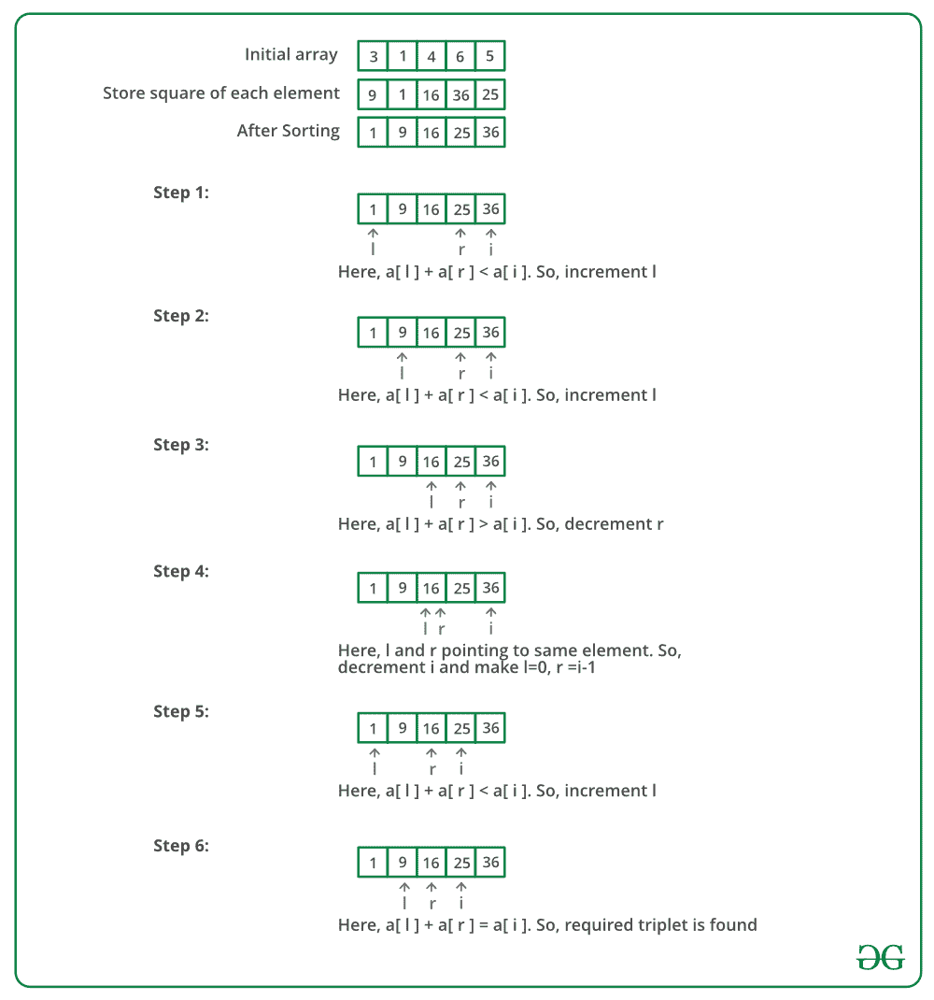

# 毕达哥拉斯三元组在一个数组中

> 原文:[https://www . geesforgeks . org/find-毕达哥拉斯-三元组-未排序数组/](https://www.geeksforgeeks.org/find-pythagorean-triplet-in-an-unsorted-array/)

给定一个整数数组，如果存在满足 a<sup>2</sup>+b<sup>2</sup>= c<sup>2</sup>的三元组(a，b，c)，则编写一个返回 true 的函数。

**例**:

> **输入** : arr[] = {3，1，4，6，5}
> 输出 : True
> 有一个毕达哥拉斯三元组(3，4，5)。
> 
> **输入** : arr[] = {10，4，6，12，5}
> 输出 : False
> 没有毕达哥拉斯三元组。

**方法 1(天真)**
一个简单的解决方法是运行三个循环，三个循环挑选三个数组元素，检查当前的三个元素是否形成毕达哥拉斯三元组。

下面是上述想法的实现:

## C++

```
// A C++ program that returns true if there is a Pythagorean
// Triplet in a given array.
#include <iostream>

using namespace std;

// Returns true if there is Pythagorean triplet in ar[0..n-1]
bool isTriplet(int ar[], int n)
{
    for (int i = 0; i < n; i++) {
        for (int j = i + 1; j < n; j++) {
            for (int k = j + 1; k < n; k++) {
                // Calculate square of array elements
                int x = ar[i] * ar[i], y = ar[j] * ar[j], z = ar[k] * ar[k];

                if (x == y + z || y == x + z || z == x + y)
                    return true;
            }
        }
    }

    // If we reach here, no triplet found
    return false;
}

/* Driver program to test above function */
int main()
{
    int ar[] = { 3, 1, 4, 6, 5 };
    int ar_size = sizeof(ar) / sizeof(ar[0]);
    isTriplet(ar, ar_size) ? cout << "Yes" : cout << "No";
    return 0;
}
```

## Java 语言(一种计算机语言，尤用于创建网站)

```
// A Java program that returns true if there is a Pythagorean
// Triplet in a given array.
import java.io.*;

class PythagoreanTriplet {

    // Returns true if there is Pythagorean triplet in ar[0..n-1]
    static boolean isTriplet(int ar[], int n)
    {
        for (int i = 0; i < n; i++) {
            for (int j = i + 1; j < n; j++) {
                for (int k = j + 1; k < n; k++) {
                    // Calculate square of array elements
                    int x = ar[i] * ar[i], y = ar[j] * ar[j], z = ar[k] * ar[k];

                    if (x == y + z || y == x + z || z == x + y)
                        return true;
                }
            }
        }

        // If we reach here, no triplet found
        return false;
    }

    // Driver program to test above function
    public static void main(String[] args)
    {
        int ar[] = { 3, 1, 4, 6, 5 };
        int ar_size = ar.length;
        if (isTriplet(ar, ar_size) == true)
            System.out.println("Yes");
        else
            System.out.println("No");
    }
}
/* This code is contributed by Devesh Agrawal */
```

## 蟒蛇 3

```
# Python program to check if there is Pythagorean
# triplet in given array

# Returns true if there is Pythagorean
# triplet in ar[0..n-1]

def isTriplet(ar, n):
    j = 0

    for i in range(n - 2):
        for k in range(j + 1, n):
            for j in range(i + 1, n - 1):
                # Calculate square of array elements
                x = ar[i]*ar[i]
                y = ar[j]*ar[j]
                z = ar[k]*ar[k]
                if (x == y + z or y == x + z or z == x + y):
                    return 1

    # If we reach here, no triplet found
    return 0

# Driver program to test above function
ar = [3, 1, 4, 6, 5]
ar_size = len(ar)

if(isTriplet(ar, ar_size)):
    print("Yes")
else:
    print("No")

# This code is contributed by Aditi Sharma
```

## C#

```
// A C# program that returns true
// if there is a Pythagorean
// Triplet in a given array.
using System;

class GFG {

    // Returns true if there is Pythagorean
    // triplet in ar[0..n-1]
    static bool isTriplet(int[] ar, int n)
    {
        for (int i = 0; i < n; i++) {
            for (int j = i + 1; j < n; j++) {
                for (int k = j + 1; k < n; k++) {

                    // Calculate square of array elements
                    int x = ar[i] * ar[i], y = ar[j] * ar[j], z = ar[k] * ar[k];

                    if (x == y + z || y == x + z || z == x + y)
                        return true;
                }
            }
        }

        // If we reach here,
        // no triplet found
        return false;
    }

    // Driver code
    public static void Main()
    {
        int[] ar = { 3, 1, 4, 6, 5 };
        int ar_size = ar.Length;
        if (isTriplet(ar, ar_size) == true)
            Console.WriteLine("Yes");
        else
            Console.WriteLine("No");
    }
}

// This code is contributed by shiv_bhakt.
```

## 服务器端编程语言（Professional Hypertext Preprocessor 的缩写）

```
<?php
// A PHP program that returns
// true if there is a Pythagorean
// Triplet in a given array.

// Returns true if there is
// Pythagorean triplet in
// ar[0..n-1]
function isTriplet($ar, $n)
{
    for ($i = 0; $i < $n; $i++)
    {
    for ($j = $i + 1; $j < $n; $j++)
    {
        for ($k = $j + 1; $k < $n; $k++)
        {

            // Calculate square of
            // array elements
            $x = $ar[$i] * $ar[$i];
            $y = $ar[$j] * $ar[$j];
            $z = $ar[$k] * $ar[$k];

            if ($x == $y + $z or
                $y == $x + $z or
                $z == $x + $y)
                return true;
        }
    }
    }

    // If we reach here,
    // no triplet found
    return false;
}

    // Driver Code
    $ar = array(3, 1, 4, 6, 5);
    $ar_size = count($ar);
    if(isTriplet($ar, $ar_size))
        echo "Yes";
    else
        echo "No";

// This code is contributed by anuj_67.
?>
```

## java 描述语言

```
<script>

// A Javascript program that returns
// true if there is a Pythagorean
// Triplet in a given array.

// Returns true if there is
// Pythagorean triplet in ar[0..n-1]
function isTriplet( ar, n)
{
    for (let i = 0; i < n; i++) {
        for (let j = i + 1; j < n; j++) {
            for (let k = j + 1; k < n; k++) {
          // Calculate square of array elements
                let x = ar[i] * ar[i], y = ar[j] *
                ar[j], z = ar[k] * ar[k];

                if (x == y + z || y == x + z ||
                    z == x + y)
                    return true;
            }
        }
    }

    // If we reach here, no triplet found
    return false;
}

    // driver code

    let ar = [ 3, 1, 4, 6, 5 ];
    let ar_size = ar.length;
    if (isTriplet(ar, ar_size) == true)
        document.write("Yes");
    else
        document.write("No");

</script>
```

**输出:**

```
Yes
```

上述解的时间复杂度为 O(n <sup>3</sup> )。

**方法 2(使用排序)**
我们可以先对数组进行排序，在 O(n <sup>2</sup> 时间内解决这个问题。
1)求输入数组中每个元素的平方。这一步需要 O(n)个时间。
2)按递增顺序对方形数组进行排序。这一步需要 0(nLogn)时间。
3)要找到一个三元组(a，b，c)，使得 a<sup>2</sup>= b<sup>2</sup>+c<sup>2</sup>，请执行以下操作。

1.  将“a”固定为排序数组的最后一个元素。
2.  现在搜索子数组中第一个元素和“a”之间的对(b，c)。使用本文方法 1 中讨论的中间相遇算法，可以在 O(n)时间内找到给定和的一对(b，c)。
3.  如果没有找到当前“a”的配对，则将“a”向后移动一个位置，并重复步骤 3.2。

下图是上述方法的模拟运行:



下面是上述方法的实现:

## C++

```
// A C++ program that returns true if there is a Pythagorean
// Triplet in a given array.
#include <algorithm>
#include <iostream>

using namespace std;

// Returns true if there is a triplet with following property
// A[i]*A[i] = A[j]*A[j] + A[k]*[k]
// Note that this function modifies given array
bool isTriplet(int arr[], int n)
{
    // Square array elements
    for (int i = 0; i < n; i++)
        arr[i] = arr[i] * arr[i];

    // Sort array elements
    sort(arr, arr + n);

    // Now fix one element one by one and find the other two
    // elements
    for (int i = n - 1; i >= 2; i--) {
        // To find the other two elements, start two index
        // variables from two corners of the array and move
        // them toward each other
        int l = 0; // index of the first element in arr[0..i-1]
        int r = i - 1; // index of the last element in arr[0..i-1]
        while (l < r) {
            // A triplet found
            if (arr[l] + arr[r] == arr[i])
                return true;

            // Else either move 'l' or 'r'
            (arr[l] + arr[r] < arr[i]) ? l++ : r--;
        }
    }

    // If we reach here, then no triplet found
    return false;
}

/* Driver program to test above function */
int main()
{
    int arr[] = { 3, 1, 4, 6, 5 };
    int arr_size = sizeof(arr) / sizeof(arr[0]);
    isTriplet(arr, arr_size) ? cout << "Yes" : cout << "No";
    return 0;
}
```

## Java 语言(一种计算机语言，尤用于创建网站)

```
// A Java program that returns true if there is a Pythagorean
// Triplet in a given array.
import java.io.*;
import java.util.*;

class PythagoreanTriplet {
    // Returns true if there is a triplet with following property
    // A[i]*A[i] = A[j]*A[j] + A[k]*[k]
    // Note that this function modifies given array
    static boolean isTriplet(int arr[], int n)
    {
        // Square array elements
        for (int i = 0; i < n; i++)
            arr[i] = arr[i] * arr[i];

        // Sort array elements
        Arrays.sort(arr);

        // Now fix one element one by one and find the other two
        // elements
        for (int i = n - 1; i >= 2; i--) {
            // To find the other two elements, start two index
            // variables from two corners of the array and move
            // them toward each other
            int l = 0; // index of the first element in arr[0..i-1]
            int r = i - 1; // index of the last element in arr[0..i-1]
            while (l < r) {
                // A triplet found
                if (arr[l] + arr[r] == arr[i])
                    return true;

                // Else either move 'l' or 'r'
                if (arr[l] + arr[r] < arr[i])
                    l++;
                else
                    r--;
            }
        }

        // If we reach here, then no triplet found
        return false;
    }

    // Driver program to test above function
    public static void main(String[] args)
    {
        int arr[] = { 3, 1, 4, 6, 5 };
        int arr_size = arr.length;
        if (isTriplet(arr, arr_size) == true)
            System.out.println("Yes");
        else
            System.out.println("No");
    }
}
/*This code is contributed by Devesh Agrawal*/
```

## 蟒蛇 3

```
# Python program that returns true if there is
# a Pythagorean Triplet in a given array.

# Returns true if there is Pythagorean
# triplet in ar[0..n-1]
def isTriplet(ar, n):
    # Square all the elements
    for i in range(n):
        ar[i] = ar[i] * ar[i]

    # sort array elements
    ar.sort()

    # fix one element
    # and find other two
    # i goes from n - 1 to 2
    for i in range(n-1, 1, -1):
        # start two index variables from
        # two corners of the array and
        # move them toward each other
        j = 0
        k = i - 1
        while (j < k):
            # A triplet found
            if (ar[j] + ar[k] == ar[i]):
                return True
            else:
                if (ar[j] + ar[k] < ar[i]):
                    j = j + 1
                else:
                    k = k - 1
    # If we reach here, then no triplet found
    return False

# Driver program to test above function */
ar = [3, 1, 4, 6, 5]
ar_size = len(ar)
if(isTriplet(ar, ar_size)):
    print("Yes")
else:
    print("No")

# This code is contributed by Aditi Sharma
```

## C#

```
// C# program that returns true
// if there is a Pythagorean
// Triplet in a given array.
using System;

class GFG {

    // Returns true if there is a triplet
    // with following property A[i]*A[i]
    // = A[j]*A[j]+ A[k]*[k] Note that
    // this function modifies given array
    static bool isTriplet(int[] arr, int n)
    {

        // Square array elements
        for (int i = 0; i < n; i++)
            arr[i] = arr[i] * arr[i];

        // Sort array elements
        Array.Sort(arr);

        // Now fix one element one by one
        // and find the other two elements
        for (int i = n - 1; i >= 2; i--) {
            // To find the other two elements,
            // start two index variables from
            // two corners of the array and
            // move them toward each other
            // index of the first element
            // in arr[0..i-1]
            int l = 0;

            // index of the last element
            // in arr[0..i - 1]
            int r = i - 1;
            while (l < r) {

                // A triplet found
                if (arr[l] + arr[r] == arr[i])
                    return true;

                // Else either move 'l' or 'r'
                if (arr[l] + arr[r] < arr[i])
                    l++;
                else
                    r--;
            }
        }

        // If we reach here, then
        // no triplet found
        return false;
    }

    // Driver Code
    public static void Main()
    {
        int[] arr = { 3, 1, 4, 6, 5 };
        int arr_size = arr.Length;
        if (isTriplet(arr, arr_size) == true)
            Console.WriteLine("Yes");
        else
            Console.WriteLine("No");
    }
}

// This code is contributed by shiv_bhakt.
```

## 服务器端编程语言（Professional Hypertext Preprocessor 的缩写）

```
<?php
// A PHP program that returns
// true if there is a Pythagorean
// Triplet in a given array.

// Returns true if there is a
// triplet with following property
// A[i]*A[i] = A[j]*A[j] + A[k]*[k]
// Note that this function modifies
// given array
function isTriplet( $arr, $n)
{

    // Square array elements
    for ($i = 0; $i < $n; $i++)
        $arr[$i] = $arr[$i] * $arr[$i];

    // Sort array elements
    sort($arr);

    // Now fix one element one by
    // one and find the other two
    // elements
    for($i = $n - 1; $i >= 2; $i--)
    {

        // To find the other two
        // elements, start two index
        // variables from two corners
        // of the array and move
        // them toward each other

        // index of the first element
        // in arr[0..i-1]
        $l = 0;

        // index of the last element
        // in arr[0..i-1]
        $r = $i - 1;
        while ($l < $r)
        {

            // A triplet found
            if ($arr[$l] + $arr[$r] == $arr[$i])
                return true;

            // Else either move 'l' or 'r'
            ($arr[$l] + $arr[$r] < $arr[$i])? $l++: $r--;
        }
    }

    // If we reach here,
    // then no triplet found
    return false;
}

    // Driver Code
    $arr = array(3, 1, 4, 6, 5);
    $arr_size = count($arr);
    if(isTriplet($arr, $arr_size))
        echo "Yes";
    else
        echo "No";

// This code is contributed by anuj_67.
?>
```

## java 描述语言

```
<script>
// A javascript program that returns true if there is a Pythagorean
// Triplet in a given array.

    // Returns true if there is a triplet with following property
    // A[i]*A[i] = A[j]*A[j] + A[k]*[k]
    // Note that this function modifies given array
    function isTriplet(arr , n)
    {

        // Square array elements
        for (i = 0; i < n; i++)
            arr[i] = arr[i] * arr[i];

        // Sort array elements
        arr.sort((a,b)=>a-b);

        // Now fix one element one by one and find the other two
        // elements
        for (i = n - 1; i >= 2; i--)
        {

            // To find the other two elements, start two index
            // variables from two corners of the array and move
            // them toward each other
            var l = 0; // index of the first element in arr[0..i-1]
            var r = i - 1; // index of the last element in arr[0..i-1]
            while (l < r)
            {

                // A triplet found
                if (arr[l] + arr[r] == arr[i])
                    return true;

                // Else either move 'l' or 'r'
                if (arr[l] + arr[r] < arr[i])
                    l++;
                else
                    r--;
            }
        }

        // If we reach here, then no triplet found
        return false;
    }

    // Driver program to test above function   
        var arr = [ 3, 1, 4, 6, 5 ];
        var arr_size = arr.length;
        if (isTriplet(arr, arr_size) == true)
            document.write("Yes");
        else
            document.write("No");

// This code is contributed by umadevi9616
</script>
```

**输出:**

```
 Yes 
```

该方法的时间复杂度为 O(n <sup>2</sup> )。

**方法 3** :(使用哈希)
这个问题也可以使用哈希来解决。我们可以使用哈希映射来标记给定数组的所有值。使用两个循环，我们可以迭代所有可能的 a 和 b 的组合，然后检查是否存在第三个值 c。如果存在任何这样的值，那么就有一个毕达哥拉斯三元组。

下面是上述方法的实现:

## C++

```
#include <bits/stdc++.h>
using namespace std;

// Function to check if the
// Pythagorean triplet exists or not
bool checkTriplet(int arr[], int n)
{
    int maximum = 0;

    // Find the maximum element
    for (int i = 0; i < n; i++) {
        maximum = max(maximum, arr[i]);
    }

    // Hashing array
    int hash[maximum + 1] = { 0 };

    // Increase the count of array elements
    // in hash table
    for (int i = 0; i < n; i++)
        hash[arr[i]]++;

    // Iterate for all possible a
    for (int i = 1; i < maximum + 1; i++) {

        // If a is not there
        if (hash[i] == 0)
            continue;

        // Iterate for all possible b
        for (int j = 1; j < maximum + 1; j++) {

            // If a and b are same and there is only one a
            // or if there is no b in original array
            if ((i == j && hash[i] == 1) || hash[j] == 0)
                continue;

            // Find c
            int val = sqrt(i * i + j * j);

            // If c^2 is not a perfect square
            if ((val * val) != (i * i + j * j))
                continue;

            // If c exceeds the maximum value
            if (val > maximum)
                continue;

            // If there exists c in the original array,
            // we have the triplet
            if (hash[val]) {
                return true;
            }
        }
    }
    return false;
}
// Driver Code
int main()
{
    int arr[] = { 3, 2, 4, 6, 5 };
    int n = sizeof(arr) / sizeof(arr[0]);
    if (checkTriplet(arr, n))
        cout << "Yes";
    else
        cout << "No";
}
```

## Java 语言(一种计算机语言，尤用于创建网站)

```
import java.util.*;

class GFG
{

// Function to check if the
// Pythagorean triplet exists or not
static boolean checkTriplet(int arr[], int n)
{
    int maximum = 0;

    // Find the maximum element
    for (int i = 0; i < n; i++)
    {
        maximum = Math.max(maximum, arr[i]);
    }

    // Hashing array
    int []hash = new int[maximum + 1];

    // Increase the count of array elements
    // in hash table
    for (int i = 0; i < n; i++)
        hash[arr[i]]++;

    // Iterate for all possible a
    for (int i = 1; i < maximum + 1; i++)
    {

        // If a is not there
        if (hash[i] == 0)
            continue;

        // Iterate for all possible b
        for (int j = 1; j < maximum + 1; j++)
        {

            // If a and b are same and there is only one a
            // or if there is no b in original array
            if ((i == j && hash[i] == 1) || hash[j] == 0)
                continue;

            // Find c
            int val = (int) Math.sqrt(i * i + j * j);

            // If c^2 is not a perfect square
            if ((val * val) != (i * i + j * j))
                continue;

            // If c exceeds the maximum value
            if (val > maximum)
                continue;

            // If there exists c in the original array,
            // we have the triplet
            if (hash[val] == 1)
            {
                return true;
            }
        }
    }
    return false;
}

// Driver Code
public static void main(String[] args)
{
    int arr[] = { 3, 2, 4, 6, 5 };
    int n = arr.length;
    if (checkTriplet(arr, n))
        System.out.print("Yes");
    else
        System.out.print("No");
}
}

// This code is contributed by Rajput-Ji
```

## 蟒蛇 3

```
# Function to check if the
# Pythagorean triplet exists or not
import math

def checkTriplet(arr, n):
    maximum = 0

    # Find the maximum element
    maximum = max(arr)

        # Hashing array
    hash = [0]*(maximum+1)

    # Increase the count of array elements
    # in hash table
    for i in range(n):
        hash[arr[i]] += 1

        # Iterate for all possible a
    for i in range(1, maximum+1):
        # If a is not there
        if (hash[i] == 0):
            continue

        # Iterate for all possible b
        for j in range(1, maximum+1):
            # If a and b are same and there is only one a
            # or if there is no b in original array
            if ((i == j and hash[i] == 1) or hash[j] == 0):
                continue

            # Find c
            val = int(math.sqrt(i * i + j * j))

            # If c^2 is not a perfect square
            if ((val * val) != (i * i + j * j)):
                continue

            # If c exceeds the maximum value
            if (val > maximum):
                continue

            # If there exists c in the original array,
            # we have the triplet
            if (hash[val]):
                return True
    return False

# Driver Code
arr = [3, 2, 4, 6, 5]
n = len(arr)
if (checkTriplet(arr, n)):
    print("Yes")
else:
    print("No")

# This code is contributed by ankush_953
```

## C#

```
using System;

class GFG
{

// Function to check if the
// Pythagorean triplet exists or not
static bool checkTriplet(int []arr, int n)
{
    int maximum = 0;

    // Find the maximum element
    for (int i = 0; i < n; i++)
    {
        maximum = Math.Max(maximum, arr[i]);
    }

    // Hashing array
    int []hash = new int[maximum + 1];

    // Increase the count of array elements
    // in hash table
    for (int i = 0; i < n; i++)
        hash[arr[i]]++;

    // Iterate for all possible a
    for (int i = 1; i < maximum + 1; i++)
    {

        // If a is not there
        if (hash[i] == 0)
            continue;

        // Iterate for all possible b
        for (int j = 1; j < maximum + 1; j++)
        {

            // If a and b are same and there is only one a
            // or if there is no b in original array
            if ((i == j && hash[i] == 1) || hash[j] == 0)
                continue;

            // Find c
            int val = (int) Math.Sqrt(i * i + j * j);

            // If c^2 is not a perfect square
            if ((val * val) != (i * i + j * j))
                continue;

            // If c exceeds the maximum value
            if (val > maximum)
                continue;

            // If there exists c in the original array,
            // we have the triplet
            if (hash[val] == 1)
            {
                return true;
            }
        }
    }
    return false;
}

// Driver Code
public static void Main(String[] args)
{
    int []arr = { 3, 2, 4, 6, 5 };
    int n = arr.Length;
    if (checkTriplet(arr, n))
        Console.Write("Yes");
    else
        Console.Write("No");
}
}

// This code is contributed by Rajput-Ji
```

## java 描述语言

```
<script>

    // Function to check if the
    // Pythagorean triplet exists or not
    function checkTriplet(arr , n) {
        var maximum = 0;

        // Find the maximum element
        for (i = 0; i < n; i++) {
            maximum = Math.max(maximum, arr[i]);
        }

        // Hashing array
        var hash = Array(maximum + 1).fill(0);

        // Increase the count of array elements
        // in hash table
        for (i = 0; i < n; i++)
            hash[arr[i]]++;

        // Iterate for all possible a
        for (i = 1; i < maximum + 1; i++) {

            // If a is not there
            if (hash[i] == 0)
                continue;

            // Iterate for all possible b
            for (j = 1; j < maximum + 1; j++) {

                // If a and b are same and there is only one a
                // or if there is no b in original array
                if ((i == j && hash[i] == 1) || hash[j] == 0)
                    continue;

                // Find c
                var val = parseInt( Math.sqrt(i * i + j * j));

                // If c^2 is not a perfect square
                if ((val * val) != (i * i + j * j))
                    continue;

                // If c exceeds the maximum value
                if (val > maximum)
                    continue;

                // If there exists c in the original array,
                // we have the triplet
                if (hash[val] == 1) {
                    return true;
                }
            }
        }
        return false;
    }

    // Driver Code
        var arr = [ 3, 2, 4, 6, 5 ];
        var n = arr.length;
        if (checkTriplet(arr, n))
            document.write("Yes");
        else
            document.write("No");

// This code is contributed by gauravrajput1

</script>
```

**Output**

```
Yes
```

感谢[奋斗者](https://auth.geeksforgeeks.org/user/Striver/articles)提出上述方法。
**时间复杂度** : O( max * max)，其中 max 是数组中最大最多的元素。

**方法-4:使用 STL**

**进场:**

这个问题可以用有序图和无序图来解决。不需要以有序的方式存储元素，因此无序映射的实现更快。我们可以使用无序映射来标记给定数组的所有值。使用两个循环，我们可以迭代所有可能的 a 和 b 的组合，然后检查是否存在第三个值 c。如果存在任何这样的值，那么就有一个毕达哥拉斯三元组。

下面是上述方法的实现:

## C++

```
#include <bits/stdc++.h>
using namespace std;

//  Returns true if there is Pythagorean triplet in
//  ar[0..n-1]
bool checkTriplet(int arr[], int n)
{
    // initializing unordered map with key and value as
    // integers
    unordered_map<int, int> umap;

    // Increase the count of array elements in unordered map
    for (int i = 0; i < n; i++)
        umap[arr[i]] = umap[arr[i]] + 1;

    for (int i = 0; i < n - 1; i++)
    {
        for (int j = i + 1; j < n; j++)
        {   
            // calculating the squares of two elements as
            // integer and float
            int p = sqrt(arr[i] * arr[i] + arr[j] * arr[j]);
            float q
                = sqrt(arr[i] * arr[i] + arr[j] * arr[j]);

            // Condition is true if the value is same in
            // integer and float and also the value is
            // present in unordered map
            if (p == q && umap[p] != 0)
                return true;
        }
    }

    // If we reach here, no triplet found
    return false;
}

// Driver Code
int main()
{
    int arr[] = { 3, 2, 4, 6, 5 };
    int n = sizeof(arr) / sizeof(arr[0]);
    if (checkTriplet(arr, n))
        cout << "Yes";
    else
        cout << "No";
}
// This code is contributed by Vikkycirus
```

## Java 语言(一种计算机语言，尤用于创建网站)

```
import java.util.*;
class GFG{

  //  Returns true if there is Pythagorean triplet in
  //  ar[0..n-1]
  static boolean checkTriplet(int arr[], int n)
  {

    // initializing unordered map with key and value as
    // integers
    HashMap<Integer,Integer> umap = new HashMap<>();

    // Increase the count of array elements in unordered map
    for (int i = 0; i < n; i++)
      if(umap.containsKey(arr[i]))
        umap.put(arr[i] , umap.get(arr[i]) + 1);
    else
      umap.put(arr[i], 1);

    for (int i = 0; i < n - 1; i++)
    {
      for (int j = i + 1; j < n; j++)
      {   

        // calculating the squares of two elements as
        // integer and float
        int p =(int) Math.sqrt(arr[i] * arr[i] + arr[j] * arr[j]);
        float q
          =(float) Math.sqrt(arr[i] * arr[i] + arr[j] * arr[j]);

        // Condition is true if the value is same in
        // integer and float and also the value is
        // present in unordered map
        if (p == q && umap.get(p) != 0)
          return true;
      }
    }

    // If we reach here, no triplet found
    return false;
  }

  // Driver Code
  public static void main(String[] args)
  {
    int arr[] = { 3, 2, 4, 6, 5 };
    int n = arr.length;
    if (checkTriplet(arr, n))
      System.out.print("Yes");
    else
      System.out.print("No");
  }
}

// This code is contributed by umadevi9616
```

## C#

```
using System;
using System.Collections.Generic;

public class GFG {

  // Returns true if there is Pythagorean triplet in
  // ar[0..n-1]
  static bool checkTriplet(int []arr, int n) {

    // initializing unordered map with key and value as
    // integers
    Dictionary<int, int> umap = new Dictionary<int,int>();

    // Increase the count of array elements in unordered map
    for (int i = 0; i < n; i++)
      if (umap.ContainsKey(arr[i]))
        umap.Add(arr[i], umap[arr[i]] + 1);
    else
      umap.Add(arr[i], 1);

    for (int i = 0; i < n - 1; i++) {
      for (int j = i + 1; j < n; j++) {

        // calculating the squares of two elements as
        // integer and float
        int p = (int) Math.Sqrt(arr[i] * arr[i] + arr[j] * arr[j]);
        float q = (float) Math.Sqrt(arr[i] * arr[i] + arr[j] * arr[j]);

        // Condition is true if the value is same in
        // integer and float and also the value is
        // present in unordered map
        if (p == q && umap[p] != 0)
          return true;
      }
    }

    // If we reach here, no triplet found
    return false;
  }

  // Driver Code
  public static void Main(String[] args) {
    int []arr = { 3, 2, 4, 6, 5 };
    int n = arr.Length;
    if (checkTriplet(arr, n))
      Console.Write("Yes");
    else
      Console.Write("No");
  }
}

// This code is contributed by umadevi9616
```

## java 描述语言

```
<script>

    // Returns true if there is Pythagorean triplet in
    // ar[0..n-1]
    function checkTriplet(arr , n) {

        // initializing unordered map with key and value as
        // integers
        var umap = new Map();

        // Increase the count of array elements in unordered map
        for (i = 0; i < n; i++)
            if (umap.has(arr[i]))
                umap.set(arr[i], umap.get(arr[i]) + 1);
            else
                umap.set(arr[i], 1);

        for (i = 0; i < n - 1; i++) {
            for (j = i + 1; j < n; j++) {

                // calculating the squares of two elements as
                // integer and float
                var p = parseInt( Math.sqrt(arr[i] * arr[i] + arr[j] * arr[j]));
                var q =  Math.sqrt(arr[i] * arr[i] + arr[j] * arr[j]);

                // Condition is true if the value is same in
                // integer and var and also the value is
                // present in unordered map
                if (p == q && umap.get(p) != 0)
                    return true;
            }
        }

        // If we reach here, no triplet found
        return false;
    }

    // Driver Code

        var arr = [ 3, 2, 4, 6, 5 ];
        var n = arr.length;
        if (checkTriplet(arr, n))
            document.write("Yes");
        else
            document.write("No");

// This code contributed by gauravrajput1
</script>
```

**Output**

```
Yes
```

**时间复杂度** :O(n <sup>2</sup>

本文由**哈什特·古普塔**供稿。如果你发现任何不正确的地方，或者你想分享更多关于上面讨论的话题的信息，请写评论。

**方法 5–更好的基于哈希的方法**

这种方法使用 Set。首先，我们将对数组的元素进行平方，然后按照递增的顺序对数组进行排序。运行两个循环，其中外部循环从数组的最后一个索引开始到第二个索引(假设基于 0 的索引)，内部循环从外部循环索引–1 开始。创建一个集合来存储外循环索引和内循环索引之间的元素。检查集合中是否有一个数字等于 arr[外部循环索引]–arr[内部循环索引]。如果是，则返回“真”。

## 蟒蛇 3

```
# Python program to check if there exists a pythagorean triplet
def checkTriplet(arr, n):
    for i in range(n):
        arr[i] = arr[i] * arr[i]

    arr.sort()

    for i in range(n - 1, 1, -1):
        s = set()
        for j in range(i - 1, -1, -1):
            if (arr[i] - arr[j]) in s:
                return True
            s.add(arr[j])
    return False

# Driver Program
arr = [3, 2, 4, 6, 5]
n = len(arr)
if (checkTriplet(arr, n)):
    print("Yes")
else:
    print("No")

# This is contributed by Manvi Pandey
```

**Output**

```
Yes
```

时间复杂性–o(n^2)