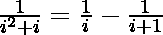
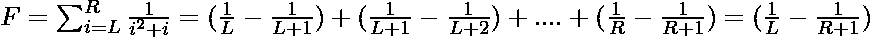

# 求表达式的范围值

> 原文:[https://www . geesforgeks . org/find-range-value-of-the-expression/](https://www.geeksforgeeks.org/find-range-value-of-the-expression/)

给定两个整数 **L** 和 **R** ，任务是计算表达式的值:


**例:**

> **输入:** L = 6，R = 12
> **输出:** 0.09
> **输入:** L = 5，R = 6
> **输出:** 0.06

**进场:**可以观察到。
所以，
于是，答案会是**(1/L)–(1/(R+1))**。
以下是上述方法的实施:

## C++

```
// C++ implementation of the approach
#include <bits/stdc++.h>
using namespace std;

// Function to return the value
// of the given expression
double get(double L, double R)
{

    // Value of the first term
    double x = 1.0 / L;

    // Value of the last term
    double y = 1.0 / (R + 1.0);

    return (x - y);
}

// Driver code
int main()
{
    int L = 6, R = 12;

    // Get the result
    double ans = get(L, R);
    cout << fixed << setprecision(2) << ans;

    return 0;
}
```

## Java 语言(一种计算机语言，尤用于创建网站)

```
// Java implementation of the approach
import java.util.*;

class GFG
{

// Function to return the value
// of the given expression
static double get(double L, double R)
{

    // Value of the first term
    double x = 1.0 / L;

    // Value of the last term
    double y = 1.0 / (R + 1.0);

    return (x - y);
}

// Driver code
public static void main(String []args)
{
    int L = 6, R = 12;

    // Get the result
    double ans = get(L, R);
    System.out.printf( "%.2f", ans);
}
}

// This code is contributed by Surendra_Gangwar
```

## 蟒蛇 3

```
# Python3 implementation of the approach

# Function to return the value
# of the given expression
def get(L, R) :

    # Value of the first term
    x = 1.0 / L;

    # Value of the last term
    y = 1.0 / (R + 1.0);

    return (x - y);

# Driver code
if __name__ == "__main__" :

    L = 6; R = 12;

    # Get the result
    ans = get(L, R);
    print(round(ans, 2));

# This code is contributed by AnkitRai01
```

## C#

```

// C# implementation of the approach
using System;

public class GFG
{

// Function to return the value
// of the given expression
static double get(double L, double R)
{

    // Value of the first term
    double x = 1.0 / L;

    // Value of the last term
    double y = 1.0 / (R + 1.0);

    return (x - y);
}

// Driver code
public static void Main(String []args)
{
    int L = 6, R = 12;

    // Get the result
    double ans = get(L, R);
    Console.Write( "{0:F2}", ans);
}
}

// This code contributed by PrinciRaj1992
```

## java 描述语言

```
<script>
// JavaScript implementation of the approach

// Function to return the value
// of the given expression
function get(L, R)
{

    // Value of the first term
    let x = 1.0 / L;

    // Value of the last term
    let y = 1.0 / (R + 1.0);
    return (x - y);
}

// Driver code
    let L = 6, R = 12;

    // Get the result
    let ans = get(L, R);
    document.write(Math.round(ans * 100) / 100);

// This code is contributed by Surbhi Tyagi.
</script>
```

**Output:** 

```
0.09
```

**时间复杂度:** O(1)