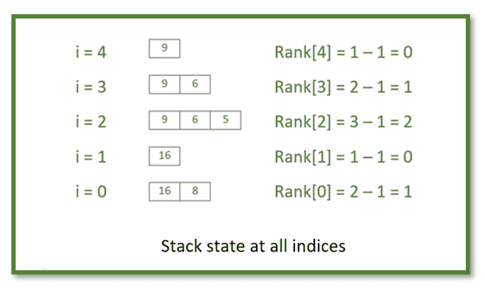

# 求数组中每个元素的相对排名

> 原文:[https://www . geeksforgeeks . org/find-相对-数组中每个元素的秩/](https://www.geeksforgeeks.org/find-relative-rank-of-each-element-in-array/)

给定一个由 **N** 个整数组成的[数组](https://www.geeksforgeeks.org/introduction-to-arrays/) **A[]** ，任务是为给定数组中的每个元素找到*相对等级*。

> 数组中每个元素的**相对等级**是从当前元素开始的[最长递增子序列](https://www.geeksforgeeks.org/longest-increasing-subsequence/)中大于当前元素的元素计数。

**示例:**

> **输入:** A[] = {8，16，5，6，9}，N = 5
> **输出:** {1，0，2，1，0}
> **说明:**
> 对于 i = 0，要求的顺序为{8，16}相对秩= 1。
> 对于 i = 1，因为 16 之后的所有元素都小于 16，所以相对秩= 0。
> 对于 i = 2，所需序列为{5，6，9}相对秩= 2
> 对于 i = 3，所需序列为{6，9}相对秩= 1
> 对于 i = 4，所需序列为{9}相对秩= 0
> 
> **输入:** A[] = {1，2，3，5，4}
> **输出:** {3，2，1，0，0}
> **解释:**
> 对于 i = 0，所需序列为{1，2，3，5}，相对秩= 3
> 对于 i = 1，所需序列为{2，3，5}，相对秩= 2
> 对于 i = 2，所需序列为{3，5}，相对秩= 1【T10

**朴素方法:**思想是为每个元素生成最长的递增子序列，然后每个元素的相对秩是**(LIS-1 的长度)**。

***时间复杂度:** O(N <sup>2</sup> )
**辅助空间:** O(1)*

**高效方法:**为了优化上述方法，想法是使用一个[堆栈](https://www.geeksforgeeks.org/stack-data-structure/)并存储元素，这些元素从右到每个元素(比如 **A[i]** )以非递减顺序排列，然后每个 **A[i]** 的等级是**(堆栈大小–1)**直到该元素。下图是同样的说明:
[](https://media.geeksforgeeks.org/wp-content/uploads/20200726032359/FindRankStackStae.png)

下面是上述方法的实现:

## C++

```
// C++ program for the above approach
#include <bits/stdc++.h>
using namespace std;

// Function to find relative rank for
// each element in the array A[]
void findRank(int A[], int N)
{
    // Create Rank Array
    int rank[N] = {};

    // Stack to store numbers in
    // non-decreasing order from right
    stack<int> s;

    // Push last element in stack
    s.push(A[N - 1]);

    // Iterate from second last
    // element to first element
    for (int i = N - 2; i >= 0; i--) {

        // If current element is less
        // than the top of stack and
        // push A[i] in stack
        if (A[i] < s.top()) {

            s.push(A[i]);

            // Rank is stack size - 1
            // for current element
            rank[i] = s.size() - 1;
        }
        else {

            // Pop elements from stack
            // till current element is
            // greater than the top
            while (!s.empty()
                   && A[i] >= s.top()) {
                s.pop();
            }

            // Push current element in Stack
            s.push(A[i]);

            // Rank is stack size - 1
            rank[i] = s.size() - 1;
        }
    }

    // Print rank of all elements
    for (int i = 0; i < N; i++) {
        cout << rank[i] << " ";
    }
}

// Driver Code
int main()
{
    // Given array A[]
    int A[] = { 1, 2, 3, 5, 4 };

    int N = sizeof(A) / sizeof(A[0]);

    // Function call
    findRank(A, N);
    return 0;
}
```

## Java 语言(一种计算机语言，尤用于创建网站)

```
// Java program to implement
// the above approach
import java.io.*;
import java.util.*;
import java.lang.*;

class GFG{

// Function to find relative rank for
// each element in the array A[]
static void findRank(int[] A, int N)
{

    // Create Rank Array
    int[] rank = new int[N];

    // Stack to store numbers in
    // non-decreasing order from right
    Stack<Integer> s = new Stack<Integer>();

    // Push last element in stack
    s.add(A[N - 1]);

    // Iterate from second last
    // element to first element
    for(int i = N - 2; i >= 0; i--)
    {

        // If current element is less
        // than the top of stack and
        // push A[i] in stack
        if (A[i] < s.peek()) 
        {
            s.add(A[i]);

            // Rank is stack size - 1
            // for current element
            rank[i] = s.size() - 1;
        }
        else
        {

            // Pop elements from stack
            // till current element is
            // greater than the top
            while (!s.isEmpty() && 
                    A[i] >= s.peek())
            {
                s.pop();
            }

            // Push current element in Stack
            s.add(A[i]);

            // Rank is stack size - 1
            rank[i] = s.size() - 1;
        }
    }

    // Print rank of all elements
    for(int i = 0; i < N; i++) 
    {
        System.out.print(rank[i] + " ");
    }
}

// Driver Code
public static void main(String[] args)
{

    // Given array A[]
    int A[] = { 1, 2, 3, 5, 4 };

    int N = A.length;

    // Function call
    findRank(A, N);
}
}

// This code is contributed by sanjoy_62
```

## 蟒蛇 3

```
# Python3 program for the above approach

# Function to find relative rank for
# each element in the array A[]
def findRank(A, N):

    # Create Rank Array
    rank = [0] * N

    # Stack to store numbers in
    # non-decreasing order from right
    s = []

    # Push last element in stack
    s.append(A[N - 1])

    # Iterate from second last
    # element to first element
    for i in range(N - 2, -1, -1):

        # If current element is less
        # than the top of stack and
        # append A[i] in stack
        if (A[i] < s[-1]):
            s.append(A[i])

            # Rank is stack size - 1
            # for current element
            rank[i] = len(s) - 1

        else:

            # Pop elements from stack
            # till current element is
            # greater than the top
            while (len(s) > 0 and A[i] >= s[-1]):
                del s[-1]

            # Push current element in Stack
            s.append(A[i])

            # Rank is stack size - 1
            rank[i] = len(s) - 1

    # Print rank of all elements
    for i in range(N):
        print(rank[i], end = " ")

# Driver Code
if __name__ == '__main__':

    # Given array A[]
    A = [ 1, 2, 3, 5, 4 ]

    N = len(A)

    # Function call
    findRank(A, N)

# This code is contributed by mohit kumar 29
```

## C#

```
// C# program to implement
// the above approach
using System;
using System.Collections.Generic;
using System.Linq;

class GFG{

// Function to find relative rank for
// each element in the array A[]
static void findRank(int[] A, int N)
{

    // Create Rank Array
    int[] rank = new int[N];

    // Stack to store numbers in
    // non-decreasing order from right
    Stack<int> s = new Stack<int>();

    // Push last element in stack
    s.Push(A[N - 1]);

    // Iterate from second last
    // element to first element
    for(int i = N - 2; i >= 0; i--)
    {

        // If current element is less
        // than the top of stack and
        // push A[i] in stack
        if (A[i] < s.Peek())
        {
            s.Push(A[i]);

            // Rank is stack size - 1
            // for current element
            rank[i] = s.Count() - 1;
        }
        else
        {

            // Pop elements from stack
            // till current element is
            // greater than the top
            while (s.Count() != 0 && 
                   A[i] >= s.Peek())
            {
                s.Pop();
            }

            // Push current element in Stack
            s.Push(A[i]);

            // Rank is stack size - 1
            rank[i] = s.Count() - 1;
        }
    }

    // Print rank of all elements
    for(int i = 0; i < N; i++)
    {
        Console.Write(rank[i] + " ");
    }
}

// Driver Code
public static void Main()
{

    // Given array A[]
    int[] A = new int[] { 1, 2, 3, 5, 4 };

    int N = A.Length;

    // Function call
    findRank(A, N);
}
}

// This code is contributed by sanjoy_62
```

**Output:**

```
3 2 1 0 0

```

 ***时间复杂度:**O(N)
T5】辅助空间: O(1)*