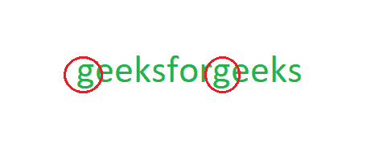

# 查找字符串中最先出现的重复字符

> 原文:[https://www . geesforgeks . org/find-repeated-character-present-first-string/](https://www.geeksforgeeks.org/find-repeated-character-present-first-string/)

给定一个字符串，找到字符串中最先出现的重复字符。
**(不是第一个重复的字符，在这里找到**[](https://www.geeksforgeeks.org/find-the-first-repeated-character-in-a-string/)****。)****

****

****示例:****

```
Input  : geeksforgeeks
Output : g
(mind that it will be g, not e.)
```

****问于:高盛实习****

****使用 O(N^2 的简单解决方案)复杂性**
解决方案是循环遍历字符串中的每个字符，并在字符串的其余部分中搜索相同的字符。这需要两个循环，因此不是最佳的。**

## **C++**

```
// C++ program to find the first
// character that is repeated
#include <bits/stdc++.h>
#include <string.h>

using namespace std;
int findRepeatFirstN2(char* s)
{
    // this is O(N^2) method
    int p = -1, i, j;
    for (i = 0; i < strlen(s); i++)
    {
        for (j = i + 1; j < strlen(s); j++)
        {
            if (s[i] == s[j])
            {
                p = i;
                break;
            }
        }
        if (p != -1)
            break;
    }

    return p;
}

// Driver code
int main()
{
    char str[] = "geeksforgeeks";
    int pos = findRepeatFirstN2(str);
    if (pos == -1)
        cout << "Not found";
    else
        cout << str[pos];
    return 0;
}

// This code is contributed
// by Akanksha Rai
```

## **C**

```
// C program to find the first character that
// is repeated
#include <stdio.h>
#include <string.h>

int findRepeatFirstN2(char* s)
{
    // this is O(N^2) method
    int p = -1, i, j;
    for (i = 0; i < strlen(s); i++) {
        for (j = i + 1; j < strlen(s); j++) {
            if (s[i] == s[j]) {
                p = i;
                break;
            }
        }
        if (p != -1)
            break;
    }

    return p;
}

// Driver code
int main()
{
    char str[] = "geeksforgeeks";
    int pos = findRepeatFirstN2(str);
    if (pos == -1)
        printf("Not found");
    else
        printf("%c", str[pos]);
    return 0;
}
```

## **Java 语言(一种计算机语言，尤用于创建网站)**

```
// Java program to find the first character
// that is repeated
import java.io.*;
import java.util.*;

class GFG {

    static int findRepeatFirstN2(String s)
    {

        // this is O(N^2) method
        int p = -1, i, j;
        for (i = 0; i < s.length(); i++)
        {
            for (j = i + 1; j < s.length(); j++)
            {
                if (s.charAt(i) == s.charAt(j))
                {
                    p = i;
                    break;
                }
            }
            if (p != -1)
                break;
        }

        return p;
    }

    // Driver code
    static public void main (String[] args)
    {
        String str = "geeksforgeeks";
        int pos = findRepeatFirstN2(str);

        if (pos == -1)
            System.out.println("Not found");
        else
        System.out.println( str.charAt(pos));
    }
}

// This code is contributed by anuj_67.
```

## **蟒蛇 3**

```
# Python3 program to find the first
# character that is repeated

def findRepeatFirstN2(s):

    # this is O(N^2) method
    p = -1
    for i in range(len(s)):

        for j in range (i + 1, len(s)):

            if (s[i] == s[j]):
                p = i
                break

        if (p != -1):
            break

    return p

# Driver code
if __name__ == "__main__":

    str = "geeksforgeeks"
    pos = findRepeatFirstN2(str)
    if (pos == -1):
        print ("Not found")
    else:
        print (str[pos])

# This code is contributed
# by ChitraNayal
```

## **C#**

```
// C# program to find the first character
// that is repeated
using System;

class GFG {

    static int findRepeatFirstN2(string s)
    {

        // this is O(N^2) method
        int p = -1, i, j;
        for (i = 0; i < s.Length; i++)
        {
            for (j = i + 1; j < s.Length; j++)
            {
                if (s[i] == s[j])
                {
                    p = i;
                    break;
                }
            }
            if (p != -1)
                break;
        }

        return p;
    }

    // Driver code
    static public void Main ()
    {
        string str = "geeksforgeeks";
        int pos = findRepeatFirstN2(str);

        if (pos == -1)
            Console.WriteLine("Not found");
        else
        Console.WriteLine( str[pos]);
    }
}

// This code is contributed by anuj_67.
```

## **服务器端编程语言（Professional Hypertext Preprocessor 的缩写）**

```
<?php
// PHP program to find the first
// character that is repeated

function findRepeatFirstN2($s)
{
    // this is O(N^2) method
    $p = -1;
    for ($i = 0; $i < strlen($s); $i++)
    {
        for ($j = ($i + 1);
             $j < strlen($s); $j++)
        {
            if ($s[$i] == $s[$j])
            {
                $p = $i;
                break;
            }
        }
        if ($p != -1)
            break;
    }

    return $p;
}

// Driver code
$str = "geeksforgeeks";
$pos = findRepeatFirstN2($str);

if ($pos == -1)
    echo ("Not found");
else
    echo ($str[$pos]);

// This code is contributed by jit_t
?>
```

## **java 描述语言**

```
<script>

// Javascript program to find the first
// character that is repeated
function findRepeatFirstN2(s)
{

    // This is O(N^2) method
    let p = -1, i, j;
    for(i = 0; i < s.length; i++)
    {
        for(j = i + 1; j < s.length; j++)
        {
            if (s[i] == s[j])
            {
                p = i;
                break;
            }
        }
        if (p != -1)
            break;
    }
    return p;
}

// Driver code
let str = "geeksforgeeks";
let pos = findRepeatFirstN2(str);

if (pos == -1)
    document.write("Not found");
else
    document.write(str[pos]);

// This code is contributed by suresh07  

</script>
```

****Output**

```
g
```** 

****通过计数出现次数进行优化**
该解决方案通过使用以下技术进行优化:
1。我们遍历字符串，并使用 ASCII 码对字符进行散列。如果找到，存储 1，如果再次找到，存储 2。此外，存储第一次在中找到的字母的位置。
2。我们在散列数组上运行一个循环，现在我们找到任何重复字符的最小位置。**

**这将有一个运行时间 **O(N)** 。**

## **C++**

```
// C++ program to find the first character that
// is repeated
#include<bits/stdc++.h>

using namespace std;
// 256 is taken just to ensure nothing is left,
// actual max ASCII limit is 128
#define MAX_CHAR 256

int findRepeatFirst(char* s)
{
    // this is optimized method
    int p = -1, i, k;

    // initialized counts of occurrences of
    // elements as zero
    int hash[MAX_CHAR] = { 0 };

    // initialized positions
    int pos[MAX_CHAR];

    for (i = 0; i < strlen(s); i++) {
        k = (int)s[i];
        if (hash[k] == 0) {
            hash[k]++;
            pos[k] = i;
        } else if (hash[k] == 1)
            hash[k]++;
    }

    for (i = 0; i < MAX_CHAR; i++) {
        if (hash[i] == 2) {
            if (p == -1) // base case
                p = pos[i];
            else if (p > pos[i])
                p = pos[i];
        }
    }

    return p;
}

// Driver code
int main()
{
    char str[] = "geeksforgeeks";
    int pos = findRepeatFirst(str);
    if (pos == -1)
        cout << "Not found";
    else
        cout << str[pos];
    return 0;
}

// This code is contributed
// by Akanksha Rai
```

## **C**

```
// C program to find the first character that
// is repeated
#include <stdio.h>
#include <string.h>

// 256 is taken just to ensure nothing is left,
// actual max ASCII limit is 128
#define MAX_CHAR 256

int findRepeatFirst(char* s)
{
    // this is optimized method
    int p = -1, i, k;

    // initialized counts of occurrences of
    // elements as zero
    int hash[MAX_CHAR] = { 0 };

    // initialized positions
    int pos[MAX_CHAR];

    for (i = 0; i < strlen(s); i++) {
        k = (int)s[i];
        if (hash[k] == 0) {
            hash[k]++;
            pos[k] = i;
        } else if (hash[k] == 1)
            hash[k]++;
    }

    for (i = 0; i < MAX_CHAR; i++) {
        if (hash[i] == 2) {
            if (p == -1) // base case
                p = pos[i];
            else if (p > pos[i])
                p = pos[i];
        }
    }

    return p;
}

// Driver code
int main()
{
    char str[] = "geeksforgeeks";
    int pos = findRepeatFirst(str);
    if (pos == -1)
        printf("Not found");
    else
        printf("%c", str[pos]);
    return 0;
}
```

## **Java 语言(一种计算机语言，尤用于创建网站)**

```
// Java Program to find the first character 
// that is repeated

import java.util.*;
import java.lang.*;

public class GFG
{
    public static int findRepeatFirst(String s)
    {
        // this is optimized method
        int p = -1, i, k;

        // initialized counts of occurrences of
        // elements as zero
        int MAX_CHAR = 256;
        int hash[] = new int[MAX_CHAR];

        // initialized positions
        int pos[] = new int[MAX_CHAR];

        for (i = 0; i < s.length(); i++)
        {
            k = (int)s.charAt(i);
            if (hash[k] == 0)
            {
                hash[k]++;
                pos[k] = i;
            }
            else if (hash[k] == 1)
                hash[k]++;
        }

        for (i = 0; i < MAX_CHAR; i++)
        {
            if (hash[i] == 2)
            {
                if (p == -1) // base case
                    p = pos[i];
                else if (p > pos[i])
                    p = pos[i];
            }
        }

        return p;
    }

// Driver code
    public static void main(String[] args)
    {
        String str = "geeksforgeeks";
        int pos = findRepeatFirst(str);
        if (pos == -1)
            System.out.println("Not found");
        else
            System.out.println(str.charAt(pos));
    }
}

// Code Contributed by Mohit Gupta_OMG
```

## **蟒蛇 3**

```
# Python 3 program to find the first
# character that is repeated

# 256 is taken just to ensure nothing
# is left, actual max ASCII limit is 128

MAX_CHAR = 256

def findRepeatFirst(s):

    # this is optimized method
    p = -1

    # initialized counts of occurrences
    # of elements as zero
    hash = [0 for i in range(MAX_CHAR)]

    # initialized positions
    pos = [0 for i in range(MAX_CHAR)]

    for i in range(len(s)):
        k = ord(s[i])
        if (hash[k] == 0):
            hash[k] += 1
            pos[k] = i
        elif(hash[k] == 1):
            hash[k] += 1

    for i in range(MAX_CHAR):
        if (hash[i] == 2):
            if (p == -1): # base case
                p = pos[i]
            elif(p > pos[i]):
                p = pos[i]
    return p

# Driver code
if __name__ == '__main__':
    str = "geeksforgeeks"
    pos = findRepeatFirst(str);
    if (pos == -1):
        print("Not found")
    else:
        print(str[pos])

# This code is contributed by
# Shashank_Sharma
```

## **C#**

```
// C# Program to find the first character 
// that is repeated
using System;
public class GFG
{
    public static int findRepeatFirst(string s)
    {
        // this is optimized method
        int p = -1, i, k;

        // initialized counts of occurrences of
        // elements as zero
        int MAX_CHAR = 256;
        int []hash = new int[MAX_CHAR];

        // initialized positions
        int []pos = new int[MAX_CHAR];

        for (i = 0; i < s.Length; i++)
        {
            k = (int)s[i];
            if (hash[k] == 0)
            {
                hash[k]++;
                pos[k] = i;
            }
            else if (hash[k] == 1)
                hash[k]++;
        }

        for (i = 0; i < MAX_CHAR; i++)
        {
            if (hash[i] == 2)
            {
                if (p == -1) // base case
                    p = pos[i];
                else if (p > pos[i])
                    p = pos[i];
            }
        }

        return p;
    }

    // Driver code
    public static void Main()
    {
        string str = "geeksforgeeks";
        int pos = findRepeatFirst(str);
        if (pos == -1)
            Console.Write("Not found");
        else
            Console.Write(str[pos]);
    }
}

// This code is contributed by nitin mittal.
```

## **java 描述语言**

```
<script>
    // Javascript Program to find the first character that is repeated

    function findRepeatFirst(s)
    {
        // this is optimized method
        let p = -1, i, k;

        // initialized counts of occurrences of
        // elements as zero
        let MAX_CHAR = 256;
        let hash = new Array(MAX_CHAR);
        hash.fill(0);

        // initialized positions
        let pos = new Array(MAX_CHAR);
        pos.fill(0);

        for (i = 0; i < s.length; i++)
        {
            k = s[i].charCodeAt();
            if (hash[k] == 0)
            {
                hash[k]++;
                pos[k] = i;
            }
            else if (hash[k] == 1)
                hash[k]++;
        }

        for (i = 0; i < MAX_CHAR; i++)
        {
            if (hash[i] == 2)
            {
                if (p == -1) // base case
                    p = pos[i];
                else if (p > pos[i])
                    p = pos[i];
            }
        }

        return p;
    }

    let str = "geeksforgeeks";
    let pos = findRepeatFirst(str);
    if (pos == -1)
      document.write("Not found");
    else
      document.write(str[pos]);

// This code is contributed by rameshtravel07.
</script>
```

****Output**

```
g
```** 

#### **方法 3:使用内置的 Python 函数:**

#### **方法:**

*   **使用 Counter()函数计算所有字符的所有频率。**
*   **遍历字符串并检查是否有任何元素的频率大于 1。**
*   **打印字符并断开循环**

****下面是实现:****

## **蟒蛇 3**

```
# Python implementation
from collections import Counter

# Function which repeats
# first repeating character
def printrepeated(string):

    # Calculating frequencies
    # using Counter function
    freq = Counter(string)

    # Traverse the string
    for i in string:
        if(freq[i] > 1):
            print(i)
            break

# Driver code
string = "geeksforgeeks"

# passing string to printrepeated function
printrepeated(string)

# this code is contributed by vikkycirus
```

****Output**

```
g
```** 

****时间复杂度:O(n)****

****空间复杂度:O(n)****

****方法#4:** 仅通过给定字符串的单次遍历来求解。**

*****算法:*****

*****1。*** 从左向右遍历字符串。**

*****2。*** 如果当前字符不在哈希映射中，那么将该字符与其索引一起推送。**

*****3。*** 如果当前字符已经存在于哈希映射中，那么获取当前字符的索引(从哈希映射中)，并将其与之前找到的重复字符的索引进行比较。**

*****4*** 。如果当前索引较小，则更新索引。**

## **C++**

```
#include <iostream>
#include<unordered_map>
#define INT_MAX 2147483647
using namespace std;

// Function to find left most repeating character.
char firstRep (string s)
    {
        unordered_map<char,int> map;
        char c='#';
        int index=INT_MAX;

        // single traversal of string.
        for(int i=0;i<s.size();i++)
        {
            char p=s[i];

            if(map.find(p)==map.end())map.insert({p,i});
            else
            {
                if(map[p]<index)
                {
                    index=map[p];
                    c=p;
                }
            }

        }

        return c;
    }

// Main function.
int main() {

    // Input string.
    string s="abccdbd";
    cout<<firstRep(s)<<endl;

    return 0;
}

// This code is contributed
// by rohan007
```

****Output**

```
b
```** 

****时间复杂度:** O(N)**

****空间复杂度:** O(N)**

****更优解** [**首现最左**](https://www.geeksforgeeks.org/repeated-character-whose-first-appearance-is-leftmost/)
重复人物本文由 [**掌门德伊**](https://www.linkedin.com/in/suprotik-dey-368706127/) 供稿。如果你喜欢 GeeksforGeeks 并想投稿，你也可以使用[write.geeksforgeeks.org](https://write.geeksforgeeks.org)写一篇文章或者把你的文章邮寄到 review-team@geeksforgeeks.org。看到你的文章出现在极客博客主页上，帮助其他极客。
如果发现有不正确的地方，或者想分享更多关于上述话题的信息，请写评论。**