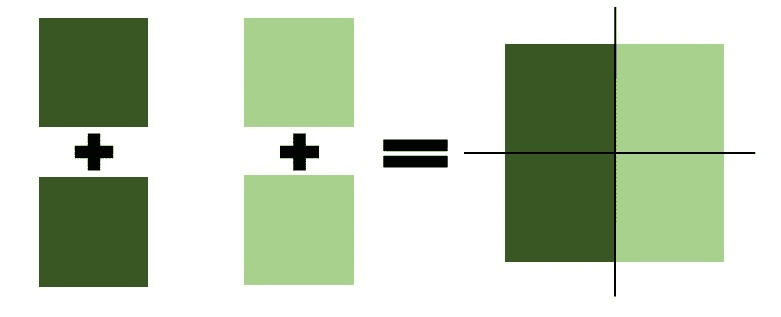
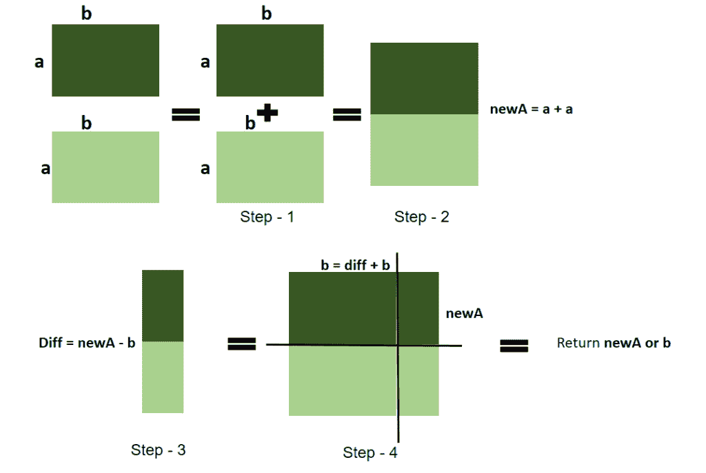

# 找到正方形的一边，使其面积最小以适合里面两个相同的矩形

> 原文:[https://www . geeksforgeeks . org/find-正方形的边，这使得最小的面积适合两个相同的矩形在其中/](https://www.geeksforgeeks.org/find-side-of-square-which-makes-minimal-area-to-fit-two-identical-rectangles-inside-it/)

给定矩形的高度 **H** 和宽度 **W** ，任务是找到两个矩形完全吻合的最小面积的正方形的边。

**注:**

1.  两个矩形可以并排或对角接触。
2.  矩形不能相互相交。
3.  矩形也可以接触正方形的边，但必须完全在正方形内部。
4.  矩形也可以旋转

**例:**

> **输入:** H = 4，W = 2
> **输出:** 4
> **说明:**
> 正方形最小边为 4
> **输入:** H = 4，W = 4
> **输出:** 8

**进场:**T2【有三种可能情况:

1.  首先检查给定的高度和宽度是否相同，如果相同，那么矩形本身就是一个正方形，所以简单地附加两个正方形并使边加倍，



1.  然后，如果第一种情况不满足，则检查**高度>宽度**是否满足，
    如果大于，则将宽度值增加一倍，并将其添加到宽度中，形成新的宽度，

> new_Width =宽度+宽度

2.  然后，如果第二种情况不满足，则检查**高度<宽度**，
    如果更小，则加倍*“高度”*值，并将其添加到高度中，形成新高度，

> new_Height =高度+高度

2.  结束



以下是上述方法的实现:

## C++

```
// C++ program of the above approach

#include <bits/stdc++.h>
using namespace std;

int minimalSquareSide(int a, int b)
{
    // if 'a' and 'b' same
    // then double 'a' or 'b'
    // and return (2*a) or (2*b)
    if (a == b) {
        return 2 * a;
    }

    // check if a!=b
    if (a != b) {
        // if a > b
        if (a > b) {

            // double the smaller value
            // that is 'b' and store
            // it to 'newB'
            int newB = b + b;

            // find the difference of
            // 'newB and 'a'
            int diff = abs(newB - a);

            // if 'newB' < a
            if (newB < a) {
                // then add the difference of
                // 'newB' and 'a' to the 'b'
                // to make 'b' and 'a' as same
                b = newB + diff;

                // return side of the
                // square a or b
                if (a == b)
                    return a;
                return 0;
            }

            else {
                // if 'newB' > a then
                // then add the difference
                // of 'newB' and 'a' to
                // the 'a' to make 'a' and
                // 'newB' as same
                a = a + diff;

                // return side of the
                // square a or newB
                if (a == newB)
                    return a;
                return 0;
            }
        }

        // if a < b
        else {
            // double the smaller value
            // that is 'a' and store
            // it to 'newA'
            int newA = a + a;

            // find the difference of
            // 'newA and 'b'
            int diff = abs(newA - b);

            // if 'newA' < b
            if (newA < b) {
                // then add the difference
                // of 'newA' and 'b' to
                // the 'a' to make 'a'
                // and 'b' as same
                a = diff + newA;

                // return side of the
                // square a or b
                if (a == b)
                    return a;
                return 0;
            }

            else {
                // if 'newA' > b then
                // then add the difference
                // of 'newA' and 'b' to
                // the 'b' to make 'b' and
                // 'newA' as same
                b = b + diff;

                // return side of the
                // square b or newA
                if (b == newA)
                    return b;
                return 0;
            }
        }
    }
}

// Drive Code
int main()
{
    int H, W;

    // Size of rectangle
    H = 3, W = 1;

    cout << minimalSquareSide(H, W) << endl;
    return 0;
}
```

## Java 语言(一种计算机语言，尤用于创建网站)

```
// Java program of the above approach
class GFG{

public static int minimalSquareSide(int a, int b)
{

    // If 'a' and 'b' same
    // then double 'a' or 'b'
    // and return (2*a) or (2*b)
    if (a == b)
    {
        return 2 * a;
    }

    // Check if a!=b
    if (a != b)
    {

        // If a > b
        if (a > b)
        {

            // Double the smaller value
            // that is 'b' and store
            // it to 'newB'
            int newB = b + b;

            // Find the difference of
            // 'newB and 'a'
            int diff = Math.abs(newB - a);

            // If 'newB' < a
            if (newB < a)
            {

                // Then add the difference of
                // 'newB' and 'a' to the 'b'
                // to make 'b' and 'a' as same
                b = newB + diff;

                // Return side of the
                // square a or b
                if (a == b)
                    return a;
                return 0;
            }
            else
            {

                // If 'newB' > a then
                // then add the difference
                // of 'newB' and 'a' to
                // the 'a' to make 'a' and
                // 'newB' as same
                a = a + diff;

                // Return side of the
                // square a or newB
                if (a == newB)
                    return a;
                return 0;
            }
        }

        // If a < b
        else
        {

            // Double the smaller value
            // that is 'a' and store
            // it to 'newA'
            int newA = a + a;

            // Find the difference of
            // 'newA and 'b'
            int diff = Math.abs(newA - b);

            // If 'newA' < b
            if (newA < b)
            {

                // Then add the difference
                // of 'newA' and 'b' to
                // the 'a' to make 'a'
                // and 'b' as same
                a = diff + newA;

                // Return side of the
                // square a or b
                if (a == b)
                    return a;
                return 0;
            }
            else
            {

                // If 'newA' > b then
                // then add the difference
                // of 'newA' and 'b' to
                // the 'b' to make 'b' and
                // 'newA' as same
                b = b + diff;

                // Return side of the
                // square b or newA
                if (b == newA)
                    return b;
                return 0;
            }
        }
    }
    return 0;
}

// Driver code   
public static void main(String[] args)
{
    int H, W;

    // Size of rectangle
    H = 3; W = 1;

    System.out.println(minimalSquareSide(H, W));
}
}

// This code is contributed by divyeshrabadiya07
```

## 蟒蛇 3

```
# Python3 program for the above approach

def minimalSquareSide(a, b):

    # If 'a' and 'b' same
    # then double 'a' or 'b'
    # and return (2*a) or (2*b)
    if (a == b):
        return 2 * a

    # Check if a!=b
    if (a != b):

        # If a > b
        if (a > b):

            # Double the smaller value
            # that is 'b' and store
            # it to 'newB'
            newB = b + b

            # Find the difference of
            # 'newB and 'a'
            diff = abs(newB - a)

            # If 'newB' < a
            if (newB < a):

                # Then add the difference of
                # 'newB' and 'a' to the 'b'
                # to make 'b' and 'a' as same
                b = newB + diff

                # Return side of the
                # square a or b
                if (a == b):
                    return a
                return 0

            else:

                # If 'newB' > a then
                # then add the difference
                # of 'newB' and 'a' to
                # the 'a' to make 'a' and
                # 'newB' as same
                a = a + diff

                # Return side of the
                # square a or newB
                if (a == newB):
                    return a
                return 0

        # If a < b
        else:

            # Double the smaller value
            # that is 'a' and store
            # it to 'newA'
            newA = a + a

            # Find the difference of
            # 'newA and 'b'
            diff = abs(newA - b)

            # If 'newA' < b
            if (newA < b):

                # Then add the difference
                # of 'newA' and 'b' to
                # the 'a' to make 'a'
                # and 'b' as same
                a = diff + newA

                # Return side of the
                # square a or b
                if (a == b):
                    return a
                return 0

            else:

                # If 'newA' > b then
                # then add the difference
                # of 'newA' and 'b' to
                # the 'b' to make 'b' and
                # 'newA' as same
                b = b + diff

                # Return side of the
                # square b or newA
                if (b == newA):
                    return b
                return 0

# Driver code

# Size of rectangle
H = 3
W = 1

print(minimalSquareSide(H, W))

# This code is contributed by sanjoy_62
```

## C#

```
// C# program of the above approach
using System;

class GFG{

public static int minimalSquareSide(int a, int b)
{

    // If 'a' and 'b' same
    // then double 'a' or 'b'
    // and return (2*a) or (2*b)
    if (a == b)
    {
        return 2 * a;
    }

    // Check if a!=b
    if (a != b)
    {

        // If a > b
        if (a > b)
        {

            // Double the smaller value
            // that is 'b' and store
            // it to 'newB'
            int newB = b + b;

            // Find the difference of
            // 'newB and 'a'
            int diff = Math.Abs(newB - a);

            // If 'newB' < a
            if (newB < a)
            {

                // Then add the difference of
                // 'newB' and 'a' to the 'b'
                // to make 'b' and 'a' as same
                b = newB + diff;

                // Return side of the
                // square a or b
                if (a == b)
                    return a;
                return 0;
            }
            else
            {

                // If 'newB' > a then
                // then add the difference
                // of 'newB' and 'a' to
                // the 'a' to make 'a' and
                // 'newB' as same
                a = a + diff;

                // Return side of the
                // square a or newB
                if (a == newB)
                    return a;
                return 0;
            }
        }

        // If a < b
        else
        {

            // Double the smaller value
            // that is 'a' and store
            // it to 'newA'
            int newA = a + a;

            // Find the difference of
            // 'newA and 'b'
            int diff = Math.Abs(newA - b);

            // If 'newA' < b
            if (newA < b)
            {

                // Then add the difference
                // of 'newA' and 'b' to
                // the 'a' to make 'a'
                // and 'b' as same
                a = diff + newA;

                // Return side of the
                // square a or b
                if (a == b)
                    return a;
                return 0;
            }
            else
            {

                // If 'newA' > b then
                // then add the difference
                // of 'newA' and 'b' to
                // the 'b' to make 'b' and
                // 'newA' as same
                b = b + diff;

                // Return side of the
                // square b or newA
                if (b == newA)
                    return b;
                return 0;
            }
        }
    }
    return 0;
}

// Driver code
public static void Main(String[] args)
{
    int H, W;

    // Size of rectangle
    H = 3; W = 1;

    Console.WriteLine(minimalSquareSide(H, W));
}
}

// This code is contributed by sapnasingh4991
```

## java 描述语言

```
<script>
// javascript program of the above approach

function minimalSquareSide(a , b)
{

    // If 'a' and 'b' same
    // then var 'a' or 'b'
    // and return (2*a) or (2*b)
    if (a == b)
    {
        return 2 * a;
    }

    // Check if a!=b
    if (a != b)
    {

        // If a > b
        if (a > b)
        {

            // Double the smaller value
            // that is 'b' and store
            // it to 'newB'
            var newB = b + b;

            // Find the difference of
            // 'newB and 'a'
            var diff = Math.abs(newB - a);

            // If 'newB' < a
            if (newB < a)
            {

                // Then add the difference of
                // 'newB' and 'a' to the 'b'
                // to make 'b' and 'a' as same
                b = newB + diff;

                // Return side of the
                // square a or b
                if (a == b)
                    return a;
                return 0;
            }
            else
            {

                // If 'newB' > a then
                // then add the difference
                // of 'newB' and 'a' to
                // the 'a' to make 'a' and
                // 'newB' as same
                a = a + diff;

                // Return side of the
                // square a or newB
                if (a == newB)
                    return a;
                return 0;
            }
        }

        // If a < b
        else
        {

            // Double the smaller value
            // that is 'a' and store
            // it to 'newA'
            var newA = a + a;

            // Find the difference of
            // 'newA and 'b'
            var diff = Math.abs(newA - b);

            // If 'newA' < b
            if (newA < b)
            {

                // Then add the difference
                // of 'newA' and 'b' to
                // the 'a' to make 'a'
                // and 'b' as same
                a = diff + newA;

                // Return side of the
                // square a or b
                if (a == b)
                    return a;
                return 0;
            }
            else
            {

                // If 'newA' > b then
                // then add the difference
                // of 'newA' and 'b' to
                // the 'b' to make 'b' and
                // 'newA' as same
                b = b + diff;

                // Return side of the
                // square b or newA
                if (b == newA)
                    return b;
                return 0;
            }
        }
    }
    return 0;
}

// Driver code   
var H, W;

// Size of rectangle
H = 3; W = 1;

document.write(minimalSquareSide(H, W));

// This code is contributed by 29AjayKumar
</script>
```

**Output:** 

```
3
```

**时间复杂度:***O(1)*
T5】辅助空间: *O(1)*