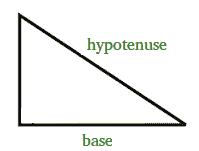

# 从给定的斜边和面积中找出直角三角形的所有边|设置 1

> 原文:[https://www . geesforgeks . org/find-sides-直角三角形-给定-斜边-面积/](https://www.geeksforgeeks.org/find-sides-right-angled-triangle-given-hypotenuse-area/)

给定直角三角形的斜边和面积，得到它的底边和高度，如果任何给定斜边和面积的三角形都不可能，打印就不可能。
**例:**

```
Input  : hypotenuse = 5,    area = 6
Output : base = 3, height = 4

Input : hypotenuse = 5, area = 7 
Output : No triangle possible with above specification.
```



我们可以用直角三角形的一个性质来解决这个问题，可以表述如下:

```
A right angle triangle with fixed hypotenuse attains
maximum area, when it is isosceles i.e. both height
and base becomes equal so if hypotenuse if H, then 
by pythagorean theorem,
Base2 + Height2 = H2

For maximum area both base and height should be equal, 
b2 + b2 = H2
b = sqrt(H2/2)

Above is the length of base at which triangle attains
maximum area, given area must be less than this maximum
area, otherwise no such triangle will possible.  
```

如果给定的面积小于这个最大面积，我们可以对基底长度做一个二分搜索法，因为增加基底会增加面积，这是一个单调增加的函数，二分搜索法很容易应用。
在下面的代码中，编写了一个获取直角三角形面积的方法，回想一下，对于直角三角形面积为*底*高，可以使用[勾股定理](https://en.wikipedia.org/wiki/Pythagorean_theorem)从底边和斜边计算出高度。
以下是上述办法的实施:

## C++

```
// C++ program to get right angle triangle, given
// hypotenuse and area of triangle
#include <bits/stdc++.h>
using namespace std;

//  limit for float comparison
#define eps 1e-6

// Utility method to get area of right angle triangle,
// given base and hypotenuse
double getArea(double base, double hypotenuse)
{
    double height = sqrt(hypotenuse*hypotenuse - base*base);
    return 0.5 * base * height;
}

// Prints base and height of triangle using hypotenuse
// and area information
void printRightAngleTriangle(int hypotenuse, int area)
{
    int hsquare = hypotenuse * hypotenuse;

    // maximum area will be obtained when base and height
    // are equal (= sqrt(h*h/2))
    double sideForMaxArea = sqrt(hsquare / 2.0);
    double maxArea = getArea(sideForMaxArea, hypotenuse);

    // if given area itself is larger than maxArea then no
    // solution is possible
    if (area > maxArea)
    {
        cout << "Not possiblen";
        return;
    }

    double low = 0.0;
    double high = sideForMaxArea;
    double base;

    // binary search for base
    while (abs(high - low) > eps)
    {
        base = (low + high) / 2.0;
        if (getArea(base, hypotenuse) >= area)
            high = base;
        else
            low = base;
    }

    // get height by pythagorean rule
    double height = sqrt(hsquare - base*base);
    cout << base << " " << height << endl;
}

// Driver code to test above methods
int main()
{
    int hypotenuse = 5;
    int area = 6;

    printRightAngleTriangle(hypotenuse, area);
    return 0;
}
```

## Java 语言(一种计算机语言，尤用于创建网站)

```
// Java program to get right angle triangle, given
// hypotenuse and area of triangle
public class GFG {

// limit for float comparison
    final static double eps = (double) 1e-6;

// Utility method to get area of right angle triangle,
// given base and hypotenuse
    static double getArea(double base, double hypotenuse) {
        double height = Math.sqrt(hypotenuse * hypotenuse - base * base);
        return 0.5 * base * height;
    }

// Prints base and height of triangle using hypotenuse
// and area information
    static void printRightAngleTriangle(int hypotenuse, int area) {
        int hsquare = hypotenuse * hypotenuse;

        // maximum area will be obtained when base and height
        // are equal (= sqrt(h*h/2))
        double sideForMaxArea = Math.sqrt(hsquare / 2.0);
        double maxArea = getArea(sideForMaxArea, hypotenuse);

        // if given area itself is larger than maxArea then no
        // solution is possible
        if (area > maxArea) {
            System.out.print("Not possible");
            return;
        }

        double low = 0.0;
        double high = sideForMaxArea;
        double base = 0;

        // binary search for base
        while (Math.abs(high - low) > eps) {
            base = (low + high) / 2.0;
            if (getArea(base, hypotenuse) >= area) {
                high = base;
            } else {
                low = base;
            }
        }

        // get height by pythagorean rule
        double height = Math.sqrt(hsquare - base * base);
        System.out.println(Math.round(base) + " " + Math.round(height));
    }

// Driver code to test above methods
    static public void main(String[] args) {
        int hypotenuse = 5;
        int area = 6;

        printRightAngleTriangle(hypotenuse, area);
    }
}

// This code is contributed by 29AjayKumar
```

## 蟒蛇 3

```
# Python 3 program to get right angle triangle, given
# hypotenuse and area of triangle

# limit for float comparison
# define eps 1e-6
import math

# Utility method to get area of right angle triangle,
# given base and hypotenuse
def getArea(base, hypotenuse):
    height = math.sqrt(hypotenuse*hypotenuse - base*base);
    return 0.5 * base * height

# Prints base and height of triangle using hypotenuse
# and area information
def printRightAngleTriangle(hypotenuse, area):
    hsquare = hypotenuse * hypotenuse

    # maximum area will be obtained when base and height
    # are equal (= sqrt(h*h/2))
    sideForMaxArea = math.sqrt(hsquare / 2.0)
    maxArea = getArea(sideForMaxArea, hypotenuse)

    # if given area itself is larger than maxArea then no
    # solution is possible
    if (area > maxArea):
        print("Not possiblen")
        return

    low = 0.0
    high = sideForMaxArea

    # binary search for base
    while (abs(high - low) > 1e-6):
        base = (low + high) / 2.0
        if (getArea(base, hypotenuse) >= area):
            high =base
        else:
            low = base

    # get height by pythagorean rule
    height = math.ceil(math.sqrt(hsquare - base*base))
    base = math.floor(base)
    print(base,height)

# Driver code to test above methods
if __name__ == '__main__':
    hypotenuse = 5
    area = 6

    printRightAngleTriangle(hypotenuse, area)

# This code is contributed by
# Surendra_Gangwar
```

## C#

```
// C# program to get right angle triangle, given
// hypotenuse and area of triangle

using System;
public class GFG{

// limit for float comparison
     static double eps = (double) 1e-6;

// Utility method to get area of right angle triangle,
// given base and hypotenuse
    static double getArea(double base1, double hypotenuse) {
        double height = Math.Sqrt(hypotenuse * hypotenuse - base1 * base1);
        return 0.5 * base1 * height;
    }

// Prints base and height of triangle using hypotenuse
// and area information
    static void printRightAngleTriangle(int hypotenuse, int area) {
        int hsquare = hypotenuse * hypotenuse;

        // maximum area will be obtained when base and height
        // are equal (= sqrt(h*h/2))
        double sideForMaxArea = Math.Sqrt(hsquare / 2.0);
        double maxArea = getArea(sideForMaxArea, hypotenuse);

        // if given area itself is larger than maxArea then no
        // solution is possible
        if (area > maxArea) {
            Console.Write("Not possible");
            return;
        }

        double low = 0.0;
        double high = sideForMaxArea;
        double base1 = 0;

        // binary search for base
        while (Math.Abs(high - low) > eps) {
            base1 = (low + high) / 2.0;
            if (getArea(base1, hypotenuse) >= area) {
                high = base1;
            } else {
                low = base1;
            }
        }

        // get height by pythagorean rule
        double height = Math.Sqrt(hsquare - base1 * base1);
        Console.WriteLine(Math.Round(base1) + " " + Math.Round(height));
    }

// Driver code to test above methods
    static public void Main() {
        int hypotenuse = 5;
        int area = 6;

        printRightAngleTriangle(hypotenuse, area);
    }
}

// This code is contributed by 29AjayKumar
```

## 服务器端编程语言（Professional Hypertext Preprocessor 的缩写）

```
<?php
// PHP program to get right angle triangle,
// given hypotenuse and area of triangle

// limit for float comparison
$eps =.0000001;

// Utility method to get area of right
// angle triangle, given base and hypotenuse
function getArea($base, $hypotenuse)
{
    $height = sqrt($hypotenuse * $hypotenuse -
                                 $base * $base);
    return 0.5 * $base * $height;
}

// Prints base and height of triangle
// using hypotenuse and area information
function printRightAngleTriangle($hypotenuse,
                                 $area)
{
    global $eps;
    $hsquare = $hypotenuse * $hypotenuse;

    // maximum area will be obtained when base
    // and height are equal (= sqrt(h*h/2))
    $sideForMaxArea = sqrt($hsquare / 2.0);
    $maxArea = getArea($sideForMaxArea,
                       $hypotenuse);

    // if given area itself is larger than
    // maxArea then no solution is possible
    if ($area > $maxArea)
    {
        echo "Not possiblen";
        return;
    }

    $low = 0.0;
    $high = $sideForMaxArea;
    $base;

    // binary search for base
    while (abs($high - $low) > $eps)
    {
        $base = ($low + $high) / 2.0;
        if (getArea($base, $hypotenuse) >= $area)
            $high = $base;
        else
            $low = $base;
    }

    // get height by pythagorean rule
    $height = sqrt($hsquare - $base * $base);
        echo (ceil($base)) ," ",
             (floor($height)), "\n";
}

// Driver Code
$hypotenuse = 5;
$area = 6;

printRightAngleTriangle($hypotenuse, $area);

// This code is contributed by Sachin
?>
```

## java 描述语言

```
<script>

// JavaScript program to get right angle triangle, given
// hypotenuse and area of triangle

// limit for float comparison
    let eps =  1e-6;

// Utility method to get area of right angle triangle,
// given base and hypotenuse
    function getArea(base, hypotenuse) {
        let height = Math.sqrt(hypotenuse * hypotenuse - base * base);
        return 0.5 * base * height;
    }

// Prints base and height of triangle using hypotenuse
// and area information
    function printRightAngleTriangle(hypotenuse, area) {
        let hsquare = hypotenuse * hypotenuse;

        // maximum area will be obtained when base and height
        // are equal (= sqrt(h*h/2))
        let sideForMaxArea = Math.sqrt(hsquare / 2.0);
        let maxArea = getArea(sideForMaxArea, hypotenuse);

        // if given area itself is larger than maxArea then no
        // solution is possible
        if (area > maxArea) {
            document.write("Not possible");
            return;
        }

        let low = 0.0;
        let high = sideForMaxArea;
        let base = 0;

        // binary search for base
        while (Math.abs(high - low) > eps) {
            base = (low + high) / 2.0;
            if (getArea(base, hypotenuse) >= area) {
                high = base;
            } else {
                low = base;
            }
        }

        // get height by pythagorean rule
        let height = Math.sqrt(hsquare - base * base);
        document.write(Math.round(base) + " " + Math.round(height));
    }

// Driver Code
        let hypotenuse = 5;
         let area = 6;

        printRightAngleTriangle(hypotenuse, area);

// This code is contributed by chinmoy1997pal.
</script>
```

**输出:**

```
3 4
```

还有一个解决方案将在下面的帖子中讨论。
[检查给定区域和斜边是否可能成直角](https://www.geeksforgeeks.org/check-right-angles-possible-given-area-hypotenuse/)
本文由 [**乌塔什·特里维迪**](https://in.linkedin.com/in/utkarsh-trivedi-253069a7) 供稿。如果你喜欢 GeeksforGeeks 并想投稿，你也可以用[contribute.geeksforgeeks.org](http://www.contribute.geeksforgeeks.org)写一篇文章或者把你的文章邮寄到 contribute@geeksforgeeks.org。看到你的文章出现在极客博客主页上，帮助其他极客。
如果发现有不正确的地方，或者想分享更多关于上述话题的信息，请写评论。