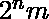
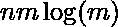
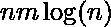

# 找到字谜单词最大子集的大小

> 原文:[https://www . geesforgeks . org/find-size-maximum-subset-anagram-words/](https://www.geeksforgeeks.org/find-size-largest-subset-anagram-words/)

给定包含小写字母的 n 个字符串的数组。找出最大字符串子集的**大小**，它们是彼此的字谜。字符串的字谜是另一个包含相同字符的字符串，只有字符的顺序可以不同。例如，“abcd”和“dabc”是彼此的字谜。

```
Input: 
ant magenta magnate tan gnamate
Output: 3
Explanation
Anagram strings(1) - ant, tan
Anagram strings(2) - magenta, magnate,
                     gnamate
Thus, only second subset have largest
size i.e., 3

Input: 
cars bikes arcs steer 
Output: 2
```

**天真的方法**是生成所有可能的子集，并从包含所有具有相同大小的字符串和彼此的字谜的最大大小的子集进行迭代。这种方法的时间复杂度是 O( )，其中 n 和 m 分别是数组的大小和字符串的长度。
**高效的方法**是使用哈希和排序。对字符串的所有字符进行排序，并将哈希值(排序后的字符串)存储在 map 中(C++中的[无序 _map 和 java 中的](https://www.geeksforgeeks.org/unordered_map-in-stl-and-its-applications/)[HashMap](https://www.geeksforgeeks.org/hashmap-treemap-java/))。最后检查哪一个是出现次数最多的频率排序词。

## C++

```
// C++ Program to find the size of
// largest subset of anagram
#include <bits/stdc++.h>
using namespace std;

// Utility function to find size of
// largest subset of anagram
int largestAnagramSet(string arr[], int n)
{

    int maxSize = 0;
    unordered_map<string, int> count;

    for (int i = 0; i < n; ++i) {

        // sort the string
        sort(arr[i].begin(), arr[i].end());

        // Increment the count of string
        count[arr[i]] += 1;

        // Compute the maximum size of string
        maxSize = max(maxSize, count[arr[i]]);
    }

    return maxSize;
}

// Driver code
int main()
{
    string arr[] = { "ant", "magenta",
               "magnate", "tan", "gnamate" };
    int n = sizeof(arr) / sizeof(arr[0]);
    cout << largestAnagramSet(arr, n) << "\n";

    string arr1[] = { "cars", "bikes", "arcs",
                                     "steer" };
    n = sizeof(arr1) / sizeof(arr[0]);
    cout << largestAnagramSet(arr1, n);
    return 0;
}
```

## Java 语言(一种计算机语言，尤用于创建网站)

```
// Java Program to find the size of
// largest subset of anagram
import java.util.*;

class GFG
{

// Utility function to find size of
// largest subset of anagram
static int largestAnagramSet(String arr[], int n)
{
    int maxSize = 0;
    HashMap<String, Integer> count = new HashMap<>();

    for (int i = 0; i < n; ++i)
    {

        // sort the String
        char temp[] = arr[i].toCharArray();
        Arrays.sort(temp);
        arr[i] = new String(temp);

        // Increment the count of String
        if(count.containsKey(arr[i]))
        {
            count.put(arr[i], count.get(arr[i]) + 1);
        }
        else
        {
            count.put(arr[i], 1);
        }

        // Compute the maximum size of String
        maxSize = Math.max(maxSize, count.get(arr[i]));
    }
    return maxSize;
}

// Driver code
public static void main(String[] args)
{
    String arr[] = { "ant", "magenta",
                     "magnate", "tan", "gnamate" };
    int n = arr.length;
    System.out.println(largestAnagramSet(arr, n));

    String arr1[] = { "cars", "bikes",
                      "arcs", "steer" };
    n = arr1.length;
    System.out.println(largestAnagramSet(arr1, n));
}
}

// This code is contributed by 29AjayKumar
```

## 蟒蛇 3

```
# Python3 Program to find the size of
# largest subset of anagram

# Utility function to find size of
# largest subset of anagram
def largestAnagramSet(arr, n) :

    maxSize = 0
    count = {}

    for i in range(n) :

        # sort the string
        arr[i] = ''.join(sorted(arr[i]))

        # Increment the count of string
        if arr[i] in count :
            count[arr[i]] += 1
        else :
            count[arr[i]] = 1

        # Compute the maximum size of string
        maxSize = max(maxSize, count[arr[i]])

    return maxSize

# Driver code
arr = [ "ant", "magenta", "magnate", "tan", "gnamate" ]
n = len(arr)
print(largestAnagramSet(arr, n))

arr1 = [ "cars", "bikes", "arcs", "steer" ]
n = len(arr1)
print(largestAnagramSet(arr1, n))

# This code is contributed by divyeshrabadiya072019
```

## C#

```
// C# Program to find the size of
// largest subset of anagram
using System;
using System.Collections.Generic;

class GFG
{

// Utility function to find size of
// largest subset of anagram
static int largestAnagramSet(String []arr, int n)
{
    int maxSize = 0;

    Dictionary<String,
               int> count = new Dictionary<String,
                                           int>();
    for (int i = 0; i < n; ++i)
    {

        // sort the String
        char []temp = arr[i].ToCharArray();
        Array.Sort(temp);
        arr[i] = new String(temp);

        // Increment the count of String
        if(count.ContainsKey(arr[i]))
        {
            count[arr[i]] = count[arr[i]] + 1;
        }
        else
        {
            count.Add(arr[i], 1);
        }

        // Compute the maximum size of String
        maxSize = Math.Max(maxSize, count[arr[i]]);
    }
    return maxSize;
}

// Driver code
public static void Main(String[] args)
{
    String []arr = {"ant", "magenta",
                    "magnate", "tan", "gnamate"};
    int n = arr.Length;
    Console.WriteLine(largestAnagramSet(arr, n));

    String []arr1 = {"cars", "bikes",
                     "arcs", "steer"};
    n = arr1.Length;
    Console.WriteLine(largestAnagramSet(arr1, n));
}
}

// This code is contributed by Rajput-Ji
```

## java 描述语言

```
<script>

// JavaScript Program to find the size of
// largest subset of anagram

// Utility function to find size of
// largest subset of anagram
function largestAnagramSet(arr, n)
{
    var maxSize = 0;

    var count = new Map();

    for(var i = 0; i < n; ++i)
    {

        // sort the String
        var temp = arr[i].split('');
        temp.sort();
        arr[i] = temp.join('');

        // Increment the count of String
        if(count.has(arr[i]))
        {
            count.set(arr[i], count.get(arr[i])+1);
        }
        else
        {
            count.set(arr[i], 1);
        }

        // Compute the maximum size of String
        maxSize = Math.max(maxSize, count.get(arr[i]));
    }
    return maxSize;
}

// Driver code
var arr = ["ant", "magenta",
                "magnate", "tan", "gnamate"];
var n = arr.length;
document.write(largestAnagramSet(arr, n) + "<br>");
var arr1 = ["cars", "bikes",
                 "arcs", "steer"];
n = arr1.length;
document.write(largestAnagramSet(arr1, n));

</script>
```

**输出:**

```
3
2
```

**时间复杂度:** O( )其中 m 是所有字符串中最大的大小
**辅助空间:** O(n + m)
**最好的方法**是存储每个字的频率数组。在这种情况下，我们只需要迭代单词的字符，并增加当前字母的频率。最后，只增加同频阵列[]的个数，取其中的最大值。**只有当字符串的长度与数组大小相比最大时，这种方法才是最佳的**。

## 卡片打印处理机（Card Print Processor 的缩写）

```
// C++ Program to find the size of
// largest subset of anagram
#include <bits/stdc++.h>
using namespace std;

// Utility function to find size of
// largest subset of anagram
int largestAnagramSet(string arr[], int n)
{
    int maxSize = 0;

    // Initialize map<> of vector array
    map<vector<int>, int> count;

    for (int i = 0; i < n; ++i) {

        // Vector array to store
        // frequency of element
        vector<int> freq(26);

        for (char ch : arr[i])
            freq[ch - 'a'] += 1;

        // Increment the count of
        // frequency array in map<>
        count[freq] += 1;

        // Compute the maximum size
        maxSize = max(maxSize, count[freq]);
    }
    return maxSize;
}

// Driver code
int main()
{
    string arr[] = { "ant", "magenta", "magnate",
                              "tan", "gnamate" };
    int n = sizeof(arr) / sizeof(arr[0]);
    cout << largestAnagramSet(arr, n) << "\n";

    string arr1[] = { "cars", "bikes", "arcs",
                                     "steer" };
    n = sizeof(arr1) / sizeof(arr[0]);
    cout << largestAnagramSet(arr1, n);
    return 0;
}
```

## 蟒蛇 3

```
# Python Program to find the size of
# largest subset of anagram

# Utility function to find size of
# largest subset of anagram
def largestAnagramSet(arr, n):
    maxSize = 0

    # Initialize dictionary of array
    count = {}
    for i in range(n):

        # list to store
        # frequency of element
        freq=[0 for i in range(26)]

        for ch in arr[i]:
            freq[ord(ch) - ord('a')] += 1

        # Increment the count of
        # frequency array in dictionary
        temp = "".join(str(i) for i in freq)
        if temp not in count:
            count[temp] = 1
        else:
            count[temp] += 1

        # Compute the maximum size
        maxSize = max(maxSize, count[temp])
    return maxSize

# Driver code
arr = ["ant", "magenta", "magnate","tan", "gnamate"]
n = len(arr)
print(largestAnagramSet(arr, n))

arr1 = ["cars", "bikes", "arcs", "steer"]
n = len(arr1)
print(largestAnagramSet(arr1, n))

# This code is contributed by rag2127
```

```
Output
3
2
```

**时间复杂度:** O( )其中 m 是所有弦中最大的尺寸
**辅助空间:** O(n + m)