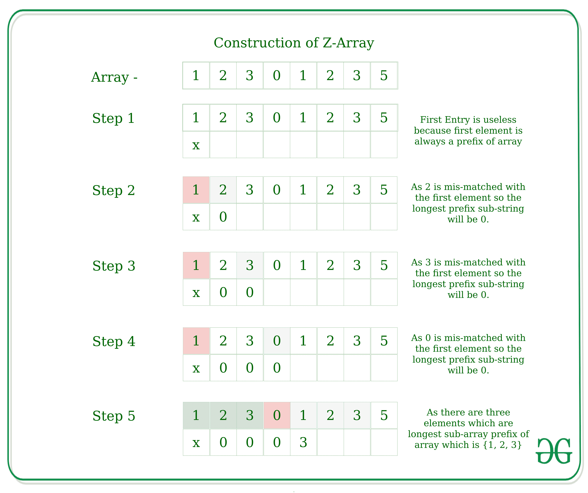

# 使用 Z 算法找到数组 A 中给定数组 B 每次出现的起始索引

> 原文:[https://www . geeksforgeeks . org/find-start-index-for-after-in-array-a-use-z-algorithm/](https://www.geeksforgeeks.org/find-starting-index-for-every-occurence-of-given-array-b-in-array-a-using-z-algorithm/)

给定两个数组 **A** 和 **B** ，任务是使用 [Z 算法](https://www.geeksforgeeks.org/z-algorithm-linear-time-pattern-searching-algorithm/)找到数组 **A** 中数组 **B** 每次出现的起始索引。
**举例:**

> **输入:** A = {1，2，3，2，3}，B = {2，3}
> **输出:** 1 3
> **说明:**
> 在数组 A 中，数组 B 出现在索引 1 和索引 3 处。因此答案是{1，3}。
> **输入:** A = {1，1，1，1，1}，B = {1}
> **输出:** 0 1 2 3 4
> 在数组 A 中，数组 B 出现在索引{0，1，2，3，4}处。

在 [Z 算法](https://www.geeksforgeeks.org/z-algorithm-linear-time-pattern-searching-algorithm/)中，我们构造了一个 Z 数组。
**什么是 Z 阵？**T5 对于**arr【0..n-1]** ，Z 数组是一个数组，长度与字符串数组 arr 相同，其中 Z 数组的每个元素 **Z[i]** 存储从 arr[i]开始的[最长子字符串](https://www.geeksforgeeks.org/length-of-the-longest-substring-without-repeating-characters/)的长度，arr[I]也是 arr[0]的前缀..n-1]。Z 数组的第一个条目是没有意义的，因为完整的数组总是它自己的前缀。
**例如:**对于给定的数组 arr[] = { 1，2，3，0，1，2，3，5}



**进场:**

*   将数组 **B** 和数组 **A** 合并成一个新的数组 **C** 。这里的分隔符可以是任何特殊字符。
*   使用数组 **C** 创建 **Z 数组**。
*   迭代 Z 数组，打印所有值大于或等于数组 b 长度的索引

下面是上述方法的实现。

## C++

```
// CPP implementation for pattern
// searching in an array using Z-Algorithm
#include<bits/stdc++.h>
using namespace std;

// Function to calculate Z-Array
vector<int> zArray(vector<int> arr)
{
    int n = arr.size();
    vector<int> z(n);
    int r = 0, l = 0;

    // Loop to calculate Z-Array
    for (int k = 1; k < n; k++) {

        // Outside the Z-box
        if (k > r) {
            r = l = k;
            while (r < n
                && arr[r] == arr[r - l])
                r++;
            z[k] = r - l;
            r--;
        }

        // Inside Z-box
        else {
            int k1 = k - l;

            if (z[k1] < r - k + 1)
                z[k] = z[k1];

            else {
                l = k;
                while (r < n
                    && arr[r] == arr[r - l])
                    r++;
                z[k] = r - l;
                r--;
            }
        }
    }
    return z;
}

// Helper function to merge two
// arrays and create a single array
vector<int> mergeArray(vector<int> A, vector<int> B)
{
    int n = A.size();
    int m = B.size();
    vector<int> z;

    // Array to store merged array
    vector<int> c(n + m + 1);

    // Copying array B
    for (int i = 0; i < m; i++)
        c[i] = B[i];

    // Adding a separator
    c[m] = INT_MAX;

    // Copying array A
    for (int i = 0; i < n; i++)
        c[m + i + 1] = A[i];

    // Calling Z-function
    z = zArray(c);
    return z;
}

// Function to help compute the Z array
void findZArray(vector<int>A,vector<int>B, int n)
{
    int flag = 0;
    vector<int> z;
    z = mergeArray(A, B);

    // Printing indexes where array B occur
    for (int i = 0; i < z.size(); i++) {
        if (z[i] == n) {

            cout << (i - n - 1) << " ";
            flag = 1;
        }
    }
    if (flag == 0) {
        cout << ("Not Found");
    }
}

// Driver Code
int main()
{
    vector<int>A{ 1, 2, 3, 2, 3, 2 };
    vector<int>B{ 2, 3 };
    int n = B.size();

    findZArray(A, B, n);
}

// This code is contributed by Surendra_Gangwar
```

## Java 语言(一种计算机语言，尤用于创建网站)

```
// Java implementation for pattern
// searching in an array using Z-Algorithm

import java.io.*;
import java.util.*;

class GfG {

    // Function to calculate Z-Array
    private static int[] zArray(int arr[])
    {
        int z[];
        int n = arr.length;
        z = new int[n];
        int r = 0, l = 0;

        // Loop to calculate Z-Array
        for (int k = 1; k < n; k++) {

            // Outside the Z-box
            if (k > r) {
                r = l = k;
                while (r < n
                       && arr[r] == arr[r - l])
                    r++;
                z[k] = r - l;
                r--;
            }

            // Inside Z-box
            else {
                int k1 = k - l;

                if (z[k1] < r - k + 1)
                    z[k] = z[k1];

                else {
                    l = k;
                    while (r < n
                           && arr[r] == arr[r - l])
                        r++;
                    z[k] = r - l;
                    r--;
                }
            }
        }
        return z;
    }

    // Helper function to merge two
    // arrays and create a single array
    private static int[] mergeArray(int A[],
                                    int B[])
    {
        int n = A.length;
        int m = B.length;
        int z[];

        // Array to store merged array
        int c[] = new int[n + m + 1];

        // Copying array B
        for (int i = 0; i < m; i++)
            c[i] = B[i];

        // Adding a separator
        c[m] = Integer.MAX_VALUE;

        // Copying array A
        for (int i = 0; i < n; i++)
            c[m + i + 1] = A[i];

        // Calling Z-function
        z = zArray(c);
        return z;
    }

    // Function to help compute the Z array
    private static void findZArray(int A[], int B[], int n)
    {
        int flag = 0;
        int z[];
        z = mergeArray(A, B);

        // Printing indexes where array B occur
        for (int i = 0; i < z.length; i++) {
            if (z[i] == n) {

                System.out.print((i - n - 1)
                                 + " ");
                flag = 1;
            }
        }
        if (flag == 0) {
            System.out.println("Not Found");
        }
    }

    // Driver Code
    public static void main(String args[])
    {
        int A[] = { 1, 2, 3, 2, 3, 2 };
        int B[] = { 2, 3 };
        int n = B.length;

        findZArray(A, B, n);
    }
}
```

## 蟒蛇 3

```
# Python3 implementation for pattern
# searching in an array using Z-Algorithm
import sys;

# Function to calculate Z-Array
def zArray(arr) :
    n = len(arr);
    z = [0]*n;
    r = 0;
    l = 0;

    # Loop to calculate Z-Array
    for k in range(1, n) :

        # Outside the Z-box
        if (k > r) :
            r = l = k;
            while (r < n and arr[r] == arr[r - l]) :
                r += 1;
            z[k] = r - l;
            r -= 1;

        # Inside Z-box
        else :
            k1 = k - l;

            if (z[k1] < r - k + 1) :
                z[k] = z[k1];

            else :
                l = k;
                while (r < n and arr[r] == arr[r - l]) :
                    r += 1 ;
                z[k] = r - l;
                r -= 1;

    return z;

# Helper function to merge two
# arrays and create a single array
def mergeArray(A,B) :

    n = len(A);
    m = len(B);

    # Array to store merged array
    c = [0]*(n + m + 1);

    # Copying array B
    for i in range(m) :
        c[i] = B[i];

    # Adding a separator
    c[m] = sys.maxsize;

    # Copying array A
    for i in range(n) :
        c[m + i + 1] = A[i];

    # Calling Z-function
    z = zArray(c);
    return z;

# Function to help compute the Z array
def findZArray( A,B, n) :
    flag = 0;
    z = mergeArray(A, B);

    # Printing indexes where array B occur
    for i in range(len(z)) :
        if (z[i] == n) :
            print(i - n - 1, end= " ");
            flag = 1;

    if (flag == 0) :
        print("Not Found");

# Driver Code
if __name__ == "__main__" :

    A = [ 1, 2, 3, 2, 3, 2];
    B = [ 2, 3 ];
    n = len(B);
    findZArray(A, B, n);

# This code is contributed by AnkitRai01
```

## C#

```
// C# implementation for pattern
// searching in an array using Z-Algorithm
using System;

class GfG
{

    // Function to calculate Z-Array
    private static int[] zArray(int []arr)
    {
        int []z;
        int n = arr.Length;
        z = new int[n];
        int r = 0, l = 0;

        // Loop to calculate Z-Array
        for (int k = 1; k < n; k++)
        {

            // Outside the Z-box
            if (k > r)
            {
                r = l = k;
                while (r < n
                    && arr[r] == arr[r - l])
                    r++;
                z[k] = r - l;
                r--;
            }

            // Inside Z-box
            else
            {
                int k1 = k - l;

                if (z[k1] < r - k + 1)
                    z[k] = z[k1];

                else
                {
                    l = k;
                    while (r < n
                        && arr[r] == arr[r - l])
                        r++;
                    z[k] = r - l;
                    r--;
                }
            }
        }
        return z;
    }

    // Helper function to merge two
    // arrays and create a single array
    private static int[] mergeArray(int []A,
                                    int []B)
    {
        int n = A.Length;
        int m = B.Length;
        int []z;

        // Array to store merged array
        int []c = new int[n + m + 1];

        // Copying array B
        for (int i = 0; i < m; i++)
            c[i] = B[i];

        // Adding a separator
        c[m] = int.MaxValue;

        // Copying array A
        for (int i = 0; i < n; i++)
            c[m + i + 1] = A[i];

        // Calling Z-function
        z = zArray(c);
        return z;
    }

    // Function to help compute the Z array
    private static void findZArray(int []A, int []B, int n)
    {
        int flag = 0;
        int []z;
        z = mergeArray(A, B);

        // Printing indexes where array B occur
        for (int i = 0; i < z.Length; i++)
        {
            if (z[i] == n)
            {

                Console.Write((i - n - 1)
                                + " ");
                flag = 1;
            }
        }
        if (flag == 0)
        {
            Console.WriteLine("Not Found");
        }
    }

    // Driver Code
    public static void Main()
    {
        int []A = { 1, 2, 3, 2, 3, 2 };
        int []B = { 2, 3 };
        int n = B.Length;

        findZArray(A, B, n);
    }
}

// This code is contributed by AnkitRai01
```

## java 描述语言

```
<script>

// JavaScript implementation for pattern
// searching in an array using Z-Algorithm

// Function to calculate Z-Array
function zArray(arr) {
    let n = arr.length;
    let z = new Array(n);
    let r = 0, l = 0;

    // Loop to calculate Z-Array
    for (let k = 1; k < n; k++) {

        // Outside the Z-box
        if (k > r) {
            r = l = k;
            while (r < n
                && arr[r] == arr[r - l])
                r++;
            z[k] = r - l;
            r--;
        }

        // Inside Z-box
        else {
            let k1 = k - l;

            if (z[k1] < r - k + 1)
                z[k] = z[k1];

            else {
                l = k;
                while (r < n
                    && arr[r] == arr[r - l])
                    r++;
                z[k] = r - l;
                r--;
            }
        }
    }
    return z;
}

// Helper function to merge two
// arrays and create a single array
function mergeArray(A, B) {
    let n = A.length;
    let m = B.length;
    let z = new Array();

    // Array to store merged array
    let c = new Array(n + m + 1);

    // Copying array B
    for (let i = 0; i < m; i++)
        c[i] = B[i];

    // Adding a separator
    c[m] = Number.MAX_SAFE_INTEGER;

    // Copying array A
    for (let i = 0; i < n; i++)
        c[m + i + 1] = A[i];

    // Calling Z-function
    z = zArray(c);
    return z;
}

// Function to help compute the Z array
function findZArray(A, B, n) {
    let flag = 0;
    let z = [];
    z = mergeArray(A, B);

    // Printing indexes where array B occur
    for (let i = 0; i < z.length; i++) {
        if (z[i] == n) {

            document.write((i - n - 1) + " ");
            flag = 1;
        }
    }
    if (flag == 0) {
        document.write("Not Found");
    }
}

// Driver Code

let A = [1, 2, 3, 2, 3, 2];
let B = [2, 3];
let n = B.length;

findZArray(A, B, n);

// This code is contributed by gfgking

</script>
```

**Output:** 

```
1 3
```

**时间复杂度:** O(N + M)。