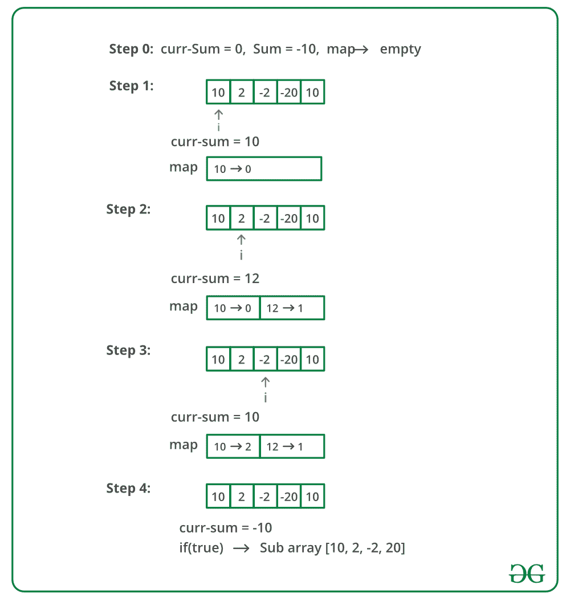

# 求给定和的子阵|集合 2(处理负数)

> 原文:[https://www . geesforgeks . org/find-subarray-带给定整数和的数组/](https://www.geeksforgeeks.org/find-subarray-with-given-sum-in-array-of-integers/)

给定一个未排序的整数数组，找到一个与给定数字相加的子数组。如果给定数量的总和超过一个子阵列，打印其中任何一个。

**示例:**

```
Input: arr[] = {1, 4, 20, 3, 10, 5}, sum = 33
Output: Sum found between indexes 2 and 4
Explanation: Sum of elements between indices
2 and 4 is 20 + 3 + 10 = 33

Input: arr[] = {10, 2, -2, -20, 10}, sum = -10
Output: Sum found between indexes 0 to 3
Explanation: Sum of elements between indices
0 and 3 is 10 + 2 - 2 - 20 = -10

Input: arr[] = {-10, 0, 2, -2, -20, 10}, sum = 20
Output: No subarray with given sum exists
Explanation: There is no subarray with the given sum
```

**注意:**我们讨论了一个不处理负整数的解决方案[这里](https://www.geeksforgeeks.org/find-subarray-with-given-sum/)。在这篇文章中，负整数也被处理。

**<u>简单方法:</u>** 一个简单的解决方法是逐个考虑所有子阵列，检查每个子阵列的和。下面的程序实现了简单的解决方案。运行两个循环:外部循环选择一个起点 I，内部循环尝试从 I 开始的所有子阵列。

算法:

1.  从头到尾遍历数组。
2.  从每个索引开始从 I 到数组末尾的另一个循环，以获得从 I 开始的所有子数组，保持一个变量和来计算和。对于内部循环中的每个索引，更新总和=总和+数组[j]如果总和等于给定的总和，则打印子数组。
3.  对于内部循环中的每个索引，更新总和=总和+数组[j]
4.  如果总和等于给定的总和，则打印子阵列。

## C++

```
/* A simple program to print subarray
with sum as given sum */
#include <bits/stdc++.h>
using namespace std;

/* Returns true if the there is a subarray
of arr[] with sum equal to 'sum' otherwise
returns false. Also, prints the result */
int subArraySum(int arr[], int n, int sum)
{
    int curr_sum, i, j;

    // Pick a starting point
    for (i = 0; i < n; i++) {
        curr_sum = 0;

        // try all subarrays starting with 'i'
        for (j = i ; j < n; j++) {
           curr_sum = curr_sum + arr[j];

            if (curr_sum == sum) {
                cout << "Sum found between indexes "
                     << i << " and " << j ;
                return 1;
            }

        }
    }

    cout << "No subarray found";
    return 0;
}

// Driver Code
int main()
{
    int arr[] = { 15, 2, 4, 8, 9, 5, 10, 23 };
    int n = sizeof(arr) / sizeof(arr[0]);
    int sum = 23;
    subArraySum(arr, n, sum);
    return 0;
}
```

## Java 语言(一种计算机语言，尤用于创建网站)

```
// Java program for the above approach
import java.util.*;

class GFG
{

/* Returns true if the there is a subarray
of arr[] with sum equal to 'sum' otherwise
returns false. Also, prints the result */
static int subArraySum(int arr[], int n, int sum)
{
    int curr_sum, i, j;

    // Pick a starting point
    for (i = 0; i < n; i++) {
        curr_sum = 0;

        // try all subarrays starting with 'i'
        for (j = i ; j < n; j++) {
           curr_sum = curr_sum + arr[j];

            if (curr_sum == sum) {
                System.out.print( "Sum found between indexes "
                     + i + " and " + j);
                return 1;
            }

        }
    }

    System.out.print("No subarray found");
    return 0;
}

// Driver Code
public static void main (String[] args)
{
    int arr[] = { 15, 2, 4, 8, 9, 5, 10, 23 };
    int n = arr.length;
    int sum = 23;
    subArraySum(arr, n, sum);
}
}

// This code is contributed by code_hunt.
```

**Output**

```
Sum found between indexes 1 and 4
```

**<u>方法:</u>** 其思想是将数组中每个前缀的元素之和存储在一个 hashmap 中，即每个索引存储该索引 hashmap 之前的元素之和。因此，要检查是否有一个总和等于 *s* 的子阵列，请检查每个指标 I，并将该指标总和为 *x* 。如果有一个和等于*x–s*的前缀，则找到给定和的子阵列。

**算法:**

1.  创建一个 Hashmap ( *hm* )来存储键值对，即 key =前缀和值=其索引，以及一个变量来存储当前和值( *sum = 0* )和子数组的和作为 *s*
2.  从头到尾遍历数组。
3.  对于每个元素，更新总和，即*总和=总和+数组[i]*
4.  如果总和等于 s，那么打印具有给定总和的子阵列是从 0 到 I
5.  如果 HashMap 中有任何键等于*sum–s*，则打印具有给定和的子阵列是从 hm[sum–s]到 I
6.  将 sum 和 index 作为键值对放在 hashmap 中。

**上述方法的试运行:**



**实施:**

## C++

```
// C++ program to print subarray with sum as given sum
#include<bits/stdc++.h>
using namespace std;

// Function to print subarray with sum as given sum
void subArraySum(int arr[], int n, int sum)
{
    // create an empty map
    unordered_map<int, int> map;

    // Maintains sum of elements so far
    int curr_sum = 0;

    for (int i = 0; i < n; i++)
    {
        // add current element to curr_sum
        curr_sum = curr_sum + arr[i];

        // if curr_sum is equal to target sum
        // we found a subarray starting from index 0
        // and ending at index i
        if (curr_sum == sum)
        {
            cout << "Sum found between indexes "
                 << 0 << " to " << i << endl;
            return;
        }

        // If curr_sum - sum already exists in map
        // we have found a subarray with target sum
        if (map.find(curr_sum - sum) != map.end())
        {
            cout << "Sum found between indexes "
                 << map[curr_sum - sum] + 1
                 << " to " << i << endl;
            return;
        }

        map[curr_sum] = i;
    }

    // If we reach here, then no subarray exists
    cout << "No subarray with given sum exists";
}

// Driver program to test above function
int main()
{
    int arr[] = {10, 2, -2, -20, 10};
    int n = sizeof(arr)/sizeof(arr[0]);
    int sum = -10;

    subArraySum(arr, n, sum);

    return 0;
}
```

## Java 语言(一种计算机语言，尤用于创建网站)

```
// Java program to print subarray with sum as given sum
import java.util.*;

class GFG {

    public static void subArraySum(int[] arr, int n, int sum) {
        //cur_sum to keep track of cumulative sum till that point
        int cur_sum = 0;
        int start = 0;
        int end = -1;
        HashMap<Integer, Integer> hashMap = new HashMap<>();

        for (int i = 0; i < n; i++) {
            cur_sum = cur_sum + arr[i];
            //check whether cur_sum - sum = 0, if 0 it means
            //the sub array is starting from index 0- so stop
            if (cur_sum - sum == 0) {
                start = 0;
                end = i;
                break;
            }
            //if hashMap already has the value, means we already
            // have subarray with the sum - so stop
            if (hashMap.containsKey(cur_sum - sum)) {
                start = hashMap.get(cur_sum - sum) + 1;
                end = i;
                break;
            }
            //if value is not present then add to hashmap
            hashMap.put(cur_sum, i);

        }
        // if end is -1 : means we have reached end without the sum
        if (end == -1) {
            System.out.println("No subarray with given sum exists");
        } else {
            System.out.println("Sum found between indexes "
                            + start + " to " + end);
        }

    }

    // Driver code
    public static void main(String[] args) {
        int[] arr = {10, 2, -2, -20, 10};
        int n = arr.length;
        int sum = -10;
        subArraySum(arr, n, sum);

    }
}
```

## 蟒蛇 3

```
# Python3 program to print subarray with sum as given sum

# Function to print subarray with sum as given sum
def subArraySum(arr, n, Sum):

    # create an empty map
    Map = {}

    # Maintains sum of elements so far
    curr_sum = 0

    for i in range(0,n):

        # add current element to curr_sum
        curr_sum = curr_sum + arr[i]

        # if curr_sum is equal to target sum
        # we found a subarray starting from index 0
        # and ending at index i
        if curr_sum == Sum:

            print("Sum found between indexes 0 to", i)
            return

        # If curr_sum - sum already exists in map
        # we have found a subarray with target sum
        if (curr_sum - Sum) in Map:

            print("Sum found between indexes", \
                   Map[curr_sum - Sum] + 1, "to", i)

            return

        Map[curr_sum] = i

    # If we reach here, then no subarray exists
    print("No subarray with given sum exists")

# Driver program to test above function
if __name__ == "__main__":

    arr = [10, 2, -2, -20, 10]
    n = len(arr)
    Sum = -10

    subArraySum(arr, n, Sum)

# This code is contributed by Rituraj Jain
```

## C#

```
using System;
using System.Collections.Generic;

// C# program to print subarray with sum as given sum

public class GFG
{

    public static void subArraySum(int[] arr, int n, int sum)
    {
        //cur_sum to keep track of cumulative sum till that point
        int cur_sum = 0;
        int start = 0;
        int end = -1;
        Dictionary<int, int> hashMap = new Dictionary<int, int>();

        for (int i = 0; i < n; i++)
        {
            cur_sum = cur_sum + arr[i];
            //check whether cur_sum - sum = 0, if 0 it means
            //the sub array is starting from index 0- so stop
            if (cur_sum - sum == 0)
            {
                start = 0;
                end = i;
                break;
            }
            //if hashMap already has the value, means we already 
            // have subarray with the sum - so stop
            if (hashMap.ContainsKey(cur_sum - sum))
            {
                start = hashMap[cur_sum - sum] + 1;
                end = i;
                break;
            }
            //if value is not present then add to hashmap
            hashMap[cur_sum] = i;

        }
        // if end is -1 : means we have reached end without the sum
        if (end == -1)
        {
            Console.WriteLine("No subarray with given sum exists");
        }
        else
        {
            Console.WriteLine("Sum found between indexes " + start + " to " + end);
        }

    }

    // Driver code
    public static void Main(string[] args)
    {
        int[] arr = new int[] {10, 2, -2, -20, 10};
        int n = arr.Length;
        int sum = -10;
        subArraySum(arr, n, sum);

    }
}

// This code is contributed by Shrikant13
```

## java 描述语言

```
<script>

// Javascript program to print subarray with sum as given sum

    function subArraySum(arr, n, sum) {
        //cur_sum to keep track of cumulative sum till that point
        let cur_sum = 0;
        let start = 0;
        let end = -1;
        let hashMap = new Map();

        for (let i = 0; i < n; i++) {
            cur_sum = cur_sum + arr[i];
            //check whether cur_sum - sum = 0, if 0 it means
            //the sub array is starting from index 0- so stop
            if (cur_sum - sum == 0) {
                start = 0;
                end = i;
                break;
            }
            //if hashMap already has the value, means we already
            // have subarray with the sum - so stop
            if (hashMap.has(cur_sum - sum)) {
                start = hashMap.get(cur_sum - sum) + 1;
                end = i;
                break;
            }
            //if value is not present then add to hashmap
            hashMap.set(cur_sum, i);

        }
        // if end is -1 : means we have reached end without the sum
        if (end == -1) {
            document.write("No subarray with given sum exists");
        }
        else {
            document.write("Sum found between indexes "
                            + start + " to " + end);
        }

    }

// Driver program

         let arr = [10, 2, -2, -20, 10];
        let n = arr.length;
        let sum = -10;
        subArraySum(arr, n, sum);

</script>
```

**Output**

```
Sum found between indexes 0 to 3
```

**复杂度分析:**

*   **时间复杂度:** O(N)。
    如果散列是在数组的帮助下执行的，那么这就是时间复杂度。如果元素不能在数组中进行哈希运算，也可以使用哈希映射，如上面的代码所示。
*   **辅助空间:** O(n)。
    由于需要 HashMap，这需要线性空间。

[**求给定和的子阵，常数空间中允许有负数**](https://www.geeksforgeeks.org/find-subarray-with-given-sum-with-negatives-allowed-in-constant-space/)
本文由 **Aditya Goel** 供稿。如果你喜欢 GeeksforGeeks 并想投稿，你也可以使用[write.geeksforgeeks.org](http://www.write.geeksforgeeks.org)写一篇文章或者把你的文章邮寄到 review-team@geeksforgeeks.org。看到你的文章出现在极客博客主页上，帮助其他极客。
如果发现有不正确的地方，或者想分享更多关于上述话题的信息，请写评论。