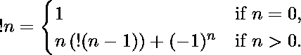

# 找到一个数字的子工厂

> 原文:[https://www . geesforgeks . org/find-subfactory-of-a-number/](https://www.geeksforgeeks.org/find-subfactorial-of-a-number/)

给定一个整数 **N，**任务是找到表示为**的数字的**子工厂**！编号**使用编号 **N** 的递归关系定义编号的子因子:

> **！N = (N-1) [！(N-2) +！(N-1) ]**
> 
> 在哪里**！1 = 0** 和**！0 = 1**

一些子工厂是:

<figure class="table">

| *n* | Zero | one | Two | three | four | five | six | seven | eight | nine | Ten | Eleven | Twelve | Thirteen |
| ！ *n* | one | Zero | one | Two | nine | forty-four | Two hundred and sixty-five | 1, 854 | 14, 833 | 133, 496 | 1, 334, 961 | 14, 684, 570 | 176, 214, 841 | 2, 290, 792, 932 |

</figure>

**示例:**

> **输入:** N = 4
> **输出:** 9
> **解释:**
> ！4 = !(4-1)*4 + (-1) <sup>4</sup> =！3*4 + 1
> ！3 = !(3–1)* 3+(-1)<sup>3</sup>=！2 * 3–1
> ！2 = !(2–1)* 2+(-1)<sup>2</sup>=！1*2 + 1
> ！1 = !(1–1)* 1+(-1)<sup>1</sup>=！0 * 1–1
> 自！因此，0 = 1！1 = 0, !2 = 1, !3 = 2 和！4 = 9.
> 
> **输入:**N = 0
> T3】输出: 1

**方法:**数量 **N** 的子工厂也可以计算为:

> 
> 
> 扩展这一点
> 
> 
> 
> => !N = ( N！)*( 1 – 1/(1!) + (1/2!) – (1/3!) ……..(1/N！)*(-1) <sup>N</sup> )

因此，上面的系列可以用来寻找数字 n 的子工厂。按照下面的步骤，看看如何:

*   初始化变量，比如 **res = 0** 、 **fact = 1** 和 **count = 0** 。
*   [使用 **i** 迭代从 **1** 到**N**T5 的范围，并执行以下操作:](https://www.geeksforgeeks.org/range-based-loop-c/)
    *   将**事实**更新为**事实*i.**
    *   如果计数为**偶数**，则将 res 更新为**RES = RES–(1/事实)**。
    *   如果计数为**奇数**，则将 res 更新为 **res = res + (1 /事实)**。
    *   将计数值增加 **1。**
*   最后，返回**事实*(1 + res)** 。

下面是上述方法的实现:

## C++

```
/// C++ program for the above approach
#include <iostream>
using namespace std;

// Function to find the subfactorial
// of the number
double subfactorial(int N)
{

    // Initialize variables
    double res = 0, fact = 1;
    int count = 0;

    // Iterating over range N
    for (int i = 1; i <= N; i++) {

        // Fact variable store
        // factorial of the i
        fact = fact * i;

        // If count is even
        if (count % 2 == 0)
            res = res - (1 / fact);
        else
            res = res + (1 / fact);

        // Increase the value of
        // count by 1
        count++;
    }

    return fact * (1 + res);
}

// Driver Code
int main()
{
    int N = 4;
    cout << subfactorial(N);

    return 0;
}
```

## Java 语言(一种计算机语言，尤用于创建网站)

```
/// Java program for the above approach
import java.util.*;

class GFG {

    // Function to find the subfactorial
    // of the number
    static double subfactorial(int N)
    {

        // Initialize variables
        double res = 0, fact = 1;
        int count = 0;

        // Iterating over range N
        for (int i = 1; i <= N; i++) {

            // Fact variable store
            // factorial of the i
            fact = fact * i;

            // If count is even
            if (count % 2 == 0)
                res = res - (1 / fact);
            else
                res = res + (1 / fact);

            // Increase the value of
            // count by 1
            count++;
        }

        return fact * (1 + res);
    }

    // Driver Code
    public static void main(String[] args)
    {
        int N = 4;
        System.out.println((int)(subfactorial(N)));
    }
}

// This code is contributed by ukasp.
```

## 蟒蛇 3

```
# python program for the above approach

# Function to find the subfactorial
# of the number
def subfactorial(N):

        # Initialize variables
    res = 0
    fact = 1
    count = 0

    # Iterating over range N
    for i in range(1, N+1):

                # Fact variable store
                # factorial of the i
        fact = fact * i

        # If count is even
        if (count % 2 == 0):
            res = res - (1 / fact)

        else:
            res = res + (1 / fact)

            # Increase the value of
            # count by 1
        count += 1

    return fact * (1 + res)

# Driver Code
if __name__ == "__main__":

    N = 4
    print(subfactorial(N))

    # This code is contributed by rakeshsahni
```

## C#

```
/// C# program for the above approach
using System;
using System.Collections.Generic;

class GFG{

// Function to find the subfactorial
// of the number
static double subfactorial(int N)
{

    // Initialize variables
    double res = 0, fact = 1;
    int count = 0;

    // Iterating over range N
    for (int i = 1; i <= N; i++) {

        // Fact variable store
        // factorial of the i
        fact = fact * i;

        // If count is even
        if (count % 2 == 0)
            res = res - (1 / fact);
        else
            res = res + (1 / fact);

        // Increase the value of
        // count by 1
        count++;
    }

    return fact * (1 + res);
}

// Driver Code
public static void Main()
{
    int N = 4;
    Console.Write(subfactorial(N));
}
}

// This code is contributed by ipg2016107.
```

## java 描述语言

```
<script>
        // JavaScript Program to implement
        // the above approach

        // Function to find the subfactorial
        // of the number
        function subfactorial(N) {

            // Initialize variables
            let res = 0, fact = 1;
            let count = 0;

            // Iterating over range N
            for (let i = 1; i <= N; i++) {

                // Fact variable store
                // factorial of the i
                fact = fact * i;

                // If count is even
                if (count % 2 == 0)
                    res = res - 1 / fact;
                else
                    res = res + 1 / fact;

                // Increase the value of
                // count by 1
                count++;
            }

            return fact * (1 + res);
        }

        // Driver Code
        let N = 4;
        document.write(subfactorial(N));

// This code is contributed by Potta Lokesh
    </script>
```

**Output**

```
9
```

***时间复杂度:**O(N)*
T5**辅助空间:** O(1)