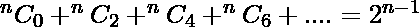

# 求偶数指数二项式系数之和

> 原文:[https://www . geesforgeks . org/find-sum-偶数-指数-二项式-系数/](https://www.geeksforgeeks.org/find-sum-even-index-binomial-coefficients/)

给定正整数 **n** 。任务是找到偶数索引二项式系数的和。即
**<sup>n</sup>C<sub>0</sub>+<sup>n</sup>C<sub>2</sub>+<sup>n</sup>C<sub>4</sub>+<sup>n</sup>C<sub>6</sub>+<sup>n</sup>C<sub>8</sub>+……..**
**例:**

```
Input : n = 4
Output : 8
4C0 + 4C2 + 4C4
= 1 + 6 + 1
= 8

Input : n = 6
Output : 32
```

**方法一:(蛮力)**
思路是找出所有的二项式系数，只找出偶数索引值的和。

## 卡片打印处理机（Card Print Processor 的缩写）

```
// CPP Program to find sum
// of even index term
#include <bits/stdc++.h>
using namespace std;

// Return the sum of
// even index term
int evenSum(int n)
{
    int C[n + 1][n + 1];
    int i, j;

    // Calculate value of Binomial
    // Coefficient in bottom up manner
    for (i = 0; i <= n; i++) {
        for (j = 0; j <= min(i, n); j++) {
            // Base Cases
            if (j == 0 || j == i)
                C[i][j] = 1;

            // Calculate value using
            // previously stored values
            else
                C[i][j] = C[i - 1][j - 1]
                            + C[i - 1][j];
        }
    }   

    // finding sum of even index term.
    int sum = 0;
    for (int i = 0; i <= n; i += 2)
        sum += C[n][i];

    return sum;
}

// Driver Program
int main()
{
    int n = 4;
    cout << evenSum(n) << endl;
    return 0;
}
```

## Java 语言(一种计算机语言，尤用于创建网站)

```
// Java Program to find sum
// of even index term
import java.io.*;
import java.math.*;

class GFG {

    // Return the sum of
    // even index term
    static int evenSum(int n)
    {
        int C[][] = new int [n + 1][n + 1];
        int i, j;

        // Calculate value of Binomial
        // Coefficient in bottom up manner
        for (i = 0; i <= n; i++)
        {
            for (j = 0; j <= Math.min(i, n); j++)
            {
                // Base Cases
                if (j == 0 || j == i)
                    C[i][j] = 1;

                // else Calculate value using
                // previously stored values
                else
                    C[i][j] = C[i - 1][j - 1]
                                + C[i - 1][j];
            }
        }   

        // finding sum of even index term.
        int sum = 0;
        for (i = 0; i <= n; i += 2)
            sum += C[n][i];

        return sum;
    }

    // Driver Program
    public static void main(String args[])
    {
        int n = 4;
        System.out.println(evenSum(n));
    }
}

/*This code is contributed by Nikita Tiwari.*/
```

## 计算机编程语言

```
# Python Program to find sum of even index term
import math

# Return the sum of even index term
def evenSum(n) :
    # Creates a list containing n+1 lists,
    # each of n+1 items, all set to 0
    C = [[0 for x in range(n + 1)] for y in range(n + 1)]

    # Calculate value of Binomial Coefficient
    # in bottom up manner
    for i in range(0, n + 1):
        for j in range(0, min(i, n + 1)):
            # Base Cases
            if j == 0 or j == i:
                C[i][j] = 1

            # Calculate value using previously
            # stored values
            else:
                C[i][j] = C[i - 1][j - 1] + C[i - 1][j]

    # Finding sum of even index term
    sum = 0;
    for i in range(0, n + 1):
        if n % 2 == 0:
            sum = sum + C[n][i]

    return sum

# Driver method
n = 4
print evenSum(n)

# This code is contributed by 'Gitanjali'.
```

## C#

```
// C# Program to find sum
// of even index term
using System;

class GFG {

    // Return the sum of
    // even index term
    static int evenSum(int n)
    {
        int [,]C = new int [n + 1,n + 1];
        int i, j;

        // Calculate value of Binomial
        // Coefficient in bottom up manner
        for (i = 0; i <= n; i++)
        {
            for (j = 0; j <= Math.Min(i, n); j++)
            {
                // Base Cases
                if (j == 0 || j == i)
                    C[i,j] = 1;

                // else Calculate value using
                // previously stored values
                else
                    C[i,j] = C[i - 1,j - 1]
                            + C[i - 1,j];
            }
        }

        // finding sum of even index term.
        int sum = 0;
        for (i = 0; i <= n; i += 2)
            sum += C[n,i];

        return sum;
    }

    // Driver Program
    public static void Main()
    {
        int n = 4;
        Console.WriteLine(evenSum(n));
    }
}

/*This code is contributed by vt_m.*/
```

## 服务器端编程语言（Professional Hypertext Preprocessor 的缩写）

```
<?php
// PHP Program to find sum
// of even index term

// Return the sum of
// even index term
function evenSum($n)
{
    $C = array(array());
    $i; $j;

    // Calculate value of Binomial
    // Coefficient in bottom up manner
    for ($i = 0; $i <= $n; $i++)
    {
        for ($j = 0; $j <= min($i, $n); $j++)
        {
            // Base Cases
            if ($j == 0 or $j == $i)
                $C[$i][$j] = 1;

            // Calculate value using
            // previously stored values
            else
                $C[$i][$j] = $C[$i - 1][$j - 1] +
                             $C[$i - 1][$j];
        }
    }

    // finding sum of even index term.
    $sum = 0;
    for ( $i = 0; $i <= $n; $i += 2)
        $sum += $C[$n][$i];

    return $sum;
}

// Driver Code
$n = 4;
echo evenSum($n) ;

// This code is contributed by anuj_67.
?>
```

## java 描述语言

```
<script>

// Javascript Program to find sum
// of even index term

// Return the sum of
// even index term
function evenSum(n)
{
    var C =  Array.from(Array(n+1),
    ()=> Array(n+1).fill(0));
    var i, j;

    // Calculate value of Binomial
    // Coefficient in bottom up manner
    for (i = 0; i <= n; i++) {
        for (j = 0; j <= Math.min(i, n); j++) {
            // Base Cases
            if (j == 0 || j == i)
                C[i][j] = 1;

            // Calculate value using
            // previously stored values
            else
                C[i][j] = C[i - 1][j - 1]
                            + C[i - 1][j];
        }
    }   

    // finding sum of even index term.
    var sum = 0;
    for (var i = 0; i <= n; i += 2)
        sum += C[n][i];

    return sum;
}

// Driver Program
var n = 4;
document.write( evenSum(n) );  

</script>   
```

**输出:**

```
8
```

**时间复杂度:** O(n <sup>2</sup> )
**方法 2:(使用公式)**
偶数索引二项式系数之和:

**证明:**

```
We know,
(1 + x)n = nC0 + nC1 x + nC2 x2 + ..... + nCn xn

Now put x = -x, we get
(1 - x)n = nC0 - nC1 x + nC2 x2 + ..... + (-1)n nCn xn

Now, adding both the above equation, we get,
(1 + x)n + (1 - x)n = 2 * [nC0 + nC2 x2 + nC4 x4 + .......]

Put x = 1
(1 + 1)n + (1 - 1)n = 2 * [nC0 + nC2 + nC4 + .......]
2n/2 = nC0 + nC2 + nC4 + .......
2n-1 = nC0 + nC2 + nC4 + .......
```

以下是该方法的实现:

## C++

```
// CPP Program to find sum even indexed Binomial
// Coefficient.
#include <bits/stdc++.h>
using namespace std;

// Returns value of even indexed Binomial Coefficient
// Sum which is 2 raised to power n-1.
int evenbinomialCoeffSum(int n)
{
    return (1 << (n - 1));
}

/* Driver program to test above function*/
int main()
{
    int n = 4;
    printf("%d", evenbinomialCoeffSum(n));
    return 0;
}
```

## Java 语言(一种计算机语言，尤用于创建网站)

```
// Java Program to find sum even indexed
// Binomial Coefficient.
import java.io.*;

class GFG {
// Returns value of even indexed Binomial Coefficient
// Sum which is 2 raised to power n-1.
static int evenbinomialCoeffSum(int n)
{
    return (1 << (n - 1));
}

// Driver Code
public static void main(String[] args)
{
int n = 4;
    System.out.println(evenbinomialCoeffSum(n));
}
    }

// This code is contributed by 'Gitanjali'.
```

## 计算机编程语言

```
# Python program to find sum even indexed
# Binomial Coefficient
import math

# Returns value of even indexed Binomial Coefficient
# Sum which is 2 raised to power n-1.
def evenbinomialCoeffSum( n):

    return (1 << (n - 1))

# Driver method
if __name__ == '__main__':
    n = 4
    print evenbinomialCoeffSum(n)

# This code is contributed by 'Gitanjali'.
```

## C#

```
// C# Program to find sum even indexed
// Binomial Coefficient.
using System;

class GFG
{
    // Returns value of even indexed
    // Binomial Coefficient Sum which
    // is 2 raised to power n-1.
    static int evenbinomialCoeffSum(int n)
    {
        return (1 << (n - 1));
    }

    // Driver Code
    public static void Main()
    {
        int n = 4;
        Console.WriteLine(evenbinomialCoeffSum(n));
    }
}

// This code is contributed by 'Vt_m'.
```

## 服务器端编程语言（Professional Hypertext Preprocessor 的缩写）

```
<?php
// PHP Program to find sum
// even indexed Binomial
// Coefficient.

// Returns value of even indexed
// Binomial Coefficient Sum which
// is 2 raised to power n-1.
function evenbinomialCoeffSum( $n)
{
    return (1 << ($n - 1));
}

    // Driver Code
    $n = 4;
    echo evenbinomialCoeffSum($n);

// This code is contributed by anuj_67.
?>
```

## java 描述语言

```
<script>

// JavaScript Program to find sum even indexed
// Binomial Coefficient.

// Returns value of even indexed Binomial Coefficient
// Sum which is 2 raised to power n-1.
function evenbinomialCoeffSum(n)
{
    return (1 << (n - 1));
}

// Driver code   

        let n = 4;
    document.write(evenbinomialCoeffSum(n));

     // This code is contributed by code_hunt.
</script>
```

**输出:**

```
8
```

**时间复杂度:** O(1)
**奇指标二项式系数之和**
利用上面的结果我们很容易证明奇指标二项式系数之和也是 2 <sup>n-1</sup> 。