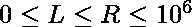

# 求给定整数序列中 L 到 R 范围内的和

> 原文:[https://www . geesforgeks . org/find-sum-in-range-l-to-r-in-给定整数序列/](https://www.geeksforgeeks.org/find-sum-in-range-l-to-r-in-given-sequence-of-integers/)

给定一个整数的**数组 arr[]** 和一个形式为:
的序列

> **【2，3，0，1，6，7，4，5，…】**。

还给出了两个整数 **L 和 R** ，这样。任务是找出从 L 到 r 的给定范围内所有数字的和
**示例:**

```
Input : L = 0, R = 5
Output : 19
Explanation : 
The arr[] is {2, 3, 0, 1, 6, 7}.
sum = arr[0] + arr[1] + arr[2] + arr[3] + arr[4] + arr[5]
sum = 2 + 3 + 0 + 1 + 6 + 7
Hence, the sum is 19.

Input : L = 2, R = 5
Output : 14
Explanation : 
The arr[] is {0, 1, 6, 7}.
sum = arr[2] + arr[3] + arr[4] + arr[5] 
sum = 0 + 1 + 6 + 7
Hence, the sum is 14.
```

**方法:**
要解决上面提到的问题，我们首先要观察数组的顺序，了解它是如何生成的。给定的数组是由一系列整数生成的，这些整数是[ 0，1，2，3，4，5，6，… ]。最初我们*在前两个整数*上加 2，然后我们*从后两个整数*上减去 2，如此继续。所以我们新形成的数组看起来像[ 0+2，1+2，2-2，3-2，4+2，5+2，6-2，7-2，… ]。因此，我们生成这个新的整数序列，并将其存储在数组中。最后，计算范围从 L 到 R 的指数之和并返回。
以下是上述方法的实施:

## C++

```
// C++ program to find the
// sum in given range L to R

#include <bits/stdc++.h>
using namespace std;

// Function to find the sum
// within the given range
int findSum(int L, int R)
{
    vector<int> arr;

    // generating array from given sequence
    int i = 0;
    int x = 2;
    while (i <= R) {
        arr.push_back(i + x);

        if (i + 1 <= R)
            arr.push_back(i + 1 + x);

        x *= -1;

        i += 2;
    }

    // calculate the desired sum
    int sum = 0;

    for (int i = L; i <= R; ++i)

        sum += arr[i];

    // return the sum
    return sum;
}

// Driven code
int main()
{

    // initialise the range
    int L = 0, R = 5;

    cout << findSum(L, R);

    return 0;
}
```

## Java 语言(一种计算机语言，尤用于创建网站)

```
// Java program to find the
// sum in given range L to R
import java.util.*;

class GFG{

// Function to find the sum
// within the given range
public static int findSum(int L, int R)
{
    ArrayList<Integer> arr = new ArrayList<>();

    // Generating array from given sequence
    int i = 0;
    int x = 2;
    while (i <= R)
    {
        arr.add(i + x);

        if (i + 1 <= R)
            arr.add(i + 1 + x);

        x *= -1;

        i += 2;
    }

    // Calculate the desired sum
    int sum = 0;

    for(i = L; i <= R; ++i)
       sum += arr.get(i);

    // return the sum
    return sum;
}

// Driver code
public static void main(String[] args)
{

    // Initialise the range
    int L = 0, R = 5;

    System.out.println(findSum(L, R));
}
}

// This code is contributed by jrishabh99
```

## 蟒蛇 3

```
# Python3 program to find the
# sum in given range L to R

# Function to find the sum
# within the given range
def findSum(L, R) :
    arr = []

    # generating array from given sequence
    i = 0
    x = 2
    k = 0
    while (i <= R) :
        arr.insert(k, i + x)
        k += 1
        if (i + 1 <= R) :
            arr.insert(k, i + 1 + x)
        k += 1
        x *= -1
        i += 2

    # calculate the desired sum
    sum = 0

    for i in range(L, R + 1) :
        sum += arr[i]

    # return the sum
    return sum

# Driver code

# initialise the range
L = 0
R = 5
print(findSum(L, R))

# This code is contributed by Sanjit_Prasad
```

## C#

```
// C# program to find the
// sum in given range L to R
using System;
using System.Collections;

class GFG{

// Function to find the sum
// within the given range
public static int findSum(int L, int R)
{
    ArrayList arr = new ArrayList();

    // Generating array from given sequence
    int i = 0;
    int x = 2;
    while (i <= R)
    {
        arr.Add(i + x);

        if (i + 1 <= R)
            arr.Add(i + 1 + x);

        x *= -1;
        i += 2;
    }

    // Calculate the desired sum
    int sum = 0;

    for(i = L; i <= R; ++i)
        sum += (int)arr[i];

    // return the sum
    return sum;
}

// Driver code
public static void Main(string[] args)
{

    // Initialise the range
    int L = 0, R = 5;

    Console.Write(findSum(L, R));
}
}

// This code is contributed by rutvik_56
```

## java 描述语言

```
<script>
//Javascript  program to find the
// sum in given range L to R

// Function to find the sum
// within the given range
function findSum( L,  R)
{
    var arr=[];

    // generating array from given sequence
    var i = 0;
    var x = 2;
    while (i <= R) {
        arr.push(i + x);

        if (i + 1 <= R)
            arr.push(i + 1 + x);

        x *= -1;

        i += 2;
    }

    // calculate the desired sum
    var sum = 0;

    for (var i = L; i <= R; ++i)

        sum += arr[i];

    // return the sum
    return sum;
}

var L = 0, R = 5;
document.write( findSum(L, R));

//This code is contributed by SoumikMondal
</script>
```

**Output:** 

```
19
```

**时间复杂度:** O(N)

**辅助空间:** O(N)