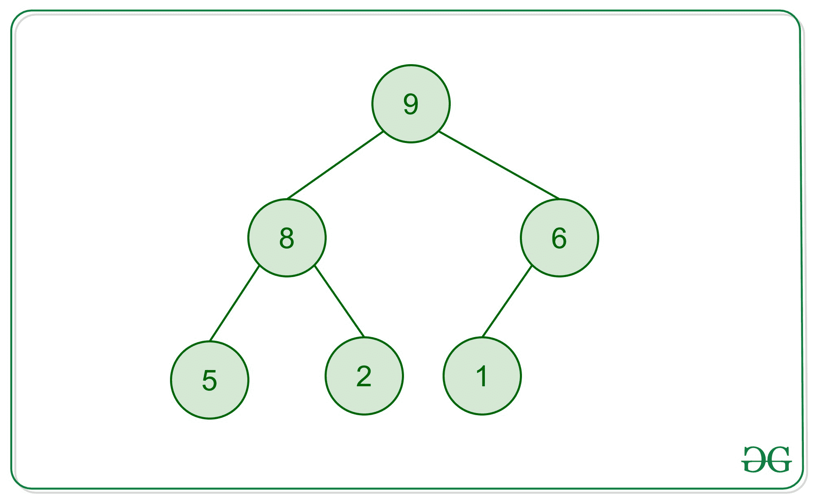

# 求给定二叉树中所有左叶的和

> 原文:[https://www . geesforgeks . org/find-sum-left-given-二叉树/](https://www.geeksforgeeks.org/find-sum-left-leaves-given-binary-tree/)

给定一棵二叉树，求其中所有左叶的和。例如，二叉树下面所有左叶的和是 5+1=6。



这个想法是遍历树，从根开始。对于每个节点，检查它的左子树是否是叶子。如果是，则将其添加到结果中。
以下是上述思路的实现。

## C++

```
// A C++ program to find sum of all left leaves
#include <bits/stdc++.h>
using namespace std;

/* A binary tree Node has key, pointer to left and right
   children */
struct Node
{
    int key;
    struct Node* left, *right;
};

/* Helper function that allocates a new node with the
   given data and NULL left and right pointer. */
Node *newNode(char k)
{
    Node *node = new Node;
    node->key = k;
    node->right = node->left = NULL;
    return node;
}

// A utility function to check if a given node is leaf or not
bool isLeaf(Node *node)
{
   if (node == NULL)
       return false;
   if (node->left == NULL && node->right == NULL)
       return true;
   return false;
}

// This function returns sum of all left leaves in a given
// binary tree
int leftLeavesSum(Node *root)
{
    // Initialize result
    int res = 0;

    // Update result if root is not NULL
    if (root != NULL)
    {
       // If left of root is NULL, then add key of
       // left child
       if (isLeaf(root->left))
            res += root->left->key;
       else // Else recur for left child of root
            res += leftLeavesSum(root->left);

       // Recur for right child of root and update res
       res += leftLeavesSum(root->right);
    }

    // return result
    return res;
}

/* Driver program to test above functions*/
int main()
{
    // Let us a construct the Binary Tree
    struct Node *root         = newNode(20);
    root->left                = newNode(9);
    root->right               = newNode(49);
    root->right->left         = newNode(23);
    root->right->right        = newNode(52);
    root->right->right->left  = newNode(50);
    root->left->left          = newNode(5);
    root->left->right         = newNode(12);
    root->left->right->right  = newNode(12);
    cout << "Sum of left leaves is "
         << leftLeavesSum(root);
    return 0;
}
```

## Java 语言(一种计算机语言，尤用于创建网站)

```
// Java program to find sum of all left leaves
class Node
{
    int data;
    Node left, right;

    Node(int item)
    {
        data = item;
        left = right = null;
    }
}

class BinaryTree
{
    Node root;

    // A utility function to check if a given node is leaf or not
    boolean isLeaf(Node node)
    {
        if (node == null)
            return false;
        if (node.left == null && node.right == null)
            return true;
        return false;
    }

     // This function returns sum of all left leaves in a given
     // binary tree
    int leftLeavesSum(Node node)
    {
        // Initialize result
        int res = 0;

        // Update result if root is not NULL
        if (node != null)
        {
            // If left of root is NULL, then add key of
            // left child
            if (isLeaf(node.left))
                res += node.left.data;
            else // Else recur for left child of root
                res += leftLeavesSum(node.left);

            // Recur for right child of root and update res
            res += leftLeavesSum(node.right);
        }

        // return result
        return res;
    }

    // Driver program
    public static void main(String args[])
    {
        BinaryTree tree = new BinaryTree();
        tree.root = new Node(20);
        tree.root.left = new Node(9);
        tree.root.right = new Node(49);
        tree.root.left.right = new Node(12);
        tree.root.left.left = new Node(5);
        tree.root.right.left = new Node(23);
        tree.root.right.right = new Node(52);
        tree.root.left.right.right = new Node(12);
        tree.root.right.right.left = new Node(50);

        System.out.println("The sum of leaves is " +
                                       tree.leftLeavesSum(tree.root));
    }
}

// This code is contributed by Mayank Jaiswal
```

## 计算机编程语言

```
# Python program to find sum of all left leaves

# A Binary tree node
class Node:
    # Constructor to create a new Node
    def __init__(self, key):
        self.key = key
        self.left = None
        self.right = None

# A utility function to check if a given node is leaf or not
def isLeaf(node):
    if node is None:
        return False
    if node.left is None and node.right is None:
        return True
    return False

# This function return sum of all left leaves in a
# given binary tree
def leftLeavesSum(root):

    # Initialize result
    res = 0

    # Update result if root is not None
    if root is not None:

        # If left of root is None, then add key of
        # left child
        if isLeaf(root.left):
            res += root.left.key
        else:
            # Else recur for left child of root
            res += leftLeavesSum(root.left)

        # Recur for right child of root and update res
        res += leftLeavesSum(root.right)
    return res

# Driver program to test above function

# Let us constrcut the Binary Tree shown in the above function
root = Node(20)
root.left = Node(9)
root.right = Node(49)
root.right.left = Node(23)       
root.right.right = Node(52)
root.right.right.left = Node(50)
root.left.left = Node(5)
root.left.right = Node(12)
root.left.right.right = Node(12)
print "Sum of left leaves is", leftLeavesSum(root)

# This code is contributed by Nikhil Kumar Singh(nickzuck_007)
```

## C#

```
using System;

// C# program to find sum of all left leaves
public class Node
{
    public int data;
    public Node left, right;

    public Node(int item)
    {
        data = item;
        left = right = null;
    }
}

public class BinaryTree
{
    public Node root;

    // A utility function to check if a given node is leaf or not
    public virtual bool isLeaf(Node node)
    {
        if (node == null)
        {
            return false;
        }
        if (node.left == null && node.right == null)
        {
            return true;
        }
        return false;
    }

     // This function returns sum of all left leaves in a given
     // binary tree
    public virtual int leftLeavesSum(Node node)
    {
        // Initialize result
        int res = 0;

        // Update result if root is not NULL
        if (node != null)
        {
            // If left of root is NULL, then add key of
            // left child
            if (isLeaf(node.left))
            {
                res += node.left.data;
            }
            else // Else recur for left child of root
            {
                res += leftLeavesSum(node.left);
            }

            // Recur for right child of root and update res
            res += leftLeavesSum(node.right);
        }

        // return result
        return res;
    }

    // Driver program
    public static void Main(string[] args)
    {
        BinaryTree tree = new BinaryTree();
        tree.root = new Node(20);
        tree.root.left = new Node(9);
        tree.root.right = new Node(49);
        tree.root.left.right = new Node(12);
        tree.root.left.left = new Node(5);
        tree.root.right.left = new Node(23);
        tree.root.right.right = new Node(52);
        tree.root.left.right.right = new Node(12);
        tree.root.right.right.left = new Node(50);

        Console.WriteLine("The sum of leaves is " + tree.leftLeavesSum(tree.root));
    }
}

  //  This code is contributed by Shrikant13
```

## java 描述语言

```
<script>
// Javascript program to find sum of all left leaves

    class Node
    {
        constructor(k)
        {
            this.data = k;
            this.left = null;
            this.right = null;
        }

    }

    // A utility function to check if a given node is leaf or not
    function isLeaf(node)
    {
        if (node == null)
            return false;
        if (node.left == null && node.right == null)
            return true;
        return false;
    }

    // This function returns sum of all left leaves in a given
     // binary tree
    function leftLeavesSum(node)
    {

        // Initialize result
        let res = 0;

        // Update result if root is not NULL
        if (node != null)
        {

            // If left of root is NULL, then add key of
            // left child
            if (isLeaf(node.left))
                res += node.left.data;
            else // Else recur for left child of root
                res += leftLeavesSum(node.left);

            // Recur for right child of root and update res
            res += leftLeavesSum(node.right);
        }

        // return result
        return res;
    }

    // Driver program
    root = new Node(20);
    root.left = new Node(9);
    root.right = new Node(49);
    root.left.right = new Node(12);
    root.left.left = new Node(5);
    root.right.left = new Node(23);
    root.right.right = new Node(52);
    root.left.right.right = new Node(12);
    root.right.right.left = new Node(50);

    document.write("The sum of leaves is " +leftLeavesSum(root));

    // This code is contributed by unknown2108
</script>
```

**Output**

```
Sum of left leaves is 78
```