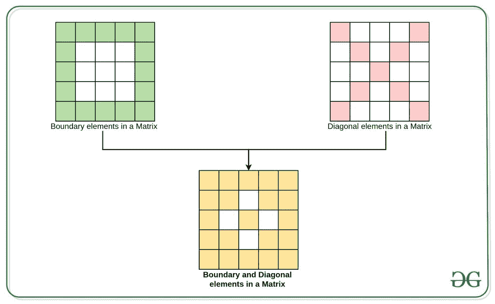

# 求矩阵所有边界和对角元素的和

> 原文:[https://www . geeksforgeeks . org/find-矩阵的所有边界和对角线元素之和/](https://www.geeksforgeeks.org/find-sum-of-all-boundary-and-diagonal-element-of-a-matrix/)

给定顺序为 **NxN** 的 [2D 数组](https://www.geeksforgeeks.org/multidimensional-arrays-c-cpp/) **arr[][]** ，任务是找到给定 **arr[][]** 的对角线和[边界元素](https://www.geeksforgeeks.org/boundary-elements-matrix/)中存在的所有[元素的总和。
**示例:**](https://www.geeksforgeeks.org/efficiently-compute-sums-of-diagonals-of-a-matrix/) 

> **输入:** arr[][] = { {1，2，3，4}，{1，2，3，4}，{1，2，3，4}，{1，2，3，4} }
> **输出:** 40
> **解释:**
> 边界上的元素之和为 1+2+3+4+4+4+3+2+1+1 = 30。
> 对角线上不与边界元素相交的元素之和为 2 + 3 + 2 + 3 = 10。
> 因此所需的总和为 30 + 10 = 40。
> **输入:** arr[][] = { {1，2，3}，{1，2，3}，{1，2，3}}
> **输出:** 18
> **解释:**
> 边界上的元素之和为 1+2+3+3+2+1+1 = 16。
> 对角线上不与边界元素相交的元素之和为 2。
> 因此所需的和为 16 + 2 = 18。

**进场:**



1.  使用两个循环遍历给定的 2D 数组，一个循环用于行(比如说 **i** )，另一个循环用于列(比如说 **j** )。
2.  如果 **i** 等于 **j** 或 **(i + j)** 等于**(列-1 的大小)**，则该元素对给定 2D 数组的对角线有贡献。
3.  如果( **i** 或 **j** 等于 **0** )或( **i** 或 **j** 等于第–1 列的 s **大小)，则该元素构成给定 2D 数组的边界元素。**
4.  满足上述两个条件的所有元素的和给出了所需的和。

以下是上述方法的实现:

## C++

```
// C++ implementation of the above approach

#include "bits/stdc++.h"
using namespace std;

const int N = 4;

// Function to find the sum of all diagonal
// and Boundary elements
void diagonalBoundarySum(int arr[N][N])
{

    int requiredSum = 0;

    // Traverse arr[][]
    // Loop from i to N-1 for rows
    for (int i = 0; i < N; i++) {

        // Loop from j = N-1 for columns
        for (int j = 0; j < N; j++) {

            // Condition for diagonal
            // elements
            if (i == j || (i + j) == N - 1) {
                requiredSum += arr[i][j];
            }

            // Condition for Boundary
            // elements
            else if (i == 0 || j == 0
                     || i == N - 1
                     || j == N - 1) {
                requiredSum += arr[i][j];
            }
        }
    }

    // Print the final Sum
    cout << requiredSum << endl;
}

// Driver Code
int main()
{
    int arr[][4] = { { 1, 2, 3, 4 },
                     { 1, 2, 3, 4 },
                     { 1, 2, 3, 4 },
                     { 1, 2, 3, 4 } };

    diagonalBoundarySum(arr);
    return 0;
}
```

## Java 语言(一种计算机语言，尤用于创建网站)

```
// Java implementation of the above approach
import java.util.*;

class GFG{
    public static int N = 4;

    // Function to find the sum of all diagonal
    // and Boundary elements
    static void diagonalBoundarySum(int arr[][]){
        int requiredSum = 0;

        // Traverse arr[][]
        // Loop from i to N-1 for rows
        for (int i = 0; i < N; i++) {

            // Loop from j = N-1 for columns
            for (int j = 0; j < N; j++) {

                // Condition for diagonal
                // elements
                if (i == j || (i + j) == N - 1) {
                    requiredSum += arr[i][j];
                }

                // Condition for Boundary
                // elements
                else if (i == 0 || j == 0 || i == N - 1|| j == N - 1) {
                    requiredSum += arr[i][j];
                }
            }
        }

        // Print the final Sum
        System.out.println(requiredSum);
    }

    // Driver Code
    public static void main(String args[])
    {
        int arr[][] = { { 1, 2, 3, 4 },{ 1, 2, 3, 4 },
                        { 1, 2, 3, 4 },{ 1, 2, 3, 4 } };

        diagonalBoundarySum(arr);

    }
}

// This code is contributed by AbhiThakur
```

## 蟒蛇 3

```
# Python implementation of the above approach

N = 4;

# Function to find the sum of all diagonal
# and Boundary elements
def diagonalBoundarySum(arr):
    requiredSum = 0;

    # Traverse arr
    # Loop from i to N-1 for rows
    for i in range(N):

        # Loop from j = N-1 for columns
        for j in range(N):

            # Condition for diagonal
            # elements
            if (i == j or (i + j) == N - 1):
                requiredSum += arr[i][j];

            # Condition for Boundary
            # elements
            elif(i == 0 or j == 0 or i == N - 1 or j == N - 1):
                requiredSum += arr[i][j];

    # Print the final Sum
    print(requiredSum);

# Driver Code
if __name__ == '__main__':
    arr = [[ 1, 2, 3, 4 ],
    [ 1, 2, 3, 4 ],
    [ 1, 2, 3, 4 ],
    [ 1, 2, 3, 4 ]];

    diagonalBoundarySum(arr);

# This code is contributed by 29AjayKumar
```

## C#

```
// C# implementation of the above approach
using System;

class GFG
{
    public static int N = 4;

    // Function to find the sum of all diagonal
    // and Boundary elements
    static void diagonalBoundarySum(int[, ] arr){
        int requiredSum = 0;

        // Traverse arr[][]
        // Loop from i to N-1 for rows
        for (int i = 0; i < N; i++) {

            // Loop from j = N-1 for columns
            for (int j = 0; j < N; j++) {

                // Condition for diagonal
                // elements
                if (i == j || (i + j) == N - 1) {
                    requiredSum += arr[i,j];
                }

                // Condition for Boundary
                // elements
                else if (i == 0 || j == 0 || i == N - 1|| j == N - 1) {
                    requiredSum += arr[i,j];
                }
            }
        }

        // Print the final Sum
        Console.WriteLine(requiredSum);
    }

    // Driver Code
    public static void Main()
    {
        int[, ] arr = { { 1, 2, 3, 4 },{ 1, 2, 3, 4 },{ 1, 2, 3, 4 },{ 1, 2, 3, 4 } };

        diagonalBoundarySum(arr);

    }
}

// This code is contributed by abhaysingh290895
```

## java 描述语言

```
<script>
// Java script  implementation of the above approach
let N = 4;

    // Function to find the sum of all diagonal
    // and Boundary elements
    function diagonalBoundarySum(arr){
        let requiredSum = 0;

        // Traverse arr[][]
        // Loop from i to N-1 for rows
        for (let i = 0; i < N; i++) {

            // Loop from j = N-1 for columns
            for (let j = 0; j < N; j++) {

                // Condition for diagonal
                // elements
                if (i == j || (i + j) == N - 1) {
                    requiredSum += arr[i][j];
                }

                // Condition for Boundary
                // elements
                else if (i == 0 || j == 0 || i == N - 1|| j == N - 1) {
                    requiredSum += arr[i][j];
                }
            }
        }

        // Print the final Sum
        document.write(requiredSum);
    }

    // Driver Code

        let arr = [[ 1, 2, 3, 4 ],[ 1, 2, 3, 4 ],
                        [1, 2, 3, 4 ],[ 1, 2, 3, 4 ]];

        diagonalBoundarySum(arr);

// contributed by sravan kumar
</script>
```

**Output:** 

```
40
```