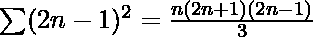

# 求[L，R]

范围内所有奇数完美平方的和

> 原文:[https://www . geesforgeks . org/find-所有奇数完美平方的和-范围-l-r/](https://www.geeksforgeeks.org/find-sum-of-all-odd-perfect-squares-in-the-range-l-r/)

给定两个整数 **L** 和 **R** 。任务是在**【L，R】**范围内找到所有完全平方的奇数的**和**。

**示例**:

> **输入** : L = 1，R = 9
> **输出** : 10
> **说明**:范围内奇数为 1，3，5，7，9，只有 1，9 是 1，3 的完美平方。所以，1 + 9 = 10。
> 
> **输入** : L = 50，R = 10，000
> 输出 : 166566

**天真法**:解决这个问题的基本思路是遍历 L 到 R 范围内的数字，对于每个奇数，也要检查它是否是一个完美的正方形。

***时间复杂度:*** O(R-L)
***辅助空间:*** O(1)

**高效逼近**:解的逼近基于序列的数学概念。想法是使用第一个 **N** 奇数的平方和。

> **前 n 个奇数自然数的平方=** 

按照以下步骤解决问题。：

1.  检查 1 和刚好大于或等于 l 的完美平方奇数之间的完美平方的计数。
2.  检查**【1，L】**范围内**奇数正方体**的**计数**。
3.  计算范围**【1，L】**内奇数完美正方形的和 **(sum1)** 。
4.  检查**【1，R】**范围内**完美方块**的计数。
5.  检查范围**【1，R】**内的**奇数正方块**的计数。
6.  计算范围**【1，R】**内奇数完美正方形的和 **(sum2)** 。
7.  **从 sum2 中减去** sum1，得到[L，R]范围内的奇数的和，这些奇数都是完美平方。

下面是上述方法的实现:

## C++

```
// C++ implementation for the above approach
#include <cmath>
#include <iostream>
using namespace std;

// Function to find sum of all the odd
// numbers,which are perfect squares
// in range [L, R]
int findSum(int L, int R)
{
    // If L > R or both less than 0
    if (L < 0 || R < 0 || L > R)
        return -1;

    int l, r, n1, n2, s1, s2;

    // Check count of numbers
    // which are perfect squares between 
    // 1 & perfect squared odd number
    // just greater or equal to L
    l = ceil(sqrt(L));
    if (!(l & 1))
        l++;

    // Check count of numbers which
    // are perfect squares in range [1, R]
    r = floor(sqrt(R));
    if (!(r & 1))
        r--;

    // Check count of odd numbers which
    // are perfect squares in range [1, L)
    n1 = floor((float)l / 2);

    // Check count of odd numbers which
    // are perfect squares in range [1, R]
    n2 = ceil((float)r / 2);

    // Calculate sum of odd numbers which
    // are perfect squares in range [1, L)
    s1 = n1 * ((4 * n1 * n1) - 1) / 3;

    // Calculate sum of odd numbers which
    // are perfect squares in range [1, R]
    s2 = n2 * ((4 * n2 * n2) - 1) / 3;

    // Return sum of odd numbers which
    // are perfect squares in range [L, R]
    return s2 - s1;
}

// Driver Code
int main()
{
    int L = 1;
    int R = 9;

    cout << findSum(L, R);
    return 0;
}
```

## Java 语言(一种计算机语言，尤用于创建网站)

```
// Java implementation for the above approach
import java.util.*;
public class GFG
{
// Function to find sum of all the odd
// numbers,which are perfect squares
// in range [L, R]
static int findSum(int L, int R)
{
    // If L > R or both less than 0
    if (L < 0 || R < 0 || L > R)
        return -1;

    int l, r, n1, n2, s1, s2;

    // Check count of numbers
    // which are perfect squares between 
    // 1 & perfect squared odd number
    // just greater or equal to L
    l = (int)Math.ceil(Math.sqrt(L));
    if ((l & 1) == 0)
        l++;

    // Check count of numbers which
    // are perfect squares in range [1, R]
    r = (int)Math.floor(Math.sqrt(R));
    if ((r & 1) == 0)
        r--;

    // Check count of odd numbers which
    // are perfect squares in range [1, L)
    n1 = (int)Math.floor((float)l / 2);

    // Check count of odd numbers which
    // are perfect squares in range [1, R]
    n2 = (int)Math.ceil((float)r / 2);

    // Calculate sum of odd numbers which
    // are perfect squares in range [1, L)
    s1 = n1 * ((4 * n1 * n1) - 1) / 3;

    // Calculate sum of odd numbers which
    // are perfect squares in range [1, R]
    s2 = n2 * ((4 * n2 * n2) - 1) / 3;

    // Return sum of odd numbers which
    // are perfect squares in range [L, R]
    return s2 - s1;
}

// Driver Code
public static void main(String args[])
{
    int L = 1;
    int R = 9;

    System.out.println(findSum(L, R));
}
}

// This code is contributed by Samim Hossain Mondal.
```

## 蟒蛇 3

```
# Python3 implementation for the above approach
import math

# Function to find sum of all the odd
# numbers,which are perfect squares
# in range [L, R]
def findSum(L, R):

    # If L > R or both less than 0
    if (L < 0 or R < 0 or L > R):
        return -1

    # Check count of numbers which are
    # perfect squares between 1 & perfect
    # squared odd number just greater or
    # equal to L
    l = math.ceil(math.sqrt(L))
    if (not (l & 1)):
        l += 1

    # Check count of numbers which
    # are perfect squares in range [1, R]
    r = math.floor(math.sqrt(R))
    if (not (r & 1)):
        r -= 1

    # Check count of odd numbers which
    # are perfect squares in range [1, L)
    n1 = math.floor(l / 2)

    # Check count of odd numbers which
    # are perfect squares in range [1, R]
    n2 = math.ceil(r / 2)

    # Calculate sum of odd numbers which
    # are perfect squares in range [1, L)
    s1 = int(n1 * ((4 * n1 * n1) - 1) / 3)

    # Calculate sum of odd numbers which
    # are perfect squares in range [1, R]
    s2 = int(n2 * ((4 * n2 * n2) - 1) / 3)

    # Return sum of odd numbers which
    # are perfect squares in range [L, R]
    return s2 - s1

# Driver Code
if __name__ == "__main__":

    L = 1
    R = 9

    print(findSum(L, R))

# This code is contributed by rakeshsahni
```

## C#

```
// C# implementation for the above approach
using System;
class GFG
{

// Function to find sum of all the odd
// numbers,which are perfect squares
// in range [L, R]
static int findSum(int L, int R)
{

    // If L > R or both less than 0
    if (L < 0 || R < 0 || L > R)
        return -1;

    int l, r, n1, n2, s1, s2;

    // Check count of numbers
    // which are perfect squares between 
    // 1 & perfect squared odd number
    // just greater or equal to L
    l = (int)Math.Ceiling(Math.Sqrt(L));
    if ((l & 1) == 0)
        l++;

    // Check count of numbers which
    // are perfect squares in range [1, R]
    r = (int)Math.Floor(Math.Sqrt(R));
    if ((r & 1) == 0)
        r--;

    // Check count of odd numbers which
    // are perfect squares in range [1, L)
    n1 = (int)Math.Floor((float)l / 2);

    // Check count of odd numbers which
    // are perfect squares in range [1, R]
    n2 = (int)Math.Ceiling((float)r / 2);

    // Calculate sum of odd numbers which
    // are perfect squares in range [1, L)
    s1 = n1 * ((4 * n1 * n1) - 1) / 3;

    // Calculate sum of odd numbers which
    // are perfect squares in range [1, R]
    s2 = n2 * ((4 * n2 * n2) - 1) / 3;

    // Return sum of odd numbers which
    // are perfect squares in range [L, R]
    return s2 - s1;
}

// Driver Code
public static void Main()
{
    int L = 1;
    int R = 9;

    Console.Write(findSum(L, R));
}
}

// This code is contributed by Samim Hossain Mondal.
```

## java 描述语言

```
<script>

// JavaScript implementation for the above approach

// Function to find sum of all the odd
// numbers,which are perfect squares
// in range [L, R]
function findSum(L, R)
{

    // If L > R or both less than 0
    if (L < 0 || R < 0 || L > R)
        return -1;

    let l, r, n1, n2, s1, s2;

    // Check count of numbers
    // which are perfect squares between 
    // 1 & perfect squared odd number
    // just greater or equal to L
    l = Math.ceil(Math.sqrt(L));
    if (!(l & 1))
        l++;

    // Check count of numbers which
    // are perfect squares in range [1, R]
    r = Math.floor(Math.sqrt(R));
    if (!(r & 1))
        r--;

    // Check count of odd numbers which
    // are perfect squares in range [1, L)
    n1 = Math.floor(l / 2);

    // Check count of odd numbers which
    // are perfect squares in range [1, R]
    n2 = Math.ceil(r / 2);

    // Calculate sum of odd numbers which
    // are perfect squares in range [1, L)
    s1 = n1 * ((4 * n1 * n1) - 1) / 3;

    // Calculate sum of odd numbers which
    // are perfect squares in range [1, R]
    s2 = n2 * ((4 * n2 * n2) - 1) / 3;

    // Return sum of odd numbers which
    // are perfect squares in range [L, R]
    return s2 - s1;
}

// Driver Code
let L = 1;
let R = 9;

document.write(findSum(L, R));

// This code is contributed by Potta Lokesh

</script>
```

**Output**

```
10
```

***时间复杂度** : O(1)*
***辅助空间** : O(1)*