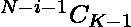
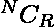

# 求大小为 K 的所有可能子集的最大值和最小值之差的和

> 原文:[https://www . geeksforgeeks . org/find-最大和最小差之和-所有可能的大小子集-k/](https://www.geeksforgeeks.org/find-sum-of-difference-of-maximum-and-minimum-over-all-possible-subsets-of-size-k/)

给定一个由 **N** 个整数和一个整数 **K** 组成的[数组](https://www.geeksforgeeks.org/introduction-to-arrays/)**arr【】】**，任务是找到所有可能的大小为 **K** 的子集上的最大和最小元素之间的**和**的之和。

**示例:**

> **输入:** arr[] = {1，1，3，4}，K = 2
> **输出:** 11
> **解释:**
> 给定大小为 K(= 2)的数组有 6 个子集。它们是{1，1}、{1，3}、{1，4}、{1，3}、{1，4}和{3，4}。
> 每个子集的最大值-最小值分别为 0、2、3、2、3、1，它们的和为 11。
> 
> **输入:** arr[] = {1，1，1}，K = 1
> T3】输出: 0

**方法:**给定的问题可以基于以下观察来解决:

*   所有集合的最大值和最小值之差之和是相互独立的，即可以计算为**所有集合尺寸 K 的最大值之和–所有集合尺寸 K 的最小值之和*。*
*   *在一个[排序数组](https://www.geeksforgeeks.org/nearly-sorted-algorithm/)中 **arr[]** ， **arr[i]** 是数组中元素在**【0，I–1】**范围内的所有集合的最大值。因此，具有 arr[i]作为[最大数组元素](https://www.geeksforgeeks.org/c-program-find-largest-element-array/)的大小为 K 的集合的数量可以计算为。类似地，以 arr[i]为最小元素的大小为 K 的集合的数量为。*
*   *使用本文中讨论的方法可以有效地计算的值。*

*利用上述观察，可以通过以下步骤解决给定的问题:*

*   *[按非递减顺序对给定数组](https://www.geeksforgeeks.org/sorting-algorithms/) arr[]进行排序。*
*   *为了计算所有尺寸组 **K** 的最大值之和，创建一个变量 **sumMax** ，对于每个变量，范围**【K–1，N–1】**、[内的指数 **i** 迭代数组](https://www.geeksforgeeks.org/c-program-to-traverse-an-array/)**arr【】**并将![arr[i] * {}^{i}C_{K - 1}           ](img/2e9f207f99ecfe45e086b49506f32eab.png "Rendered by QuickLaTeX.com")加入 **sumMax** 。*
*   *同样，为了计算所有尺寸组 **K** 的最小值之和，创建一个变量 **sumMin** ，对于范围【0，N-K】中的每个 I，迭代数组**arr【】**并将![arr[i] * {}^{N - i - 1}C_{K - 1}           ](img/3fe2046c56cd7416c6abdaa2d272f22d.png "Rendered by QuickLaTeX.com")添加到 **sumMin** 中。*
*   ***sumMax–sumMin**的值是必需的答案。*

*下面是上述方法的实现:*

## *C++*

```
*// C++ program for the above approach

#include <bits/stdc++.h>
using namespace std;

#define int long long int
#define max 100000
#define mod 1000000007

int inv[max], fact[max], facinv[max];

// Function to precompute factorial and
// the inverse of factorial values of all
// elements in the range [1, max] to find
// the value of nCr in O(1)
void ncrPrecomputation()
{
    inv[0] = inv[1] = 1;
    fact[0] = fact[1] = 1;
    facinv[0] = facinv[1] = 1;

    // Loop to iterate over all i in
    // the range [2, max]
    for (int i = 2; i < max; i++) {

        // Calculate Inverse of i
        inv[i] = inv[mod % i]
                 * (mod - mod / i) % mod;

        // Calculate Factorial of i
        fact[i] = (fact[i - 1] * i) % mod;

        // Calculate the Inverse of
        // factorial of i
        facinv[i] = (inv[i] * facinv[i - 1]) % mod;
    }
}

// Function to find nCr in O(1)
int nCr(int n, int r)
{
    return ((fact[n] * facinv[r]) % mod
            * facinv[n - r])
           % mod;
}

// Function to find the sum of difference
// between maximum and minimum over all
// sets of arr[] having K elements
int sumMaxMin(int arr[], int N, int K)
{
    // Sort the given array
    sort(arr, arr + N);

    // Stores the sum of maximum of
    // all the sets
    int sumMax = 0;

    // Loop to iterate arr[] in the
    // range [K-1, N-1]
    for (int i = K - 1; i < N; i++) {

        // Add sum of sets having arr[i]
        // as the maximum element
        sumMax += (arr[i] * nCr(i, K - 1));
    }

    // Stores the sum of the minimum of
    // all the sets
    int sumMin = 0;

    // Loop to iterate arr[] in the
    // range [0, N - K]
    for (int i = 0; i <= N - K; i++) {

        // Add sum of sets having arr[i]
        // as the minimum element
        sumMin += (arr[i] * nCr(N - i - 1, K - 1));
    }

    // Return answer
    return (sumMax - sumMin);
}

// Driver Code
signed main()
{
    int arr[] = { 1, 1, 3, 4 };
    int K = 2;
    int N = sizeof(arr) / sizeof(arr[0]);

    ncrPrecomputation();

    cout << sumMaxMin(arr, N, K);

    return 0;
}*
```

## *Java 语言(一种计算机语言，尤用于创建网站)*

```
*// Java program for the above approach
import java.io.*;
import java.util.*;

class GFG {

    static final int max = 100000;
    static final int mod = 1000000007;

    static long inv[] = new long[max], fact[] = new long[max],
               facinv[] = new long[max];

    // Function to precompute factorial and
    // the inverse of factorial values of all
    // elements in the range [1, max] to find
    // the value of nCr in O(1)
    static void ncrPrecomputation()
    {
        inv[0] = inv[1] = 1;
        fact[0] = fact[1] = 1;
        facinv[0] = facinv[1] = 1;

        // Loop to iterate over all i in
        // the range [2, max]
        for (int i = 2; i < max; i++) {

            // Calculate Inverse of i
            inv[i] = inv[mod % i] * (mod - mod / i) % mod;

            // Calculate Factorial of i
            fact[i] = (fact[i - 1] * i) % mod;

            // Calculate the Inverse of
            // factorial of i
            facinv[i] = (inv[i] * facinv[i - 1]) % mod;
        }
    }

    // Function to find nCr in O(1)
    static long nCr(long n, long r)
    {
        return ((fact[(int)n] * facinv[(int)r]) % mod * facinv[(int)(n - r)])
            % mod;
    }

    // Function to find the sum of difference
    // between maximum and minimum over all
    // sets of arr[] having K elements
    static long sumMaxMin(long arr[], long N, long K)
    {
        // Sort the given array
        Arrays.sort(arr);

        // Stores the sum of maximum of
        // all the sets
        long sumMax = 0;

        // Loop to iterate arr[] in the
        // range [K-1, N-1]
        for (int i = (int)K - 1; i < N; i++) {

            // Add sum of sets having arr[i]
            // as the maximum element
            sumMax += (arr[i] * nCr(i, K - 1));
        }

        // Stores the sum of the minimum of
        // all the sets
        long sumMin = 0;

        // Loop to iterate arr[] in the
        // range [0, N - K]
        for (int i = 0; i <= N - K; i++) {

            // Add sum of sets having arr[i]
            // as the minimum element
            sumMin += (arr[i] * nCr(N - i - 1, K - 1));
        }

        // Return answer
        return (sumMax - sumMin);
    }

    // Driver Code
    public static void main(String[] args)
    {
        long arr[] = { 1, 1, 3, 4 };
        long K = 2;
        long N = arr.length;

        ncrPrecomputation();

        System.out.println(sumMaxMin(arr, N, K));
    }
}

// This code is contributed by Dharanendra L V.*
```

## *C#*

```
*// C# program for the above approach
using System;
public class GFG
{

    static readonly int max = 100000;
    static readonly int mod = 1000000007;

    static long []inv = new long[max];
    static long []fact = new long[max];
    static long []facinv = new long[max];

    // Function to precompute factorial and
    // the inverse of factorial values of all
    // elements in the range [1, max] to find
    // the value of nCr in O(1)
    static void ncrPrecomputation()
    {
        inv[0] = inv[1] = 1;
        fact[0] = fact[1] = 1;
        facinv[0] = facinv[1] = 1;

        // Loop to iterate over all i in
        // the range [2, max]
        for (int i = 2; i < max; i++) {

            // Calculate Inverse of i
            inv[i] = inv[mod % i] * (mod - mod / i) % mod;

            // Calculate Factorial of i
            fact[i] = (fact[i - 1] * i) % mod;

            // Calculate the Inverse of
            // factorial of i
            facinv[i] = (inv[i] * facinv[i - 1]) % mod;
        }
    }

    // Function to find nCr in O(1)
    static long nCr(long n, long r)
    {
        return ((fact[(int)n] * facinv[(int)r]) % mod * facinv[(int)(n - r)])
            % mod;
    }

    // Function to find the sum of difference
    // between maximum and minimum over all
    // sets of []arr having K elements
    static long sumMaxMin(long []arr, long N, long K)
    {
        // Sort the given array
        Array.Sort(arr);

        // Stores the sum of maximum of
        // all the sets
        long sumMax = 0;

        // Loop to iterate []arr in the
        // range [K-1, N-1]
        for (int i = (int)K - 1; i < N; i++) {

            // Add sum of sets having arr[i]
            // as the maximum element
            sumMax += (arr[i] * nCr(i, K - 1));
        }

        // Stores the sum of the minimum of
        // all the sets
        long sumMin = 0;

        // Loop to iterate []arr in the
        // range [0, N - K]
        for (int i = 0; i <= N - K; i++) {

            // Add sum of sets having arr[i]
            // as the minimum element
            sumMin += (arr[i] * nCr(N - i - 1, K - 1));
        }

        // Return answer
        return (sumMax - sumMin);
    }

    // Driver Code
    public static void Main(String[] args)
    {
        long []arr = { 1, 1, 3, 4 };
        long K = 2;
        long N = arr.Length;

        ncrPrecomputation();

        Console.WriteLine(sumMaxMin(arr, N, K));
    }
}

// This code is contributed by 29AjayKumar*
```

## *蟒蛇 3*

```
*# Python 3 program for the above approach

max1 = 100000
mod = 1000000007

inv = [0 for i in range(max1)]
fact = [0 for i in range(max1)]
facinv = [0 for i in range(max1)]

# Function to precompute factorial and
# the inverse of factorial values of all
# elements in the range [1, max] to find
# the value of nCr in O(1)
def ncrPrecomputation():
    inv[0] = inv[1] = 1
    fact[0] = fact[1] = 1
    facinv[0] = facinv[1] = 1

    # Loop to iterate over all i in
    # the range [2, max]
    for i in range(2,max1,1):
        # Calculate Inverse of i
        inv[i] = inv[mod % i] * (mod - mod // i) % mod

        # Calculate Factorial of i
        fact[i] = (fact[i - 1] * i) % mod

        # Calculate the Inverse of
        # factorial of i
        facinv[i] = (inv[i] * facinv[i - 1]) % mod

# Function to find nCr in O(1)
def nCr(n,r):
    return ((fact[n] * facinv[r]) % mod * facinv[n - r]) % mod

# Function to find the sum of difference
# between maximum and minimum over all
# sets of arr[] having K elements
def sumMaxMin(arr, N, K):
    # Sort the given array
    arr.sort()

    # Stores the sum of maximum of
    # all the sets
    sumMax = 0

    # Loop to iterate arr[] in the
    # range [K-1, N-1]
    for i in range(K - 1,N,1):
        # Add sum of sets having arr[i]
        # as the maximum element
        sumMax += (arr[i] * nCr(i, K - 1))

    # Stores the sum of the minimum of
    # all the sets
    sumMin = 0

    # Loop to iterate arr[] in the
    # range [0, N - K]
    for i in range(N - K+1):
        # Add sum of sets having arr[i]
        # as the minimum element
        sumMin += (arr[i] * nCr(N - i - 1, K - 1))

    # Return answer
    return (sumMax - sumMin)

# Driver Code
if __name__ == '__main__':
    arr = [1, 1, 3, 4]
    K = 2
    N = len(arr)
    ncrPrecomputation()
    print(sumMaxMin(arr, N, K))

    # This code is contributed by SURENDRA_GANGWAR*
```

## *java 描述语言*

```
*<script>
// JaVASCRIPT program for the above approach

let max = 100000;
let mod = 1000000007;

let inv = new Array(max).fill(0),
  fact = new Array(max).fill(0),
  facinv = new Array(max).fill(0);

// Function to precompute factorial and
// the inverse of factorial values of all
// elements in the range [1, max] to find
// the value of nCr in O(1)
function ncrPrecomputation() {
  inv[0] = inv[1] = 1;
  fact[0] = fact[1] = 1;
  facinv[0] = facinv[1] = 1;

  // Loop to iterate over all i in
  // the range [2, max]
  for (let i = 2; i < max; i++) {
    // Calculate Inverse of i
    inv[i] = (inv[mod % i] * Math.ceil(mod - mod / i)) % mod;

    // Calculate Factorial of i
    fact[i] = (fact[i - 1] * i) % mod;

    // Calculate the Inverse of
    // factorial of i
    facinv[i] = (inv[i] * facinv[i - 1]) % mod;
  }
}

// Function to find nCr in O(1)
function nCr(n, r) {
  return (((fact[n] * facinv[r]) % mod) * facinv[n - r]) % mod;
}

// Function to find the sum of difference
// between maximum and minimum over all
// sets of arr[] having K elements
function sumMaxMin(arr, N, K) {
  // Sort the given array
  arr.sort((a, b) => a - b);

  // Stores the sum of maximum of
  // all the sets
  let sumMax = 0;

  // Loop to iterate arr[] in the
  // range [K-1, N-1]
  for (let i = K - 1; i < N; i++) {
    // Add sum of sets having arr[i]
    // as the maximum element
    sumMax += arr[i] * nCr(i, K - 1);
  }

  // Stores the sum of the minimum of
  // all the sets
  let sumMin = 0;

  // Loop to iterate arr[] in the
  // range [0, N - K]
  for (let i = 0; i <= N - K; i++) {
    // Add sum of sets having arr[i]
    // as the minimum element
    sumMin += arr[i] * nCr(N - i - 1, K - 1);
  }

  // Return answer
  return sumMax - sumMin;
}

// Driver Code

let arr = [1, 1, 3, 4];
let K = 2;
let N = arr.length;

ncrPrecomputation();

document.write(sumMaxMin(arr, N, K));

// This code is contributed by saurabh_jaiswal.
</script>*
```

***Output:** 

```
11
```* 

****时间复杂度:** O(N*log N)*
***辅助空间:** O(N)**