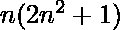

# 求第 N 组自然数的和

> 原文:[https://www . geesforgeks . org/find-n-th-sum-group-of-natural-numbers/](https://www.geeksforgeeks.org/find-sum-of-n-th-group-of-natural-numbers/)

给定一系列自然数，分成如下几组:(1，2)，(3，4，5，6)，(7，8，9，10，11，12)，(13，14，15，16，17，18，19，20)…..等等。给定一个数字 N，任务是找出第 N<sup>组中数字的和。</sup>

**示例:**

```
Input : N = 3
Output : 57
Numbers in 3rd group are:
7, 8, 9, 10, 11, 12

Input : N = 10 
Output : 2010 
```

第一组有 **2** 项，
第二组有 **4** 项，
。
。
。
第 n 组有 **2n** 个术语。
现在，
第一组的最后一个任期是 2 = 1 × (1 + 1)
第二组**的最后一个任期是 6 = 2 × (2 + 1)
第三组**的最后一个任期是 12 = 3 × (3 + 1)
第四组**的最后一个任期是 20 = 4 × (4 + 1)
。
。
第 n 组**最后一个学期= n(n + 1)** 。
因此**第 n 组**中的数字之和为:**

> =直到第**个组**的所有数字的总和-直到第**(n-1)个组**个组
> 的所有数字的总和=[1+2+……]..+n(n+1)]–[1+2+……..+(n–1)((n–1)+1)]
> =![\frac{n(n+1)[n(n+1)+1]}{2} - \frac {n(n-1)[n(n-1)+1]}{2}  ](img/d36211bdf4710180fcc2d67a6c2ff53c.png "Rendered by QuickLaTeX.com")
> =![\frac{n[(n+1)(n(n+1)+1)-(n-1)(n(n-1)+1)]}{2}  ](img/f029475e6c17ce6a5a96428704f136c1.png "Rendered by QuickLaTeX.com")
> =![\frac{n[n[(n+1)^{2} - (n-1)^{2}]+2]}{2}  ](img/4b16b7653490a83d9840c66a7a2529d7.png "Rendered by QuickLaTeX.com")
> =

以下是上述方法的实现:

## C++

```
// C++ program to find sum in Nth group
#include<bits/stdc++.h>
using namespace std;

//calculate sum of Nth group
int nth_group(int n){
     return n * (2 * pow(n, 2) + 1);
}

//Driver code
int main()
{

  int N = 5;
  cout<<nth_group(N);

  return 0;
}
```

## Java 语言(一种计算机语言，尤用于创建网站)

```
// Java program to find sum
// in Nth group
import java.util.*;

class GFG
{

// calculate sum of Nth group
static int nth_group(int n)
{
    return n * (2 * (int)Math.pow(n, 2) + 1);
}

// Driver code
public static void main(String arr[])
{
    int N = 5;
    System.out.println(nth_group(N));
}
}

// This code is contributed by Surendra
```

## 蟒蛇 3

```
# Python program to find sum in Nth group

# calculate sum of Nth group
def nth_group(n):
    return n * (2 * pow(n, 2) + 1)

# Driver code
N = 5
print(nth_group(N))
```

## C#

```
// C# program to find sum in Nth group

using System;

class gfg
{
 //calculate sum of Nth group
 public static double nth_group(int n)
 {
    return n * (2 * Math.Pow(n, 2) + 1);
 }

 //Driver code
 public static int Main()
 {
   int N = 5;
   Console.WriteLine(nth_group(N));
   return 0;
 }
}
// This code is contributed by Soumik
```

## 服务器端编程语言（Professional Hypertext Preprocessor 的缩写）

```
<?php
// PHP program to find sum
// in Nth group

// calculate sum of Nth group
function nth_group($n)
{
    return $n * (2 * pow($n, 2) + 1);
}

// Driver code
$N = 5;
echo nth_group($N);

// This code is contributed
// by jit_t
?>
```

## java 描述语言

```
<script>
    // Javascript program to find sum in Nth group

    //calculate sum of Nth group
    function nth_group(n)
    {
      return n * (2 * Math.pow(n, 2) + 1);
    }

   let N = 5;
   document.write(nth_group(N));

</script>
```

**Output:** 

```
255
```