# 求给定数列中数的乘积之和

> 原文:[https://www . geesforgeks . org/find-给定系列中产品数量的总和/](https://www.geeksforgeeks.org/find-sum-of-product-of-number-in-given-series/)

给定两个数字 **N** 和 **T** 其中，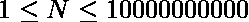和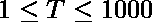。任务是找到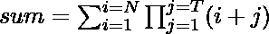的价值。
由于和可以很大，以 **10 <sup>9</sup> +7** 为模输出。
**示例:**

```
Input : 3 2
Output : 38
2*3 + 3*4 + 4*5 = 38

Input : 4 2
Output : 68
```

> 在给定的样本情况下 **n = 3** 和 **t = 2** 。
> 总和= **2*3+3*4+4*5** 。
> 注意:
> 
> 
> 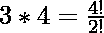
> 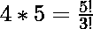

所以如果我们用 **t 乘和除，每个项都是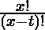
的形式！**就变成了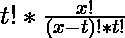
这无非就是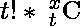
所以，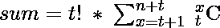
但是我们知道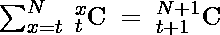
所以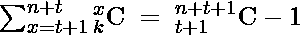
所以最终的表达式出来就是
但是由于 **n** 那么大我们不能直接计算出来，我们就要把上面的表达式简化一下。
关于简化，我们得到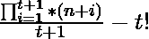。
以下是上述办法的实施情况

## C++

```
// C++ program to find sum of product
// of number in given series
#include <bits/stdc++.h>
using namespace std;

typedef long long ll;
const long long MOD = 1000000007;

// function to calculate (a^b)%p
ll power(ll x, unsigned long long y, ll p)
{
    ll res = 1; // Initialize result

    // Update x if it is more than or equal to p
    x = x % p;

    while (y > 0) {

        // If y is odd, multiply x with result
        if (y & 1)
            res = (res * x) % p;

        // y must be even now
        y = y >> 1; // y = y/2
        x = (x * x) % p;
    }

    return res;
}

// function to return required answer
ll sumProd(ll n, ll t)
{
    // modulo inverse of denominator
    ll dino = power(t + 1, MOD - 2, MOD);

    // calculating commentator part
    unsigned long long ans = 1;
    for (ll i = n + t + 1; i > n; --i)
        ans = (ans % MOD * i % MOD) % MOD;

    // calculating t!
    ll tfact = 1;
    for (int i = 1; i <= t; ++i)
        tfact = (tfact * i) % MOD;

    // accumulating the final answer
    ans = ans * dino - tfact + MOD;

    return ans % MOD;
}
int main()
{
    ll n = 3, t = 2;

    // function call to print required sum
    cout << sumProd(n, t);

    return 0;
}
```

## Java 语言(一种计算机语言，尤用于创建网站)

```
// Java program to find sum of product
// of number in given series

public class GFG {

     static long MOD = 1000000007;

    //function to calculate (a^b)%p
     static long power(long x, long y, long p)
     {
      long res = 1; // Initialize result

      // Update x if it is more than or equal to p
      x = x % p;

      while (y > 0) {

          // If y is odd, multiply x with result
          if ((y & 1)!= 0)
              res = (res * x) % p;

          // y must be even now
          y = y >> 1; // y = y/2
          x = (x * x) % p;
      }

      return res;
     }

     //function to return required answer
     static long sumProd(long n, long t)
     {
      // modulo inverse of denominator
      long dino = power(t + 1, MOD - 2, MOD);

      // calculating commentator part
      long ans = 1;
      for (long i = n + t + 1; i > n; --i)
          ans = (ans % MOD * i % MOD) % MOD;

      // calculating t!
      long tfact = 1;
      for (int i = 1; i <= t; ++i)
          tfact = (tfact * i) % MOD;

      // accumulating the final answer
      ans = ans * dino - tfact + MOD;

      return ans % MOD;
     }

     // Driver program
    public static void main(String[] args) {

        long n = 3, t = 2;

         // function call to print required sum
         System.out.println(sumProd(n, t));
    }
}
```

## 蟒蛇 3

```
# Python 3 program to find sum of product
# of number in given series

MOD = 1000000007

# function to calculate (a^b)%p
def power(x, y, p) :

    # Initialize result
    res = 1

    # Update x if it is more than or equal to p
    x = x % p

    # If y is odd, multiply x with result
    while y > 0 :

        if y & 1 :
            res = (res * x) % p

        #  y must be even now
        y = y >> 1 # y = y/2
        x = (x * x) % p

    return res

# function to return required answer
def sumProd(n, t) :

    # modulo inverse of denominator
    dino = power(t + 1, MOD - 2, MOD)

    ans = 1

    # calculating commentator part
    for i in range(n + t + 1 , n, -1) :
        ans = (ans % MOD * i % MOD) % MOD

    # calculating t!
    tfact = 1
    for i in range(1, t+1) :
        tfact = (tfact * i) % MOD

    # accumulating the final answer
    ans = ans * dino - tfact + MOD

    return ans % MOD

# Driver Code
if __name__ == "__main__" :

    n, t = 3, 2

    # function call to print required sum
    print(sumProd(n, t))

# This code is contributed by ANKITRAI1
```

## C#

```
// C# program to find sum of product
// of number in given series
using System;
class GFG
{
static long MOD = 1000000007;

// function to calculate (a^b)%p
static long power(long x, long y,
                  long p)
{
    long res = 1; // Initialize result

    // Update x if it is more
    // than or equal to p
    x = x % p;

    while (y > 0)
    {

        // If y is odd, multiply x
        // with result
        if ((y & 1) != 0)
            res = (res * x) % p;

        // y must be even now
        y = y >> 1; // y = y/2
        x = (x * x) % p;
    }

    return res;
}

// function to return required answer
static long sumProd(long n, long t)
{

// modulo inverse of denominator
long dino = power(t + 1, MOD - 2, MOD);

// calculating commentator part
long ans = 1;
for (long i = n + t + 1; i > n; --i)
    ans = (ans % MOD * i % MOD) % MOD;

// calculating t!
long tfact = 1;
for (int i = 1; i <= t; ++i)
    tfact = (tfact * i) % MOD;

// accumulating the final answer
ans = ans * dino - tfact + MOD;

return ans % MOD;
}

// Driver Code
public static void Main()
{
    long n = 3, t = 2;

    // function call to print required sum
    Console.WriteLine(sumProd(n, t));
}
}

// This code is contributed
// by Akanksha Rai(Abby_akku)
```

## 服务器端编程语言（Professional Hypertext Preprocessor 的缩写）

```
<?php
// PHP program to find sum of product
// of number in given series

// function to calculate (a^b)%p
function power($x, $y, $p)
{
    $res = 1; // Initialize result

    // Update x if it is more
    // than or equal to p
    $x = $x % $p;

    while ($y > 0)
    {

        // If y is odd, multiply
        // x with result
        if ($y & 1)
            $res = ($res * $x) % $p;

        // y must be even now
        $y = $y >> 1; // y = y/2
        $x = ($x * $x) % $p;
    }

    return $res;
}

// function to return required answer
function sumProd($n, $t)
{
    $MOD = 1000000007;

    // modulo inverse of denominator
    $dino = power($t + 1, $MOD - 2, $MOD);

    // calculating commentator part
    $ans = 1;
    for ($i = $n + $t + 1; $i > $n; --$i)
        $ans = ($ans % $MOD * $i %
                       $MOD) % $MOD;

    // calculating t!
    $tfact = 1;
    for ($i = 1; $i <= $t; ++$i)
        $tfact = ($tfact * $i) % $MOD;

    // accumulating the final answer
    $ans = $ans * $dino - $tfact + $MOD;

    return $ans % $MOD;
}

// Driver code
$n = 3;
$t = 2;

// function call to print
// required sum
echo sumProd($n, $t);

// This code is contributed
// by Shivi_Aggarwal
?>
```

## java 描述语言

```
<script>

// Javascript program to find sum of product
// of number in given series
var MOD = 100000007;

// function to calculate (a^b)%p
function power(x, y, p)
{
    var res = 1; // Initialize result

    // Update x if it is more than or equal to p
    x = x % p;

    while (y > 0) {

        // If y is odd, multiply x with result
        if (y & 1)
            res = (res * x) % p;

        // y must be even now
        y = y >> 1; // y = y/2
        x = (x * x) % p;
    }

    return res;
}

// function to return required answer
function sumProd(n, t)
{
    // modulo inverse of denominator
    var dino = power(t + 1, MOD - 2, MOD);

    // calculating commentator part
    var ans = 1;
    for (var i = n + t + 1; i > n; --i)
        ans = (ans % MOD * i % MOD) % MOD;

    // calculating t!
    var tfact = 1;
    for (var i = 1; i <= t; ++i)
        tfact = (tfact * i) % MOD;

    // accumulating the final answer
    ans = ans * dino - tfact + MOD;

    return ans % MOD;
}

var n = 3, t = 2;
// function call to print required sum
document.write( sumProd(n, t));

// This code is contributed by noob2000.
</script>
```

**输出:**

```
38
```

**时间复杂度:** O(T)