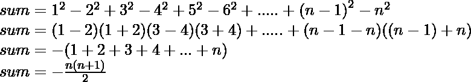

# 求系列 1^2-2^2+3^2-4^2 的和…..最新条款

> 原文:[https://www . geesforgeks . org/find-sum-of-series-12-22-32-42-up-n-terms/](https://www.geeksforgeeks.org/find-sum-of-series-12-22-32-42-upto-n-terms/)

给定一个数字 n，任务是找出以下级数的和，直到 n 个项:

> 1<sup>2</sup>–2<sup>2</sup>+3<sup>2</sup>–4<sup>2</sup>+…..

**例:**

```
Input: n = 2
Output: -3
Explanation: 
    sum = 12 - 22
    = 1 - 4
    = -3

Input: n = 3
Output: 6
Explanation: 
    sum = 12 - 22 + 32
    = 1 - 4 + 9
    = 6
```

### 天真的方法:

这个方法包括简单地运行 I 从 1 到 n 的循环，如果 I 是奇数，那么简单地把它的平方加到结果上，它是偶数，然后简单地把它的平方减去结果。
以下是上述方法的实现:

## C++

```
// C++ program to find sum of series
// 1^2 - 2^2 + 3^3 - 4^4 + ...

#include <bits/stdc++.h>
using namespace std;

// Function to find sum of series
int sum_of_series(int n)
{
    int result = 0;
    for (int i = 1; i <= n; i++) {

        // If i is even
        if (i % 2 == 0)
            result = result - pow(i, 2);

        // If i is odd
        else
            result = result + pow(i, 2);
    }

    // return the result
    return result;
}

// Driver Code
int main(void)
{

    // Get n
    int n = 3;

    // Find the sum
    cout << sum_of_series(n) << endl;

    // Get n
    n = 10;

    // Find the sum
    cout << sum_of_series(n) << endl;
}
```

## Java 语言(一种计算机语言，尤用于创建网站)

```
// Java Program to find sum of series
// 1^2 - 2^2 + 3^3 - 4^4 + ...
import java.util.*;
import java.lang.*;

class GFG
{
// Function to find sum of series
static int sum_of_series(int n)
{
    int result = 0;
    for (int i = 1; i <= n; i++)
    {

        // If i is even
        if (i % 2 == 0)
            result = result -
                    (int)Math.pow(i, 2);

        // If i is odd
        else
            result = result +
                    (int)Math.pow(i, 2);
    }

    // return the result
    return result;
}

// Driver Code
public static void main(String args[])
{

    // Get n
    int n = 3;

    // Find the sum
    System.out.println(sum_of_series(n));

    // Get n
    n = 10;

    // Find the sum
    System.out.println(sum_of_series(n));
}
}

// This code is contributed
// by Akanksha Rai(Abby_akku)
```

## 蟒蛇 3

```
# Python3 program to find sum of series
# 1^2 - 2^2 + 3^3 - 4^4 + ...

# Function to find sum of series
def sum_of_series(n):

    result = 0
    for i in range(1, n + 1) :

        # If i is even
        if (i % 2 == 0):
            result = result - pow(i, 2)

        # If i is odd
        else:
            result = result + pow(i, 2)

    # return the result
    return result

# Driver Code
if __name__ == "__main__":

    # Get n
    n = 3

    # Find the sum
    print(sum_of_series(n))

    # Get n
    n = 10

    # Find the sum
    print(sum_of_series(n))

# This code is contributed
# by ChitraNayal
```

## C#

```
// C# Program to find sum of series
// 1^2 - 2^2 + 3^3 - 4^4 + ...
using System;

class GFG
{
// Function to find sum of series
static int sum_of_series(int n)
{
    int result = 0;
    for (int i = 1; i <= n; i++)
    {

        // If i is even
        if (i % 2 == 0)
            result = result -
                    (int)Math.Pow(i, 2);

        // If i is odd
        else
            result = result +
                    (int)Math.Pow(i, 2);
    }

    // return the result
    return result;
}

// Driver Code
public static void Main()
{

    // Get n
    int n = 3;

    // Find the sum
    Console.WriteLine(sum_of_series(n));

    // Get n
    n = 10;

    // Find the sum
    Console.WriteLine(sum_of_series(n));
}
}

// This code is contributed
// by Akanksha Rai(Abby_akku)
```

## 服务器端编程语言（Professional Hypertext Preprocessor 的缩写）

```
<?php
// PHP program to find sum of series
// 1^2 - 2^2 + 3^3 - 4^4 + ...
// Function to find sum of series
function sum_of_series($n)
{
    $result = 0;
    for ($i = 1; $i <= $n; $i++)
    {

        // If i is even
        if ($i % 2 == 0)
            $result = $result - pow($i, 2);

        // If i is odd
        else
            $result = $result + pow($i, 2);
    }

    // return the result
    return $result;
}

// Driver Code

// Get n
$n = 3;

// Find the sum
echo sum_of_series($n),"\n";

// Get n
$n = 10;

// Find the sum
echo sum_of_series($n),"\n";

// This Code is Contributed by anuj_67
?>
```

## java 描述语言

```
<script>

// javascript Program to find sum of series
// 1^2 - 2^2 + 3^3 - 4^4 + ...

// Function to find sum of series
function sum_of_series(n)
{
    var result = 0;
    for (i = 1; i <= n; i++)
    {

        // If i is even
        if (i % 2 == 0)
            result = result -
                    parseInt(Math.pow(i, 2));

        // If i is odd
        else
            result = result +
                    parseInt(Math.pow(i, 2));
    }

    // return the result
    return result;
}

// Driver Code  

// Get n
var n = 3;

// Find the sum
document.write(sum_of_series(n)+ "<br>");

// Get n
n = 10;

// Find the sum
document.write(sum_of_series(n));

// This code is contributed by 29AjayKumar

</script>
```

**Output:** 

```
6
-55
```

**时间复杂度:**上述代码的复杂度为 O(n)。

### 高效方法

基于 n
T1 的条件，如果 n 为偶数:T3

> 

**如果 n 是奇数:**

> 

以下是上述方法的实现:

## C++

```
// C++ Program to find sum of series
// 1^2 - 2^2 +3^3 -4^4 + ...

#include <bits/stdc++.h>
using namespace std;

// Function to find sum of series
int sum_of_series(int n)
{
    int result = 0;

    // If n is even
    if (n % 2 == 0) {
        result = -(n * (n + 1)) / 2;
    }

    // If n is odd
    else {
        result = (n * (n + 1)) / 2;
    }

    // return the result
    return result;
}

// Driver Code
int main(void)
{

    // Get n
    int n = 3;

    // Find the sum
    cout << sum_of_series(n) << endl;

    // Get n
    n = 10;

    // Find the sum
    cout << sum_of_series(n) << endl;
}
```

## Java 语言(一种计算机语言，尤用于创建网站)

```
// Java Program to find sum of series
// 1^2 - 2^2 +3^3 -4^4 + ...
import java.util.*;
import java.lang.*;

class GFG
{
// Function to find sum of series
static int sum_of_series(int n)
{
    int result = 0;

    // If n is even
    if (n % 2 == 0)
    {
        result = -(n * (n + 1)) / 2;
    }

    // If n is odd
    else
    {
        result = (n * (n + 1)) / 2;
    }

    // return the result
    return result;
}

// Driver Code
public static void main(String args[])
{

    // Get n
    int n = 3;

    // Find the sum
    System.out.println(sum_of_series(n));

    // Get n
    n = 10;

    // Find the sum
    System.out.println(sum_of_series(n));
}
}

// This code is contributed
// by Akanksha Rai(Abby_akku)
```

## 蟒蛇 3

```
# Python3 Program to find sum of series
# 1^2 - 2^2 +3^3 -4^4 + ...

# Function to find sum of series
def sum_of_series(n) :

    result = 0

    # If n is even
    if (n % 2 == 0) :
        result = -(n * (n + 1)) // 2

    # If n is odd
    else :
        result = (n * (n + 1)) // 2

    # return the result
    return result

# Driver Code
if __name__ == "__main__" :

    # Get n
    n = 3

    # Find the sum
    print(sum_of_series(n))

    # Get n
    n = 10

    # Find the sum
    print(sum_of_series(n))

# This code is contributed by Ryuga
```

## C#

```
// C# Program to find sum of series
// 1^2 - 2^2 +3^3 -4^4 + ...

using System;

class GFG
{
// Function to find sum of series
static int sum_of_series(int n)
{
    int result = 0;

    // If n is even
    if (n % 2 == 0)
    {
        result = -(n * (n + 1)) / 2;
    }

    // If n is odd
    else
    {
        result = (n * (n + 1)) / 2;
    }

    // return the result
    return result;
}

// Driver Code
public static void Main()
{

    // Get n
    int n = 3;

    // Find the sum
    Console.WriteLine(sum_of_series(n));

    // Get n
    n = 10;

    // Find the sum
    Console.WriteLine(sum_of_series(n));
}
}

// This code is contributed
// by Akanksha Rai(Abby_akku)
```

## 服务器端编程语言（Professional Hypertext Preprocessor 的缩写）

```
<?php
// PHP program to find sum of series
// 1^2 - 2^2 +3^3 -4^4 + ...

// Function to find sum of series
function sum_of_series($n)
{
    $result = 0;

    // If n is even
    if ($n % 2 == 0)
    {
        $result = -($n * ($n + 1)) / 2;
    }

    // If n is odd
    else
    {
        $result = ($n * ($n + 1)) / 2;
    }

    // return the result
    return $result;
}

// Driver Code

// Get n
$n = 3;

// Find the sum
echo sum_of_series($n);
echo ("\n");

// Get n
$n = 10;

// Find the sum
echo sum_of_series($n);
echo ("\n");

// Get n
$n = 10;

// This code is contributed
// by Shivi_Aggarwal
?>
```

## java 描述语言

```
<script>
// Javascript Program to find sum of series
// 1^2 - 2^2 +3^3 -4^4 + ...

    // Function to find sum of series
    function sum_of_series( n) {
        let result = 0;

        // If n is even
        if (n % 2 == 0) {
            result = -(n * (n + 1)) / 2;
        }

        // If n is odd
        else {
            result = (n * (n + 1)) / 2;
        }

        // return the result
        return result;
    }

    // Driver Code

        // Get n
        let n = 3;

        // Find the sum
        document.write(sum_of_series(n)+"<br/>");

        // Get n
        n = 10;

        // Find the sum
        document.write(sum_of_series(n));

// This code is contributed by 29AjayKumar 
</script>
```

**Output:** 

```
6
-55
```