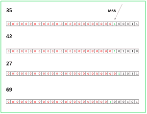

# 求给定数组中所有无序对的 XNOR 之和

> 原文:[https://www . geeksforgeeks . org/find-sum-of-xnor-of-all-unordered-pairs-from-the-forced-array/](https://www.geeksforgeeks.org/find-sum-of-xnor-of-all-unordered-pairs-from-given-array/)

给定一个大小为 **N** 的[数组](https://www.geeksforgeeks.org/array-data-structure/) **arr[]** ，任务是从给定数组中找到所有可能无序对的所有 [XNOR](https://www.geeksforgeeks.org/xnor-two-numbers/) 值的和。

**示例:**

> **输入** : N = 5，arr[] = {2，2，2，1，1}
> **输出** :10
> **解释**:这里，
> 2 XNOR 2 = 3，2 XNOR 2 = 3，2 XNOR 2 = 3，1 XNOR 1 = 1，2 XNOR 1 = 0，2 XNOR 1 = 0，2 XNOR 1 = 0，2 XNOR 1 = 0，2 XNOR 1 = 0，2 XNOR 1 = 0，因此和为 3+3+3
> 
> **输入** : N = 3，arr[] = {1，2，3}
> **输出** : 3
> **解释**:这里，1 XNOR 2 = 0，1 XNOR 3 = 1，2 XNOR 3 = 2。因此总和是 0+1+2 = 3

**方法:**在 [XNOR](https://www.geeksforgeeks.org/xnor-two-numbers/) 操作后，一个位设置**的唯一可能情况是两个**位**必须是相同的**。按照以下步骤解决问题:****

*   **保持一个大小为 30 的位数组。**左起第 0 个**位置表示 **2^29** 包含在二进制表示&中，**左起第 29 个**位置表示 **2^0** 包含在二进制表示中。**
*   **对于每个元素，如果第位的**被**设置为**，则**增加位阵列的第**位置。****
*   **遇到包含**“1”**的 **MSB** 后，计算“0”和“1”位。**
*   **直到遇到一个**“1”**位，所有的**“0”**位都将被浪费掉。分开存放。**
*   **最后，假设第一个位置有 y 个 1。因此，对于具有 **(1，1)** 位组合的 ith 位，存在 **y*(y-1)/2** 对，其给出结果 **1** 为 **XNOR** 。同样，假设直到相同的位置有 **x 个零**。因此，对于具有 **(0，0)** 位组合的 ith 位，存在 **y*(y-1)/2** 对，其给出的结果 **1** 为 **XNOR** 。**
*   **现在对于**前导零**的情况，将**浪费的**比特数乘以 **0 比特数**。对每个位位置做这个并计算答案。**

**为了更好地理解，考虑数组{35，42，27，69} **。**这里是数组所有四个元素的二进制表示。**

**

数组元素的二进制表示。** 

*   **带箭头的一位是该元素的第一位，即 1。因此它是该元素的[最高有效位](https://www.geeksforgeeks.org/find-significant-set-bit-number/)。类似地，所有其他元素的 **MSB** 被着色为**绿色**。**
*   **出现在 MSB 前的零是**浪费的位**，用**红**着色。这些二进制数组的大小各为 30。**
*   **在比特数组的前 23 个位置中，**浪费的** **比特的数量**为**四**，而 **1 的数量**为**零**，而 **0 的数量**为**零**，如图所示。**
*   **在第 24 个位置，**浪费的比特**是 **3** ，并且 **1 的**的数量将是 **1** ，因为在元素 69 的第 24 个元素处遇到了 MSB。**

> **第 23 位:**浪费位数** : 4、**1 位** : 0、**0 位** : 0
> 第 24 位:**浪费位数** : 3、**1 位** : 1、**0 位** : 0
> 第 25 位:**浪费位数** : 1、 ****0 的数量** : 1(因为它发生在 MSB 之后)
> 第 26 位:**浪费位的数量** : 0、**1 的数量** : 1、**0 的数量:** 3
> 第 27 位:**浪费位的数量** : 0、**1 的数量** : 2、**数量 **0 号** : 3
> 第 29 位:**废位数量** : 0、**1 号** : 3、**0 号** : 1
> 第 30 位:**废位数量** : 0、**1 号** : 3、**0 号********

*   现在在这些位中的每一个位中，对于任一对位中的 [XNOR](https://www.geeksforgeeks.org/xnor-two-numbers/) 值为 **1** ，或者**两个**都应为 **1** ，或者**两个**都应为 **0** 。
*   **对于两者都应该是 1** ，它有 **N[i]*(N[i]-1)/2** 对，其中 **N[i]** 是所有元素中第一个位置的 1 的个数。
*   同样，两者的**都应该是 0** ，它有 **M[i]*(M[i]-1)/2** 对，其中 **M[i]** 是所有元素中第一个位置的 0 的个数。因为要求的答案是所有可能性的总和。因此，对于带有位的**，为所有可能的对添加 **2^(30-i-1)** 。**
*   如果两者都为 0，还应考虑**浪费位**，这发生在任何元素在浪费位的相同位置具有 0(非浪费)的情况下。让浪费的比特成为 **W【我】**。
*   所以总和=**(n[i]*(n[i]-1)/2)*(2^(30-i-1)+(m[i]*(m[i]-1)/2)*(2^(30-i-1)+(w[i]*m[i]*(2^(30-i-1)))**其中 0 < = i < =30。
*   所以，对于上面的例子，直到第 23 位，一切都是 0。这里列出了从第 24 位开始。
*   total =**((1*0)/2)*(2^6)+((0*(-1))/2)*(2^6)+3*0*(2^6)+((2*1)/2)*(2^5)+((1*0)/2)*(2^5)+1*1*(2^5)+((1*0)/2)*(2^4)+((3*2)/2)*(2^4)+0 * 3 *(2 4)+((2 * 1)/2)*(2 3)+((2 * 1)/2)*(2 3)+0 * 2 *(2 3)+((1 * 0)/2)*(2)+((3 * 2)/2)*(2)+0 * 3 *(2)+(3 * 2)/2)**
*   总计= 0+0+0+32+0+32+0+48+0+8+8+0+0+12+0+6+0+0+3+0+0
*   因此，总和= 149

下面是上述方法的实现。

## 蟒蛇 3

```
# Python program for the above approach

# Function to find the required sum

def findSum(n, r):

    # Store the result
    result = 0

    # bits[i][0] and bits[i][1] has
    # count of all 1's and 0's in the
    # ith bit of all elements respectively
    # bits[i][2] has count of wasted zeroes
    # of ith bit for all elements
    bits = [[0, 0, 0] for i in range(30)]

    # Iterating through all elements
    for i in r:

        # Converting element to binary
        binary = bin(i)[2:]

        # zfill adds zeros to the front
        binary = binary.zfill(30)

        # Flag variable set to 1 after
        # first occurence of 1 (MSB)
        flag = 0

        # Iterating through all the bits
        for j in range(30):
            # If msb not found
            if(flag == 0):

                # Msb found
                if(binary[j] == '1'):

                    # Set flag to 1
                    flag = 1

                    # Incrementing number
                    # of 1's in jth bit
                    bits[j][0] += 1

                # If msb not found yet
                else:
                    # Incrementing number of
                    # wasted zeroes before msb
                    bits[j][2] += 1

                # Continue till msb is encountered
                continue

            # Incrementing number
            # of 1's in jth bit
            if(binary[j] == '1'):
                bits[j][0] += 1

            # Incrementing number
            # of 0's in jth bit
            else:
                bits[j][1] += 1

    # Iterating through all bits
    for i in range(30):

        # Total number of 1's in
        # ith bit of all elements
        y = bits[i][0]

        # Total number of 0's in
        # ith bit of all elements
        x = bits[i][1]

        # Total number of wasted 0's
        # before msb of ith bit of all elements
        msboff = bits[i][2]

        # y*(y-1)/2 pairs for ith bit has (1, 1)
        # bit combo which gives result 1 in XNOR
        onePairs = (y*(y-1))//2

        # Adding value of ith
        # bit number of (1, 1) pairs
        # times to result
        # (2^(30-i-1) => 2 ^ 29, 2 ^ 28 etc.
        result += onePairs * pow(2, 30-i-1)

        # x*(x-1)/2 pairs for ith bit has (0, 0)
        # bit combo which gives result 1 in XNOR
        zeroPairs = ((x*(x-1))//2)

        # Adding value of ith bit
        # number of (0, 0) pairs
        # times to result
        # (2^(30-i-1) => 2 ^ 29, 2 ^ 28 etc.)
        result += zeroPairs * pow(2, 30-i-1)

        # Same for leading zeroes
        result += (msboff * x)*pow(2, 30-i-1)

    return result

# Driver code
if __name__ == '__main__':
    n = 5
    r = [2, 2, 2, 1, 1]
    print(findSum(n, r))
```

## java 描述语言

```
<script>
    // JavaScript program for the above approach

    // Function to find the required sum
    const findSum = (n, r) => {

        // Store the result
        let result = 0;

        // bits[i][0] and bits[i][1] has
        // count of all 1's and 0's in the
        // ith bit of all elements respectively
        // bits[i][2] has count of wasted zeroes
        // of ith bit for all elements
        let bits = new Array(30).fill(0).map(() => new Array(3).fill(0));
        // Iterating through all elements
        for (let i in r) {

            // Converting element to binary
            let binary = Number(r[i]).toString(2);
            binary = binary.split("");
            while (binary.length < 30) {
                binary.unshift('0');
            }
            // Flag variable set to 1 after
            // first occurence of 1 (MSB)
            let flag = 0;

            // Iterating through all the bits
            for (let j = 0; j < 30; j++) {
                // If msb not found
                if (flag == 0) {

                    // Msb found
                    if (binary[j] == '1') {

                        // Set flag to 1
                        flag = 1;

                        // Incrementing number
                        // of 1's in jth bit
                        bits[j][0] += 1;
                    }

                    // If msb not found yet
                    else
                        // Incrementing number of
                        // wasted zeroes before msb
                        bits[j][2] += 1;

                    // Continue till msb is encountered
                    continue;
                }

                // Incrementing number
                // of 1's in jth bit
                if (binary[j] == '1')
                    bits[j][0] += 1;

                // Incrementing number
                // of 0's in jth bit
                else
                    bits[j][1] += 1;
            }
        }
        // document.write(`${bits}<br/>`)
        // Iterating through all bits
        for (let i = 0; i < 30; i++) {

            // Total number of 1's in
            // ith bit of all elements
            let y = bits[i][0];

            // Total number of 0's in
            // ith bit of all elements
            let x = bits[i][1];

            // Total number of wasted 0's
            // before msb of ith bit of all elements
            let msboff = bits[i][2];

            // y*(y-1)/2 pairs for ith bit has (1, 1)
            // bit combo which gives result 1 in XNOR
            let onePairs = (y * (y - 1)) / 2;
            // Adding value of ith
            // bit number of (1, 1) pairs
            // times to result
            // (2^(30-i-1) => 2 ^ 29, 2 ^ 28 etc.
            result += onePairs * Math.pow(2, 30 - i - 1);

            // x*(x-1)/2 pairs for ith bit has (0, 0)
            // bit combo which gives result 1 in XNOR
            let zeroPairs = (x * (x - 1)) / 2;

            // Adding value of ith bit
            // number of (0, 0) pairs
            // times to result
            // (2^(30-i-1) => 2 ^ 29, 2 ^ 28 etc.)
            result += zeroPairs * Math.pow(2, 30 - i - 1);

            // Same for leading zeroes
            result += (msboff * x) * Math.pow(2, 30 - i - 1);
        }

        return result;
    }

    // Driver code
    let n = 5;
    let r = [2, 2, 2, 1, 1];
    document.write(findSum(n, r));

// This code is contributed by rakeshsahni

</script>
```

**Output**

```
10
```

***时间复杂度*** : O(30*N)
***辅助空间:*** O(1)