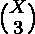

# 求数组所有无序三元组的异或之和

> 原文:[https://www . geeksforgeeks . org/find-所有无序数组三元组的异或之和/](https://www.geeksforgeeks.org/find-sum-of-xor-of-all-unordered-triplets-of-the-array/)

给定一个由 N 个非负整数组成的数组 A，求该数组所有无序三元组的异或之和。对于无序三元组，三元组(A[i]，A[j]，A[k])被认为与三元组(A[j]，A[i]，A[k])和所有其他排列相同。
既然答案可以大，那就计算它的 mod 到 10037。

**示例:**

```
Input : A = [3, 5, 2, 18, 7]
Output : 132

Input : A = [140, 1, 66]
Output : 207 
```

**天真方法**
迭代所有无序的三元组，并将每个三元组的异或相加。

**高效方法**

*   需要注意的一点是 xor 独立于所有的位。因此，我们可以对每一位单独进行所需的计算。
*   让我们考虑所有数组元素的第 k 位。如果无序三元组的数量是第 k 位 xor 1 be C，我们可以简单地将 C * 2 <sup>k</sup> 加到答案中。设第 k 位为 1 的元素个数为 X，第 k 位为 0 的元素个数为 y，然后找出第 k 位异或为 1 的无序三元组，可以用两种情况形成:
    1.  三个元素中只有一个有第 k 位 1。
    2.  他们三个都有第 k 位 1。
*   选择第 k 位为 1 的 3 个元素的方式数= 
*   用第 k 位 1 选择 1 个元素，用 0 休息的方式数= 
*   我们将使用 [nCr mod p](https://www.geeksforgeeks.org/compute-ncr-p-set-3-using-fermat-little-theorem/) 来计算组合函数值。

下面是上述方法的实现。

## C++

```
// C++ program to find sum of xor of
// all unordered triplets of the array
#include <bits/stdc++.h>

using namespace std;

// Iterative Function to calculate
// (x^y)%p in O(log y)
int power(int x, int y, int p)
{
    // Initialize result
    int res = 1;

    // Update x if it is more than or
    // equal to p
    x = x % p;

    while (y > 0)
    {
        // If y is odd, multiply x
        // with result
        if (y & 1)
            res = (res * x) % p;

        // y must be even now
        y = y >> 1; // y = y/2
        x = (x * x) % p;
    }
    return res;
}

// Returns n^(-1) mod p
int modInverse(int n, int p)
{
    return power(n, p - 2, p);
}

// Returns nCr % p using Fermat's little
// theorem.
int nCrModPFermat(int n, int r, int p)
{
    // Base case
    if (r == 0)
        return 1;
    if (n < r)
        return 0;

    // Fill factorial array so that we
    // can find all factorial of r, n
    // and n-r
    int fac[n + 1];
    fac[0] = 1;
    for (int i = 1; i <= n; i++)
        fac[i] = fac[i - 1] * i % p;

    return (fac[n] * modInverse(fac[r], p) % p
            * modInverse(fac[n - r], p) % p) % p;
}

// Function returns sum of xor of all
// unordered triplets of the array
int SumOfXor(int a[], int n)
{

    int mod = 10037;

    int answer = 0;

    // Iterating over the bits
    for (int k = 0; k < 32; k++)
    {
        // Number of elements whith k'th bit
        // 1 and 0 respectively
        int x = 0, y = 0;

        for (int i = 0; i < n; i++)
        {
            // Checking if k'th bit is 1
            if (a[i] & (1 << k))
                x++;
            else
                y++;
        }
        // Adding this bit's part to the answer
        answer += ((1 << k) % mod *
                (nCrModPFermat(x, 3, mod)
                    + x * nCrModPFermat(y, 2, mod))
                % mod) % mod;
    }
    return answer;
}
// Drivers code
int main()
{
    int n = 5;
    int A[n] = { 3, 5, 2, 18, 7 };

    cout << SumOfXor(A, n);

    return 0;
}
```

## Java 语言(一种计算机语言，尤用于创建网站)

```
// Java program to find sum of xor of
// all unordered triplets of the array
class GFG{

// Iterative Function to calculate
// (x^y)%p in O(log y)
static int power(int x, int y, int p)
{

    // Initialize result
    int res = 1;

    // Update x if it is more than or
    // equal to p
    x = x % p;

    while (y > 0)
    {

        // If y is odd, multiply x
        // with result
        if ((y & 1) == 1)
            res = (res * x) % p;

        // y must be even now
        y = y >> 1; // y = y/2
        x = (x * x) % p;
    }
    return res;
}

// Returns n^(-1) mod p
static int modInverse(int n, int p)
{
    return power(n, p - 2, p);
}

// Returns nCr % p using Fermat's little
// theorem.
static int nCrModPFermat(int n, int r, int p)
{

    // Base case
    if (r == 0)
        return 1;
    if (n < r)
        return 0;

    // Fill factorial array so that we
    // can find all factorial of r, n
    // and n-r
    int fac[] = new int[n + 1];
    fac[0] = 1;
    for(int i = 1; i <= n; i++)
        fac[i] = fac[i - 1] * i % p;

    return (fac[n] * modInverse(fac[r], p) % p *
                     modInverse(fac[n - r], p) %
                                            p) % p;
}

// Function returns sum of xor of all
// unordered triplets of the array
static int SumOfXor(int a[], int n)
{

    int mod = 10037;
    int answer = 0;

    // Iterating over the bits
    for(int k = 0; k < 32; k++)
    {

        // Number of elements whith k'th bit
        // 1 and 0 respectively
        int x = 0, y = 0;

        for(int i = 0; i < n; i++)
        {

            // Checking if k'th bit is 1
            if ((a[i] & (1 << k)) != 0)
                x++;
            else
                y++;
        }
        // Adding this bit's part to the answer
        answer += ((1 << k) % mod *
                   (nCrModPFermat(x, 3, mod) + x *
                    nCrModPFermat(y, 2, mod)) %
                                        mod) % mod;
    }
    return answer;
}

// Driver code
public static void main(String[] args)
{
    int n = 5;
    int A[] = { 3, 5, 2, 18, 7 };

    System.out.println(SumOfXor(A, n));
}
}

// This code is contributed by jrishabh99
```

## 蟒蛇 3

```
# Python3 program to find sum of xor of
# all unordered triplets of the array

# Iterative Function to calculate
# (x^y)%p in O(log y)
def power(x, y, p):

    # Initialize result
    res = 1

    # Update x if it is more than or
    # equal to p
    x = x % p

    while (y > 0):
        # If y is odd, multiply x
        # with result
        if (y & 1):
            res = (res * x) % p

        # y must be even now
        y = y >> 1#y = y/2
        x = (x * x) % p
    return res

# Returns n^(-1) mod p
def modInverse(n, p):
    return power(n, p - 2, p)

# Returns nCr % p using Fermat's little
# theorem.
def nCrModPFermat(n, r, p):

    # Base case
    if (r == 0):
        return 1
    if (n < r):
        return 0

    # Fill factorial array so that we
    # can find all factorial of r, n
    # and n-r
    fac = [0]*(n + 1)
    fac[0] = 1
    for i in range(1, n + 1):
        fac[i] = fac[i - 1] * i % p

    return (fac[n] * modInverse(fac[r], p) % p *
            modInverse(fac[n - r], p) % p) % p

# Function returns sum of xor of all
# unordered triplets of the array
def SumOfXor(a, n):

    mod = 10037

    answer = 0

    # Iterating over the bits
    for k in range(32):

        # Number of elements whith k'th bit
        # 1 and 0 respectively
        x = 0
        y = 0

        for i in range(n):

            # Checking if k'th bit is 1
            if (a[i] & (1 << k)):
                x += 1
            else:
                y += 1
        # Adding this bit's part to the answer
        answer += ((1 << k) % mod * (nCrModPFermat(x, 3, mod)
                    + x * nCrModPFermat(y, 2, mod))
                % mod) % mod

    return answer

# Drivers code
if __name__ == '__main__':
    n = 5
    A=[3, 5, 2, 18, 7]

    print(SumOfXor(A, n))

# This code is contributed by mohit kumar 29
```

## C#

```
// C# program to find sum of xor of
// all unordered triplets of the array
using System;
class GFG{

// Iterative Function to calculate
// (x^y)%p in O(log y)
static int power(int x, int y, int p)
{

    // Initialize result
    int res = 1;

    // Update x if it is more than or
    // equal to p
    x = x % p;

    while (y > 0)
    {

        // If y is odd, multiply x
        // with result
        if ((y & 1) == 1)
            res = (res * x) % p;

        // y must be even now
        y = y >> 1; // y = y/2
        x = (x * x) % p;
    }
    return res;
}

// Returns n^(-1) mod p
static int modInverse(int n, int p)
{
    return power(n, p - 2, p);
}

// Returns nCr % p using Fermat's little
// theorem.
static int nCrModPFermat(int n, int r, int p)
{

    // Base case
    if (r == 0)
        return 1;
    if (n < r)
        return 0;

    // Fill factorial array so that we
    // can find all factorial of r, n
    // and n-r
    int []fac = new int[n + 1];
    fac[0] = 1;
    for(int i = 1; i <= n; i++)
        fac[i] = fac[i - 1] * i % p;

    return (fac[n] * modInverse(fac[r], p) % p *
                     modInverse(fac[n - r], p) %
                                            p) % p;
}

// Function returns sum of xor of all
// unordered triplets of the array
static int SumOfXor(int []a, int n)
{
    int mod = 10037;
    int answer = 0;

    // Iterating over the bits
    for(int k = 0; k < 32; k++)
    {

        // Number of elements whith k'th bit
        // 1 and 0 respectively
        int x = 0, y = 0;

        for(int i = 0; i < n; i++)
        {

            // Checking if k'th bit is 1
            if ((a[i] & (1 << k)) != 0)
                x++;
            else
                y++;
        }
        // Adding this bit's part to the answer
        answer += ((1 << k) % mod *
                   (nCrModPFermat(x, 3, mod) + x *
                    nCrModPFermat(y, 2, mod)) %
                                        mod) % mod;
    }
    return answer;
}

// Driver code
public static void Main(String[] args)
{
    int n = 5;
    int []A = { 3, 5, 2, 18, 7 };

    Console.WriteLine(SumOfXor(A, n));
}
}

// This code is contributed by gauravrajput1
```

## java 描述语言

```
<script>

// Javascript program to find sum of xor of
// all unordered triplets of the array

// Iterative Function to calculate
// (x^y)%p in O(log y)
function power(x, y, p)
{

    // Initialize result
    let res = 1;

    // Update x if it is more than or
    // equal to p
    x = x % p;

    while (y > 0)
    {

        // If y is odd, multiply x
        // with result
        if ((y & 1) == 1)
            res = (res * x) % p;

        // y must be even now
        y = y >> 1; // y = y/2
        x = (x * x) % p;
    }
    return res;
}

// Returns n^(-1) mod p
function modInverse(n, p)
{
    return power(n, p - 2, p);
}

// Returns nCr % p using Fermat's little
// theorem.
function nCrModPFermat(n, r, p)
{

    // Base case
    if (r == 0)
        return 1;
    if (n < r)
        return 0;

    // Fill factorial array so that we
    // can find all factorial of r, n
    // and n-r
    let fac = Array.from({length: n+1}, (_, i) => 0);
    fac[0] = 1;
    for(let i = 1; i <= n; i++)
        fac[i] = fac[i - 1] * i % p;

    return (fac[n] * modInverse(fac[r], p) % p *
                     modInverse(fac[n - r], p) %
                                            p) % p;
}

// Function returns sum of xor of all
// unordered triplets of the array
function SumOfXor(a, n)
{

    let mod = 10037;
    let answer = 0;

    // Iterating over the bits
    for(let k = 0; k < 32; k++)
    {

        // Number of elements whith k'th bit
        // 1 and 0 respectively
        let x = 0, y = 0;

        for(let i = 0; i < n; i++)
        {

            // Checking if k'th bit is 1
            if ((a[i] & (1 << k)) != 0)
                x++;
            else
                y++;
        }
        // Adding this bit's part to the answer
        answer += ((1 << k) % mod *
                   (nCrModPFermat(x, 3, mod) + x *
                    nCrModPFermat(y, 2, mod)) %
                                        mod) % mod;
    }
    return answer;
}

// Driver Code

    let n = 5;
    let A = [ 3, 5, 2, 18, 7 ];

    document.write(SumOfXor(A, n));

</script>
```

**Output:** 

```
132
```

**时间复杂度:** O(32 * N)