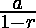
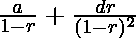

# 数列 M/1+(M+P)/2+(M+2 * P)/4+(M+3 * P)/8 的和……直到无穷大

> 原文:[https://www . geesforgeks . org/find-sum-series-m-1-MP2-m2p 4-m3p 8-infinite/](https://www.geeksforgeeks.org/find-sum-series-m-1-mp2-m2p4-m3p8-infinite/)

求数列 M/1+(M+P)/2+(M+2 * P)/4+(M+3 * P)/8……直到无穷的和，其中 M 和 P 是正整数。

示例:

```
Input : M = 0, P = 3; 
Output : 6

Input : M = 2, P = 9;
Output : 22
```

**方法:**
**S = M/1+(M+P)/2+(M+2 * P)/4+(M+3 * P)/8……直到无穷**
所以这个系列的解会是这样的
我们要把这个系列分成两部分-
S =(M/1+M/2+M/4+M/8……直到无穷)+ ( p/2 + (2*p)/4 + (3*p)/8 + …。高达无限)
我们来考虑一下
**S = A + B ……..等式(1)**
其中，
A = M/1+M/2+M/4+M/8……直到无穷大
A = M *(1+1/2+1/4+1/8……。直到无限)
是 r = 1/2 的无限项的 G . P；
根据无限项的 G.P 和公式为 r < 1 而
a 为第一项，r 为公比所以现在，
A = M *(1/(1–1/2))
A = 2 * M；

**现在为 B–**
B =(p/2+(2 * p)/4+(3 * p)/8+…。直到无限)
B = P/2 *(1+2 *(1/2)+3 *(1/4)+……直到无限)
它是 a = 1，r = 1/2，d = 1 的无限项 AGP 之和；
根据公式其中 a 为第一项，
r 为公比，d 为公差所以现在，
b = p/2 *(1/(1-1/2)+(1 * 1/2)/(1-1/2)^2)
b = p/2 * 4
b = 2 * p；
将 A 和 B 的值放入等式(1)
**S = 2(M + P)**

## C++

```
#include <iostream>
using namespace std;

int sum(int M, int P)
{
    return 2*(M + P);
}

// driver code
int main() {

    int M = 2, P = 9;   
    cout << sum(M,P);   
    return 0;
}
```

## Java 语言(一种计算机语言，尤用于创建网站)

```
// Java Program to finding the
// sum of the series
import java.io.*;

class GFG {

    // function that calculate
    // the sum of the nth series
    static int sum_series(int M, int P)
    {
        return 2 * (M + P);
    }

    // Driver function
    public static void main (String[] args)
    {
        int M = 2;
        int P = 9;
        System.out.println( sum_series(M, P)) ;
    }
}
```

## 蟒蛇 3

```
# Python3 Program to finding
# the sum of the  series

# function that calculate
# the sum of the  series
def sum_series(M, P):

    return int(2 * (M + P))

# Driver function
M = 2
P = 9
print(sum_series(M ,P))
```

## C#

```
// C# program to finding the
// sum of the series
using System;

class GFG {

    // Function that calculate
    // the sum of the nth series
    static int sum_series(int M, int P)
    {
        return 2*(M + P);
    }

    // Driver Code
    public static void Main ()
    {
        int M =2;
        int P =9;

        Console.Write( sum_series(M,P)) ;
    }
}
```

## 服务器端编程语言（Professional Hypertext Preprocessor 的缩写）

```
<?php
// PHP program to finding the
// sum of the series

// Function that calculate
// the sum of the nth series
function sum($M, $P)
{
    return 2*($M + $P);
}

// Driver Code
$M = 2;
$P = 9;
echo sum($M, $P);

// This code is contributed by mits
?>
```

## java 描述语言

```
<script>

// JavaScript program to finding the
// sum of the series

// Function that calculate
// the sum of the nth series
function sum_series(M, P)
{
    return 2 * (M + P);
}

// Driver code
let M = 2;
let P = 9;

document.write( sum_series(M, P));

// This code is contributed by splevel62

</script>
```

**Output:** 

```
22
```