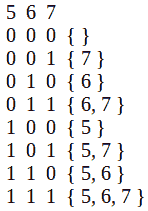

# 求所有子序列之和的和

> 原文:[https://www.geeksforgeeks.org/find-sum-sum-sub-sequences/](https://www.geeksforgeeks.org/find-sum-sum-sub-sequences/)

给定一组 **n 个**整数。任务是找到数组中每个子序列的和。
**例:**

```
Input : arr[] = { 6, 8, 5 }
Output : 76
All subsequence sum are:
{ 6 }, sum = 6
{ 8 }, sum = 8
{ 5 }, sum = 5
{ 6, 8 }, sum = 14
{ 6, 5 }, sum = 11
{ 8, 5 }, sum = 13
{ 6, 8, 5 }, sum = 19
Total sum = 76.

Input  : arr[] = {1, 2}
Output : 6
```

**方法一(蛮力):**
[生成所有子序列](https://www.geeksforgeeks.org/subarraysubstring-vs-subsequence-and-programs-to-generate-them/)，求每个子序列的和。
**方法 2(有效方法):**
对于大小为 n 的数组，我们总共有 2^n 子序列(包括空的)。观察总共 2 个 <sup>n</sup> 子序列，每个元素出现 2 个 <sup>n-1 个</sup>次。
例如，arr[] = { 5，6，7 }



所以，所有子序列的和将是(所有元素的和)* 2 <sup>n-1</sup> 。
以下是本办法的实施情况:

## C++

```
// C++ program to find sum of all sub-sequences
// of an array.
#include<bits/stdc++.h>
using namespace std;

// Return sum of sum of all sub-sequence.
int sum(int arr[], int n)
{
  int ans = 0;

  // Finding sum of the array.
  for (int i = 0; i < n; i++)
    ans += arr[i];

  return ans * pow(2, n - 1);
}

// Driver Code
int main()
{
  int arr[] = { 6, 7, 8 };
  int n = sizeof(arr)/sizeof(arr[0]);

  cout << sum(arr, n) << endl;

  return 0;
}
```

## Java 语言(一种计算机语言，尤用于创建网站)

```
// Java program to find sum of
// all sub-sequences of an array.
import java.io.*;
import java.math.*;

class GFG {

    // Return sum of sum of all sub-sequence.
    static int sum(int arr[], int n)
    {
    int ans = 0;

    // Finding sum of the array.
    for (int i = 0; i < n; i++)
        ans += arr[i];

    return ans * (int)(Math.pow(2, n - 1));
    }

    // Driver Code
    public static void main(String args[])
    {
    int arr[]= { 6, 7, 8 };
    int n = arr.length;

    System.out.println(sum(arr, n));
    }
}

// This code is contributed by Nikita Tiwari.
```

## 蟒蛇 3

```
# Python 3 program to find sum of
# all sub-sequences of an array.

# Return sum of sum of all sub-sequence.
def sm(arr , n) :
    ans = 0

    # Finding sum of the array.
    for i in range(0, n) :
        ans = ans + arr[i]

    return ans * pow(2, n - 1)

# Driver Code
arr = [ 6, 7, 8 ]
n=len(arr)

print(sm(arr, n))

# This code is contributed by Nikita Tiwari.
```

## C#

```
// C# program to find sum of
// all sub-sequences of an array.
using System;

class GFG
{

    // Return sum of sum of all sub-sequence.
    static int sum(int []arr, int n)
    {
    int ans = 0;

    // Finding sum of the array.
    for (int i = 0; i < n; i++)
        ans += arr[i];

    return ans * (int)(Math.Pow(2, n - 1));
    }

    // Driver Code
    public static void Main()
    {
    int []arr= { 6, 7, 8 };
    int n = arr.Length;

    Console.Write(sum(arr, n));
    }
}

// This code is contributed by nitin mittal
```

## 服务器端编程语言（Professional Hypertext Preprocessor 的缩写）

```
<?php
// PHP program to find sum of
// all sub-sequences of an array.

// Return sum of sum of
// all sub-sequence.
function sum($arr, $n)
{
    $ans = 0;

    // Finding sum of the array.
    for ($i = 0; $i < $n; $i++)
        $ans += $arr[$i];

    return $ans * pow(2, $n - 1);
}

// Driver Code
$arr = array(6, 7, 8);
$n = sizeof($arr);
echo sum($arr, $n) ;

// This code is contributed by nitin mittal.
?>
```

## java 描述语言

```
<script>

// JavaScript program to find sum of all sub-sequences
// of an array.

// Return sum of sum of all sub-sequence.
function sum(arr, n)
{
  var ans = 0;

  // Finding sum of the array.
  for (var i = 0; i < n; i++)
    ans += arr[i];

  return ans * Math.pow(2, n - 1);
}

// Driver Code
var arr = [6, 7, 8];
var n = arr.length;
document.write( sum(arr, n));

</script>
```

**输出:**

```
84
```

本文由 **Anuj Chauhan** 供稿。如果你喜欢 GeeksforGeeks 并想投稿，你也可以使用[write.geeksforgeeks.org](https://write.geeksforgeeks.org)写一篇文章或者把你的文章邮寄到 review-team@geeksforgeeks.org。看到你的文章出现在极客博客主页上，帮助其他极客。
如果你发现任何不正确的地方，或者你想分享更多关于上面讨论的话题的信息，请写评论。