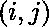

# 求三维图形的表面积

> 原文:[https://www.geeksforgeeks.org/find-surface-area-3d-figure/](https://www.geeksforgeeks.org/find-surface-area-3d-figure/)

给定一个代表三维图形的 N*M 矩阵 A[][]。处建筑高度为![A[i][j]  ](img/d83103f2678027d5742c9f3b09f29be5.png "Rendered by QuickLaTeX.com")。求图的表面积。
**例:**

```
Input : N = 1, M = 1   A[][] = { {1} }
Output : 6

Explanation : 
The total surface area is 6 i.e 6 side of 
the figure and each are of height 1.

Input : N = 3, M = 3   A[][] = { {1, 3, 4},
                                 {2, 2, 3},
                                 {1, 2, 4} }
Output : 60
```

**方法:**为了找到表面积，我们需要考虑给定三维图形的所有六个边的贡献。我们将部分地解决这些问题以使它变得容易。图形的底部将始终为图形的总表面积贡献 N*M，而相同的 N*M 面积将由图形的顶部贡献。现在，为了计算墙贡献的面积，我们将取出两个相邻墙的高度之间的绝对差。差异将是总表面积的贡献。
以下是上述思路的实现:

## C++

```
// CPP program to find the Surface area of a 3D figure
#include <bits/stdc++.h>
using namespace std;

// Declaring the size of the matrix
const int M = 3;
const int N = 3;

// Absolute Difference between the height of
// two consecutive blocks
int contribution_height(int current, int previous)
{
    return abs(current - previous);
}

// Function To calculate the Total surfaceArea.
int surfaceArea(int A[N][M])
{
    int ans = 0;

    // Traversing the matrix.
    for (int i = 0; i < N; i++) {
        for (int j = 0; j < M; j++) {

            /* If we are traveling the topmost row in the
            matrix, we declare the wall above it as 0
            as there is no wall above it. */
            int up = 0;

            /* If we are traveling the leftmost column in the
            matrix, we declare the wall left to it as 0
            as there is no wall left it. */
            int left = 0;

            // If its not the topmost row
            if (i > 0)
                up = A[i - 1][j];

            // If its not the leftmost column
            if (j > 0)
                left = A[i][j - 1];

            // Summing up the contribution of by
            // the current block
            ans += contribution_height(A[i][j], up)
                    + contribution_height(A[i][j], left);

            /* If its the rightmost block of the matrix
               it will contribute area equal to its height
               as a wall on the right of the figure */
            if (i == N - 1)
                ans += A[i][j];

            /* If its the lowest block of the matrix it will
               contribute area equal to its height as a wall
               on the bottom of the figure */
            if (j == M - 1)
                ans += A[i][j];
        }
    }

    // Adding the contribution by the base and top of the figure
    ans += N * M * 2;
    return ans;
}

// Driver program
int main()
{
    int A[N][M] = { { 1, 3, 4 },
                    { 2, 2, 3 },
                    { 1, 2, 4 } };
    cout << surfaceArea(A) << endl;
    return 0;
}
```

## Java 语言(一种计算机语言，尤用于创建网站)

```
// Java program to find the Surface
// area of a 3D figure

class GFG
{
    // Declaring the size of the matrix
    static final int M=3;
    static final int N=3;

    // Absolute Difference between the height of
    // two consecutive blocks
    static int contribution_height(int current, int previous)
    {
        return Math.abs(current - previous);
    }

    // Function To calculate the Total surfaceArea.
    static int surfaceArea(int A[][])
    {
        int ans = 0;

        // Traversing the matrix.
        for (int i = 0; i < N; i++)
        {
            for (int j = 0; j < M; j++) {

                /* If we are traveling the topmost
                row in the matrix, we declare the
                wall above it as 0 as there is no
                wall above it. */
                int up = 0;

                /* If we are traveling the leftmost
                column in the matrix, we declare the
                wall left to it as 0as there is no
                wall left it. */
                int left = 0;

                // If its not the topmost row
                if (i > 0)
                    up = A[i - 1][j];

                // If its not the leftmost column
                if (j > 0)
                    left = A[i][j - 1];

                // Summing up the contribution of by
                // the current block
                ans += contribution_height(A[i][j], up)
                       + contribution_height(A[i][j], left);

                /* If its the rightmost block of the matrix
                it will contribute area equal to its height
                as a wall on the right of the figure */
                if (i == N - 1)
                    ans += A[i][j];

                /* If its the lowest block of the
                matrix it will contribute area equal
                to its height as a wall on
                 the bottom of the figure */
                if (j == M - 1)
                    ans += A[i][j];
            }
        }

        // Adding the contribution by
        // the base and top of the figure
        ans += N * M * 2;
        return ans;
    }

    // Driver code
    public static void main (String[] args)
    {
        int A[][] = {{ 1, 3, 4 },
                     { 2, 2, 3 },
                     { 1, 2, 4 } };
        System.out.println(surfaceArea(A));
    }
}

// This code is contributed By Anant Agarwal.
```

## 蟒蛇 3

```
# Python3 program to find the
# Surface area of a 3D figure

# Declaring the size
# of the matrix
M = 3;
N = 3;

# Absolute Difference
# between the height of
# two consecutive blocks
def contribution_height(current, previous):
    return abs(current - previous);

# Function To calculate
# the Total surfaceArea.
def surfaceArea(A):
    ans = 0;

    # Traversing the matrix.
    for i in range(N):
        for j in range(M):

            # If we are traveling the
            # topmost row in the matrix,
            # we declare the wall above it
            # as 0 as there is no wall
            # above it.
            up = 0;

            # If we are traveling the
            # leftmost column in the
            # matrix, we declare the wall
            # left to it as 0 as there is
            # no wall left it.
            left = 0;

            # If its not the topmost row
            if (i > 0):
                up = A[i - 1][j];

            # If its not the
            # leftmost column
            if (j > 0):
                left = A[i][j - 1];

            # Summing up the
            # contribution of by
            # the current block
            ans += contribution_height(A[i][j], up)+contribution_height(A[i][j], left);

            # If its the rightmost block
            # of the matrix it will contribute
            # area equal to its height as a
            # wall on the right of the figure */
            if (i == N - 1):
                ans += A[i][j];

            # If its the lowest block
            # of the matrix it will
            # contribute area equal to
            # its height as a wall on
            # the bottom of the figure
            if (j == M - 1):
                ans += A[i][j];

    # Adding the contribution by
    # the base and top of the figure
    ans += N * M * 2;
    return ans;

# Driver Code
A = [[1, 3, 4],[2, 2, 3],[1, 2, 4]];
print(surfaceArea(A));

# This code is contributed By mits
```

## C#

```
// C# program to find the
// Surface area of a 3D figure
using System;

class GFG
{
    // Declaring the size of the matrix
    static int M=3;
    static int N=3;

    // Absolute Difference between the
    // height of two consecutive blocks
    static int contribution_height(int current, int previous)
    {
        return Math.Abs(current - previous);
    }

    // Function To calculate the
    // Total surfaceArea.
    static int surfaceArea(int [,]A)
    {
        int ans = 0;

    // Traversing the matrix.
        for (int i = 0; i < N; i++)
        {
            for (int j = 0; j < M; j++) {

    // If we are traveling the topmost
    // row in the matrix, we declare the
    // wall above it as 0 as there is no
    // wall above it.
                int up = 0;

    // If we are traveling the leftmost
    // column in the matrix, we declare
    // the wall left to it as 0as there
    // is no wall left it.
                int left = 0;

    // If its not the topmost row
                if (i > 0)
                    up = A[i - 1,j];

    // If its not the leftmost column
                if (j > 0)
                    left = A[i,j - 1];

    // Summing up the contribution 
    // of by the current block
            ans += contribution_height(A[i,j], up)
                + contribution_height(A[i,j], left);

    // If its the rightmost block of the
    // matrix it will contribute area equal
    // to its height as a wall on the right
    // of the figure
                if (i == N - 1)
                    ans += A[i,j];

    // If its the lowest block of the
    // matrix it will contribute area 
    // equal to its height as a wall
    // on the bottom of the figure
                if (j == M - 1)
                    ans += A[i,j];
            }
        }

    // Adding the contribution by the
    // base and top of the figure
        ans += N * M * 2;
        return ans;
    }

    // Driver code
    public static void Main ()
    {
        int [,]A = {{ 1, 3, 4 },
                    { 2, 2, 3 },
                    { 1, 2, 4 } };
        Console.WriteLine(surfaceArea(A));
    }
}

// This code is contributed By vt_m.
```

## 服务器端编程语言（Professional Hypertext Preprocessor 的缩写）

```
<?php
// PHP program to find the
// Surface area of a 3D figure

// Declaring the size
// of the matrix
$M = 3;
$N = 3;

// Absolute Difference
// between the height of
// two consecutive blocks
function contribution_height($current,
                             $previous)
{
    return abs($current - $previous);
}

// Function To calculate
// the Total surfaceArea.
function surfaceArea($A)
{
    global $M;
    global $N;
    $ans = 0;

    // Traversing the matrix.
    for ($i = 0; $i < $N; $i++)
    {
        for ($j = 0; $j < $M; $j++)
        {

            /* If we are traveling the
            topmost row in the matrix,
            we declare the wall above it
            as 0 as there is no wall
            above it. */
            $up = 0;

            /* If we are traveling the
            leftmost column in the
            matrix, we declare the wall
            left to it as 0 as there is
            no wall left it. */
            $left = 0;

            // If its not the topmost row
            if ($i > 0)
                $up = $A[$i - 1][$j];

            // If its not the
            // leftmost column
            if ($j > 0)
                $left = $A[$i][$j - 1];

            // Summing up the
            // contribution of by
            // the current block
            $ans += contribution_height($A[$i][$j], $up) +
                    contribution_height($A[$i][$j], $left);

            /* If its the rightmost block
            of the matrix it will contribute
            area equal to its height as a
            wall on the right of the figure */
            if ($i == $N - 1)
                $ans += $A[$i][$j];

            /* If its the lowest block
               of the matrix it will
               contribute area equal to
               its height as a wall on
               the bottom of the figure */
            if ($j == $M - 1)
                $ans += $A[$i][$j];
        }
    }

    // Adding the contribution by
    // the base and top of the figure
    $ans += $N * $M * 2;
    return $ans;
}

// Driver Code
$A = array(array(1, 3, 4),
           array(2, 2, 3),
           array(1, 2, 4));
echo surfaceArea($A);

// This code is contributed By mits
?>
```

## java 描述语言

```
<script>

// JavaScript program to find the Surface
// area of a 3D figure

// Declaring the size of the matrix
    let M=3;
    let N=3;

    // Absolute Difference between the height of
    // two consecutive blocks
    function contribution_height(current, previous)
    {
        return Math.abs(current - previous);
    }

    // Function To calculate the Total surfaceArea.
    function surfaceArea( A)
    {
        let ans = 0;

        // Traversing the matrix.
        for (let i = 0; i < N; i++)
        {
            for (let j = 0; j < M; j++) {

                /* If we are traveling the topmost
                row in the matrix, we declare the
                wall above it as 0 as there is no
                wall above it. */
                let up = 0;

                /* If we are traveling the leftmost
                column in the matrix, we declare the
                wall left to it as 0as there is no
                wall left it. */
                let left = 0;

                // If its not the topmost row
                if (i > 0)
                    up = A[i - 1][j];

                // If its not the leftmost column
                if (j > 0)
                    left = A[i][j - 1];

                // Summing up the contribution of by
                // the current block
                ans += contribution_height(A[i][j], up)
                       + contribution_height(A[i][j], left);

                /* If its the rightmost block of the matrix
                it will contribute area equal to its height
                as a wall on the right of the figure */
                if (i == N - 1)
                    ans += A[i][j];

                /* If its the lowest block of the
                matrix it will contribute area equal
                to its height as a wall on
                 the bottom of the figure */
                if (j == M - 1)
                    ans += A[i][j];
            }
        }

        // Adding the contribution by
        // the base and top of the figure
        ans += N * M * 2;
        return ans;
    }

// Driver code

        let A = [[ 1, 3, 4 ],
                     [ 2, 2, 3 ],
                     [ 1, 2, 4 ]];
        document.write(surfaceArea(A));

</script>
```

**输出:**

```
60
```