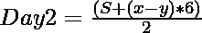

# 用给定的总和和平均值

求缺失天数的温度

> 原文:[https://www . geeksforgeeks . org/find-缺少天数的温度-使用给定的总和和平均值/](https://www.geeksforgeeks.org/find-temperature-of-missing-days-using-given-sum-and-average/)

给定整数 **x** 和 **y** ，分别表示除了**第 1 天**和**第 2 天**之外的一周平均温度，**第 1 天**和**第 2 天**的温度之和为 **S** ，任务是找出**第 1 天**和**第 2 天**的温度。
**例:**

> **输入:** x = 15，y = 10，S = 50
> **输出:** Day1 = 10，Day2 = 40
> **说明:**
> 剔除 Day1 的一周平均值为 15，剔除 Day2 的一周平均值为 10，Day1 和 Day2 的温度之和为 50。两天的个体温度分别为 10°和 40°。
> **输入:** x = 5，y = 10，s = 40
> **输出:** Day1 = 35，Day2 = 5
> **说明:**
> 剔除 Day1 的一周平均值为 5，剔除 Day2 的一周平均值为 10，Day1 和 Day2 的温度之和为 40。两天的个体温度分别为 35°和 5°。

**方法:**我们知道**平均值=所有观测值之和/观测总数。**因此，观测之和=平均*观测次数，即 **S = A * n**

> 所以在排除第一天或第二天之后，我们只剩下 6 天了
> ，所以 N = 6，等式是:
> 
> 
> 
> 和
> 
> 
> 
> 减去上面两个方程，我们得到
> 
> 
> 
> (等式 1)
> 问题陈述中给出
> 
> 
> 
> (等式 2)

求解上述两个方程，第 1 天和第 2 天的值由下式给出:

> [特克斯]第 1 天=第 2 天[/特克斯]

以下是上述方法的实现:

## C++

```
// C++ program for the above approach

#include <bits/stdc++.h>
using namespace std;

// Function for finding the temperature
void findTemperature(int x, int y, int s)
{
    double Day1, Day2;

    // Store Day1 - Day2 in diff
    double diff = (x - y) * 6;

    Day2 = (diff + s) / 2;

    // Remaining from s will be Day1
    Day1 = s - Day2;

    // Print Day1 and Day2
    cout << "Day1 : " << Day1 << endl;
    cout << "Day2 : " << Day2 << endl;
}

// Driver Code
int main()
{
    int x = 5, y = 10, s = 40;

    // Functions
    findTemperature(x, y, s);

    return 0;
}
```

## Java 语言(一种计算机语言，尤用于创建网站)

```
// Java program for the above approach
class GFG{

// Function for finding the temperature
static void findTemperature(int x, int y, int s)
{
    double Day1, Day2;

    // Store Day1 - Day2 in diff
    double diff = (x - y) * 6;

    Day2 = (diff + s) / 2;

    // Remaining from s will be Day1
    Day1 = s - Day2;

    // Print Day1 and Day2
    System.out.println( "Day1 : " + Day1);
    System.out.println( "Day2 : " + Day2);
}

// Driver Code
public static void main(String[] args)
{
    int x = 5, y = 10, s = 40;

    // Functions
    findTemperature(x, y, s);
}
}

// This code is contributed by rock_cool
```

## 计算机编程语言

```
# Python3 program for the above approach

# Function for finding the temperature
def findTemperature(x, y, s):

    # Store Day1 - Day2 in diff
    diff = (x - y) * 6
    Day2 = (diff + s) // 2

    # Remaining from s will be Day1
    Day1 = s - Day2

    # Print Day1 and Day2
    print("Day1 : ", Day1)
    print("Day2 : ", Day2)

# Driver Code
if __name__ == '__main__':
    x = 5
    y = 10
    s = 40

    # Functions
    findTemperature(x, y, s)

# This code is contributed by Mohit Kumar
```

## C#

```
// C# program for the above approach
using System;
class GFG{

// Function for finding the temperature
static void findTemperature(int x, int y, int s)
{
    double Day1, Day2;

    // Store Day1 - Day2 in diff
    double diff = (x - y) * 6;

    Day2 = (diff + s) / 2;

    // Remaining from s will be Day1
    Day1 = s - Day2;

    // Print Day1 and Day2
    Console.Write( "Day1 : " + Day1 + '\n');
    Console.WriteLine( "Day2 : " + Day2 + '\n');
}

// Driver Code
public static void Main(string[] args)
{
    int x = 5, y = 10, s = 40;

    // Functions
    findTemperature(x, y, s);
}
}

// This code is contributed by Ritik Bansal
```

## java 描述语言

```
<script>

    // Javascript program for the above approach

    // Function for finding the temperature
    function findTemperature(x, y, s)
    {
        let Day1, Day2;

        // Store Day1 - Day2 in diff
        let diff = (x - y) * 6;

        Day2 = (diff + s) / 2;

        // Remaining from s will be Day1
        Day1 = s - Day2;

        // Print Day1 and Day2
        document.write("Day1 : " + Day1 + "</br>");
        document.write("Day2 : " + Day2 + "</br>");
    }

    let x = 5, y = 10, s = 40;

    // Functions
    findTemperature(x, y, s);

</script>
```

**Output:** 

```
Day1 : 35
Day2 : 5
```

**时间复杂度:***O(1)*
T5】辅助空间: *O(1)*