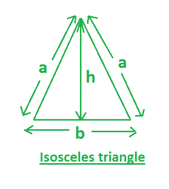
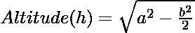

# 求等腰三角形的高度和面积

> 原文:[https://www . geesforgeks . org/find-等腰三角形的高度和面积/](https://www.geeksforgeeks.org/find-the-altitude-and-area-of-an-isosceles-triangle/)

给定等腰三角形的边 **(a)** 。任务是找到区域**(甲)**和高度**(乙)**。等腰三角形是两条等长边和两条等内角相邻的三角形。



**在此图中，**
**a-** 等腰三角形等边的度量。
**b-** 等腰三角形的底边。
**h-** 等腰三角形的高度。

**示例:**

```
Input: a = 2, b = 3
Output: altitude = 1.32, area = 1.98

Input: a = 5, b = 6
Output: altitude = 4, area = 12
```

**公式:**下面是等腰三角形的高度和面积的公式。

[Tex]面积(A)= \ frac { 1 } { 2 } \倍 b \倍 h [/Tex]

下面是使用上述公式的实现:

## C++

```
// CPP program to find the Altitude
// Area of an isosceles triangle
#include <bits/stdc++.h>
using namespace std;

// function to find the altitude
float altitude(float a, float b)
{
    // return altitude
    return sqrt(pow(a, 2) - (pow(b, 2) / 4));
}

// function to find the area
float area(float b, float h)
{

    // return area
    return (1 * b * h) / 2;
}

// Driver code
int main()
{

    float a = 2, b = 3;
    float h = altitude(a, b);
    cout << setprecision(3);
    cout << "Altitude= " << h << ", ";

    cout << "Area= " << area(b, h);
    return 0;
}
```

## Java 语言(一种计算机语言，尤用于创建网站)

```
// Java program to find the Altitude
// Area of an isosceles triangle

import java.io.*;

class GFG {

    // function to find the altitude
    static float altitude(float a, float b)
    {
        // return altitude
        return (float)(Math.sqrt(Math.pow(a, 2)
                                 - (Math.pow(b, 2) / 4)));
    }

    // function to find the area
    static float area(float b, float h)
    {

        // return area
        return (1 * b * h) / 2;
    }

    // Driver Code

    public static void main(String[] args)
    {
        float a = 2, b = 3;
        float h = altitude(a, b);
        System.out.print("Altitude= " + h + ", ");

        System.out.print("Area= " + area(b, h));
    }
}
// This code is contributed by  inder_verma.
```

## 蟒蛇 3

```
# Python 3 program to find
# the Altitude Area of an
# isosceles triangle
import math

# function to find the altitude

def altitude(a, b):

    # return altitude
    return math.sqrt(pow(a, 2) -
                     (pow(b, 2) / 4))

# function to find the area

def area(b, h):

    # return area
    return (1 * b * h) / 2

# Driver Code
if __name__ == "__main__":

    a = 2
    b = 3
    h = altitude(a, b)
    print("Altitude = " +
          str(round(h, 3)), end=", ")

    print("Area = " +
          str(round(area(b, h), 3)))

# This code is contributed
# by ChitraNayal
```

## C#

```
// C# program to find the Altitude
// Area of an isosceles triangle
using System;

class GFG {

    // function to find the altitude
    static float altitude(float a, float b)
    {
        // return altitude
        return (float)(Math.Sqrt(Math.Pow(a, 2)
                                 - (Math.Pow(b, 2) / 4)));
    }

    // function to find the area
    static float area(float b, float h)
    {

        // return area
        return (1 * b * h) / 2;
    }

    // Driver Code
    public static void Main()
    {
        float a = 2, b = 3;
        float h = altitude(a, b);
        Console.WriteLine("Altitude = " + h + ", ");

        Console.WriteLine("Area = " + area(b, h));
    }
}

// This code is contributed
// by inder_verma
```

## 服务器端编程语言（Professional Hypertext Preprocessor 的缩写）

```
<?php
// PHP program to find the Altitude
// Area of an isosceles triangle

// function to find the altitude
function altitude($a, $b)
{
    // return altitude
    return sqrt(pow($a, 2) -
               (pow($b, 2) / 4));
}

// function to find the area
function area($b, $h)
{

    // return area
    return (1 * $b * $h) / 2;
}

// Driver Code
$a = 2; $b = 3;
$h = altitude($a, $b);

echo "Altitude = " , $h , ", ";

echo "Area = " , area($b, $h);

// This code is contributed
// by anuj_67
?>
```

## java 描述语言

```
<script>

// Javascript program to find the Altitude
// Area of an isosceles triangle

// function to find the altitude
function altitude(a,b)
{
    // return altitude
    return Math.sqrt(Math.pow(a, 2) - (Math.pow(b, 2) / 4));
}

// function to find the area
function area( b, h)
{

    // return area
    return (1 * b * h) / 2;
}

// Driver code
let a = 2, b = 3;
    let h = altitude(a, b);
    document.write("Altitude= " + h.toFixed(2) + ", ");

    document.write( "Area= " + area(b, h).toFixed(2));

// This code contributed by aashish1995

</script>
```

**Output**

```
Altitude= 1.32, Area= 1.98
```

**时间复杂度:**O(log n)
T3】辅助空间: O(1)