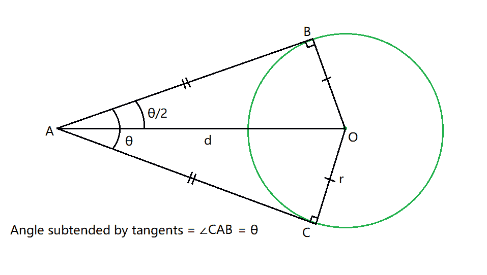
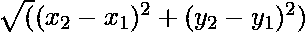
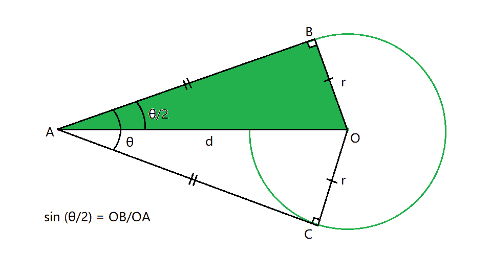
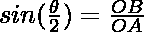
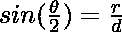
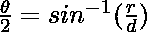
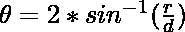

# 求出从给定外部点到圆的切线之间的角度

> 原文:[https://www . geeksforgeeks . org/find-从给定的外部点到圆绘制的切线之间的角度/](https://www.geeksforgeeks.org/find-the-angle-between-tangents-drawn-from-a-given-external-point-to-a-circle/)

给定一个正整数 **R** 代表圆的半径和圆的[中心](https://www.geeksforgeeks.org/find-center-circle-using-endpoints-diameter/) **(X1，Y1)** 以及笛卡尔平面中的另一个点 **(X2，Y2)** ，任务是找出从点 **(X2，Y2)** 到圆的一对切线之间的夹角。

[](https://media.geeksforgeeks.org/wp-content/uploads/20210425233803/Interceptofline.png)

**示例:**

> **输入:** R = 6，(X1，Y1) = (5，1)，(X2，Y2) = (6，9)
> **输出:** 96.1851
> 
> **输入:** R = 4，(X1，Y1) = (7，12)，(X2，Y2) = (3，4)
> **输出:** 53.1317

**方法:**给定的问题可以基于以下观察来解决:

*   半径与切线和圆的接触点处的切线成 **90 度**的角度。此外，由一对切线(θ) 对着的**角被连接圆心和外点的线平分。**
*   因此，中心和外部点之间的距离可以使用距离公式计算如下:

> 距离= 

> [](https://media.geeksforgeeks.org/wp-content/uploads/20210425220820/Interceptofline.png)
> 
> 现在，考虑 d 是两个给定点之间的距离，然后在直角三角形中，OAB，
> 
> => 
> 
> => 
> 
> => 
> 
> => 

因此，使用上述公式，可以计算从点 **(X2，Y2)** 到圆的一对切线之间的角度。

下面是上述方法的实现:

## C++

```
// C++ program for the above approach

#include <cmath>
#include <iostream>
using namespace std;

// Function to find the distance between
// center and the exterior point
double point_distance(int x1, int y1,
                      int x2, int y2)
{
    // Find the difference between
    // the x and y coordinates
    int p = (x2 - x1);
    int q = (y2 - y1);

    // Using the distance formula
    double distance = sqrt(p * p
                           + q * q);

    return distance;
}

// Function to find the angle between
// the pair of tangents drawn from the
// point (X2, Y2) to the circle.
void tangentAngle(int x1, int y1,
                  int x2, int y2,
                  double radius)
{
    // Calculate the distance between
    // the center and exterior point
    double distance = point_distance(
        x1, y1, x2, y2);

    // Invalid Case
    if (radius / distance > 1
        || radius / distance < -1) {
        cout << -1;
    }

    // Find the angle using the formula
    double result
        = 2 * asin(radius / distance) * 180
          / 3.1415;

    // Print the resultant angle
    cout << result << " degrees";
}

// Driver Code
int main()
{
    int radius = 4;
    int x1 = 7, y1 = 12;
    int x2 = 3, y2 = 4;
    tangentAngle(x1, y1, x2, y2, radius);

    return 0;
}
```

## Java 语言(一种计算机语言，尤用于创建网站)

```
// java program for the above approach
import java.io.*;
import java.lang.*;
import java.util.*;

class GFG
{

// Function to find the distance between
// center and the exterior point
static double point_distance(int x1, int y1,
                      int x2, int y2)
{
    // Find the difference between
    // the x and y coordinates
    int p = (x2 - x1);
    int q = (y2 - y1);

    // Using the distance formula
    double distance = Math.sqrt(p * p
                           + q * q);

    return distance;
}

// Function to find the angle between
// the pair of tangents drawn from the
// point (X2, Y2) to the circle.
static void tangentAngle(int x1, int y1,
                  int x2, int y2,
                  double radius)
{

    // Calculate the distance between
    // the center and exterior point
    double distance = point_distance(
        x1, y1, x2, y2);

    // Invalid Case
    if (radius / distance > 1
        || radius / distance < -1) {
         System.out.println(-1);
    }

    // Find the angle using the formula
    double result
        = 2 * Math.asin(radius / distance) * 180
          / 3.1415;

    // Print the resultant angle
    System.out.println(String.format("%.4f", result) + " degrees");
}

    // Driver Code
    public static void main(String[] args)
    {

    int radius = 4;
    int x1 = 7, y1 = 12;
    int x2 = 3, y2 = 4;
    tangentAngle(x1, y1, x2, y2, radius);
    }
}

// This code is contributed by susmitakundugoaldanga.
```

## 蟒蛇 3

```
# Python 3 program for the above approach
import math

# Function to find the distance between
# center and the exterior point
def point_distance(x1, y1,
                   x2,  y2):

    # Find the difference between
    # the x and y coordinates
    p = (x2 - x1)
    q = (y2 - y1)

    # Using the distance formula
    distance = math.sqrt(p * p
                         + q * q)

    return distance

# Function to find the angle between
# the pair of tangents drawn from the
# point (X2, Y2) to the circle.
def tangentAngle(x1,  y1,
                 x2,  y2,
                 radius):

    # Calculate the distance between
    # the center and exterior point
    distance = point_distance(
        x1, y1, x2, y2)

    # Invalid Case
    if (radius / distance > 1
            or radius / distance < -1):
        print(-1)

    # Find the angle using the formula
    result = 2 * math.asin(radius / distance) * 180 / 3.1415

    # Print the resultant angle
    print(result, " degrees")

# Driver Code
if __name__ == "__main__":

    radius = 4
    x1 = 7
    y1 = 12
    x2 = 3
    y2 = 4
    tangentAngle(x1, y1, x2, y2, radius)

    # This code is contributed by ukasp.
```

## C#

```
// C# program for the above approach
using System;

class GFG{

// Function to find the distance between
// center and the exterior point
static double point_distance(int x1, int y1,
                             int x2, int y2)
{

    // Find the difference between
    // the x and y coordinates
    int p = (x2 - x1);
    int q = (y2 - y1);

    // Using the distance formula
    double distance = Math.Sqrt(p * p + q * q);

    return distance;
}

// Function to find the angle between
// the pair of tangents drawn from the
// point (X2, Y2) to the circle.
static void tangentAngle(int x1, int y1, int x2,
                         int y2, double radius)
{

    // Calculate the distance between
    // the center and exterior point
    double distance = point_distance(x1, y1, x2, y2);

    // Invalid Case
    if (radius / distance > 1 ||
        radius / distance < -1)
    {
        Console.WriteLine(-1);
    }

    // Find the angle using the formula
    double result = 2 * Math.Asin(
               radius / distance) *
                  180 / 3.1415;

    // Print the resultant angle
    Console.WriteLine(
        String.Format("{0:0.0000}", result) +
                      " degrees");
}

// Driver code
static void Main()
{
    int radius = 4;
    int x1 = 7, y1 = 12;
    int x2 = 3, y2 = 4;

    tangentAngle(x1, y1, x2, y2, radius);
}
}

// This code is contributed by abhinavjain194
```

## java 描述语言

```
<script>

// JavaScript program for the above approach

// Function to find the distance between
// center and the exterior point
function  point_distance( x1,  y1, x2,  y2)
{

    // Find the difference between
    // the x and y coordinates
    var p = (x2 - x1);
    var q = (y2 - y1);

    // Using the distance formula
    var distance = Math.sqrt(p * p + q * q);

    return distance;
}

// Function to find the angle between
// the pair of tangents drawn from the
// point (X2, Y2) to the circle.

function tangentAngle( x1,  y1,  x2, y2,  radius)
{

    // Calculate the distance between
    // the center and exterior point
    var distance = point_distance(x1, y1, x2, y2);

    // Invalid Case
    if (radius / distance > 1 ||
        radius / distance < -1)
    {
        document.write(-1 + "<br>");
    }

    // Find the angle using the formula
    var result = 2 * Math.asin(
               radius / distance) *
                  180 / 3.1415;

    // Print the resultant angle
    document.write( result.toFixed(4) + " degrees");

}

// Driver code

    var radius = 4;
    var x1 = 7, y1 = 12;
    var x2 = 3, y2 = 4;

    tangentAngle(x1, y1, x2, y2, radius);

</script>
```

**Output:** 

```
53.1317 degrees
```

***时间复杂度:**O(1)*
T5**辅助空间:** O(1)