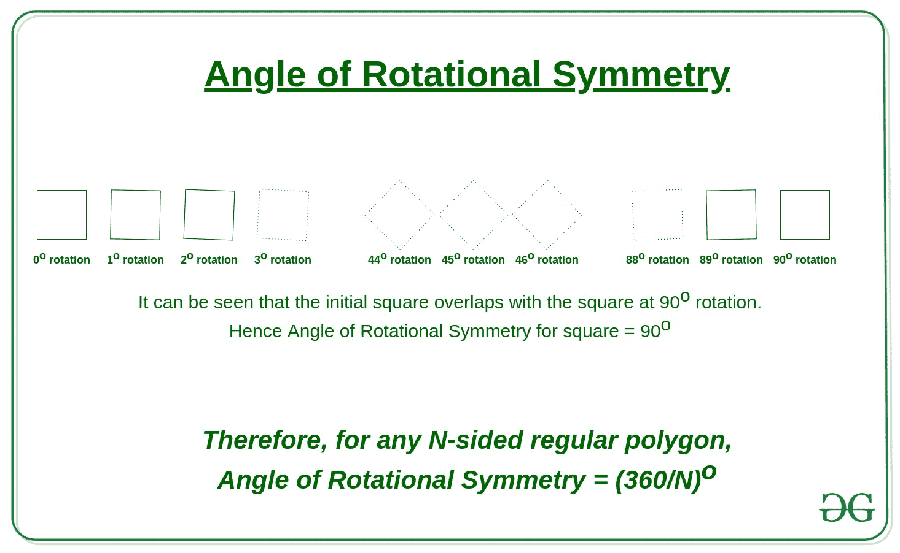

# 求 N 边正多边形的旋转对称角

> 原文:[https://www . geesforgeks . org/find-n 边正多边形的旋转对称角/](https://www.geeksforgeeks.org/find-the-angle-of-rotational-symmetry-of-an-n-sided-regular-polygon/)

给定一个整数 **N** ，它是一个正多边形的边数。任务是找到最小的旋转角度，使得生成的正多边形具有相似的位置和尺寸，即新的旋转多边形与初始多边形对称。

> 如果在[1，360 ]<sup>到</sup>的范围内存在旋转，使得新形状与初始形状完全重叠，则称该形状具有**旋转对称性**。

**示例:**

> **输入:** N = 4
> **输出:** 90
> **解释:**
> 一个 4 边正多边形是一个正方形，当它旋转 90 度时，会产生相似的正方形。
> 
> **输入:**N = 8
> T3】输出: 45

**方法:**对于任何 **N** 边的正多边形，当旋转 360 度时，它会在多边形的原始位置对齐。为了找到最小旋转角，我们利用正多边形的对称性。对于 **N** 边正多边形，当旋转 **360/N 度**时，旋转的多边形与原始多边形处于相同的位置，这是 N 边正多边形的[外角。](https://www.geeksforgeeks.org/program-to-find-the-interior-and-exterior-angle-of-a-regular-polygon/)

**例如:**
考虑 N = 4，

[](https://media.geeksforgeeks.org/wp-content/cdn-uploads/20200707123838/Angle-of-Rotational-Symmetry.jpg)

下面是上述方法的实现。

## C++

```
// C++ program to find the angle
// of Rotational Symmetry of
// an N-sided regular polygon

#include <bits/stdc++.h>
using namespace std;

// function to find required
// minimum angle of rotation
double minAnglRot(int N)
{
    // Store the answer in
    // a double variable
    double res;

    // Calculating the angle
    // of rotation and type-
    // casting the integer N
    // to double type
    res = 360 / (double)N;

    return res;
}

// Driver code
int main()
{
    int N = 4;
    cout << "Angle of Rotational Symmetry: "
         << minAnglRot(N);
    return 0;
}
```

## Java 语言(一种计算机语言，尤用于创建网站)

```
// Java program to find the angle
// of Rotational Symmetry of
// an N-sided regular polygon
import java.io.*;
class GFG
{

// function to find required
// minimum angle of rotation
static double minAnglRot(int N)
{
    // Store the answer in
    // a double variable
    double res;

    // Calculating the angle
    // of rotation and type-
    // casting the integer N
    // to double type
    res = 360 / (double)N;

    return res;
}

// Driver code
public static void main (String[] args)
{
    int N = 4;
    System.out.println("Angle of Rotational Symmetry: " +
                                          minAnglRot(N));
}
}

// This code is contributed by shivanisinghss2110
```

## 蟒蛇 3

```
# Python3 program to find the angle
# of Rotational Symmetry of
# an N-sided regular polygon

# Function to find required
# minimum angle of rotation
def minAnglRot(N):

    # Store the answer in a
    # variable

    # Calculating the angle
    # of rotation and type-
    # casting the integer N
    # to type
    res = 360 // N

    return res

# Driver code
if __name__ == '__main__':

    N = 4;

    print("Angle of Rotational Symmetry: ",
          minAnglRot(N))

# This code is contributed by mohit kumar 29   
```

## C#

```
// C# program to find the angle
// of Rotational Symmetry of
// an N-sided regular polygon
using System;
class GFG
{

// function to find required
// minimum angle of rotation
static double minAnglRot(int N)
{
    // Store the answer in
    // a double variable
    double res;

    // Calculating the angle
    // of rotation and type-
    // casting the integer N
    // to double type
    res = 360 / (double)N;

    return res;
}

// Driver code
public static void Main (string[] args)
{
    int N = 4;
    Console.Write("Angle of Rotational Symmetry: " +
                                     minAnglRot(N));
}
}

// This code is contributed by rock_cool
```

## java 描述语言

```
<script>

// Javascript program to find the angle
// of Rotational Symmetry of an N-sided
// regular polygon

// Function to find required
// minimum angle of rotation
function minAnglRot(N)
{

    // Store the answer in
    // a double variable
    let res;

    // Calculating the angle of
    // rotation and type-casting
    // the integer N to double type
    res = 360 / N;

    return res;
}

// Driver code
let N = 4;

document.write("Angle of Rotational Symmetry: " +
               minAnglRot(N));

// This code is contributed by divyeshrabadiya07

</script>
```

**Output:** 

```
Angle of Rotational Symmetry: 90
```

***时间复杂度:** O (1)*
***辅助空间:** O (1)*