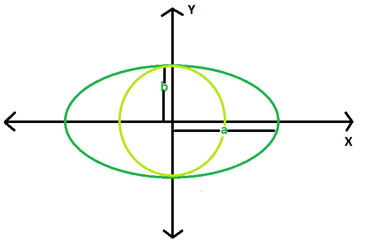

# 求椭圆内接最大圆的面积

> 原文:[https://www . geesforgeks . org/find-椭圆内接最大圆的面积/](https://www.geeksforgeeks.org/find-the-area-of-largest-circle-inscribed-in-ellipse/)

给定一个椭圆，长轴和短轴长度分别为 2a 和 2b。任务是找到可在其中内接的最大圆的面积。
**例:**

```
Input : a = 5, b = 3
Output : 28.2743

Input : a = 10, b = 8
Output : 201.062
```



**逼近:**椭圆内接圆的最大半径是椭圆的短轴。
所以，面积最大的圆= **π * b * b** 。
以下是上述方法的实施:

## C++

```
// CPP program to find
// the area of the circle
#include <bits/stdc++.h>
using namespace std;
#define pi 3.1415926

double areaCircle(double b)
{
    double area = pi * b * b;
    return area;
}

// Driver Code
int main()
{
    double a = 10, b = 8;
    cout << areaCircle(b);
    return 0;
}
```

## Java 语言(一种计算机语言，尤用于创建网站)

```
// Java Program to find the area
// of circle

class GFG
{
    static double areaCircle(double b)
    {

        // Area of the Reuleaux triangle
        double area = (double)3.1415926 * b * b;
        return area;
    }

    // Driver code
    public static void main(String args[])
    {
        float a = 10,b = 8;
        System.out.println(areaCircle(b)) ;
    }
}

// This code is contributed by mohit kumar 29
```

## 蟒蛇 3

```
# Python3 program implementation of above approach

import math

# Function to return required answer
def areaCircle(b):
    area = math.pi * b * b
    return area

# Driver Code
a = 10
b = 8
print(areaCircle(b))

# This code is contributed by
# Sanjit_Prasad
```

## C#

```
// C# Program to find the area
// of circle
using System;

class GFG
{
    static double areaCircle(double b)
    {
        // Area of the Reuleaux triangle
        double area = (double)3.1415926 * b * b;
        return area;
    }

    // Driver code
    public static void Main()
    {
        float b = 8;
        Console.WriteLine(areaCircle(b)) ;
    }
}

// This code is contributed by aishwarya.27
```

## 服务器端编程语言（Professional Hypertext Preprocessor 的缩写）

```
<?php
// PHP program to find the area of the circle

$GLOBALS['pi'] = 3.1415926;

function areaCircle($b)
{
    $area = $GLOBALS['pi'] * $b * $b;
    return $area;
}

// Driver Code
$a = 10;
$b = 8;

echo round(areaCircle($b), 3);

// This code is contributed by Ryuga
?>
```

## java 描述语言

```
<script>
// Javascript program to find
// the area of the circle
function areaCircle(b)
{
    let area = 3.1415926 * b * b;
    return area;
}

// Driver Code
    let a = 10, b = 8;
    document.write(areaCircle(b));

// This code is contributed by Mayank Tyagi
</script>
```

**Output:** 

```
201.062
```