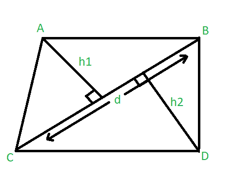

# 求给定对角线和相对顶点到对角线的垂线时四边形的面积

> 原文:[https://www . geeksforgeeks . org/find-给定对角顶点和与其垂直的顶点时的四边形面积/](https://www.geeksforgeeks.org/find-the-area-of-quadrilateral-when-diagonal-and-the-perpendiculars-to-it-from-opposite-vertices-are-given/)

给定三个整数 **d** 、 **h1** 、 **h2** ，其中 **d** 代表四边形对角线的长度。 **h1** 和 **h2** 表示从相对顶点到给定对角线的垂线长度。任务是找到四边形的面积。



**例:**

> **输入:** d= 6，h1 = 4，h2 = 3
> **输出:** 21
> **输入:** d= 10，h1 = 8，h2 = 10
> **输出:** 90

**逼近:**
四边形的面积是两个三角形的面积之和。我们知道三角形的面积是 1/2 *底*高。
因此，四边形的面积可以计算为:

> 面积= 1/2 * d * h1+1/2 * d * H2
> = 1/2 * d *(h1+H2)

以下是上述方法的实现:

## C++

```
// C++ program to find the area of quadrilateral
#include <bits/stdc++.h>
using namespace std;

// Function to find the area of quadrilateral
float Area(int d, int h1, int h2)
{
    float area;

    area = 0.5 * d * (h1 + h2);

    return area;
}

// Driver code
int main()
{
    int d = 6, h1 = 4, h2 = 3;

    cout << "Area of Quadrilateral = " << (Area(d, h1, h2));

    return 0;
}
```

## Java 语言(一种计算机语言，尤用于创建网站)

```
// Java program to find the area of quadrilateral
class GFG
{

    // Function to find the area of quadrilateral
    static float Area(int d, int h1, int h2)
    {
        float area;

        area = (float) 0.5 * d * (h1 + h2);

        return area;
    }

    // Driver code
    public static void main(String[] args)
    {
        int d = 6, h1 = 4, h2 = 3;

        System.out.println("Area of Quadrilateral = " +
                                      Area(d, h1, h2));
    }
}

// This code is contributed by Princi Singh
```

## 蟒蛇 3

```
# Python3 program to find
# the area of quadrilateral

# Function to find the
# area of quadrilateral
def Area(d, h1, h2):

    area = 0.5 * d * (h1 + h2);

    return area;

# Driver code
if __name__ == '__main__':

    d = 6;
    h1 = 4;
    h2 = 3;

    print("Area of Quadrilateral = ",
                  (Area(d, h1, h2)));

# This code is contributed by Rajput-Ji
```

## C#

```
// C# program to find the area of quadrilateral
using System;

class GFG
{

// Function to find the area of quadrilateral
static float Area(int d, int h1, int h2)
{
    float area;

    area = (float)0.5 * d * (h1 + h2);

    return area;
}

// Driver code
public static void Main()
{
    int d = 6, h1 = 4, h2 = 3;

    Console.WriteLine("Area of Quadrilateral = " +
                                 Area(d, h1, h2));
}
}

// This code is contributed by nidhiva
```

## java 描述语言

```
<script>

// JavaScript program to find the area of quadrilateral

// Function to find the area of quadrilateral
function Area(d, h1, h2)
{
    let area;

    area = 0.5 * d * (h1 + h2);

    return area;
}

// Driver code

    let d = 6, h1 = 4, h2 = 3;

    document.write("Area of Quadrilateral = " + (Area(d, h1, h2)));

// This code is contributed by Surbhi Tyagi.

</script>
```

**Output:** 

```
Area of Quadrilateral = 21
```