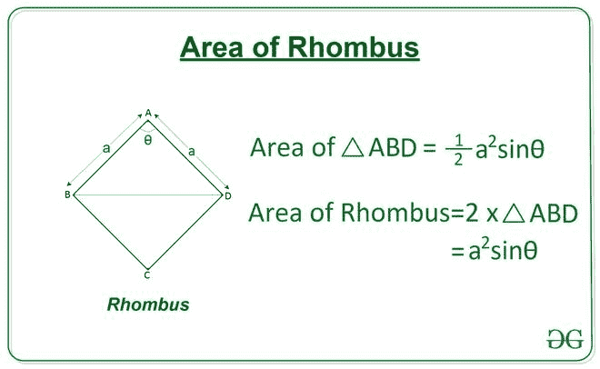

# 从给定的角度和边长找到菱形的面积

> 原文:[https://www . geeksforgeeks . org/从给定的角度和边长找到菱形区域/](https://www.geeksforgeeks.org/find-the-area-of-rhombus-from-given-angle-and-side-length/)

给定两个整数 **A** 和 **X** ，分别表示一个[菱形的边长](https://en.wikipedia.org/wiki/Rhombus)和一个角度，任务是求菱形的面积。

> A **菱形**是四边等长的四边形，其中相对的两边平行，相对的角度相等。

**示例:**

> **输入:** A = 4，X = 60
> T3】输出: 13.86
> 
> **输入:** A = 4，X = 30
> T3】输出: 8.0

**方法:**对于边长为 **a** 且角度为 **x** 的菱形 **ABCD** ，三角形的面积 **ABD** 可以使用三角形的[边-角-边特性](https://www.geeksforgeeks.org/area-of-triangle-using-side-angle-side-length-of-two-sides-and-the-included-angle/)通过以下公式计算:

> 三角形面积**ABD = 1/2(a<sup>2</sup>)sin x**
> 菱形面积 **ABCD** 将是 **ABD** 三角形面积的两倍。
> 
> 因此，菱形面积**ABCD**=**(a<sup>2</sup>)sin x**

[](https://media.geeksforgeeks.org/wp-content/uploads/20200807100945/AreaofRhombus-660x406.jpg)

下面是上述方法的实现:

## C++

```
// C++ Program to calculate
// area of rhombus from given
// angle and side length
#include <bits/stdc++.h>
using namespace std;

#define RADIAN 0.01745329252
// Function to return the area of rhombus
// using one angle and side.
float Area_of_Rhombus(int a, int theta)
{
    float area = (a * a) * sin((RADIAN * theta));
    return area;
}

// Driver Code
int main()
{
    int a = 4;
    int theta = 60;

    // Function Call
    float ans = Area_of_Rhombus(a, theta);

    // Print the final answer
    printf("%0.2f", ans);
    return 0;
}

// This code is contributed by Rajput-Ji
```

## Java 语言(一种计算机语言，尤用于创建网站)

```
// Java Program to calculate
// area of rhombus from given
// angle and side length
class GFG{

static final double RADIAN = 0.01745329252;

// Function to return the area of rhombus
// using one angle and side.
static double Area_of_Rhombus(int a, int theta)
{
    double area = (a * a) * Math.sin((RADIAN * theta));
    return area;
}

// Driver Code
public static void main(String[] args)
{
    int a = 4;
    int theta = 60;

    // Function Call
    double ans = Area_of_Rhombus(a, theta);

    // Print the final answer
    System.out.printf("%.2f", ans);
}
}

// This code is contributed by Rajput-Ji
```

## 蟒蛇 3

```
# Python3 Program to calculate
# area of rhombus from given
# angle and side length

import math 

# Function to return the area of rhombus
# using one angle and side. 
def Area_of_Rhombus(a, theta): 

    area = (a**2) * math.sin(math.radians(theta))

    return area 

# Driver Code 
a = 4
theta = 60

# Function Call 
ans = Area_of_Rhombus(a, theta) 

# Print the final answer
print(round(ans, 2))
```

## C#

```
// C# Program to calculate
// area of rhombus from given
// angle and side length
using System;
class GFG{

static readonly double RADIAN = 0.01745329252;

// Function to return the area of rhombus
// using one angle and side.
static double Area_of_Rhombus(int a, int theta)
{
    double area = (a * a) * Math.Sin((RADIAN * theta));
    return area;
}

// Driver Code
public static void Main(String[] args)
{
    int a = 4;
    int theta = 60;

    // Function Call
    double ans = Area_of_Rhombus(a, theta);

    // Print the readonly answer
    Console.Write("{0:F2}", ans);
}
}

// This code is contributed by Rajput-Ji
```

## java 描述语言

```
<script>

// Javascript Program to calculate
// area of rhombus from given
// angle and side length

// Function to return the area of rhombus
// using one angle and side.
function Area_of_Rhombus(a, theta){

    var area = (a**2) * Math.sin(theta *Math.PI/180);

    return area ;
}

// Driver Code
a = 4
theta = 60

// Function Call
ans = Area_of_Rhombus(a, theta)

 // Print the final answer
document.write(Math.round(ans * 100) / 100);

</script>
```

**Output:** 

```
13.86
```

***时间复杂度:**O(1)*
T5**辅助空间:** O(1)