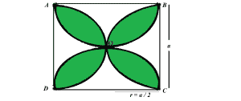
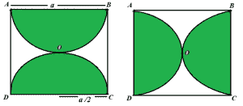

# 求正方形中四个半圆相交形成的阴影区域面积

> 原文:[https://www . geesforgeks . org/find-正方形中四个半圆相交形成的阴影区域面积/](https://www.geeksforgeeks.org/find-the-area-of-the-shaded-region-formed-by-the-intersection-of-four-semicircles-in-a-square/)

给定正方形的边长 **a** ，任务是找到正方形中四个半圆相交形成的阴影区域的面积，如下图所示:



**例:**

> **输入:** a = 10
> **输出:** 57
> **输入:** a = 19
> **输出:** 205.77

**方法:**阴影区域的面积将为:

> **面积(半圆 1) +面积(半圆 2) +面积(半圆 3) +面积(半圆 4)–面积(平方)**。
> 由于所有半圆的半径相同，因此，所有半圆的面积都相等。所以，上面的公式可以写成:
> **4*(半圆面积)–面积(平方)**

半圆的面积为 **(3.14 * r <sup>2</sup> ) / 2** ，其中 **r** 为半圆的半径，等于 **a / 2** 。
因此，阴影区域的**面积= 4 *(3.14 *(a * a)/8)–a * a**



以下是上述方法的实现:

## C++

```
// C++ implementation of the approach
#include <bits/stdc++.h>
using namespace std;

// Function to return the area
// of the shaded region
float findAreaShaded(float a)
{

    // Area of the square
    float sqArea = a * a;

    // Area of the semicircle
    float semiCircleArea = (3.14 * (a * a) / 8);

    // There are 4 semicircles
    // shadedArea = Area of 4 semicircles - Area of square
    float ShadedArea = 4 * semiCircleArea - sqArea;

    return ShadedArea;
}

// Driver code
int main()
{
    float a = 10;
    cout << findAreaShaded(a);

    return 0;
}
```

## Java 语言(一种计算机语言，尤用于创建网站)

```
// Java implementation of the approach
class GFG {

    // Function to return the area
    // of the shaded region
    static float findAreaShaded(float a)
    {

        // Area of the square
        float sqArea = a * a;

        // Area of the semicircle
        float semiCircleArea = (float)(3.14 * (a * a) / 8);

        // There are 4 semicircles
        // shadedArea = Area of 4 semicircles - Area of square
        float ShadedArea = 4 * semiCircleArea - sqArea;

        return ShadedArea;
    }

    // Driver code
    public static void main(String[] args)
    {
        float a = 10;
        System.out.println(findAreaShaded(a));
    }
}
```

## 蟒蛇 3

```
# Python3 implementation of the approach

# Function to return the area
# of the shaded region
def findAreaShaded(a):

    # Area of the square
    sqArea = a * a;

    # Area of the semicircle
    semiCircleArea = (3.14 * (a * a ) / 8)

    # There are 4 semicircles
    # shadedArea = Area of 4 semicircles - Area of square
    ShadedArea = 4 * semiCircleArea - sqArea ;

    return ShadedArea;

# Driver code
if __name__ == '__main__':
    a = 10
    print(findAreaShaded(a))
```

## C#

```
// C# implementation of the approach
using System;

class GFG
{

    // Function to return the area
    // of the shaded region
    static float findAreaShaded(float a)
    {

        // Area of the square
        float sqArea = a * a;

        // Area of the semicircle
        float semiCircleArea = (float)(3.14 * (a * a) / 8);

        // There are 4 semicircles
        // shadedArea = Area of 4 semicircles - Area of square
        float ShadedArea = 4 * semiCircleArea - sqArea;

        return ShadedArea;
    }

    // Driver code
    public static void Main()
    {
        float a = 10;
        Console.WriteLine(findAreaShaded(a));
    }
}

// This code is contributed by mohit kumar 29
```

## 服务器端编程语言（Professional Hypertext Preprocessor 的缩写）

```
<?php
// PHP implementation of the approach

// Function to return the area
// of the shaded region
function findAreaShaded($a)
{

    // Area of the square
    $sqArea = $a * $a;

    // Area of the semicircle
    $semiCircleArea = (3.14 * ($a * $a) / 8);

    // There are 4 semicircles
    // shadedArea = Area of 4 semicircles -
    //              Area of square
    $ShadedArea = 4 * $semiCircleArea - $sqArea;

    return $ShadedArea;
}

// Driver code
$a = 10;
echo findAreaShaded($a);

// This code is contributed by Ryuga
?>
```

## java 描述语言

```
<script>

// Javascript implementation of the approach

// Function to return the area
// of the shaded region
function findAreaShaded( a)
{

    // Area of the square
    let sqArea = a * a;

    // Area of the semicircle
    let semiCircleArea = (3.14 * (a * a) / 8);

    // There are 4 semicircles
    // shadedArea = Area of 4 semicircles - Area of square
    let ShadedArea = 4 * semiCircleArea - sqArea;

    return ShadedArea;
}

    // driver code

    let a = 10;
    document.write(findAreaShaded(a));

</script>
```

**Output:** 

```
57
```