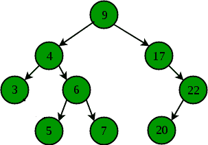

# 寻找二叉查找树最接近的元素|空间高效法

> 原文:[https://www . geesforgeks . org/find-二进制中最接近的元素-搜索-树-空间-高效-方法/](https://www.geeksforgeeks.org/find-the-closest-element-in-binary-search-tree-space-efficient-method/)

给定一个二叉查找树和一个目标节点 k。任务是找到与给定目标值 k 具有最小绝对差的节点。
**注:**所使用的方法应该有恒定的额外空间消耗 O(1)。不应使用递归或类似容器的堆栈/队列。



**例:**

```
Input:  k = 4
Output:  4

Input:  k = 18
Output:  17
```

在[这篇](https://www.geeksforgeeks.org/find-closest-element-binary-search-tree/)帖子中提到的一个简单的解决方案是使用递归来获得与二叉查找树的一个键最接近的元素。上面提到的帖子中使用的方法由于递归而消耗了 O(n)个额外空间。
现在，我们可以使用 [Morris 遍历](https://www.geeksforgeeks.org/inorder-tree-traversal-without-recursion-and-without-stack/)轻松修改上述方法，这是一种空间高效的方法，无需在常数空间 O(1)中使用递归或堆栈/队列即可进行有序树遍历。
Morris 遍历基于[线程二叉树](https://www.geeksforgeeks.org/threaded-binary-tree/)，利用树中的空指针，使其指向一些后继或前驱节点。就像在有 n 个节点的二叉树中一样，n+1 个空指针会浪费内存。
在下面提到的算法中，我们简单地进行有序树遍历，当使用莫里斯遍历进行有序树遍历时，我们检查节点的数据和关键字之间的差异，并维护两个变量“diff”和“closer ”,当我们找到离关键字更近的节点时，它们会更新。当我们完成完整的有序树遍历后，我们就有了最近的节点。
**算法** :

```
1) Initialize Current as root.

2) Initialize a variable diff as INT_MAX.

3)initialize a variable closest(pointer to node) which 
  will be returned.

4) While current is not NULL:

  4.1) If the current has no left child:
     a) If the absolute difference between current's data
        and the key is smaller than diff:
       1) Set diff as the absolute difference between the 
          current node and the key.
       2) Set closest as the current node. 

     b)Otherwise, Move to the right child of current.

  4.2) Else, here we have 2 cases:

   a) Find the inorder predecessor of the current node. 
      Inorder predecessor is the rightmost node 
      in the left subtree or left child itself.

   b) If the right child of the inorder predecessor is NULL:
      1) Set current as the right child of its inorder 
         predecessor(Making threads between nodes).
      2) Move current node to its left child.

   c) Else, if the threaded link between the current node 
      and it's inorder predecessor already exists :

      1) Set right pointer of the inorder predecessor node as NULL.

      2) If the absolute difference between current's data and 
         the key is smaller than diff:
        a) Set diff variable as the absolute difference between 
           the current node and the key.
        b) Set closest as the current node. 

      3) Move current to its right child.

5)By the time we have traversed the whole tree, we have the 
  closest node, so we simply return closest.
```

以下是上述方法的实现:

## C++

```
// CPP program to find closest value in
// a Binary Search Tree.
#include <iostream>
#include <limits.h>
using namespace std;

// Tree Node
struct Node {
    int data;
    Node *left, *right;
};

// Utility function to create a new Node
Node* newNode(int data)
{
    Node* temp = new Node();
    temp->data = data;
    temp->left = temp->right = NULL;
    return temp;
}

// Function to find the Node closest to the
// given key in BST using Morris Traversal
Node* closestNodeUsingMorrisTraversal(Node* root,
                                         int key)
{
    int diff = INT_MAX;
    Node* curr = root;
    Node* closest;

    while (curr) {
        if (curr->left == NULL) {

            // updating diff if the current diff is
            // smaller than prev difference
            if (diff > abs(curr->data - key)) {
                diff = abs(curr->data - key);
                closest = curr;
            }

            curr = curr->right;
        }

        else {

            // finding the inorder predecessor
            Node* pre = curr->left;
            while (pre->right != NULL &&
                   pre->right != curr)
                pre = pre->right;

            if (pre->right == NULL) {
                pre->right = curr;
                curr = curr->left;
            }

            // threaded link between curr and
            // its predecessor already exists
            else {
                pre->right = NULL;

                // if a closer Node found, then update
                // the diff and set closest to current
                if (diff > abs(curr->data - key)) {
                    diff = abs(curr->data - key);
                    closest = curr;
                }

                // moving to the right child
                curr = curr->right;
            }
        }
    }

    return closest;
}

// Driver Code
int main()
{
    /* Constructed binary tree is
          5
        /   \
       3     9
     /  \   /  \
    1    2  8    12 */
    Node* root = newNode(5);
    root->left = newNode(3);
    root->right = newNode(9);
    root->left->left = newNode(1);
    root->left->right = newNode(2);
    root->right->left = newNode(8);
    root->right->right = newNode(12);

    cout << closestNodeUsingMorrisTraversal(root, 10)->data;

    return 0;
}
```

## Java 语言(一种计算机语言，尤用于创建网站)

```
// Java program to find closest value in
// a Binary Search Tree.
class GFG
{

// Tree Node
static class Node
{
    int data;
    Node left, right;
};

// Utility function to create a new Node
static Node newNode(int data)
{
    Node temp = new Node();
    temp.data = data;
    temp.left = temp.right = null;
    return temp;
}

// Function to find the Node closest to the
// given key in BST using Morris Traversal
static Node closestNodeUsingMorrisTraversal(Node root,
                                        int key)
{
    int diff = Integer.MAX_VALUE;
    Node curr = root;
    Node closest = null;

    while (curr != null)
    {
        if (curr.left == null)
        {

            // updating diff if the current diff is
            // smaller than prev difference
            if (diff > Math.abs(curr.data - key))
            {
                diff = Math.abs(curr.data - key);
                closest = curr;
            }

            curr = curr.right;
        }

        else
        {

            // finding the inorder predecessor
            Node pre = curr.left;
            while (pre.right != null &&
                pre.right != curr)
                pre = pre.right;

            if (pre.right == null)
            {
                pre.right = curr;
                curr = curr.left;
            }

            // threaded link between curr and
            // its predecessor already exists
            else
            {
                pre.right = null;

                // if a closer Node found, then update
                // the diff and set closest to current
                if (diff > Math.abs(curr.data - key))
                {
                    diff = Math.abs(curr.data - key);
                    closest = curr;
                }

                // moving to the right child
                curr = curr.right;
            }
        }
    }

    return closest;
}

// Driver Code
public static void main(String[] args)
{
    /* Constructed binary tree is
        5
        / \
    3     9
    / \ / \
    1 2 8 12 */
    Node root = newNode(5);
    root.left = newNode(3);
    root.right = newNode(9);
    root.left.left = newNode(1);
    root.left.right = newNode(2);
    root.right.left = newNode(8);
    root.right.right = newNode(12);

    System.out.println(closestNodeUsingMorrisTraversal(root, 10).data);
}
}

// This code is contributed by Rajput-Ji
```

## 蟒蛇 3

```
# Python program to find closest value in
# Binary search Tree

_MIN = -2147483648
_MAX = 2147483648

# Helper function that allocates a new
# node with the given data and None left
# and right poers.                                
class newNode:

    # Constructor to create a new node
    def __init__(self, data):
        self.data = data
        self.left = None
        self.right = None

# Function to find the Node closest to the
# given key in BST using Morris Traversal
def closestNodeUsingMorrisTraversal(root,key):
    diff = _MAX
    curr = root
    closest=0

    while (curr) :
        if (curr.left == None) :

            # updating diff if the current diff is
            # smaller than prev difference
            if (diff > abs(curr.data - key)) :
                diff = abs(curr.data - key)
                closest = curr

            curr = curr.right

        else :

            # finding the inorder predecessor
            pre = curr.left
            while (pre.right != None and
                    pre.right != curr):
                pre = pre.right

            if (pre.right == None):
                pre.right = curr
                curr = curr.left

            # threaded link between curr and
            # its predecessor already exists
            else :
                pre.right = None

                # if a closer Node found, then update
                # the diff and set closest to current
                if (diff > abs(curr.data - key)) :
                    diff = abs(curr.data - key)
                    closest = curr

                # moving to the right child
                curr = curr.right

    return closest

# Driver Code
if __name__ == '__main__':
    """ /* Constructed binary tree is
        5
        / \
    3 9
    / \ / \
    1 2 8 12 */ """

    root = newNode(5)
    root.left = newNode(3)
    root.right = newNode(9)
    root.left.right = newNode(2)
    root.left.left = newNode(1)
    root.right.right = newNode(12)
    root.right.left = newNode(8)
    print(closestNodeUsingMorrisTraversal(root, 10).data)

# This code is contributed
# Shubham Singh(SHUBHAMSINGH10)
```

## C#

```
// C# program to find closest value in
// a Binary Search Tree.
using System;

class GFG
{

// Tree Node
public class Node
{
    public int data;
    public Node left, right;
};

// Utility function to create a new Node
static Node newNode(int data)
{
    Node temp = new Node();
    temp.data = data;
    temp.left = temp.right = null;
    return temp;
}

// Function to find the Node closest to the
// given key in BST using Morris Traversal
static Node closestNodeUsingMorrisTraversal(Node root,
                                        int key)
{
    int diff = int.MaxValue;
    Node curr = root;
    Node closest = null;

    while (curr != null)
    {
        if (curr.left == null)
        {

            // updating diff if the current diff is
            // smaller than prev difference
            if (diff > Math.Abs(curr.data - key))
            {
                diff = Math.Abs(curr.data - key);
                closest = curr;
            }

            curr = curr.right;
        }

        else
        {

            // finding the inorder predecessor
            Node pre = curr.left;
            while (pre.right != null &&
                pre.right != curr)
                pre = pre.right;

            if (pre.right == null)
            {
                pre.right = curr;
                curr = curr.left;
            }

            // threaded link between curr and
            // its predecessor already exists
            else
            {
                pre.right = null;

                // if a closer Node found, then update
                // the diff and set closest to current
                if (diff > Math.Abs(curr.data - key))
                {
                    diff = Math.Abs(curr.data - key);
                    closest = curr;
                }

                // moving to the right child
                curr = curr.right;
            }
        }
    }

    return closest;
}

// Driver Code
public static void Main(String[] args)
{
    /* Constructed binary tree is
        5
        / \
    3     9
    / \ / \
    1 2 8 12 */
    Node root = newNode(5);
    root.left = newNode(3);
    root.right = newNode(9);
    root.left.left = newNode(1);
    root.left.right = newNode(2);
    root.right.left = newNode(8);
    root.right.right = newNode(12);

    Console.WriteLine(closestNodeUsingMorrisTraversal(root, 10).data);
}
}

/* This code is contributed by PrinciRaj1992 */
```

## java 描述语言

```
<script>

// Javascript program to find closest value in
// a Binary Search Tree.

// Tree Node
class Node
{
    constructor()
    {
        this.data = 0;
        this.left = null;
        this.right = null;
    }
};

// Utility function to create a new Node
function newNode(data)
{
    var temp = new Node();
    temp.data = data;
    temp.left = temp.right = null;
    return temp;
}

// Function to find the Node closest to the
// given key in BST using Morris Traversal
function closestNodeUsingMorrisTraversal(root, key)
{
    var diff = 1000000000;
    var curr = root;
    var closest = null;

    while (curr != null)
    {
        if (curr.left == null)
        {

            // updating diff if the current diff is
            // smaller than prev difference
            if (diff > Math.abs(curr.data - key))
            {
                diff = Math.abs(curr.data - key);
                closest = curr;
            }

            curr = curr.right;
        }

        else
        {

            // finding the inorder predecessor
            var pre = curr.left;
            while (pre.right != null &&
                pre.right != curr)
                pre = pre.right;

            if (pre.right == null)
            {
                pre.right = curr;
                curr = curr.left;
            }

            // threaded link between curr and
            // its predecessor already exists
            else
            {
                pre.right = null;

                // if a closer Node found, then update
                // the diff and set closest to current
                if (diff > Math.abs(curr.data - key))
                {
                    diff = Math.abs(curr.data - key);
                    closest = curr;
                }

                // moving to the right child
                curr = curr.right;
            }
        }
    }

    return closest;
}

// Driver Code
/* Constructed binary tree is
    5
    / \
3     9
/ \ / \
1 2 8 12 */
var root = newNode(5);
root.left = newNode(3);
root.right = newNode(9);
root.left.left = newNode(1);
root.left.right = newNode(2);
root.right.left = newNode(8);
root.right.right = newNode(12);
document.write(closestNodeUsingMorrisTraversal(root, 10).data);

// This code is contributed by itsok.
</script>
```

**Output:** 

```
9
```

**时间复杂度**:O(n)
T3】辅助空间 : O(1)