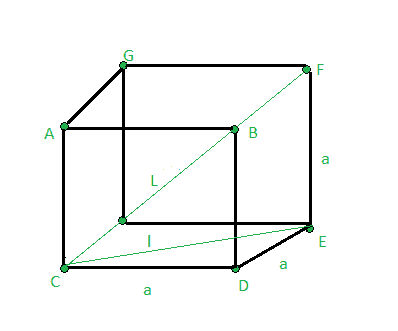

# 求立方体的对角线

> 原文:[https://www . geeksforgeeks . org/find-the-the-对角线的立方体/](https://www.geeksforgeeks.org/find-the-diagonal-of-the-cube/)

给定立方体的一面**一面**。任务是找出立方体对角线的长度。



**例:**

> **输入:** a = 3
> **输出:** 5.19615
> **输入:** a = 6
> **输出:** 10.3923

**公式:**

> 立方体对角线长度= sqrt(3) *边

**证明:**

> 使用勾股定理，
> 在三角形 CED 中，
> CE<sup>2</sup>= CD<sup>2</sup>+DE<sup>2</sup>T8】l<sup>2</sup>= a<sup>2</sup>+a<sup>2</sup>—>(1)
> 在三角形 CFE 中，
> CF<sup>2</sup>= CE<sup>2</sup>+EF<sup>2</sup>
> L<sup>2</sup>= L<sup>2</sup>+a<sup>2</sup>T30】使用公式(1)中的 l <sup>2</sup> 值，
> L<sup>2</sup>= a<sup>2</sup>+a<sup>2</sup>

## C++

```
// CPP program to find length
// of the diagonal of the cube
#include <bits/stdc++.h>
using namespace std;

// Function to find length
// of diagonal of cube
float diagonal_length(float a)
{
    float L;

    // Formula to Find length
    // of diagonal of cube
    L = a * sqrt(3);

    return L;
}

// Driver code
int main()
{

    float a = 5;

    // Function call
    cout << diagonal_length(a);

    return 0;
}
```

## Java 语言(一种计算机语言，尤用于创建网站)

```
// Java program to find length
// of the diagonal of the cube
class GFG
{

    // Function to find length
    // of diagonal of cube
    static float diagonal_length(float a)
    {
        float L;

        // Formula to Find length
        // of diagonal of cube
        L = a * (float)Math.sqrt(3);

        return L;
    }

    // Driver Code
    public static void main (String[] args)
    {
        float a = 5;

        // Function call
        System.out.println(diagonal_length(a));
    }
}

// This code is contributed by
// sanjeev2552
```

## 蟒蛇 3

```
# Python3 program to find length
# of the diagonal of the cube
from math import sqrt

# Function to find length
# of diagonal of cube
def diagonal_length(a):
    L = 0

    # Formula to Find length
    # of diagonal of cube
    L = a * sqrt(3)

    return L

# Driver code
a = 5

# Function call
print(diagonal_length(a))

# This code is contributed by Mohit Kumar
```

## C#

```
// C# program to find length
// of the diagonal of the cube
using System;
class GFG
{
// Function to find length
// of diagonal of cube
static float diagonal_length(float a)
{
    float L;

    // Formula to Find length
    // of diagonal of cube
    L = a * (float)Math.Sqrt(3);

    return L;
}

// Driver code
public static void Main()
{
    float a = 5;

    // Function call
    Console.Write(diagonal_length(a));
}
}

// This code is contributed by Nidhi
```

## 服务器端编程语言（Professional Hypertext Preprocessor 的缩写）

```
<?php
// PHP program to find length
// of the diagonal of the cube

// Function to find length
// of diagonal of cube
function diagonal_length($a)
{
    $L;

    // Formula to Find length
    // of diagonal of cube
    $L = $a * sqrt(3);

    return $L;
}

// Driver code
$a = 5;

// Function call
echo diagonal_length($a);

// This code is contributed
// by Naman_Garg.
?>
```

## java 描述语言

```
<script>
// javascript program to find length
// of the diagonal of the cube

// Function to find length
// of diagonal of cube
function diagonal_length( a)
{
    let L;

    // Formula to Find length
    // of diagonal of cube
    L = a * Math.sqrt(3);

    return L;
}

// Driver code
    let a = 5;

    // Function call
    document.write(diagonal_length(a).toFixed(5));

// This code is contributed by gauravrajput1
</script>
```

**Output:** 

```
8.66025
```