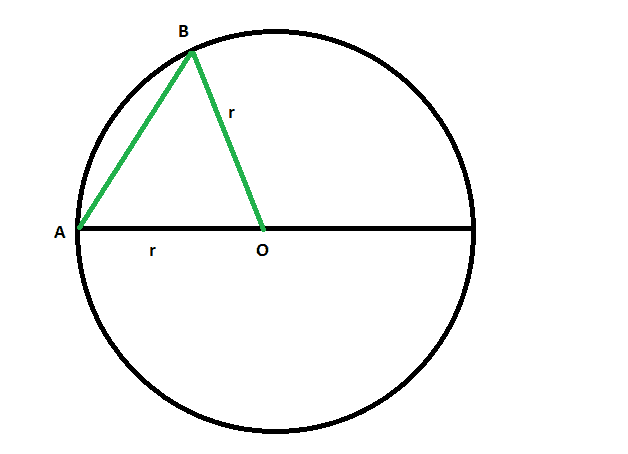

# 求圆的直径或最长弦

> 原文:[https://www . geesforgeks . org/find-直径或最长弦的圆/](https://www.geeksforgeeks.org/find-the-diameter-or-longest-chord-of-a-circle/)

给定半径为“r”的圆，任务是找出圆的直径或最长弦。
**例:**

```
Input: r = 4
Output: 8

Input: r = 9
Output: 18
```



**圆最长弦是其直径的证明:**

*   在上面画圆 O 和任意和弦 AB。
*   从和弦的一个端点，比如 A，画一条穿过中心的线段。也就是画一个直径。
*   现在画一个从中心 0 到 b 的半径
*   由三角形不等式可知，

```
AB < AO + OB
 = r + r
 = 2r
 = d
```

*   所以，任何不是直径的弦都会小于直径。
*   所以最大的弦是直径

**接近** :

*   任何圆最长的弦是它的直径。
*   因此，圆的直径是它的半径的两倍。

```
Length of the longest chord or diameter = 2r
```

以下是上述方法的实现:

## C++

```
// C++ program to find
// the longest chord or diameter
// of the circle whose radius is given

#include <bits/stdc++.h>
using namespace std;

// Function to find the longest chord
void diameter(double r)
{
    cout << "The length of the longest chord"
         << " or diameter of the circle is "
         << 2 * r << endl;
}

// Driver code
int main()
{

    // Get the radius
    double r = 4;

    // Find the diameter
    diameter(r);

    return 0;
}
```

## Java 语言(一种计算机语言，尤用于创建网站)

```
// Java program to find
// the longest chord or diameter
// of the circle whose radius is given
class GFG
{

// Function to find the longest chord
static void diameter(double r)
{
    System.out.println("The length of the longest chord"
        + " or diameter of the circle is "
        + 2 * r);
}

// Driver code
public static void main(String[] args)
{

    // Get the radius
    double r = 4;

    // Find the diameter
    diameter(r);
}
}

// This code contributed by Rajput-Ji
```

## 蟒蛇 3

```
# Python3 program to find
# the longest chord or diameter
# of the circle whose radius is given

# Function to find the longest chord
def diameter(r):

    print("The length of the longest chord"
        ," or diameter of the circle is "
        ,2 * r)

# Driver code

# Get the radius
r = 4

# Find the diameter
diameter(r)

# This code is contributed by mohit kumar
```

## C#

```
// C# program to find
// the longest chord or diameter
// of the circle whose radius is given
using System;

class GFG
{

// Function to find the longest chord
static void diameter(double r)
{
    Console.WriteLine("The length of the longest chord"
        + " or diameter of the circle is "
        + 2 * r);
}

// Driver code
public static void Main(String[] args)
{

    // Get the radius
    double r = 4;

    // Find the diameter
    diameter(r);
}
}

// This code has been contributed by 29AjayKumar
```

## 服务器端编程语言（Professional Hypertext Preprocessor 的缩写）

```
<?php
// PHP program to find
// the longest chord or diameter
// of the circle whose radius is given

// Function to find the longest chord
function diameter($r)
{
    echo "The length of the longest chord"
        ," or diameter of the circle is "
        ,2 * $r << "\n";
}

    // Driver code
    // Get the radius
    $r = 4;

    // Find the diameter
    diameter($r);

    // This code is contributed by Ryuga

?>
```

## java 描述语言

```
<script>

// javascript program to find
// the longest chord or diameter
// of the circle whose radius is given

// Function to find the longest chord
function diameter(r)
{
    document.write("The length of the longest chord"
        + " or diameter of the circle is "
        + 2 * r);
}

// Driver code

// Get the radius
var r = 4;

// Find the diameter
diameter(r);

// This code contributed by Princi Singh

</script>
```

**Output:** 

```
The length of the longest chord or diameter of the circle is 8
```