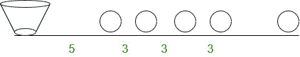

# 求等距离收集物品所覆盖的距离

> 原文:[https://www . geeksforgeeks . org/find-等距离收集物品覆盖的距离/](https://www.geeksforgeeks.org/find-the-distance-covered-to-collect-items-at-equal-distances/)

一场比赛正在进行，几块石头被放在一条路上。比赛起点放置一个水桶，距离第一块石头 5 个单位。其他的石头相距 3 个单位，一个接一个地排成一条直线。即第一石和第二石之间的距离是 3 个单位，第三石和第四石之间，也是 3 个单位，以此类推。竞争对手从水桶开始，捡起最近的石头，回去把那块石头放进水桶，然后再次跑去收集下一个最近的石头，跑回来，把它放进水桶。这样，这个过程一直持续到所有的石头都被放进桶里。
现在如果有 n 块石头躺在地上，那么在完成整个过程中，竞争对手会走多远。



示例:

```
Input : n = 3
Output : Distance = 48
Explanation
= 2*5 + 2(5 + 3) + 2(5 + 3 + 3)
= 10 + 16 + 22
= 48

Input : n = 5
Output : Distance = 110
Explanation
= 2*5 + 2(5 + 3) + 2(5 + 3 + 3) + 2(5 + 3 + 3 + 3) + 2(5 + 3 + 3 + 3 + 3)
= 10 + 16 + 22 + 28 + 34
= 110
```

**观察模式:**

> 竞争对手摘第一块石头跑的距离= 2 * 5
> 竞争对手摘第二块石头跑的距离= 2(5 + 3)
> 竞争对手摘第三块石头跑的距离= 2(5 + 3 + 3)
> = 2(5 + (2 * 3))
> 竞争对手摘第四块石头跑的距离= 2(5 + 3 + 3 + 3)
> = 2(5 + (3 * 3))
> 竞争对手摘第五块石头跑的距离= 2(5 + 3 + 3 + 3 + 3)
> =
> 。
> 。
> 竞赛者摘第 n 块石头跑的距离= 2(5 + 3 + 3 + ……)。+ (n-1)次)
> = 2(5 + (n-1) *3)
> 所以选手跑的总距离=以上所有距离的总和
> =(2 * 5)+2(5+3)+2(5+(2 * 3))+2(5+(3 * 3))+……..+2(5+(n-1)* 3)
> = 2(5+(5+3)+(5+(2 * 3))+(5+(3 * 3))+………………。+ (5 + (n-1) * 3)
> = 2(5 + 5 + 5 …… + n 次)+(3+(2 * 3)+(3 * 3)+……+(n-1)* 3)
> = 2(5n+3(1+2+3+…………)。+n-1))
> = 2(5n+3/2[(n-1)*(n-1+1)]
> = 2(5n+3/2[(n-1)* n])
> = 2(5n+3/2(n<sup>2</sup>–n))
> = 10n+3 * n<sup>2</sup>–3 * n
> = 3 * n<sup>2</sup>+7 *

以下是实施办法:

## C++

```
// C++ program to calculate
// the distance for given problem
#include <bits/stdc++.h>
using namespace std;

// function to calculate the
// distance
int find_distance(int n)
{
    return n * ((3 * n) + 7);
}

// Driver program
int main()
{
    int n = 5;
    cout << "Distance = " << find_distance(n);
    return 0;
}
```

## Java 语言(一种计算机语言，尤用于创建网站)

```
// Java program to calculate the
// distance for given problem
class demo {

    // function to calculate
    // the distance
    public static int find_distance(int n)
    {
        return n * (3 * n + 7);
    }

    // Driver program
    public static void main(String args[])
    {
        int n = 5;

        System.out.print("Distance = ");
        System.out.println(find_distance(n));
    }
}
```

## 蟒蛇 3

```
# Python3 code to calculate
# the distance for given problem

# function to calculate the
# distance
def find_distance(n):

    return n * ((3 * n) + 7)

# main function
n = 5
ans = find_distance( n )
print (ans)

# This code is contributed by Saloni Gupta
```

## C#

```
// C# program to calculate
// the distance for given problem
using System;

class GFG {

    // function to calculate the
    // distance
    public static int find_distance(int n)
    {
        return n * ((3 * n) + 7);
    }

    // Driver program
    public static void Main()
    {
        int n = 5;

        Console.Write(find_distance(n));
    }
}

// This code is contributed by
// Smitha Dinesh Semwal
```

## 服务器端编程语言（Professional Hypertext Preprocessor 的缩写）

```
<?php
//PHP program to calculate
// the distance for given problem

// function to calculate the
// distance

function  find_distance($n)
{
    return $n * ((3 * $n) + 7);
}

// Driver program

    $n = 5;
    echo  "Distance = ", find_distance($n);

// This code is contributed by aj_36
?>
```

## java 描述语言

```
<script>

// JavaScript program to calculate the
// distance for given problem

// function to calculate
    // the distance
    function find_distance(n)
    {
        return n * (3 * n + 7);
    }

// Driver code

        let n = 5;

        document.write("Distance = ");
        document.write(find_distance(n));

</script>
```

输出:

```
110
```