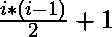
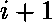
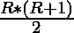

# 在给定的 2D 模式中找到第 R 行和第 C 列的元素

> 原文:[https://www . geeksforgeeks . org/find-the-element-at-rth-row-cth-column-in-given-a-2d-pattern/](https://www.geeksforgeeks.org/find-the-element-at-rth-row-and-cth-column-in-given-a-2d-pattern/)

给定两个整数 **R** 和 **C** ，任务是找到 R <sup>第</sup>行和 C <sup>第</sup>列的元素。
**图案:**

> *   The first element I <sup>, line</sup> = 
> *   Each element is a arithmetic progression incremental difference, where the tolerance is 1.
> *   Initial difference term = 

**例:**

> **输入:** R = 4，C = 4
> **输出:** 25
> **解释:**
> 大小为 4 * 4 的图案为–
> 1 3 6 10
> 2 5 9 14
> 4 8 13 19
> 7 12 18 25
> 因此，Pat[4][4] = 25
> **处的元素输入:** R = 3， C = 3
> **输出:** 13
> **解释:**
> 大小为 3 * 3 的图案为–
> 1 3 6
> 2 5 9
> 4 8 13
> 因此，帕特[3][3] = 13

**天真方法:**一个简单的解决方案是生成大小为 R * C 的模式矩阵，然后最终返回 R <sup>第</sup>行和 C <sup>第</sup>列的元素。
***时间复杂度:** O(R*C)*
***辅助空间:** O(R*C)*
**高效方法:**思路是利用公式找到 R <sup>第</sup>行的第一项，然后借助[循环](https://www.geeksforgeeks.org/c-c-do-while-loop-with-examples/)最终计算出该列的 C <sup>第</sup>项。
以下是上述方法的实施:

## C++

```
// C++ implementation to compute the
// R'th row and C'th column of the
// given pattern

#include <bits/stdc++.h>
using namespace std;

// Function to compute the
// R'th row and C'th column of the
// given pattern
int findValue(int R, int C)
{

    // First element of a given row
    int k = (R * (R - 1)) / 2 + 1;

    int diff = R + 1;

    // Element in the given column
    for (int i = 1; i < C; i++) {
        k = (k + diff);
        diff++;
    }

    return k;
}

// Driver Code
int main()
{
    int R = 4;
    int C = 4;

    // Function call
    int k = findValue(R, C);

    cout << k;

    return 0;
}
```

## Java 语言(一种计算机语言，尤用于创建网站)

```
// Java implementation to compute the
// R'th row and C'th column of the
// given pattern
import java.io.*;

class GFG{

// Function to compute the R'th
// row and C'th column of the
// given pattern
static int findValue(int R, int C)
{

    // First element of a given row
    int k = (R * (R - 1)) / 2 + 1;

    int diff = R + 1;

    // Element in the given column
    for(int i = 1; i < C; i++)
    {
       k = (k + diff);
       diff++;
    }
    return k;
}

// Driver code
public static void main (String[] args)
{
    int R = 4;
    int C = 4;

    // Function call
    int k = findValue(R, C);

    System.out.println(k);
}
}

// This code is contributed by mohit kumar 29
```

## 蟒蛇 3

```
# Python3 implementation to find the
# R'th row and C'th column value in
# the given pattern

# Function to find the
# R'th row and C'th column value in
# the given pattern
def findValue(R, C):

    # First element of a given row
    k = (R*(R-1))//2 + 1

    diff = R + 1

    # Element in the given column
    for i in range(1, C):
        k = (k + diff)
        diff+= 1

    return k

# Driver Code
if __name__ == "__main__":
    R = 4
    C = 4

    k = findValue(R, C)
    print(k)
```

## C#

```
// C# implementation to compute the
// R'th row and C'th column of the
// given pattern
using System;
class GFG{

// Function to compute the R'th
// row and C'th column of the
// given pattern
static int findValue(int R, int C)
{

    // First element of a given row
    int k = (R * (R - 1)) / 2 + 1;

    int diff = R + 1;

    // Element in the given column
    for(int i = 1; i < C; i++)
    {
        k = (k + diff);
        diff++;
    }
    return k;
}

// Driver code
public static void Main()
{
    int R = 4;
    int C = 4;

    // Function call
    int k = findValue(R, C);

    Console.Write(k);
}
}

// This code is contributed by Code_Mech
```

## java 描述语言

```
<script>
// Javascript implementation to compute the
// R'th row and C'th column of the
// given pattern

// Function to compute the R'th
// row and C'th column of the
// given pattern
function findValue(R, C)
{

    // First element of a given row
    let k = (R * (R - 1)) / 2 + 1;

    let diff = R + 1;

    // Element in the given column
    for(let i = 1; i < C; i++)
    {
       k = (k + diff);
       diff++;
    }
    return k;
}

  // Driver Code

    let R = 4;
    let C = 4;

    // Function call
    let k = findValue(R, C);

     document.write(k);

</script>
```

**Output:** 

```
25
```