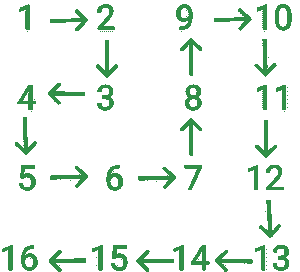

# 在螺旋矩阵中找到指定索引处的元素

> 原文:[https://www . geesforgeks . org/find-the-element-at-specified-index-in-a-spiral-matrix/](https://www.geeksforgeeks.org/find-the-element-at-specified-index-in-a-spiral-matrix/)

给定两个整数 **i** 和 **j** ，任务是打印 **i * j** <sup>第</sup>个矩阵元素，可以通过以下螺旋方式填充矩阵得到:



螺旋网格表示图 1

**示例:**

> **输入:** i = 3，j = 4
> **输出:** 12
> **说明:**
> i = 3，j = 4，网格【3】【4】= 12
> 
> **输入:** i = 5，j = 5
> **输出:** 21
> **说明:**
> i = 5，j = 5 格【5】【5】= 21

**进场:**在问题中可以观察到当 **i** 为偶数时网格中的第一个数字为 i <sup>2</sup> (2 <sup>2</sup> =第二排 4)，当 **i** 为奇数时网格中的第一个数字为**(I-1)<sup>2</sup>+1**((3-1)<sup>2</sup>+1 =第三排 5)。同样，当 **j** 为奇数时，网格中的第一个数字为**j<sup>2</sup>**(3<sup>2</sup>=第 3 列中的 9)，当 **j** 为偶数时，网格中的第一个数字为**(j-1)<sup>2</sup>+1**((4-1)<sup>2</sup>+1 =第 4 列中的 10)。所以每一行从**I<sup>2</sup>T35】或 **(i-1) <sup>2</sup> + 1** 开始，每一列从 **j <sup>2</sup>** 或 **(j-1) <sup>2</sup> + 1** 开始。**

问题可分为以下几种情况:

*   **情况 1 : i = j**
    观察到网格的对角线元素可以用公式**I<sup>2</sup>–(I-1)**或**j<sup>2</sup>–(j–1)**表示。
*   **案例 2: i > j**
    *   **情况 1:我是偶数**
        在这种情况下，第一排**我**将是**我<sup>2</sup>T8】。现在通过从第一行的数字中减去**(j–1)**，计算给定索引处的值。所以公式为**I<sup>2</sup>–(j-1)**。**
    *   **情况 2: i 为奇数**
        在这种情况下，第一排 **i** 将为**(I–1)<sup>2</sup>+1**。现在，通过将**(j–1)**添加到行的第一个数字，计算给定索引处的值。所以公式为**(I–1)<sup>2</sup>+1+(j–1)**。
*   **案例 3: i < j**
    *   **情况 1: j 为偶数**T2 在这种情况下，第一列 **j** 将为**(j–1)<sup>2</sup>+1**。现在，通过将**(I–1)**添加到列的第一个数字，计算给定索引处的值。所以公式为**(j–1)<sup>2</sup>+1+(I–1)**。
    *   **情况 2: j 为奇数**
        在这种情况下，第一列 **j** 将为 **j <sup>2</sup>** 。现在通过从列的第一个数字中减去**(I–1)**，计算给定索引处的值。所以公式为**j<sup>2</sup>+1 –( I–1)**。

按照以下步骤解决问题:

1.  检查 **i** 是否等于 **j** ，打印**I * I–(I–1)**。
2.  如果 **i** 大于 **j** :
    1.  如果 **i** 是偶数打印**I * I–(j–1)**。
    2.  否则，打印(**I–1)*(I–1)+1+(j–1)**。
3.  如果 **j** 大于 **i** :
    1.  如果 **j** 是偶数打印**(j–1)*(j–1)+1+(I–1)**。
    2.  否则，打印**j * j–(I–1)**。

下面是上述方法的实现:

## C++

```
// C++ program for the above approach
#include <iostream>
using namespace std;

// Function to the find
// element at (i, j) index
int findInGrid(int i, int j)
{
    if (i == j)
        return (i * i - (i - 1));

    else if (i > j) {
        if (i % 2 == 0)
            return i * i - (j - 1);
        else
            return (i - 1) * (i - 1) + 1 + (j - 1);
    }

    else {
        if (j % 2 == 0)
            return (j - 1) * (j - 1) + 1 + (i - 1);
        else
            return j * j - (i - 1);
    }
}

// Driver Code
int main()
{

    int i = 3, j = 4;

    // Function Call
    cout << findInGrid(i, j);

    return 0;
}
```

## Java 语言(一种计算机语言，尤用于创建网站)

```
// Java program for the above approach
import java.io.*;

class GFG{

// Function to the find
// element at (i, j) index
static int findInGrid(int i, int j)
{
    if (i == j)
        return (i * i - (i - 1));

    else if (i > j)
    {
        if (i % 2 == 0)
            return i * i - (j - 1);
        else
            return (i - 1) * (i - 1) +
                         1 + (j - 1);
    }

    else
    {
        if (j % 2 == 0)
            return (j - 1) * (j - 1) +
                         1 + (i - 1);
        else
            return j * j - (i - 1);
    }
}

// Driver Code
public static void main(String[] args)
{
    int i = 3, j = 4;

    // Function Call
    System.out.println(findInGrid(i, j));
}
}

// This code is contributed by Dharanendra L V
```

## 蟒蛇 3

```
# Python3 program for the above approach

# Function to the find
# element at(i, j) index
def findInGrid(i, j):

    if (i == j):
        return (i * i - (i - 1))

    elif (i > j):
        if (i % 2 == 0):
            return i * i - (j - 1)
        else :
            return ((i - 1) * (i - 1) +
                          1 + (j - 1))

    else:
        if (j % 2 == 0):
            return ((j - 1) * (j - 1) +
                          1 + (i - 1))
        else:
            return j * j - (i - 1)

# Driver Code
i = 3
j = 4

# Function Call
print(findInGrid(i, j))

# This code is contributed by Dharanendra L V
```

## C#

```
// C# program for the above approach
using System;

class GFG{

// Function to the find
// element at (i, j) index
static int findInGrid(int i, int j)
{
    if (i == j)
        return (i * i - (i - 1));

    else if (i > j)
    {
        if (i % 2 == 0)
            return i * i - (j - 1);
        else
            return (i - 1) * (i - 1) +
                         1 + (j - 1);
    }

    else
    {
        if (j % 2 == 0)
            return (j - 1) * (j - 1) +
                         1 + (i - 1);
        else
            return j * j - (i - 1);
    }
}

// Driver Code
static public void Main()
{
    int i = 3, j = 4;

    // Function Call
    Console.WriteLine(findInGrid(i, j));
}
}

// This code is contributed by Dharanendra L V
```

## java 描述语言

```
<script>

// Javascript program for the above approach

// Function to the find
// element at (i, j) index
function findInGrid(i, j)
{
    if (i == j)
        return (i * i - (i - 1));

    else if (i > j) {
        if (i % 2 == 0)
            return i * i - (j - 1);
        else
            return (i - 1) * (i - 1) + 1 + (j - 1);
    }

    else {
        if (j % 2 == 0)
            return (j - 1) * (j - 1) + 1 + (i - 1);
        else
            return j * j - (i - 1);
    }
}

// Driver Code

    let i = 3, j = 4;

    // Function Call
    document.write(findInGrid(i, j));

</script>
```

**Output**

```
12
```

***时间复杂度:*** O(1)
***辅助空间:*** O(1)