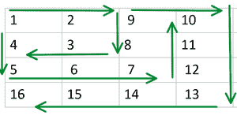

# 在螺旋填充矩阵的指定索引处找到元素

> 原文:[https://www . geeksforgeeks . org/find-指定索引处的元素-螺旋填充矩阵/](https://www.geeksforgeeks.org/find-the-element-at-the-specified-index-of-a-spirally-filled-matrix/)

给定两个整数 **x** 和 **y** 分别代表矩阵中的行数和列数，任务是在螺旋填充矩阵中的单元格 **(x，y)** 处找到整数。

> **解释:**
> 矩阵的大小根据元素的插入而变化。
> 由于行和列是逐层填充的，当每行和每列以下列方式同时添加时，将形成一个正方形矩阵:
> 
> 1.  形成具有单个元素 1 的大小为 1×1 的正方形矩阵。
> 2.  元素{2，3，4}按顺序螺旋插入后，形成大小为 2 x 2 的正方形矩阵:
>     {{1，2}，
>     {4，3}}
> 3.  在元素{5，6，7，8}按顺序螺旋插入后，形成大小为 3×3 的正方形矩阵:
>     {{1，2，9}，
>     {4，3，8}，
>     {5，6，7}}
>     
> 
> 下图表示按照上述步骤生成的 4*4 矩阵:
> 
> [](https://media.geeksforgeeks.org/wp-content/uploads/20200705060604/chahat16-300x151.png)

**示例:**

> **输入:** X = 2，Y = 3
> **输出:** 8
> **说明:**
> 第 2 行第 3 列的元素为 8。
> 
> **输入:** X = 5，Y = 4
> **输出:** 20
> **说明:**第 5 行第 4 列的元素为 20。

**方法:**
要解决这个问题，需要理解给定的螺旋填充矩阵背后的逻辑。以下是需要考虑的可能情况:

*   **情况 1:如果 y > x & y 为奇数**
    **(x，y)** 的元素等于**y<sup>2</sup>–x+1**

> **图解:**
> y = 3，x = 1
> y<sup>2</sup>–x+1 = 9–1+1 = 9
> 元素出现在(1，3) = 9。

*   **情况二:如果 y > x & y 为偶数**
    **(x，y)** 的元素等于**(y–1)<sup>2</sup>+x**

> **图解:**
> y = 4，x = 1
> (y–1)<sup>2</sup>+x = 9+1 = 10
> 元素出现在(1，4) = 10。

*   **情况 3:如果 x ≥ y & x 为偶数**
    **(x，y)** 的元素等于**x<sup>2</sup>–y+1**

> **图解:**
> y = 1，x = 4
> x<sup>2</sup>–y+1 = 16–1+1 = 16
> 元素出现在(4，1) = 16。

*   **情况 4:如果 x ≥ y & x 为奇数**
    **(x，y)** 的元素等于**(x–1)<sup>2</sup>+y**

> **图解:**
> y = 2，x = 3
> (x–1)<sup>2</sup>+y = 4+2 = 6
> 元素出现在(3，2) = 6。

因此，为了解决这个问题，我们需要评估并打印对应于给定的 **x** 和 **y** 满足的条件的方程的结果。

下面是上述方法的实现:

## C++

```
// C++ Program to find the element
// at given position in spirally
// filled matrix
#include <bits/stdc++.h>
using namespace std;

// Function to return the
// element at (x, y)
int SpiralElement(int x, int y)
{
    int r;

    // If y is greater
    if (x < y) {

        // If y is odd
        if (y % 2 == 1) {
            r = y * y;
            return (r - x + 1);
        }

        // If y is even
        else {
            r = (y - 1) * (y - 1);
            return (r + x);
        }
    }

    else {

        // If x is even
        if (x % 2 == 0) {
            r = x * x;
            return (r - y + 1);
        }

        // If x is odd
        else {
            r = (x - 1) * (x - 1);
            return (r + y);
        }
    }
}

// Driver Code
int main()
{

    int x = 2, y = 3;
    cout << SpiralElement(x, y);
    return 0;
}
```

## Java 语言(一种计算机语言，尤用于创建网站)

```
// Java program to find the element
// at given position in spirally
// filled matrix
import java.util.*;

class GFG{

// Function to return the
// element at (x, y)
static int SpiralElement(int x, int y)
{
    int r;

    // If y is greater
    if (x < y)
    {

        // If y is odd
        if (y % 2 == 1)
        {
            r = y * y;
            return (r - x + 1);
        }

        // If y is even
        else
        {
            r = (y - 1) * (y - 1);
            return (r + x);
        }
    }
    else
    {

        // If x is even
        if (x % 2 == 0)
        {
            r = x * x;
            return (r - y + 1);
        }

        // If x is odd
        else
        {
            r = (x - 1) * (x - 1);
            return (r + y);
        }
    }
}

// Driver code
public static void main(String[] args)
{
    int x = 2, y = 3;

    System.out.println(SpiralElement(x, y));
}
}

// This code is contributed by offbeat
```

## 蟒蛇 3

```
# Python3 program to find the element
# at given position in spirally
# filled matrix

# Function to return the
# element at (x, y)
def SpiralElement(x, y):

    r = 0

    # If y is greater
    if (x < y):

        # If y is odd
        if (y % 2 == 1):
            r = y * y
            return (r - x + 1)

        # If y is even
        else:
            r = (y - 1) * (y - 1)
            return (r + x)

    else:

        # If x is even
        if (x % 2 == 0):
            r = x * x
            return (r - y + 1)

        # If x is odd
        else:
            r = (x - 1) * (x - 1)
            return (r + y)

# Driver code
if __name__ == '__main__':

    x = 2
    y = 3

    print(SpiralElement(x, y))

# This code is contributed by Amit Katiyar
```

## C#

```
// C# program to find the element
// at given position in spirally
// filled matrix
using System;

class GFG{

// Function to return the
// element at (x, y)
static int SpiralElement(int x, int y)
{
    int r;

    // If y is greater
    if (x < y)
    {

        // If y is odd
        if (y % 2 == 1)
        {
            r = y * y;
            return (r - x + 1);
        }

        // If y is even
        else
        {
            r = (y - 1) * (y - 1);
            return (r + x);
        }
    }
    else
    {

        // If x is even
        if (x % 2 == 0)
        {
            r = x * x;
            return (r - y + 1);
        }

        // If x is odd
        else
        {
            r = (x - 1) * (x - 1);
            return (r + y);
        }
    }
}

// Driver code
static public void Main()
{
    int x = 2, y = 3;

    Console.WriteLine(SpiralElement(x, y));
}
}

// This code is contributed by offbeat
```

## java 描述语言

```
<script>
// javascript program to find the element
// at given position in spirally
// filled matrix

    // Function to return the
    // element at (x, y)
    function SpiralElement(x , y) {
        var r;

        // If y is greater
        if (x < y) {

            // If y is odd
            if (y % 2 == 1) {
                r = y * y;
                return (r - x + 1);
            }

            // If y is even
            else {
                r = (y - 1) * (y - 1);
                return (r + x);
            }
        } else {

            // If x is even
            if (x % 2 == 0) {
                r = x * x;
                return (r - y + 1);
            }

            // If x is odd
            else {
                r = (x - 1) * (x - 1);
                return (r + y);
            }
        }
    }

    // Driver code

        var x = 2, y = 3;

        document.write(SpiralElement(x, y));

// This code contributed by gauravrajput1
</script>
```

**Output:** 

```
8
```

***时间复杂度:** O(1)*
***辅助空间:** O(1)*