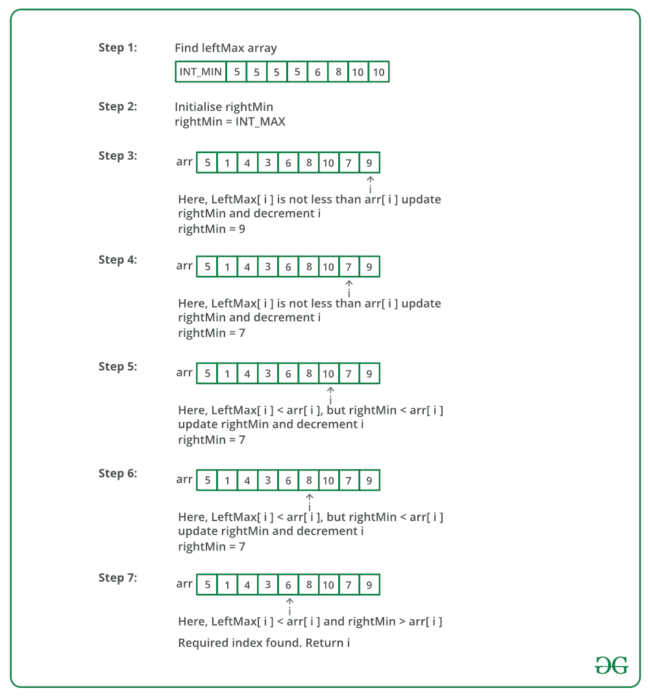

# 找出之前所有元素都比它小，之后都比它大的元素

> 原文:[https://www . geesforgeks . org/find-the-element-before-the-all-elements-before-before-before-before-before-before-before-before-before-before-before-before-before-before-before-before-before-before-](https://www.geeksforgeeks.org/find-the-element-before-which-all-the-elements-are-smaller-than-it-and-after-which-all-are-greater-than-it/)

给定一个数组，找到一个之前所有元素都小于它，之后所有元素都大于它的元素。如果有这样的元素，则返回元素的索引，否则返回-1。

**示例:**

> **输入:** arr[] = {5，1，4，3，6，8，10，7，9 }；
> **输出:** 4
> **说明:**arr【4】左边所有元素都比它小
> 右边所有元素都大。
> 
> **输入:** arr[] = {5，1，4，4 }；
> **输出:** -1
> **说明:**无此指数退出。

预期时间复杂度:O(n)。

一个**简单的解决方案**就是把每一个元素都一一考虑。对于每个元素，将其与左侧的所有元素和右侧的所有元素进行比较。这个解的时间复杂度是 O(n <sup>2</sup> )。

一个**高效解**可以利用 **O(n)** 额外空间在 **O(n)** 时间内解决这个问题。下面是详细的解决方案。

1.  创建两个数组 leftMax[]和 rightMin[]。
2.  从左到右遍历输入数组并填充 leftMax[]，使 leftMax[i]在输入数组中包含从 0 到 i-1 的最大元素。
3.  从右向左遍历输入数组并填充 rightMin[]，使得 rightMin[i]在输入数组中包含从到 n-1 到 i+1 的最小元素。
4.  遍历输入数组。对于每个元素 arr[i]，检查 arr[i]是否大于 leftMax[i]且小于 rightMin[i]。如果是，返回 I。

**对上述方法的进一步优化**是只使用一个额外的数组，并且只遍历输入数组两次。第一次遍历同上，并填充 leftMax[]。下一个遍历从右边遍历并跟踪最小值。第二次遍历还会找到所需的元素。

下图是上述方法的模拟运行:



下面是上述方法的实现。

## C++

```
// C++ program to find the element which is greater than
// all left elements and smaller than all right elements.
#include <bits/stdc++.h>
using namespace std;

// Function to return the index of the element which is greater than
// all left elements and smaller than all right elements.
int findElement(int arr[], int n)
{
    // leftMax[i] stores maximum of arr[0..i-1]
    int leftMax[n];
    leftMax[0] = INT_MIN;

    // Fill leftMax[]1..n-1]
    for (int i = 1; i < n; i++)
        leftMax[i] = max(leftMax[i-1], arr[i-1]);

    // Initialize minimum from right
    int rightMin = INT_MAX;

    // Traverse array from right
    for (int i=n-1; i>=0; i--)
    {
        // Check if we found a required element
        if (leftMax[i] < arr[i] && rightMin > arr[i])
             return i;

        // Update right minimum
        rightMin = min(rightMin, arr[i]);
    }

    // If there was no element matching criteria
    return -1;
}

// Driver program
int main()
{
    int arr[] = {5, 1, 4, 3, 6, 8, 10, 7, 9};
    int n = sizeof arr / sizeof arr[0];
    cout << "Index of the element is " << findElement(arr, n);
    return 0;
}
```

## Java 语言(一种计算机语言，尤用于创建网站)

```
// Java program to find the element which is greater than
// all left elements and smaller than all right elements.
import java.io.*;
import java.util.*;

public class GFG {
       static int findElement(int[] arr, int n)
       {
              // leftMax[i] stores maximum of arr[0..i-1] 
              int[] leftMax = new int[n];
              leftMax[0] = Integer.MIN_VALUE;

              // Fill leftMax[]1..n-1] 
              for (int i = 1; i < n; i++)
                   leftMax[i] = Math.max(leftMax[i - 1], arr[i - 1]);

              // Initialize minimum from right 
              int rightMin = Integer.MAX_VALUE;

              // Traverse array from right 
              for (int i = n - 1; i >= 0; i--) 
              {
                   // Check if we found a required element
                   if (leftMax[i] < arr[i] && rightMin > arr[i])
                       return i;

                   // Update right minimum
                   rightMin = Math.min(rightMin, arr[i]); 
              }

              // If there was no element matching criteria 
              return -1;

       }

       // Driver code
       public static void main(String args[])
       {
              int[] arr = {5, 1, 4, 3, 6, 8, 10, 7, 9};
              int n = arr.length;
              System.out.println("Index of the element is " + 
              findElement(arr, n));
       }

       // This code is contributed
       // by rachana soma
}
```

## 蟒蛇 3

```
# Python3 program to find the element which is greater than
# all left elements and smaller than all right elements.

def findElement(arr, n):

    # leftMax[i] stores maximum of arr[0..i-1]
    leftMax = [None] * n
    leftMax[0] = arr[0]

    # Fill leftMax[]1..n-1]
    for i in range(1, n):
        leftMax[i] = max(leftMax[i-1], arr[i-1])

    # Initialize minimum from right
    rightMin = [None]*n
    rightMin[n-1] = arr[n-1]

    # Fill rightMin
    for i in range(n-2, -1, -1):
        rightMin[i] = min(rightMin[i+1], arr[i])
    # Traverse array from right
    for i in range(1, n-1):

        # Check if we found a required element
        # for ith element, it should be more than maximum of of array
        # elements [0....i-1] and should be less than the minimum of
        # [i+1.....n-1] array elements
        if leftMax[i-1] <= arr[i] and arr[i] <= rightMin[i+1]:
            return i

    # If there was no element matching criteria
    return -1

# Driver program
if __name__ == "__main__":

    arr = [5, 1, 4, 3, 6, 8, 10, 7, 9]
    n = len(arr)
    print("Index of the element is", findElement(arr, n))

# This code is contributed by Rituraj Jain
```

## C#

```
// C# program to find the element which is greater than
// all left elements and smaller than all right elements.
using System;

class GFG
{
static int findElement(int[] arr, int n)
{
    // leftMax[i] stores maximum of arr[0..i-1]
    int[] leftMax = new int[n];
    leftMax[0] = int.MinValue;

    // Fill leftMax[]1..n-1]
    for (int i = 1; i < n; i++)
        leftMax[i] = Math.Max(leftMax[i - 1], arr[i - 1]);

    // Initialize minimum from right
    int rightMin = int.MaxValue;

    // Traverse array from right
    for (int i=n-1; i>=0; i--)
    {
        // Check if we found a required element
        if (leftMax[i] < arr[i] && rightMin > arr[i])
            return i;

        // Update right minimum
        rightMin = Math.Min(rightMin, arr[i]);
    }

    // If there was no element matching criteria
    return -1;
}

// Driver program
public static void Main()
{
    int[] arr = {5, 1, 4, 3, 6, 8, 10, 7, 9};
    int n = arr.Length;
    Console.Write( "Index of the element is " + findElement(arr, n));
}
}

// This code is contributed 
// by Akanksha Rai(Abby_akku)
```

## 服务器端编程语言（Professional Hypertext Preprocessor 的缩写）

```
<?php
// PHP program to find the element 
// which is greater than all left 
// elements and smaller than all 
// right elements. 

function findElement($arr, $n) 
{ 
    // leftMax[i] stores maximum 
    // of arr[0..i-1] 
    $leftMax = array(0); 
    $leftMax[0] = PHP_INT_MIN; 

    // Fill leftMax[]1..n-1] 
    for ($i = 1; $i < $n; $i++) 
        $leftMax[$i] = max($leftMax[$i - 1],
                               $arr[$i - 1]); 

    // Initialize minimum from right 
    $rightMin = PHP_INT_MAX; 

    // Traverse array from right 
    for ($i = $n - 1; $i >= 0; $i--) 
    { 
        // Check if we found a required
        // element 
        if ($leftMax[$i] < $arr[$i] && 
            $rightMin > $arr[$i]) 
            return $i; 

        // Update right minimum 
        $rightMin = min($rightMin, $arr[$i]); 
    } 

    // If there was no element
    // matching criteria 
    return -1; 
} 

// Driver Code 
$arr = array(5, 1, 4, 3, 6, 8, 10, 7, 9); 
$n = count($arr);
echo "Index of the element is " , 
           findElement($arr, $n); 

// This code is contributed
// by Sach_Code
?>
```

## java 描述语言

```
<script>

// Javascript program to find the element
// which is greater than all left elements
// and smaller than all right elements.

// Function to return the index of the 
// element which is greater than all 
// left elements and smaller than all right elements.
function findElement(arr, n) 
{

    // leftMax[i] stores maximum of arr[0..i-1]
    var leftMax = Array(n).fill(0);
    leftMax[0] = Number.MIN_VALUE;

    // Fill leftMax1..n-1]
    for(i = 1; i < n; i++)
        leftMax[i] = Math.max(leftMax[i - 1],
                                  arr[i - 1]);

    // Initialize minimum from right
    var rightMin = Number.MAX_VALUE;

    // Traverse array from right
    for(i = n - 1; i >= 0; i--)
    {

        // Check if we found a required element
        if (leftMax[i] < arr[i] &&  
              rightMin > arr[i])
            return i;

        // Update right minimum
        rightMin = Math.min(rightMin, arr[i]);
    }

    // If there was no element 
    // matching criteria
    return -1;
}

// Driver code
var arr = [ 5, 1, 4, 3, 6, 8, 10, 7, 9 ];
var n = arr.length;

document.write("Index of the element is " + 
               findElement(arr, n));

// This code is contributed by aashish1995 

</script>
```

**输出:**

```
Index of the element is 4
```

**时间复杂度:**O(n)
T3】辅助空间: O(n)
感谢高拉夫·阿希瓦尔提出上述解决方案。

**空间优化方法:**

## C++

```
// C++ program to find the element which is greater than
// all left elements and smaller than all right elements.
#include <bits/stdc++.h>
using namespace std;

int findElement(int a[], int n)
{
    // Base case
    if (n == 1 || n == 2) {
        return -1;
    }

    // 1.element is the possible candidate for the solution
    // of the problem. 
      // 2.idx is the index of the possible
    // candidate. 
      // 3.maxx is the value which is maximum on the
    // left side of the array. 
      // 4.bit tell whether the loop is
    // terminated from the if condition or from the else
    // condition when loop do not satisfied the condition.
    // 5.check is the variable which tell whether the
    // element is updated or not

    int element = a[0], maxx = a[0], bit = -1, check = 0;
    int idx = -1;

    // The extreme two of the array can not be the solution
    // Therefore iterate the loop from i = 1 to < n-1
    for (int i = 1; i < (n - 1);) {

        // here we find the possible candidate where Element
        // with left side smaller and right side greater.
        // when the if condition fail we check and update in
        // else condition.

        if (a[i] < maxx && i < (n - 1)) {
            i++;
            bit = 0;
        }

        // here we update the possible element if the
        // element is greater than the maxx (maximum element
        // so far). In while loop we sur-pass the value which
        // is greater than the element
        else {
            if (a[i] >= maxx) {
                element = a[i];
                idx = i;
                check = 1;
                maxx = a[i];
            }
            if (check == 1) {
                i++;
            }
            bit = 1;
            while (a[i] >= element && i < (n - 1)) {
                if (a[i] > maxx) {
                    maxx = a[i];
                }
                i++;
            }
            check = 0;
        }
    }

    // checking for the last value and whether the loop is
    // terminated from else or if block.

    if (element <= a[n - 1] && bit == 1) {
        return idx;
    }
    else {
        return -1;
    }
}

// Driver Code
int main()
{
    int arr[] = { 5, 1, 4, 3, 6, 8, 10, 7, 9 };
    int n = sizeof arr / sizeof arr[0];

      // Function Call
    cout << "Index of the element is "
         << findElement(arr, n);
    return 0;
}
```

## Java 语言(一种计算机语言，尤用于创建网站)

```
// Java program to find the element 
// which is greater than all left
// elements and smaller than all
// right elements.
class GFG{

static int findElement(int []a, int n)
{

    // Base case
    if (n == 1 || n == 2)
    {
        return -1;
    }

    // 1.element is the possible candidate for
    // the solution of the problem. 
    // 2.idx is the index of the possible
    // candidate. 
    // 3.maxx is the value which is maximum on the
    // left side of the array. 
    // 4.bit tell whether the loop is
    // terminated from the if condition or from 
    // the else condition when loop do not
    // satisfied the condition.
    // 5.check is the variable which tell whether the
    // element is updated or not
    int element = a[0], maxx = a[0],
            bit = -1, check = 0;
    int idx = -1;

    // The extreme two of the array can
    // not be the solution. Therefore 
    // iterate the loop from i = 1 to < n-1
    for(int i = 1; i < (n - 1);)
    {

        // Here we find the possible candidate
        // where Element with left side smaller
        // and right side greater. When the if
        // condition fail we check and update in
        // else condition.
        if (a[i] < maxx && i < (n - 1))
        {
            i++;
            bit = 0;
        }

        // Here we update the possible element
        // if the element is greater than the
        // maxx (maximum element so far). In 
        // while loop we sur-pass the value which
        // is greater than the element
        else
        {
            if (a[i] >= maxx)
            {
                element = a[i];
                idx = i;
                check = 1;
                maxx = a[i];
            }
            if (check == 1) 
            {
                i++;
            }
            bit = 1;

            while (a[i] >= element && i < (n - 1))
            {
                if (a[i] > maxx)
                {
                    maxx = a[i];
                }
                i++;
            }
            check = 0;
        }
    }

    // Checking for the last value and whether
    // the loop is terminated from else or 
    // if block.
    if (element <= a[n - 1] && bit == 1)
    {
        return idx;
    }
    else
    {
        return -1;
    }

}

// Driver code
public static void main(String []args)
{
    int []arr = { 5, 1, 4, 3, 6, 8, 10, 7, 9 };
    int n = arr.length;

    System.out.println("Index of the element is " + 
                       findElement(arr, n));
}
}

// This code is contributed by avanitrachhadiya2155
```

## 蟒蛇 3

```
# Python3 program to find the element which 
# is greater than all left elements and 
# smaller than all right elements.
def findElement (a, n):

    # Base case
    if (n == 1 or n == 2):
        return -1

    # 1\. element is the possible candidate
    # for the solution of the problem
    # 2\. idx is the index of the 
    # possible candidate
    # 3\. maxx is the value which is maximum
    # on the left side of the array
    # 4\. bit tell whether the loop is
    # terminated from the if condition or 
    # from the else condition when loop do
    # not satisfied the condition. 
    # 5\. check is the variable which tell
    # whether the element is updated or not
    element, maxx, bit = a[0], a[0], -1
    check = 0
    idx = -1

    # The extreme of the array can't be 
    # the solution Therefore iterate
    # the loop from i = 1 to < n-1
    i = 1
    while (i < (n - 1)):

        # Here we find the possible candidate
        # where element with left side smaller
        # and right side greater. when the if 
        # condition fail we check and update 
        # in else condition
        if (a[i] < maxx and i < (n - 1)):
            i += 1
            bit = 0

        # Here we update the possible element
        # if the element is greater than the 
        # maxx (maximum element so far). In 
        # while loop we sur-pass the value
        # which is greater than the element
        else:
            if (a[i] >= maxx):
                element = a[i]
                idx = i
                check = 1
                maxx = a[i]

            if (check == 1):
                i += 1

            bit = 1
            while (a[i] >= element and i < (n - 1)):
                if (a[i] > maxx):
                    maxx = a[i]

                i += 1

            check = 0

    # Checking for the last value and whether
    # the loop is terminated from else or 
    # if block
    if (element <= a[n - 1] and bit == 1):
        return idx
    else:
        return -1

# Driver Code
if __name__ == '__main__':

    arr = [ 5, 1, 4, 3, 
            6, 8, 10, 7, 9 ]
    n = len(arr)

    # Function call
    print("Index of the element is", 
           findElement(arr, n))

# This code is contributed by himanshu77
```

## C#

```
// C# program to find the element 
// which is greater than all left
// elements and smaller than all
// right elements.
using System;

class GFG{

static int findElement(int []a, int n)
{

    // Base case
    if (n == 1 || n == 2)
    {
        return -1;
    }

    // 1.element is the possible candidate for
    // the solution of the problem. 
    // 2.idx is the index of the possible
    // candidate. 
    // 3.maxx is the value which is maximum on the
    // left side of the array. 
    // 4.bit tell whether the loop is
    // terminated from the if condition or from 
    // the else condition when loop do not
    // satisfied the condition.
    // 5.check is the variable which tell whether the
    // element is updated or not
    int element = a[0], maxx = a[0], 
        bit = -1, check = 0;
    int idx = -1;

    // The extreme two of the array can
    // not be the solution. Therefore 
    // iterate the loop from i = 1 to < n-1
    for(int i = 1; i < (n - 1);)
    {

        // Here we find the possible candidate
        // where Element with left side smaller
        // and right side greater. When the if
        // condition fail we check and update in
        // else condition.
        if (a[i] < maxx && i < (n - 1))
        {
            i++;
            bit = 0;
        }

        // Here we update the possible element
        // if the element is greater than the
        // maxx (maximum element so far). In 
        // while loop we sur-pass the value which
        // is greater than the element
        else 
        {
            if (a[i] >= maxx)
            {
                element = a[i];
                idx = i;
                check = 1;
                maxx = a[i];
            }
            if (check == 1) 
            {
                i++;
            }
            bit = 1;

            while (a[i] >= element && i < (n - 1))
            {
                if (a[i] > maxx)
                {
                    maxx = a[i];
                }
                i++;
            }
            check = 0;
        }
    }

    // Checking for the last value and whether
    // the loop is terminated from else or 
    // if block.
    if (element <= a[n - 1] && bit == 1)
    {
        return idx;
    }
    else 
    {
        return -1;
    }
}

// Driver code
public static void Main(string[] args)
{
    int []arr = { 5, 1, 4, 3, 6, 8, 10, 7, 9 };
    int n = arr.Length;

    // Function Call
    Console.Write("Index of the element is " + 
                   findElement(arr, n));
}
}

// This code is contributed by rutvik_56
```

## java 描述语言

```
<script>
// javascript program to find the element 
// which is greater than all left
// elements and smaller than all
// right elements.    
function findElement(a , n)
{

        // Base case
        if (n == 1 || n == 2)
        {
            return -1;
        }

        // 1.element is the possible candidate for
        // the solution of the problem.
        // 2.idx is the index of the possible
        // candidate.
        // 3.maxx is the value which is maximum on the
        // left side of the array.
        // 4.bit tell whether the loop is
        // terminated from the if condition or from
        // the else condition when loop do not
        // satisfied the condition.
        // 5.check is the variable which tell whether the
        // element is updated or not
        var element = a[0], maxx = a[0], bit = -1, check = 0;
        var idx = -1;

        // The extreme two of the array can
        // not be the solution. Therefore
        // iterate the loop from i = 1 to < n-1
        for (i = 1; i < (n - 1);) {

            // Here we find the possible candidate
            // where Element with left side smaller
            // and right side greater. When the if
            // condition fail we check and update in
            // else condition.
            if (a[i] < maxx && i < (n - 1)) {
                i++;
                bit = 0;
            }

            // Here we update the possible element
            // if the element is greater than the
            // maxx (maximum element so far). In
            // while loop we sur-pass the value which
            // is greater than the element
            else {
                if (a[i] >= maxx) {
                    element = a[i];
                    idx = i;
                    check = 1;
                    maxx = a[i];
                }
                if (check == 1) {
                    i++;
                }
                bit = 1;

                while (a[i] >= element && i < (n - 1)) {
                    if (a[i] > maxx) {
                        maxx = a[i];
                    }
                    i++;
                }
                check = 0;
            }
        }

        // Checking for the last value and whether
        // the loop is terminated from else or
        // if block.
        if (element <= a[n - 1] && bit == 1)
        {
            return idx;
        }
        else
        {
            return -1;
        }

    }

    // Driver code
        var arr = [ 5, 1, 4, 3, 6, 8, 10, 7, 9 ];
        var n = arr.length;
        document.write("Index of the element is " + findElement(arr, n));

// This code is contributed by gauravrajput1 
</script>
```

**Output**

```
Index of the element is 4
```

**时间复杂度:**O(n)
T3】辅助空间: O(1)

如果发现有不正确的地方，请写评论，或者想分享更多关于以上讨论话题的信息