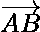
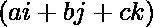
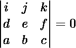
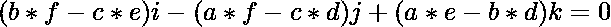
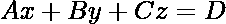

# 求通过两点且平行于给定轴的平面方程

> 原文:[https://www . geesforgeks . org/find-通过两点并平行于给定轴的平面方程/](https://www.geeksforgeeks.org/find-the-equation-of-plane-which-passes-through-two-points-and-parallel-to-a-given-axis/)

给定两个点 **A(x1，y1，z1)** 和 **B(x2，y2，z2)** 和一组代表轴 **(ai + bj + ck)** 的点(A，B，c)，任务是求通过给定点 **A** 和 **B** 并与给定轴平行的平面方程。

**示例:**

> **输入:** x1 = 1，y1 = 2，z1 = 3，x2 = 3，y2 = 4，z2 = 5，a= 6，b = 7，c = 8
> **输出:** 2x + 4y + 2z + 0 = 0
> 
> **输入:** x1 = 2，y1 = 3，z1 = 5，x2 = 6，y2 = 7，z2 = 8，a= 11，b = 23，c = 10。
> **输出:** -29x + 7y + 48z + 0= 0

**方法:**
从平面 A 和 B 上给定的两个点，方向比直线的向量方程 **AB** 由下式给出:

> 方向比=(x2–x1，y2–y1，z2–Z1)
> 
> 

自线



平行于给定的轴



。因此，交叉产品


和


是 0，由下式给出:

> 
> 
> 其中，
> d、e、f 为 AB 线向量方程的系数，即
> d =(x2–x1)
> e =(y2–y1)
> f =(z2–Z1)
> a、b、c 为给定轴的系数。

由上述行列式形成的方程由下式给出:

> 
> 
> **(等式 1)**

**方程 1** 与直线 **AB** 垂直，即与所需平面垂直。
让平面的方程式由

**(方程式 2)**
给出，其中 **A、B、C** 是平面垂直于平面的方向比。
由于**方程 1** 是**方程 2** 相互垂直，因此**方程 1 & 2** 的方向比数值是平行的。那么平面的系数由下式给出:

> a =(B * f–C * e)、
> B =(a * f–C * d)和
> C =(a * e–B * d)

现在平面和向量线 AB 的点积给出 D 的值为

> d =-(A * d–B * e+C * f)

下面是上述方法的实现:

## C++

```
// C++ implementation to find the
// equation of plane which passes
// through two points and parallel
// to a given axis

#include <bits/stdc++.h>
using namespace std;

void findEquation(int x1, int y1, int z1,
                  int x2, int y2, int z2,
                  int d, int e, int f)
{

    // Find direction vector
    // of points (x1, y1, z1)
    // and (x2, y2, z2)
    double a = x2 - x1;
    double b = y2 - y1;
    double c = z2 - z1;

    // Values that are calculated
    // and simplified from the
    // cross product
    int A = (b * f - c * e);
    int B = (a * f - c * d);
    int C = (a * e - b * d);
    int D = -(A * d - B * e + C * f);

    // Print the equation of plane
    cout << A << "x + " << B << "y + "
         << C << "z + " << D << "= 0";
}

// Driver Code
int main()
{

    // Point A
    int x1 = 2, y1 = 3, z1 = 5;

    // Point B
    int x2 = 6, y2 = 7, z2 = 8;

    // Given axis
    int a = 11, b = 23, c = 10;

    // Function Call
    findEquation(x1, y1, z1,
                 x2, y2, z2,
                 a, b, c);

    return 0;
}
```

## Java 语言(一种计算机语言，尤用于创建网站)

```
// Java implementation to find the
// equation of plane which passes
// through two points and parallel
// to a given axis
import java.util.*;

class GFG{

static void findEquation(int x1, int y1, int z1,
                         int x2, int y2, int z2,
                         int d, int e, int f)
{

    // Find direction vector
    // of points (x1, y1, z1)
    // and (x2, y2, z2)
    double a = x2 - x1;
    double b = y2 - y1;
    double c = z2 - z1;

    // Values that are calculated
    // and simplified from the
    // cross product
    int A = (int)(b * f - c * e);
    int B = (int)(a * f - c * d);
    int C = (int)(a * e - b * d);
    int D = -(int)(A * d - B * e + C * f);

    // Print the equation of plane
    System.out.println(A + "x + " + B + "y + " +
                       C + "z + " + D + "= 0 ");
}

// Driver code
public static void main(String[] args)
{

    // Point A
    int x1 = 2, y1 = 3, z1 = 5;

    // Point B
    int x2 = 6, y2 = 7, z2 = 8;

    // Given axis
    int a = 11, b = 23, c = 10;

    // Function Call
    findEquation(x1, y1, z1,
                 x2, y2, z2,
                 a, b, c);
}
}

// This code is contributed by Pratima Pandey
```

## 蟒蛇 3

```
# Python3 implementation
# to find the equation
# of plane which passes
# through two points and
# parallel to a given axis
def findEquation(x1, y1, z1,
                 x2, y2, z2,
                 d, e, f):

    # Find direction vector
    # of points (x1, y1, z1)
    # and (x2, y2, z2)
    a = x2 - x1
    b = y2 - y1
    c = z2 - z1

    # Values that are calculated
    # and simplified from the
    # cross product
    A = (b * f - c * e)
    B = (a * f - c * d)
    C = (a * e - b * d)
    D = -(A * d - B *
          e + C * f)

    # Print the equation of plane
    print (A, "x + ", B, "y + ",
           C, "z + ", D, "= 0")

# Driver Code
if __name__ == "__main__":

    # Point A
    x1 = 2
    y1 = 3
    z1 = 5;

    # Point B
    x2 = 6
    y2 = 7
    z2 = 8

    # Given axis
    a = 11
    b = 23
    c = 10

    # Function Call
    findEquation(x1, y1, z1,
                 x2, y2, z2,
                 a, b, c)

# This code is contributed by Chitranayal
```

## C#

```
// C# implementation to find the
// equation of plane which passes
// through two points and parallel
// to a given axis
using System;
class GFG{

static void findEquation(int x1, int y1, int z1,
                         int x2, int y2, int z2,
                         int d, int e, int f)
{

    // Find direction vector
    // of points (x1, y1, z1)
    // and (x2, y2, z2)
    double a = x2 - x1;
    double b = y2 - y1;
    double c = z2 - z1;

    // Values that are calculated
    // and simplified from the
    // cross product
    int A = (int)(b * f - c * e);
    int B = (int)(a * f - c * d);
    int C = (int)(a * e - b * d);
    int D = -(int)(A * d - B * e + C * f);

    // Print the equation of plane
    Console.Write(A + "x + " + B + "y + " +
                  C + "z + " + D + "= 0 ");
}

// Driver code
public static void Main()
{

    // Point A
    int x1 = 2, y1 = 3, z1 = 5;

    // Point B
    int x2 = 6, y2 = 7, z2 = 8;

    // Given axis
    int a = 11, b = 23, c = 10;

    // Function Call
    findEquation(x1, y1, z1,
                 x2, y2, z2,
                 a, b, c);
}
}

// This code is contributed by Code_Mech
```

## java 描述语言

```
<script>
// javascript implementation to find the
// equation of plane which passes
// through two points and parallel
// to a given axis

    function findEquation(x1 , y1 , z1 , x2 , y2 , z2 , d , e , f)
    {

        // Find direction vector
        // of points (x1, y1, z1)
        // and (x2, y2, z2)
        var a = x2 - x1;
        var b = y2 - y1;
        var c = z2 - z1;

        // Values that are calculated
        // and simplified from the
        // cross product
        var A = parseInt( (b * f - c * e));
        var B = parseInt( (a * f - c * d));
        var C = parseInt( (a * e - b * d));
        var D = -parseInt( (A * d - B * e + C * f));

        // Print the equation of plane
        document.write(A + "x + " + B + "y + " + C + "z + " + D + "= 0 ");
    }

    // Driver code

        // Point A
        var x1 = 2, y1 = 3, z1 = 5;

        // Point B
        var x2 = 6, y2 = 7, z2 = 8;

        // Given axis
        var a = 11, b = 23, c = 10;

        // Function Call
        findEquation(x1, y1, z1, x2, y2, z2, a, b, c);

// This code is contributed by Rajput-Ji
</script>
```

**Output:** 

```
-29x + 7y + 48z + 0= 0
```