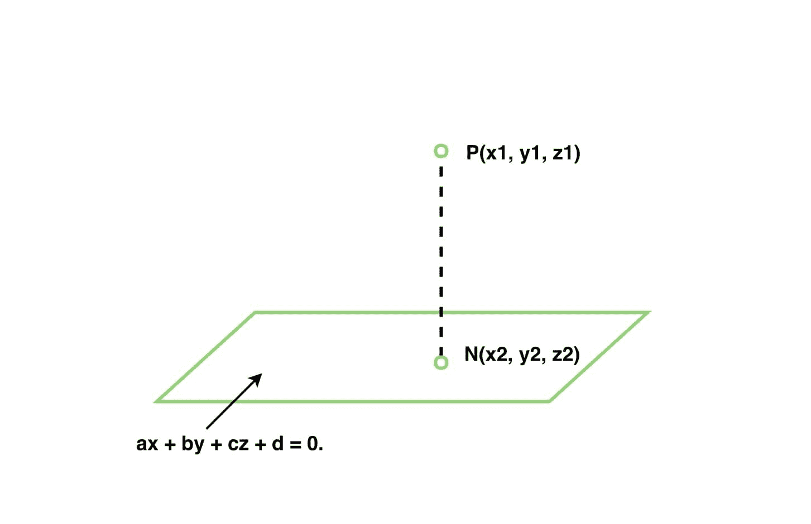

# 求一个点在三维平面上的垂线脚

> 原文:[https://www . geeksforgeeks . org/find-3-d-平面中一点的垂直英尺数/](https://www.geeksforgeeks.org/find-the-foot-of-perpendicular-of-a-point-in-a-3-d-plane/)

给定三维中的一个点(x1，y1，z1)和平面方程的系数，我们必须找到三维平面中点的垂线偏差。
**例:**

> **输入:** a = 1，b = -2，c = 0，d = 0，x = -1，y = 3，z = 4
> T3】输出:x2 = 0.4 y2 = 0.2 z2 = 4.0
> T6】输入: a = 2，b = -1，c = 1，d = 3，x = 1，y = 3，z = 4
> T9】输出:x2 =-1.0 y2 = 4.0 z2 = 0



**逼近:**平面方程为 *ax + by + cz + d = 0。*因此，法线与平面的方向比是 **(a，b，c)** 。假设 N 是从给定点到给定平面的垂线的脚，那么，线 PN 有向比(a，b，c)，它穿过 P(x1，y1，z1)。
PN 线的方程式如下:-

> (x–x1)/a =(y–y1)/b =(z–Z1)/c = k

因此，PN 线上的任何点都可以写成:-

> x = a * k+x1
> y = b * k+y1
> z = c * k+Z1

因为 N 位于直线和平面上，所以将满足(ax + by + cz + d = 0)。

> = > a *(a * k+x1)+b *(b * k+y1)+c *(c * k+Z1)+d = 0 .>a * k+a * x1+b * k+b * y 1+c * k+c * Z1+d = 0。
> =>(a * a+b * b+c * c)k =-a * x1–b * y 1–c * Z1–d。
> =>k =(-a * x1–b * y 1–c * Z1–d)/(a * a+b * b+c * c)。

现在，N 点在 k 方面的坐标将是:-

> x2 = a * k+x1
> y2 = b * k+y1
> z2 = c * k+Z1

下面是上面的实现:

## C++

```
// C++ program to find
// foot of perpendicular
// of a point in a 3 D plane.
#include <bits/stdc++.h>
#include <iomanip>
#include <iostream>
#include <math.h>
using namespace std;

// Function to find foot of perpendicular
void foot(float a, float b,
          float c, float d,
          float x1, float y1,
          float z1)
{
    float k = (-a * x1 - b * y1 - c * z1 - d) / (float)(a * a + b * b + c * c);
    float x2 = a * k + x1;
    float y2 = b * k + y1;
    float z2 = c * k + z1;

    std::cout << std::fixed;
    std::cout << std::setprecision(1);
    cout << " x2 = " << x2;
    cout << " y2 = " << y2;
    cout << " z2 = " << z2;
}

// Driver Code
int main()
{
    float a = 1;
    float b = -2;
    float c = 0;
    float d = 0;
    float x1 = -1;
    float y1 = 3;
    float z1 = 4;

    // function call
    foot(a, b, c, d, x1, y1, z1);
    return 0;
}
// This code is contributed  by Amber_Saxena.
```

## Java 语言(一种计算机语言，尤用于创建网站)

```
// Java program to find
// foot of perpendicular
// of a point in a 3 D plane.
import java.util.*;
import java.text.*;

class solution
{

// Function to find foot of perpendicular
static void foot(float a, float b,
        float c, float d,
        float x1, float y1,
        float z1)
{
    float k = (-a * x1 - b * y1 - c * z1 - d) / (float)(a * a + b * b + c * c);
    float x2 = a * k + x1;
    float y2 = b * k + y1;
    float z2 = c * k + z1;
    DecimalFormat form = new DecimalFormat("0.0");
    System.out.print(" x2 = " +form.format(x2));
    System.out.print(" y2 = " +form.format(y2));
    System.out.print( " z2 = " +form.format(z2));
}

// Driver Code
public static void main(String arr[])
{
    float a = 1;
    float b = -2;
    float c = 0;
    float d = 0;
    float x1 = -1;
    float y1 = 3;
    float z1 = 4;

    // function call
    foot(a, b, c, d, x1, y1, z1);

}
}
```

## 蟒蛇 3

```
# Python3 program to find
# foot of perpendicular
# of a point in a 3 D plane.

# Function to find foot of perpendicular
def foot(a, b, c, d, x1, y1, z1) :

    k = (-a * x1 - b * y1 - c * z1 - d) / (a * a + b * b + c * c);
    x2 = a * k + x1;
    y2 = b * k + y1;
    z2 = c * k + z1;

    print("x2 =",round(x2,1))
    print("y2 =",round(y2,1))
    print("z2 =",round(z2,1))

# Driver Code
if __name__ == "__main__" :

    a = 1
    b = -2
    c = 0
    d = 0
    x1 = -1
    y1 = 3
    z1 = 4

    # function call
    foot(a, b, c, d, x1, y1, z1)

# This code is contributed by Ryuga
```

## C#

```
// C# program to find
// foot of perpendicular
// of a point in a 3 D plane.
using System;
using System.Globalization;

class GFG
{

// Function to find foot of perpendicular
static void foot(float a, float b,
        float c, float d,
        float x1, float y1,
        float z1)
{
    float k = (-a * x1 - b * y1 - c * z1 - d) /
                (float)(a * a + b * b + c * c);
    float x2 = a * k + x1;
    float y2 = b * k + y1;
    float z2 = c * k + z1;
    NumberFormatInfo form = new NumberFormatInfo();
    form.NumberDecimalSeparator = ".";
    Console.Write(" x2 = " + x2.ToString(form));
    Console.Write(" y2 = " + y2.ToString(form));
    Console.Write( " z2 = " + z2.ToString(form));
}

// Driver Code
public static void Main(String []arr)
{
    float a = 1;
    float b = -2;
    float c = 0;
    float d = 0;
    float x1 = -1;
    float y1 = 3;
    float z1 = 4;

    // function call
    foot(a, b, c, d, x1, y1, z1);
}
}

// This code contributed by Rajput-Ji
```

## 服务器端编程语言（Professional Hypertext Preprocessor 的缩写）

```
<?php
// PHP program to find foot of perpendicular
// of a point in a 3 D plane.

// Function to find foot of perpendicular
function foot($a, $b, $c, $d, $x1, $y1, $z1)
{
    $k = (-$a * $x1 - $b * $y1 - $c * $z1 - $d) /
                  ($a * $a + $b * $b + $c * $c);
    $x2 = $a * $k + $x1;
    $y2 = $b * $k + $y1;
    $z2 = $c * $k + $z1;

    echo "x2 = " . round($x2, 1);
    echo " y2 = " . round($y2, 1);
    echo " z2 = " . round($z2, 1);
}

// Driver Code
$a = 1; $b = -2; $c = 0; $d = 0;
$x1 = -1; $y1 = 3; $z1 = 4;

// function call
foot($a, $b, $c, $d, $x1, $y1, $z1);

// This code is contributed by ita_c
?>
```

## java 描述语言

```
<script>
      // JavaScript program to find
      // foot of perpendicular
      // of a point in a 3 D plane.

      // Function to find foot of perpendicular
      function foot(a, b, c, d, x1, y1, z1) {
        var k = (-a * x1 - b * y1 - c * z1 - d) / (a * a + b * b + c * c);
        var x2 = a * k + x1;
        var y2 = b * k + y1;
        var z2 = c * k + z1;

        document.write("x2 =" + x2.toFixed(1) + " ");
        document.write("y2 =" + y2.toFixed(1) + " ");
        document.write("z2 =" + z2.toFixed(1) + " ");
      }

      // Driver Code

      var a = 1;
      var b = -2;
      var c = 0;
      var d = 0;
      var x1 = -1;
      var y1 = 3;
      var z1 = 4;

      // function call
      foot(a, b, c, d, x1, y1, z1);
    </script>
```

**Output:** 

```
x2 = 0.4 y2 = 0.2 z2 = 4.0
```