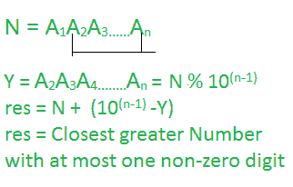

# 找到最接近 N 的最大数字，最多有一个非零数字

> 原文:[https://www . geeksforgeeks . org/find-最接近 n 的大数字-最多有一个非零数字/](https://www.geeksforgeeks.org/find-the-greater-number-closest-to-n-having-at-most-one-non-zero-digit/)

给定一个整数 **N** ，任务是找到与 **N** 最接近的数字，该数字大于 **N** ，最多包含一个**非零数字**。

**示例:**

> **输入** : N = 540
> **输出:** 600
> **说明:**由于数字 600 只包含一个非零数字，所以要求输出为 600。
> 
> **输入** : N = 1000
> **输出:** 2000

**方法:**根据以下观察，可以解决问题。

[](https://media.geeksforgeeks.org/wp-content/uploads/20200925152859/closest-greater-number-with-at-most-one-non-zero-digit.png)

按照以下步骤解决问题:

1.  初始化一个变量，比如说**ctrl**来存储 **N** 中的位数。
2.  计算**次幂的值(10，ctrl–1**)
3.  打印上述公式的值作为所需答案。

下面是上述方法的实现:

## C++

```
// C++ program to implement
// the above approach

#include <bits/stdc++.h>
using namespace std;

// Function to calculate
// X ^ n in log(n)
int power(int X, int n) {

    // Stores the value
    // of X^n
    int res = 1;
    while(n) {

        // If N is odd
        if(n & 1)
        res = res * X;

        X = X * X;
        n = n >> 1;
    }
    return res;

}

// Function to find the
// closest number > N having
// at most 1 non-zero digit
int closestgtNum(int N) {

    // Stores the count
    // of digits in N
    int n = log10(N) + 1;

    // Stores the power
    // of 10^(n-1)
    int P = power(10, n - 1);

    // Stores the
    // last (n - 1) digits
    int Y = N % P;

    // Store the answer
    int res = N + (P - Y);

    return res;
}

// Driver Code
int main()
{
    int N = 120;
    cout<<closestgtNum(N);
}
```

## Java 语言(一种计算机语言，尤用于创建网站)

```
// Java program to implement
// the above approach
import java.io.*;

class GFG{

// Function to calculate
// X ^ n in log(n)
static int power(int X, int n)
{

    // Stores the value
    // of X^n
    int res = 1;

    while(n != 0)
    {

        // If N is odd
        if ((n & 1) != 0)
            res = res * X;

        X = X * X;
        n = n >> 1;
    }
    return res;
}

// Function to find the
// closest number > N having
// at most 1 non-zero digit
static int closestgtNum(int N)
{

    // Stores the count
    // of digits in N
    int n = (int) Math.log10(N) + 1;

    // Stores the power
    // of 10^(n-1)
    int P = power(10, n - 1);

    // Stores the
    // last (n - 1) digits
    int Y = N % P;

    // Store the answer
    int res = N + (P - Y);

    return res;
}

// Driver Code
public static void main (String[] args)
{
    int N = 120;

    // Function call
    System.out.print(closestgtNum(N));
}
}

// This code is contributed by code_hunt
```

## 蟒蛇 3

```
# Python3 program to implement
# the above approach
import math

# Function to calculate
# X ^ n in log(n)
def power(X, n):

    # Stores the value
    # of X^n
    res = 1

    while (n != 0):

        # If N is odd
        if (n & 1 != 0):
            res = res * X

        X = X * X
        n = n >> 1

    return res

# Function to find the
# closest number > N having
# at most 1 non-zero digit
def closestgtNum(N):

    # Stores the count
    # of digits in N
    n = int(math.log10(N) + 1)

    # Stores the power
    # of 10^(n-1)
    P = power(10, n - 1)

    # Stores the
    # last (n - 1) digits
    Y = N % P

    # Store the answer
    res = N + (P - Y)

    return res

# Driver Code
N = 120

print(closestgtNum(N))

# This code is contributed by code_hunt
```

## C#

```
// C# program to implement
// the above approach
using System;

class GFG{

// Function to calculate
// X ^ n in log(n)
static int power(int X, int n)
{

    // Stores the value
    // of X^n
    int res = 1;

    while(n != 0)
    {

        // If N is odd
        if ((n & 1) != 0)
            res = res * X;

        X = X * X;
        n = n >> 1;
    }
    return res;
}

// Function to find the
// closest number > N having
// at most 1 non-zero digit
static int closestgtNum(int N)
{

    // Stores the count
    // of digits in N
    int n = (int) Math.Log10(N) + 1;

    // Stores the power
    // of 10^(n-1)
    int P = power(10, n - 1);

    // Stores the
    // last (n - 1) digits
    int Y = N % P;

    // Store the answer
    int res = N + (P - Y);

    return res;
}

// Driver Code
public static void Main ()
{
    int N = 120;

    // Function call
    Console.Write(closestgtNum(N));
}
}

// This code is contributed by code_hunt
```

## java 描述语言

```
<script>

// JavaScript program to implement
// the above approach

// Function to calculate
// X ^ n in log(n)
function power(X, n)
{

    // Stores the value
    // of X^n
    var res = 1;

    while(n != 0)
    {

        // If N is odd
        if ((n & 1) != 0)
            res = res * X;

        X = X * X;
        n = n >> 1;
    }
    return res;
}

// Function to find the
// closest number > N having
// at most 1 non-zero digit
function closestgtNum(N)
{

    // Stores the count
    // of digits in N
    var n = parseInt( Math.log10(N) + 1);

    // Stores the power
    // of 10^(n-1)
    var P = power(10, n - 1);

    // Stores the
    // last (n - 1) digits
    var Y = N % P;

    // Store the answer
    var res = N + (P - Y);

    return res;
}

// Driver Code
var N = 120;

// Function call
document.write(closestgtNum(N));

</script>
```

**Output**

```
200
```

***时间复杂度:**O(log<sub>2</sub>N)*
***辅助空间:** O(log <sub>10</sub> N)*

**高效方法:**想法是将给定整数的第一个数字的值增加 1，并将结果字符串初始化为给定整数的第一个数字。最后，在结果字符串的末尾追加**(N–1)0**并返回结果字符串。

1.  初始化一个字符串，说 **res** 来存储最接近的最大的一个非零数字。
2.  首先在结果字符串处追加值 **str[0] + 1** ，然后在结果字符串的末尾追加**(N–1)0**。
3.  打印 **res** 的值

下面是上述方法的实现:

## C++

```
// C++ program to implement
// the above approach
#include <bits/stdc++.h>
using namespace std;

// Function to get closest greater
// number with at most non zero digit
string closestgtNum(string str)
{
    // Stores the closest greater number
    // with at most one non-zero digit
    string res = "";

    // Stores length of str
    int n = str.length();

    if(str[0] < '9') {
        res.push_back(str[0] + 1);
    }
    else{

        // Append 10 to the end
        // of resultant string
        res.push_back('1');
        res.push_back('0');
    }

    // Append n-1 times '0' to the end
    // of resultant string
    for(int i = 0; i < n - 1; i++)
    {
        res.push_back('0');
    }
    return res;

}

// Driver Code
int main()
{
    string str = "120";
    cout<<closestgtNum(str);
}
```

## Java 语言(一种计算机语言，尤用于创建网站)

```
// Java program to implement
// the above approach
import java.util.*;

class GFG{

// Function to get closest greater
// number with at most non zero digit
static String closestgtNum(String str)
{

    // Stores the closest greater number
    // with at most one non-zero digit
    String res = "";

    // Stores length of str
    int n = str.length();

    if (str.charAt(0) < '9')
    {
        res += (char)(str.charAt(0) + 1);
    }
    else
    {

        // Append 10 to the end
        // of resultant String
        res += (char)('1');
        res += (char)('0');
    }

    // Append n-1 times '0' to the end
    // of resultant String
    for(int i = 0; i < n - 1; i++)
    {
        res += (char)('0');
    }
    return res;
}

// Driver Code
public static void main(String[] args)
{
    String str = "120";

    System.out.print(closestgtNum(str));
}
}

// This code is contributed by Amit Katiyar
```

## 蟒蛇 3

```
# Python3 program to implement
# the above approach

# Function to get closest greater
# number with at most non zero digit
def closestgtNum(str):

    # Stores the closest greater number
    # with at most one non-zero digit
    res = "";

    # Stores length of str
    n = len(str);

    if (str[0] < '9'):
        res += (chr)(ord(str[0]) + 1);
    else:

        # Append 10 to the end
        # of resultant String
        res += (chr)('1');
        res += (chr)('0');

    # Append n-1 times '0' to the end
    # of resultant String
    for i in range(n - 1):
        res += ('0');

    return res;

# Driver Code
if __name__ == '__main__':

    str = "120";

    print(closestgtNum(str));

# This code is contributed by Amit Katiyar
```

## C#

```
// C# program to implement
// the above approach
using System;

class GFG{

// Function to get closest greater
// number with at most non zero digit
public static string closestgtNum(string str)
{

    // Stores the closest greater number
    // with at most one non-zero digit
    string res = "";

    // Stores length of str
    int n = str.Length;

    if (str[0] < '9')
    {
        res = res + (char)(str[0] + 1);
    }
    else
    {

        // Append 10 to the end
        // of resultant string
        res = res + '1';
        res = res + '0';
    }

    // Append n-1 times '0' to the end
    // of resultant string
    for(int i = 0; i < n - 1; i++)
    {
        res = res + '0';
    }
    return res;
}

// Driver code
static void Main()
{
    string str = "120";

    Console.WriteLine(closestgtNum(str));
}
}

// This code is contributed by divyeshrabadiya07
```

## java 描述语言

```
<script>

// Javascript program to implement
// the above approach

// Function to get closest greater
// number with at most non zero digit
function closestgtNum(str)
{

    // Stores the closest greater number
    // with at most one non-zero digit
    var res = "";

    // Stores length of str
    var n = str.length;

    if (str[0] < '9')
    {
        res = res + String.fromCharCode(str[0].charCodeAt(0) + 1);
    }
    else
    {

        // Append 10 to the end
        // of resultant string
        res = res + '1';
        res = res + '0';
    }

    // Append n-1 times '0' to the end
    // of resultant string
    for(var i = 0; i < n - 1; i++)
    {
        res = res + '0';
    }
    return res;
}

// Driver code
var str = "120";

document.write(closestgtNum(str));

// This code is contributed by itsok.
</script>
```

**Output**

```
200
```

***时间复杂度:**O(log<sub>10</sub>N)*
***辅助空间:** O(log <sub>10</sub> N)*