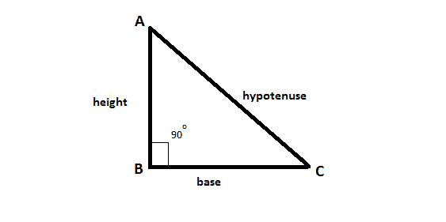

# 求面积为底边 X 倍的直角三角形的高度

> 原文:[https://www . geeksforgeeks . org/find-直角三角形的高度-其面积为其底部的 x 倍/](https://www.geeksforgeeks.org/find-the-height-of-a-right-angled-triangle-whose-area-is-x-times-its-base/)

假设直角三角形的面积是 **X** 乘以它的底 **b** 。任务是找到给定三角形的高度。



**例:**

> **输入:** X = 40
> **输出:** 80
> **输入:** X = 100
> **输出:** 200

**逼近:**我们知道一个直角三角形的面积，**面积=(基*高)/ 2** 并给出这个面积是 **X** 乘以基即基* X =(基*高)/ 2。
求解高度，我们得到**高度= (2 *基* X) /基= 2 * X** 。
以下是上述方法的实施:

## C++

```
// C++ implementation of the approach
#include <bits/stdc++.h>
using namespace std;

// Function to return the height of the
// right-angled triangle whose area
// is X times its base
int getHeight(int X)
{
    return (2 * X);
}

// Driver code
int main()
{
    int X = 35;

    cout << getHeight(X);

    return 0;
}
```

## Java 语言(一种计算机语言，尤用于创建网站)

```
// Java implementation of the approach
import java.util.*;
import java.lang.*;
import java.io.*;

class Gfg
{

// Function to return the height of the
// right-angled triangle whose area
// is X times its base
static int getHeight(int X)
{
    return (2 * X);
}

// Driver code
public static void main (String[] args) throws java.lang.Exception
{
    int X = 35;
    System.out.println(getHeight(X)) ;
}
}

// This code is contributed by nidhiva
```

## 蟒蛇 3

```
# Python 3 implementation of the approach

# Function to return the height of the
# right-angled triangle whose area
# is X times its base
def getHeight(X):
    return (2 * X)

# Driver code
if __name__ == '__main__':
    X = 35

    print(getHeight(X))

# This code is contributed by
# Surendra_Gangwar
```

## C#

```
// C# implementation of the approach
using System;

class Gfg
{

// Function to return the height of the
// right-angled triangle whose area
// is X times its base
static int getHeight(int X)
{
    return (2 * X);
}

// Driver code
public static void Main ()
{
    int X = 35;
    Console.WriteLine(getHeight(X)) ;
}
}

// This code is contributed by anuj_67..
```

## java 描述语言

```
<script>

// Function to return the height of the
// right-angled triangle whose area
// is X times its base

function getHeight(X)
{
    return (2 * X);
}

// Driver code

var X = 35;
document.write(getHeight(X)) ;

// This code is contributed by Amit Katiyar

</script>
```

**Output:** 

```
70
```