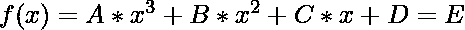

# 求给定三次方程的积分根

> 原文:[https://www . geeksforgeeks . org/find-给定三次方程的整根/](https://www.geeksforgeeks.org/find-the-integral-roots-of-a-given-cubic-equation/)

给定 5 个整数表示 **A、B、C、D 和 E** ，代表三次方程，任务是找到这个方程的积分解。如果不存在任何积分解，则打印**“NA”**。
**例:**

> **输入:** A = 1，B = 0，C = 0，D = 0，E = 27
> **输出:** 3
> **输入:** A = 1，B = 0，C = 0，D = 0，E = 16
> **输出:** NA

**进场:**思路是用[二分搜索法](https://www.geeksforgeeks.org/binary-search/)。以下是步骤:

1.  将**开始**和**结束**变量分别初始化为 **0 & 10 <sup>5</sup>** 。
2.  找到开始和结束的中间(比如**中间**)值，检查它是否满足给定的等式。
3.  如果当前中间值满足给定的等式，打印中间值。
4.  否则如果 **f(x)** 的值小于 **E** ，那么更新**开始为 mid + 1** 。
5.  否则更新**将在中间结束–1**。
6.  如果我们找不到上述方程的任何积分解，那么打印**-1”**。

以下是上述方法的实现:

## C++

```
// C++ program for the above approach
#include <bits/stdc++.h>
using namespace std;

// Function to find the value at x of
// the given equation
long long int check(int A, int B, int C,
                    int D, long long int x)
{

    long long int ans;

    // Find the value equation at x
    ans = (A * x * x * x
           + B * x * x
           + C * x
           + D);

    // Return the value of ans
    return ans;
}

// Function to find the integral
// solution of the given equation
void findSolution(int A, int B, int C,
                  int D, int E)
{

    // Initialise start and end
    int start = 0, end = 100000;

    long long int mid, ans;

    // Implement Binary Search
    while (start <= end) {

        // Find mid
        mid = start + (end - start) / 2;

        // Find the value of f(x) using
        // current mid
        ans = check(A, B, C, D, mid);

        // Check if current mid satisfy
        // the equation
        if (ans == E) {

            // Print mid and return
            cout << mid << endl;
            return;
        }

        if (ans < E)
            start = mid + 1;
        else
            end = mid - 1;
    }

    // Print "NA" if not found
    // any integral solution
    cout << "NA";
}

// Driver Code
int main()
{
    int A = 1, B = 0, C = 0;
    int D = 0, E = 27;

    // Function Call
    findSolution(A, B, C, D, E);
}
```

## Java 语言(一种计算机语言，尤用于创建网站)

```
// Java program for the above approach
import java.util.*;
class GFG{

// Function to find the value at x of
// the given equation
static long check(int A, int B, int C,
                         int D, long x)
{
    long ans;

    // Find the value equation at x
    ans = (A * x * x * x +
           B * x * x + C * x + D);

    // Return the value of ans
    return ans;
}

// Function to find the integral
// solution of the given equation
static void findSolution(int A, int B, int C,
                         int D, int E)
{

    // Initialise start and end
    long start = 0, end = 100000;

    long mid, ans;

    // Implement Binary Search
    while (start <= end)
    {

        // Find mid
        mid = start + (end - start) / 2;

        // Find the value of f(x) using
        // current mid
        ans = check(A, B, C, D, mid);

        // Check if current mid satisfy
        // the equation
        if (ans == E)
        {

            // Print mid and return
            System.out.println(mid);
            return;
        }

        if (ans < E)
            start = mid + 1;
        else
            end = mid - 1;
    }

    // Print "NA" if not found
    // any integral solution
    System.out.println("NA");
}

// Driver Code
public static void main(String args[])
{
    int A = 1, B = 0, C = 0;
    int D = 0, E = 27;

    // Function Call
    findSolution(A, B, C, D, E);
}
}

// This code is contributed by Code_Mech
```

## 蟒蛇 3

```
# Python3 program for the above approach

# Function to find the value at x of
# the given equation
def check(A, B, C, D, x) :

    ans = 0;

    # Find the value equation at x
    ans = (A * x * x * x +
           B * x * x + C * x + D);

    # Return the value of ans
    return ans;

# Function to find the integral
# solution of the given equation
def findSolution(A, B, C, D, E) :

    # Initialise start and end
    start = 0; end = 100000;

    mid = 0;
    ans = 0;

    # Implement Binary Search
    while (start <= end) :

        # Find mid
        mid = start + (end - start) // 2;

        # Find the value of f(x) using
        # current mid
        ans = check(A, B, C, D, mid);

        # Check if current mid satisfy
        # the equation
        if (ans == E) :

            # Print mid and return
            print(mid);
            return;

        if (ans < E) :
            start = mid + 1;
        else :
            end = mid - 1;

    # Print "NA" if not found
    # any integral solution
    print("NA");

# Driver Code
if __name__ == "__main__" :

    A = 1; B = 0; C = 0;
    D = 0; E = 27;

    # Function Call
    findSolution(A, B, C, D, E);

# This code is contributed by AnkitRai01
```

## C#

```
// C# program for the above approach
using System;
class GFG{

// Function to find the value at x of
// the given equation
static long check(int A, int B, int C,
                         int D, long x)
{
    long ans;

    // Find the value equation at x
    ans = (A * x * x * x +
           B * x * x + C * x + D);

    // Return the value of ans
    return ans;
}

// Function to find the integral
// solution of the given equation
static void findSolution(int A, int B, int C,
                         int D, int E)
{

    // Initialise start and end
    long start = 0, end = 100000;

    long mid, ans;

    // Implement Binary Search
    while (start <= end)
    {

        // Find mid
        mid = start + (end - start) / 2;

        // Find the value of f(x) using
        // current mid
        ans = check(A, B, C, D, mid);

        // Check if current mid satisfy
        // the equation
        if (ans == E)
        {

            // Print mid and return
            Console.WriteLine(mid);
            return;
        }

        if (ans < E)
            start = mid + 1;
        else
            end = mid - 1;
    }

    // Print "NA" if not found
    // any integral solution
    Console.Write("NA");
}

// Driver Code
public static void Main()
{
    int A = 1, B = 0, C = 0;
    int D = 0, E = 27;

    // Function Call
    findSolution(A, B, C, D, E);
}
}

// This code is contributed by Code_Mech
```

## java 描述语言

```
<script>

// Javascript program for the above approach

// Function to find the value at x of
// the given equation
function check(A, B, C, D, x)
{
    var ans;

    // Find the value equation at x
    ans = (A * x * x * x +
           B * x * x + C * x + D);

    // Return the value of ans
    return ans;
}

// Function to find the integral
// solution of the given equation
function findSolution(A, B, C, D, E)
{

    // Initialise start and end
    var start = 0, end = 100000;

    var mid, ans;

    // Implement Binary Search
    while (start <= end)
    {

        // Find mid
        mid = parseInt(start + (end - start) / 2);

        // Find the value of f(x) using
        // current mid
        ans = check(A, B, C, D, mid);

        // Check if current mid satisfy
        // the equation
        if (ans == E)
        {

            // Print mid and return
            document.write(mid);
            return;
        }

        if (ans < E)
            start = mid + 1;
        else
            end = mid - 1;
    }

    // Print "NA" if not found
    // any integral solution
    document.write("NA");
}

// Driver Code
var A = 1, B = 0, C = 0;
var D = 0, E = 27;

// Function Call
findSolution(A, B, C, D, E);

// This code is contributed by Ankita saini

</script>
```

**Output:** 

```
3
```

**时间复杂度:** O(log N)